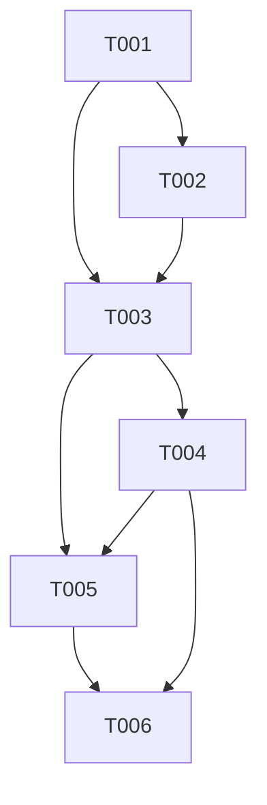

# [Feature Name] Implementation Tasks

## Task Overview
Total tasks: [Count]
Estimated effort: [Total hours]
Target completion: [Date]

## Phase 1: Setup & Foundation

### [T001] [Task Title]
**Status**: Pending
**Priority**: High
**Assignee**: [Unassigned]
**Estimation**: [Hours]

**Description**: [Detailed description of the task]

**Acceptance Criteria**:
- [ ] [Criteria 1]
- [ ] [Criteria 2]
- [ ] [Criteria 3]

**Files to Create/Modify**:
- `src/...` (new file)
- `src/...` (modify existing)

**Dependencies**: None

---

### [T002] [Task Title]
**Status**: Pending
**Priority**: High
**Assignee**: [Unassigned]
**Estimation**: [Hours]

**Description**: [Detailed description of the task]

**Acceptance Criteria**:
- [ ] [Criteria 1]
- [ ] [Criteria 2]
- [ ] [Criteria 3]

**Files to Create/Modify**:
- `src/...` (new file)

**Dependencies**: T001

---

## Phase 2: Core Implementation

### [T003] [Task Title]
**Status**: Pending
**Priority**: High
**Assignee**: [Unassigned]
**Estimation**: [Hours]

**Description**: [Detailed description of the task]

**Acceptance Criteria**:
- [ ] [Criteria 1]
- [ ] [Criteria 2]
- [ ] [Criteria 3]

**Files to Create/Modify**:
- `src/...` (new file)
- `src/...` (modify existing)

**Dependencies**: T001, T002

---

### [T004] [Task Title]
**Status**: Pending
**Priority**: Medium
**Assignee**: [Unassigned]
**Estimation**: [Hours]

**Description**: [Detailed description of the task]

**Acceptance Criteria**:
- [ ] [Criteria 1]
- [ ] [Criteria 2]
- [ ] [Criteria 3]

**Files to Create/Modify**:
- `src/...` (modify existing)

**Dependencies**: T003

---

## Phase 3: Testing & Integration

### [T005] [Task Title]
**Status**: Pending
**Priority**: High
**Assignee**: [Unassigned]
**Estimation**: [Hours]

**Description**: [Detailed description of the task]

**Acceptance Criteria**:
- [ ] [Criteria 1]
- [ ] [Criteria 2]
- [ ] [Criteria 3]

**Files to Create/Modify**:
- `tests/...` (new file)

**Dependencies**: T003, T004

---

### [T006] [Task Title]
**Status**: Pending
**Priority**: Medium
**Assignee**: [Unassigned]
**Estimation**: [Hours]

**Description**: [Detailed description of the task]

**Acceptance Criteria**:
- [ ] [Criteria 1]
- [ ] [Criteria 2]
- [ ] [Criteria 3]

**Files to Create/Modify**:
- `docs/...` (update)
- `README.md` (update)

**Dependencies**: All implementation tasks

---

## Task Dependencies Graph

## Parallel Execution Opportunities

- **Can run in parallel**:
  - T001 can start immediately
  - Once T001 is complete, T002 and T003 can run in parallel
  - T005 can start once T003 is complete

## Definition of Done

Each task is considered done when:
1. All acceptance criteria are met
2. Code is reviewed and approved
3. Tests are written and passing
4. Documentation is updated
5. Task is marked as complete in project tracking

## Testing Requirements

### Unit Tests
- Minimum 80% code coverage
- All public methods tested
- Edge cases covered

### Integration Tests
- API endpoints tested
- Database interactions verified
- External service integrations tested

### End-to-End Tests
- Critical user journeys validated
- Browser compatibility checked
- Performance benchmarks met

---

*Last Updated: [Date]*