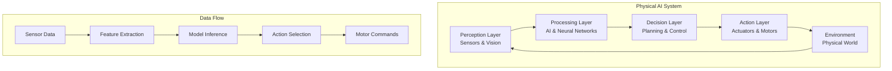

import CodeComponent from '@site/src/components/CodeComponent';
import DiagramComponent from '@site/src/components/DiagramComponent';
import QuizComponent from '@site/src/components/Quiz';

# Interactive Components Example

This page demonstrates the new interactive components available in the Physical AI textbook.

## Learning Objectives

<div className="learning-objectives">

After completing this lesson, you will be able to:
- Use interactive code components with live editing
- Understand complex systems through visual diagrams
- Test your knowledge with interactive quizzes
- Navigate content more effectively with enhanced navigation

</div>

## Interactive Code Example

<CodeComponent title="ROS 2 Node Example" language="python" editable={true}>

```python
import rclpy
from rclpy.node import Node
from std_msgs.msg import String

class PhysicalAINode(Node):
    def __init__(self):
        super().__init__('physical_ai_node')
        self.publisher_ = self.create_publisher(String, 'robot_status', 10)
        timer_period = 0.5  # seconds
        self.timer = self.create_timer(timer_period, self.timer_callback)
        self.counter = 0

    def timer_callback(self):
        msg = String()
        msg.data = f'Robot status: Active (cycle {self.counter})'
        self.publisher_.publish(msg)
        self.get_logger().info(f'Publishing: {msg.data}')
        self.counter += 1

def main(args=None):
    rclpy.init(args=args)
    physical_ai_node = PhysicalAINode()
    rclpy.spin(physical_ai_node)
    physical_ai_node.destroy_node()
    rclpy.shutdown()

if __name__ == '__main__':
    main()
```

</CodeComponent>

## System Architecture Visualization

<DiagramComponent title="Physical AI System Architecture" type="architecture">



</DiagramComponent>

## Interactive Quiz

<QuizComponent
  quizData={{
    title: "Physical AI Concepts Quiz",
    questions: [
      {
        id: "q1",
        question: "What is the main difference between Physical AI and traditional AI?",
        options: [
          "Physical AI requires more computational power",
          "Physical AI has a body to interact with the physical world",
          "Traditional AI only works with text",
          "Physical AI is always more expensive"
        ],
        correct: 1,
        explanation: "Physical AI systems have physical bodies that can sense and act in the real world, while traditional AI exists purely in digital environments."
      },
      {
        id: "q2",
        question: "Which component is responsible for converting AI decisions into physical actions?",
        options: [
          "Perception Layer",
          "Processing Layer",
          "Decision Layer",
          "Action Layer"
        ],
        correct: 3,
        explanation: "The Action Layer contains actuators and motors that execute the commands decided by the AI system."
      },
      {
        id: "q3",
        question: "What creates the feedback loop in a Physical AI system?",
        options: [
          "The clock signal",
          "The environment providing new sensory input",
          "The power supply",
          "The internet connection"
        ],
        correct: 1,
        explanation: "The environment provides new sensory input after actions are taken, creating a continuous perception-action feedback loop."
      }
    ]
  }}
/>

## Progress Tracking Feature

The textbook now includes enhanced progress tracking:
- Automatic progress saving as you complete lessons
- Visual indicators for completed content
- Quiz scores and performance analytics
- Personalized learning paths based on your progress

## Next Steps

Continue exploring the textbook with these new interactive features:
- Try editing the code examples to see real-time changes
- Use the diagrams to understand complex relationships
- Test your knowledge with quizzes after each lesson
- Track your progress through the curriculum

[← Back to Lesson 1.1](lesson-1) | [Continue to Lesson 1.2 →](lesson-2)