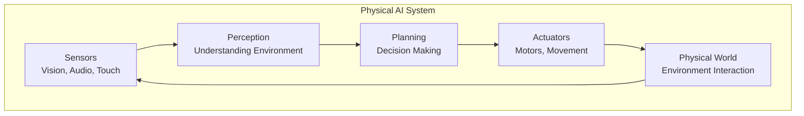
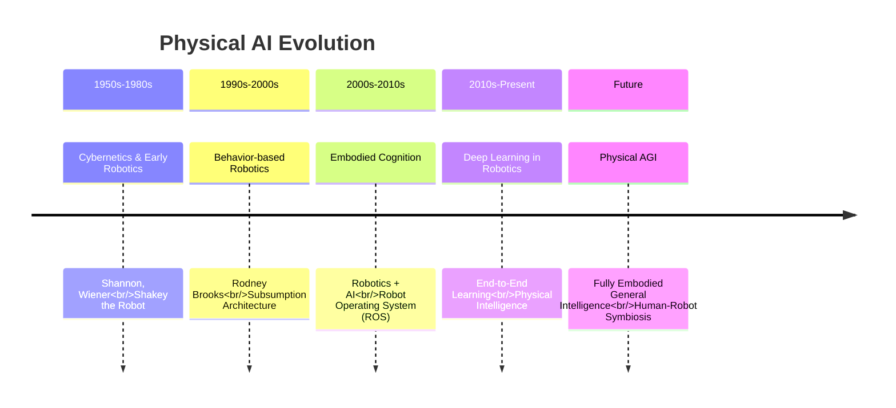
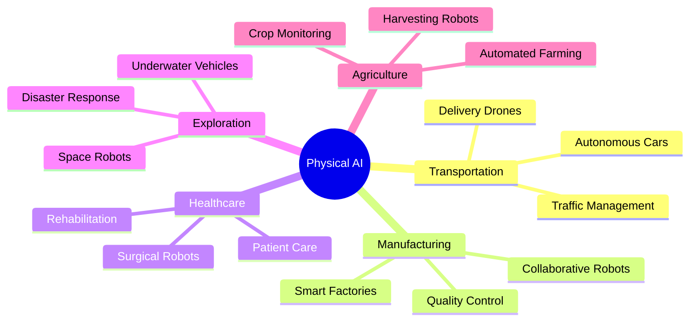

import CodeComponent from '@site/src/components/CodeComponent';

# Lesson 1.1: What is Physical AI?

## Learning Objectives

<div className="learning-objectives">

After completing this lesson, you will be able to:
- Define Physical AI and explain its importance
- Differentiate between Digital AI and Physical AI
- Understand the concept of embodied intelligence
- Identify key components of Physical AI systems
- Recognize real-world applications of Physical AI

</div>

## Introduction

Physical AI represents a paradigm shift in artificial intelligence - from digital-only intelligence to **embodied intelligence** that can interact with and understand the physical world. While traditional AI exists purely in computers, Physical AI gives AI a body to sense, act, and learn from physical interactions.

## What Makes AI "Physical"?

### Core Characteristics

Physical AI systems share these fundamental characteristics:

1. **Embodiment** - Having a physical body that can interact with the world
2. **Perception** - Sensing the environment through sensors
3. **Action** - Ability to manipulate or move in physical space
4. **Grounded Learning** - Learning from physical experiences
5. **Real-time Interaction** - Responding to physical events as they happen

<DiagramComponent title="Physical AI Components">



</DiagramComponent>

### Digital AI vs Physical AI

| Aspect | Digital AI | Physical AI |
|--------|-------------|-------------|
| **Domain** | Purely digital | Physical + Digital |
| **Learning** | From datasets | From physical experience |
| **Interaction** | Text/images | Direct physical manipulation |
| **Grounding** | Symbolic | Embodied understanding |
| **Examples** | ChatGPT, DALL-E | Humanoid robots, Self-driving cars |

## Embodied Intelligence

### The Theory

Embodied intelligence posits that **intelligence emerges from the interaction** between an agent's body, its environment, and its cognitive processes. Unlike the traditional view of the brain as a computer, embodied intelligence suggests:

> "The mind is not in the head alone, but distributed across brain, body, and environment."

### Key Principles

1. **Cognition is Situated**
   - Intelligence depends on context
   - Knowledge is grounded in experience
   - Understanding emerges from interaction

2. **The Body Shapes the Mind**
   - Physical capabilities affect cognition
   - Sensorimotor experiences build concepts
   - Morphology influences problem-solving

3. **Environment is Part of the System**
   - The world offloads cognitive work
   - Affordances guide behavior
   - Coupling with environment creates intelligence

<CodeComponent title="Simple Physical Agent Example" language="python">

```python
class PhysicalAgent:
    def __init__(self):
        self.sensors = Camera(), Lidar(), Microphone()
        self.actuators = Motors(), Gripper()
        self.position = [0, 0, 0]

    def perceive(self):
        """Get information about the environment"""
        camera_data = self.sensors.camera.capture()
        lidar_data = self.sensors.lidar.scan()
        audio_data = self.sensors.microphone.listen()
        return {
            'vision': camera_data,
            'distance': lidar_data,
            'sound': audio_data
        }

    def act(self, action):
        """Execute a physical action"""
        if action == 'move_forward':
            self.actuators.motors.move([1, 0, 0])
        elif action == 'grasp':
            self.actuators.gripper.close()
        self.update_position()

    def learn(self):
        """Learn from perception-action cycles"""
        perception = self.perceive()
        action = self.decide_action(perception)
        self.act(action)
        result = self.perceive()  # See what changed
        self.update_model(perception, action, result)
```

</CodeComponent>

## The Evolution of Physical AI

### Historical Context

Physical AI has evolved through several phases:

<DiagramComponent title="Evolution Timeline">



</DiagramComponent>

### Key Milestones

1. **Shakey (1969)** - First mobile robot with AI planning
2. **Honda ASIMO (2000)** - Advanced humanoid robot
3. **Boston Dynamics Atlas (2013)** - Dynamic legged locomotion
4. **OpenAI GPT + Robotics (2023)** - Language models controlling robots
5. **Tesla Optimus (2022)** - Humanoid robot for real-world tasks

## Why Physical AI Matters

### 1. More Natural Learning

Humans and animals learn through physical interaction, not just reading books. Physical AI enables machines to learn the same way:

```python
# Traditional AI learns from text
ai_knowledge = read_textbooks("robotics.txt")

# Physical AI learns from doing
robot_knowledge = interact_with_world()
```

### 2. Grounded Understanding

Physical AI systems develop a deeper understanding because their knowledge is tied to real experiences:

- "Heavy" isn't just a word - it's the effort to lift something
- "Slippery" isn't just a property - it's the feeling of losing grip
- "Near" and "far" are learned through spatial experience

### 3. Robust Intelligence

Physical AI tends to be more robust because it must handle:
- Uncertainty and noise
- Partial information
- Changing environments
- Physical constraints

## Real-World Applications

### Autonomous Vehicles
- Self-driving cars
- Delivery drones
- Autonomous shipping

### Manufacturing
- Collaborative robots (cobots)
- Adaptive manufacturing
- Quality inspection

### Healthcare
- Surgical robots
- Rehabilitation devices
- Elderly care assistants

### Exploration
- Space robots
- Deep-sea exploration
- Disaster response robots

<DiagramComponent title="Physical AI Application Domains">



</DiagramComponent>

## Lab Exercise: Perception-Action Loop

<div className="lab-exercise">

### Objective
Experience how perception and action work together in a simple Physical AI system.

### Setup
We'll simulate a robot learning about objects through interaction.

### Steps

1. **Initialize the Robot Agent**
2. **Explore Objects** - See how the robot perceives different objects
3. **Interact** - Watch how actions change perceptions
4. **Learn** - Build understanding from interaction

### Code Implementation

<CodeComponent language="python" editable={true}>

```python
import random

class SimplePhysicalAI:
    def __init__(self):
        self.objects = {}
        self.interactions = 0

    def perceive_object(self, object_id):
        """Simulate perceiving an object"""
        # In real robots, this would be sensor data
        objects_db = {
            'cube': {'color': 'red', 'shape': 'square', 'weight': 'heavy'},
            'ball': {'color': 'blue', 'shape': 'sphere', 'weight': 'light'},
            'box': {'color': 'green', 'shape': 'rectangular', 'weight': 'very heavy'}
        }

        if object_id in objects_db:
            self.objects[object_id] = objects_db[object_id]
            return self.objects[object_id]
        return None

    def interact(self, object_id, action):
        """Interact with an object"""
        self.interactions += 1

        if object_id not in self.objects:
            return "I don't know this object yet"

        result = f"I {action}ed the {object_id}"

        # Learn from interaction
        if action == "lift":
            weight = self.objects[object_id]['weight']
            result += f" and it feels {weight}"
        elif action == "push":
            shape = self.objects[object_id]['shape']
            if shape == 'sphere':
                result += " and it rolled away"
            else:
                result += " and it slid"

        return result

    def show_knowledge(self):
        """Display what the robot has learned"""
        print(f"After {self.interactions} interactions, I know:")
        for obj_id, properties in self.objects.items():
            print(f"  {obj_id}: {properties}")

# Create and test our Physical AI agent
agent = SimplePhysicalAI()

# Experiment with different objects
agent.perceive_object('cube')
print(agent.interact('cube', 'lift'))
print(agent.interact('cube', 'push'))

agent.perceive_object('ball')
print(agent.interact('ball', 'lift'))
print(agent.interact('ball', 'push'))

agent.perceive_object('box')
print(agent.interact('box', 'lift'))

# Show what was learned
agent.show_knowledge()
```

</CodeComponent>

### Expected Output
The robot should demonstrate how it builds knowledge through physical interactions with different objects.

### Questions
1. How did the robot's understanding change with each interaction?
2. What would happen if the robot interacted with the same object multiple times?
3. How is this different from reading about objects in a book?

</div>

## Key Takeaways

1. **Physical AI combines AI with physical bodies** to create truly intelligent systems
2. **Embodiment is crucial** for grounded understanding of the world
3. **Learning through interaction** creates more robust and adaptable intelligence
4. **Perception-action cycles** are the foundation of Physical AI systems
5. **Applications are everywhere** - from cars to healthcare to exploration

## Summary

Physical AI represents the convergence of artificial intelligence and robotics, creating systems that can truly understand and interact with the physical world. By giving AI bodies, sensors, and the ability to act, we enable machines to learn in ways that are more natural, robust, and aligned with how humans and animals learn.

In the next lesson, we'll explore the **sensors and perception systems** that enable Physical AI agents to understand their environment.

[Next: Sensors & Perception Systems →](lesson-2)

## Quiz

<Quiz
  quizId="physical-ai-foundations"
  questions={[
    {
      id: "q1",
      type: "multiple-choice",
      question: "What is the key difference between Digital AI and Physical AI?",
      options: [
        "Digital AI is faster",
        "Physical AI has a body to interact with the world",
        "Digital AI uses more data",
        "Physical AI is newer"
      ],
      correct: 1,
      explanation: "Physical AI systems have physical bodies that can sense and act in the real world, while Digital AI exists purely in digital environments."
    },
    {
      id: "q2",
      type: "true-false",
      question: "Embodied intelligence suggests that intelligence emerges from brain, body, and environment interaction.",
      correct: true,
      explanation: "Embodied intelligence posits that cognition is distributed across brain, body, and environment, not just in the head."
    },
    {
      id: "q3",
      type: "multiple-choice",
      question: "Which of these is NOT a characteristic of Physical AI?",
      options: [
        "Having sensors to perceive the environment",
        "Purely digital existence",
        "Having actuators to take action",
        "Learning from physical experiences"
      ],
      correct: 1,
      explanation: "Physical AI systems must have a physical presence; purely digital existence is characteristic of Digital AI, not Physical AI."
    }
  ]}
/>