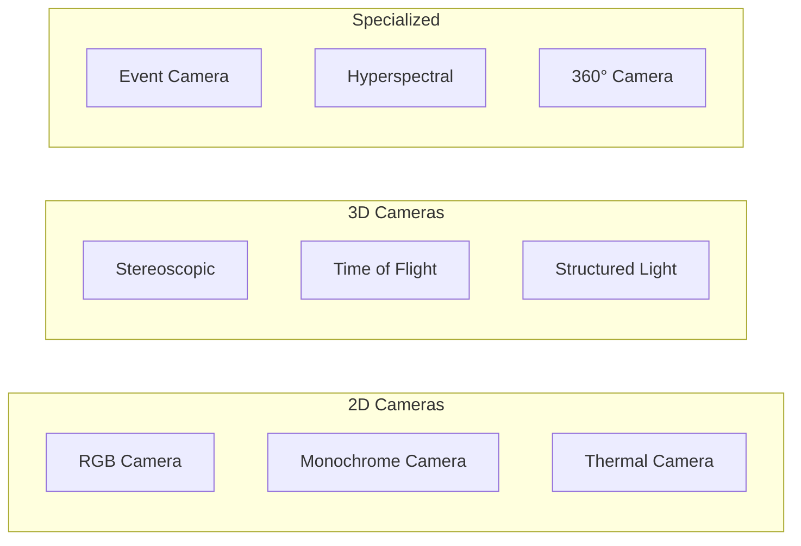
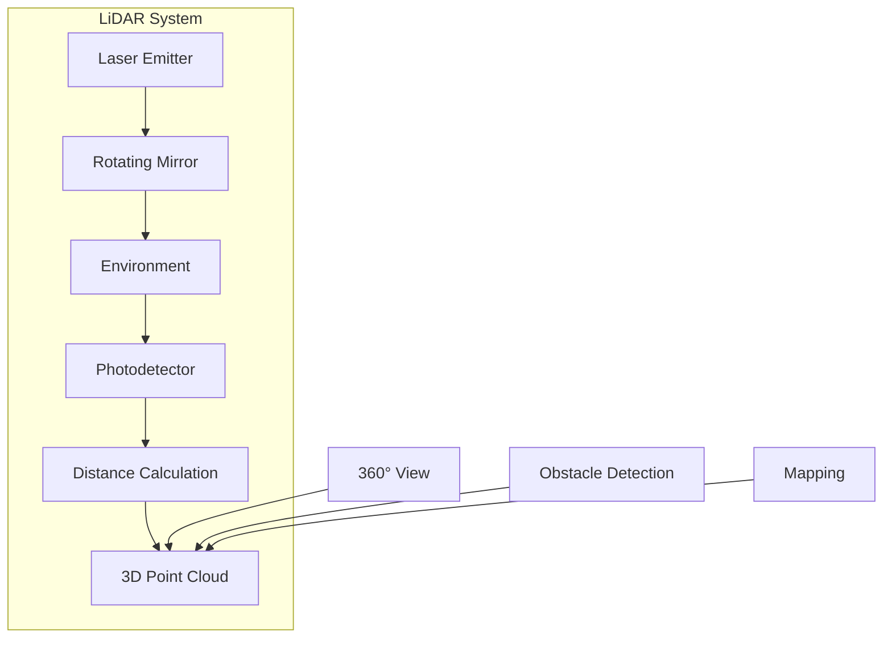
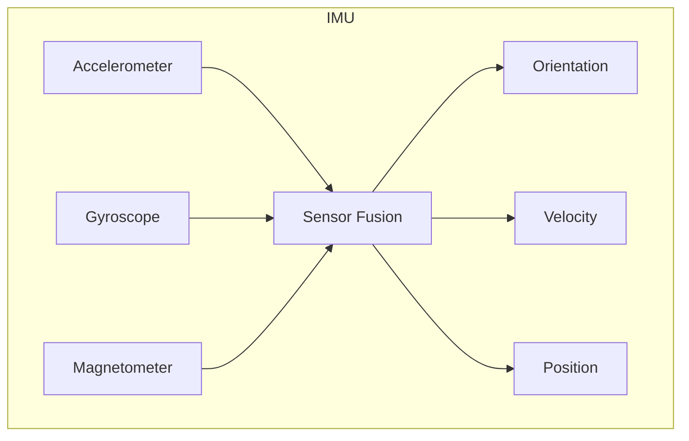
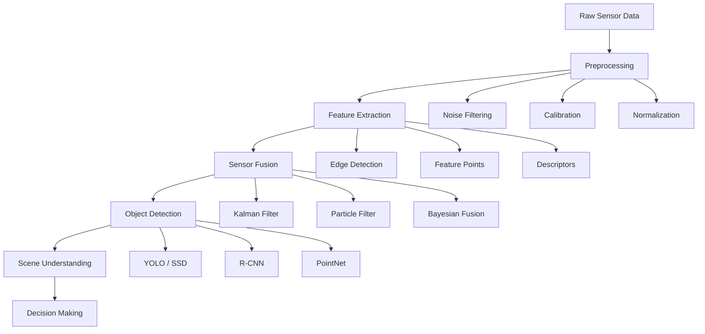

import CodeComponent from '@site/src/components/CodeComponent';

# Lesson 1.2: Sensors & Perception Systems

## Learning Objectives

<div className="learning-objectives">

After completing this lesson, you will be able to:
- Explain the role of sensors in Physical AI systems
- Identify different types of sensors used in robotics
- Understand sensor fusion and data processing
- Implement basic perception algorithms
- Recognize challenges in robot perception

</div>

## Introduction

Perception is the foundation of Physical AI. Just as humans use their senses to understand the world, robots use sensors to gather information about their environment. These sensors serve as the robot's eyes, ears, and sense of touch, enabling it to make informed decisions and take appropriate actions.

## Types of Sensors

### 1. Vision Sensors

#### Cameras
The most common vision sensors in robotics:

<DiagramComponent title="Camera Types in Robotics">



</DiagramComponent>

<CodeComponent title="OpenCV Camera Processing Example" language="python">

```python
import cv2
import numpy as np

class CameraProcessor:
    def __init__(self, camera_id=0):
        self.camera = cv2.VideoCapture(camera_id)
        self.frame_count = 0

    def capture_frame(self):
        """Capture and process a single frame"""
        ret, frame = self.camera.read()
        if not ret:
            return None

        # Convert to different color spaces
        gray = cv2.cvtColor(frame, cv2.COLOR_BGR2GRAY)
        hsv = cv2.cvtColor(frame, cv2.COLOR_BGR2HSV)

        # Apply filters
        blurred = cv2.GaussianBlur(gray, (5, 5), 0)
        edges = cv2.Canny(blurred, 50, 150)

        return {
            'original': frame,
            'gray': gray,
            'hsv': hsv,
            'edges': edges
        }

    def detect_objects(self, frame):
        """Detect objects using color thresholding"""
        hsv = frame['hsv']

        # Example: Detect red objects
        lower_red = np.array([0, 100, 100])
        upper_red = np.array([10, 255, 255])

        mask = cv2.inRange(hsv, lower_red, upper_red)
        contours, _ = cv2.findContours(mask, cv2.RETR_EXTERNAL, cv2.CHAIN_APPROX_SIMPLE)

        # Draw bounding boxes
        result = frame['original'].copy()
        for contour in contours:
            if cv2.contourArea(contour) > 100:
                x, y, w, h = cv2.boundingRect(contour)
                cv2.rectangle(result, (x, y), (x+w, y+h), (0, 255, 0), 2)

        return result, len(contours)
```

</CodeComponent>

### 2. Depth Sensors

#### LiDAR (Light Detection and Ranging)
LiDAR sensors use laser beams to measure distance, creating 3D point clouds of the environment.

<DiagramComponent title="LiDAR Scanning Pattern">



</DiagramComponent>

<CodeComponent title="LiDAR Data Processing" language="python">

```python
import numpy as np
import matplotlib.pyplot as plt
from mpl_toolkits.mplot3d import Axes3D

class LidarProcessor:
    def __init__(self):
        self.max_range = 100.0  # meters
        self.angle_resolution = 0.25  # degrees

    def process_scan(self, raw_data):
        """Process raw LiDAR scan data into point cloud"""
        points = []

        for i, distance in enumerate(raw_data):
            if 0.1 < distance < self.max_range:  # Filter valid ranges
                angle = np.radians(i * self.angle_resolution)

                # Convert polar to Cartesian coordinates
                x = distance * np.cos(angle)
                y = distance * np.sin(angle)
                z = 0  # Assume 2D LiDAR

                points.append([x, y, z])

        return np.array(points)

    def segment_obstacles(self, point_cloud, threshold=0.5):
        """Segment point cloud into obstacles using clustering"""
        from sklearn.cluster import DBSCAN

        # Perform DBSCAN clustering
        clustering = DBSCAN(eps=threshold, min_samples=5).fit(point_cloud)
        labels = clustering.labels_

        # Group points by cluster
        obstacles = {}
        for i, label in enumerate(labels):
            if label != -1:  # -1 represents noise
                if label not in obstacles:
                    obstacles[label] = []
                obstacles[label].append(point_cloud[i])

        return obstacles

    def create_occupancy_grid(self, point_cloud, grid_size=200, resolution=0.5):
        """Create 2D occupancy grid from point cloud"""
        grid = np.zeros((grid_size, grid_size))

        for point in point_cloud:
            # Convert point to grid coordinates
            x_idx = int((point[0] + grid_size * resolution / 2) / resolution)
            y_idx = int((point[1] + grid_size * resolution / 2) / resolution)

            if 0 <= x_idx < grid_size and 0 <= y_idx < grid_size:
                grid[y_idx, x_idx] = 1  # Mark as occupied

        return grid
```

</CodeComponent>

### 3. Proximity Sensors

#### Ultrasonic Sensors
Using sound waves to measure distance:

<CodeComponent title="Ultrasonic Sensor Simulation" language="python">

```python
import time
import random

class UltrasonicSensor:
    def __init__(self, max_distance=400, min_distance=2):
        """Initialize ultrasonic sensor
        max_distance: maximum detection distance in cm
        min_distance: minimum detection distance in cm
        """
        self.max_distance = max_distance
        self.min_distance = min_distance
        self.speed_of_sound = 34300  # cm/s in air at 20°C

    def measure_distance(self):
        """Simulate distance measurement"""
        # Simulate echo time calculation
        distance = random.uniform(self.min_distance, self.max_distance)

        # Calculate echo time (microseconds)
        echo_time = (2 * distance / self.speed_of_sound) * 1e6

        return distance, echo_time

    def detect_obstacles(self, angle, distance_threshold=50):
        """Detect obstacles at a specific angle"""
        distance, _ = self.measure_distance()

        if distance < distance_threshold:
            return {
                'obstacle_detected': True,
                'angle': angle,
                'distance': distance,
                'confidence': min(1.0, (distance_threshold - distance) / distance_threshold)
            }
        else:
            return {
                'obstacle_detected': False,
                'angle': angle,
                'distance': distance,
                'confidence': 0.0
            }

# Example: Multiple ultrasonic sensors for 360° coverage
class MultiUltrasonicArray:
    def __init__(self, num_sensors=8):
        self.sensors = [UltrasonicSensor() for _ in range(num_sensors)]
        self.angles = [i * (360 / num_sensors) for i in range(num_sensors)]

    def scan_360(self):
        """Perform a 360° scan"""
        results = []

        for sensor, angle in zip(self.sensors, self.angles):
            result = sensor.detect_obstacles(angle)
            results.append(result)

        return results

# Create and test sensor array
sensor_array = MultiUltrasonicArray(8)
scan_results = sensor_array.scan_360()

# Find closest obstacle
obstacles = [r for r in scan_results if r['obstacle_detected']]
if obstacles:
    closest = min(obstacles, key=lambda x: x['distance'])
    print(f"Closest obstacle at {closest['angle']}°, {closest['distance']}cm")
```

</CodeComponent>

### 4. Inertial Sensors

#### IMU (Inertial Measurement Unit)
Combines accelerometer and gyroscope to measure motion and orientation.

<DiagramComponent title="IMU Components">



</DiagramComponent>

<CodeComponent title="IMU Data Processing" language="python">

```python
import numpy as np
from scipy.integrate import cumtrapz
import matplotlib.pyplot as plt

class IMUProcessor:
    def __init__(self, sample_rate=100):
        self.sample_rate = sample_rate  # Hz
        self.dt = 1.0 / sample_rate

        # State variables
        self.orientation = np.array([0, 0, 0])  # roll, pitch, yaw in radians
        self.velocity = np.array([0, 0, 0])
        self.position = np.array([0, 0, 0])

        # Calibration parameters
        self.accel_bias = np.array([0.0, 0.0, 0.0])
        self.gyro_bias = np.array([0.0, 0.0, 0.0])

    def calibrate(self, accel_data, gyro_data, duration=5.0):
        """Calibrate IMU by computing bias from stationary measurements"""
        samples = int(duration * self.sample_rate)

        self.accel_bias = np.mean(accel_data[:samples], axis=0)
        self.gyro_bias = np.mean(gyro_data[:samples], axis=0)

        # Account for gravity in Z-axis accelerometer bias
        self.accel_bias[2] -= 9.81

        return self.accel_bias, self.gyro_bias

    def process_accelerometer(self, accel_data):
        """Process accelerometer data to get linear acceleration"""
        # Remove bias
        accel_corrected = accel_data - self.accel_bias

        # Integrate to get velocity
        self.velocity += cumtrapz(accel_corrected, dx=self.dt, initial=0)

        # Integrate to get position
        self.position += cumtrapz(self.velocity, dx=self.dt, initial=0)

        return self.velocity, self.position

    def process_gyroscope(self, gyro_data):
        """Process gyroscope data to update orientation"""
        # Remove bias
        gyro_corrected = gyro_data - self.gyro_bias

        # Integrate angular velocity to get orientation
        self.orientation += cumtrapz(gyro_corrected, dx=self.dt, initial=0)

        # Normalize angles to [-π, π]
        self.orientation = np.arctan2(np.sin(self.orientation), np.cos(self.orientation))

        return self.orientation

    def sensor_fusion_kalman(self, accel_data, gyro_data):
        """
        Simple Kalman filter for sensor fusion
        Combines accelerometer and gyroscope data
        """
        # State: [position, velocity, orientation]
        x = np.array([self.position, self.velocity, self.orientation])

        # Process noise covariance
        Q = np.eye(9) * 0.01

        # Measurement noise covariance
        R = np.eye(9) * 0.1

        # Simple Kalman filter implementation
        # Prediction step
        F = np.eye(9)  # State transition matrix
        x_pred = F @ x

        # Update step with accelerometer
        H_accel = np.eye(9)  # Measurement matrix
        z_accel = np.array([self.position, self.velocity, self.orientation])

        # Kalman gain
        S = H_accel @ Q @ H_accel.T + R
        K = Q @ H_accel.T @ np.linalg.inv(S)

        # Update state
        x = x_pred + K @ (z_accel - H_accel @ x_pred)

        # Update state variables
        self.position = x[:3]
        self.velocity = x[3:6]
        self.orientation = x[6:9]

        return x

# Example usage
imu = IMUProcessor(sample_rate=100)

# Simulate IMU data
t = np.arange(0, 10, 1/100)
accel_data = np.random.randn(1000, 3) * 0.1 + np.array([0, 0, 9.81])
gyro_data = np.random.randn(1000, 3) * 0.01

# Process data
for i in range(len(accel_data)):
    accel = accel_data[i]
    gyro = gyro_data[i]

    velocity, position = imu.process_accelerometer(accel)
    orientation = imu.process_gyroscope(gyro)

    if i % 100 == 0:  # Log every 1 second
        print(f"Time: {i/100:.1f}s, Position: {position}")
```

</CodeComponent>

### 5. Specialized Sensors

#### Force/Torque Sensors
Measure contact forces and torques for manipulation tasks.

<CodeComponent title="Force Sensor Integration" language="python">

```python
class ForceSensor:
    def __init__(self, max_force=50, max_torque=5):
        self.max_force = max_force  # Newtons
        self.max_torque = max_torque  # N⋅m
        self.calibration_matrix = np.eye(6)  # 6-DOF calibration

    def read_forces(self):
        """Read force/torque data"""
        # Simulate force sensor reading
        fx = np.random.uniform(-self.max_force, self.max_force)
        fy = np.random.uniform(-self.max_force, self.max_force)
        fz = np.random.uniform(0, self.max_force)  # Positive Z (pushing)
        tx = np.random.uniform(-self.max_torque, self.max_torque)
        ty = np.random.uniform(-self.max_torque, self.max_torque)
        tz = np.random.uniform(-self.max_torque, self.max_torque)

        raw_reading = np.array([fx, fy, fz, tx, ty, tz])

        # Apply calibration
        calibrated_reading = self.calibration_matrix @ raw_reading

        return {
            'force': calibrated_reading[:3],
            'torque': calibrated_reading[3:6],
            'magnitude': {
                'force': np.linalg.norm(calibrated_reading[:3]),
                'torque': np.linalg.norm(calibrated_reading[3:6])
            }
        }

class GripperWithForceFeedback:
    def __init__(self):
        self.force_sensor = ForceSensor()
        self.gripper_open = True
        self.grasp_force = 10.0  # Newtons
        self.current_force = 0.0

    def grasp_object(self, target_force=None):
        """Grasp an object with force feedback"""
        if target_force:
            self.grasp_force = target_force

        # Close gripper
        self.gripper_open = False

        # Monitor force while closing
        while self.current_force < self.grasp_force:
            force_data = self.force_sensor.read_forces()
            self.current_force = force_data['magnitude']['force']

            # Check if object is slipping
            if self.current_force > self.grasp_force * 1.5:
                print("Warning: Object might be slipping!")
                break

        return {
            'grasped': True,
            'applied_force': self.current_force,
            'stable': self.current_force >= self.grasp_force * 0.9
        }

# Test the force feedback system
gripper = GripperWithForceFeedback()
result = gripper.grasp_object(target_force=15.0)
print(f"Grasp result: {result}")
```

</CodeComponent>

## Sensor Fusion

### Why Fuse Sensors?

Different sensors have different strengths and weaknesses:

| Sensor Type | Strengths | Weaknesses |
|-------------|----------|------------|
| Camera | Rich visual info | Sensitive to lighting |
| LiDAR | Accurate depth | Expensive, sparse data |
| IMU | High frequency | Drift over time |
| GPS | Global position | Not available indoors |

### Fusion Techniques

<CodeComponent title="Kalman Filter for Sensor Fusion" language="python">

```python
import numpy as np
from filterpy.kalman import KalmanFilter

class MultiSensorFusion:
    def __init__(self):
        # State vector: [x, y, z, vx, vy, vz, ax, ay, az]
        self.kf = KalmanFilter(dim_x=9, dim_z=9)

        # State transition matrix
        self.kf.F = np.array([
            [1, 0, 0, 1, 0, 0, 0.5, 0, 0],  # x = x + vx*dt + 0.5*ax*dt^2
            [0, 1, 0, 0, 1, 0, 0, 0.5, 0],  # y = y + vy*dt + 0.5*ay*dt^2
            [0, 0, 1, 0, 0, 1, 0, 0, 0.5],  # z = z + vz*dt + 0.5*az*dt^2
            [0, 0, 0, 1, 0, 0, 1, 0, 0],      # vx = vx + ax*dt
            [0, 0, 0, 0, 1, 0, 0, 1, 0],      # vy = vy + ay*dt
            [0, 0, 0, 0, 0, 1, 0, 0, 1],      # vz = vz + az*dt
            [0, 0, 0, 0, 0, 0, 1, 0, 0],      # ax = ax (random walk)
            [0, 0, 0, 0, 0, 0, 0, 1, 0],      # ay = ay (random walk)
            [0, 0, 0, 0, 0, 0, 0, 0, 1]       # az = az (random walk)
        ])

        # Measurement matrix
        self.kf.H = np.eye(9)

        # Process noise
        self.kf.Q *= 0.01

        # Measurement noise
        self.kf.R *= 0.1

        # Initial state covariance
        self.kf.P *= 1000

    def update_with_vision(self, position, confidence=0.8):
        """Update Kalman filter with vision data"""
        # Adjust measurement noise based on confidence
        R_vision = self.kf.R / confidence
        self.kf.R = R_vision

        z = np.array([position[0], position[1], position[2], 0, 0, 0, 0, 0, 0])
        self.kf.predict()
        self.kf.update(z)

        return self.kf.x[:3]

    def update_with_imu(self, acceleration, confidence=0.9):
        """Update Kalman filter with IMU data"""
        # Adjust measurement noise
        R_imu = self.kf.R / confidence
        self.kf.R = R_imu

        z = np.array([0, 0, 0, 0, 0, 0, acceleration[0], acceleration[1], acceleration[2]])
        self.kf.predict()
        self.kf.update(z)

        return self.kf.x

    def update_with_lidar(self, position, confidence=0.95):
        """Update Kalman filter with LiDAR data"""
        R_lidar = self.kf.R / confidence
        self.kf.R = R_lidar

        z = np.array([position[0], position[1], position[2], 0, 0, 0, 0, 0, 0])
        self.kf.predict()
        self.kf.update(z)

        return self.kf.x[:3]

# Example usage
fusion = MultiSensorFusion()

# Simulate sensor updates over time
for t in range(10):
    # Vision update
    vision_pos = np.array([t + np.random.normal(0, 0.1),
                           2 + np.random.normal(0, 0.1),
                           0])
    fusion.update_with_vision(vision_pos)

    # IMU update
    imu_accel = np.array([0.1, 0, -9.81])  # Small forward acceleration and gravity
    fusion.update_with_imu(imu_accel)

    # LiDAR update (every 3 steps)
    if t % 3 == 0:
        lidar_pos = np.array([t + np.random.normal(0, 0.05),
                              2 + np.random.normal(0, 0.05),
                              np.random.normal(0, 0.05)])
        fusion.update_with_lidar(lidar_pos)

    # Get fused estimate
    estimated_state = fusion.kf.x
    print(f"Time {t}: Position = ({estimated_state[0]:.2f}, {estimated_state[1]:.2f}, {estimated_state[2]:.2f})")
```

</CodeComponent>

## Perception Pipeline

### End-to-End Perception System

<DiagramComponent title="Robot Perception Pipeline">



</DiagramComponent>

## Lab Exercise: Building a Simple Perception System

<div className="lab-exercise">

### Objective
Create a multi-sensor perception system that can detect and track objects.

### Setup
We'll build a simplified perception system using simulated sensor data.

### Implementation

<CodeComponent language="python" editable={true}>

```python
import numpy as np
import matplotlib.pyplot as plt
from scipy.spatial.distance import euclidean

class PerceptionSystem:
    def __init__(self):
        self.objects = []
        self.object_tracker = {}
        self.next_id = 0

        # Sensor noise parameters
        self.vision_noise = 0.1
        self.lidar_noise = 0.05

    def detect_objects_vision(self, camera_data):
        """Simulate object detection from camera"""
        objects = []

        # Simulate detecting 3 objects in the scene
        true_objects = [
            {'id': 1, 'pos': [2, 3], 'size': 1.0, 'type': 'cube'},
            {'id': 2, 'pos': [5, 1], 'size': 1.5, 'type': 'sphere'},
            {'id': 3, 'pos': [3, 5], 'size': 0.8, 'type': 'cylinder'}
        ]

        for obj in true_objects:
            # Add Gaussian noise to measurements
            measured_pos = [
                obj['pos'][0] + np.random.normal(0, self.vision_noise),
                obj['pos'][1] + np.random.normal(0, self.vision_noise)
            ]

            objects.append({
                'sensor': 'vision',
                'position': np.array(measured_pos),
                'size': obj['size'],
                'type': obj['type'],
                'confidence': 0.9
            })

        return objects

    def detect_objects_lidar(self, lidar_data):
        """Simulate object detection from LiDAR"""
        objects = []

        # Simulate detecting 2 objects (less resolution than vision)
        true_objects = [
            {'id': 1, 'pos': [2.05, 2.95], 'type': 'cube'},
            {'id': 2, 'pos': [4.95, 1.02], 'type': 'sphere'}
        ]

        for obj in true_objects:
            # Add smaller noise to LiDAR measurements
            measured_pos = [
                obj['pos'][0] + np.random.normal(0, self.lidar_noise),
                obj['pos'][1] + np.random.normal(0, self.lidar_noise)
            ]

            objects.append({
                'sensor': 'lidar',
                'position': np.array(measured_pos),
                'type': obj['type'],
                'confidence': 0.95
            })

        return objects

    def fuse_detections(self, vision_objects, lidar_objects):
        """Fuse detections from multiple sensors"""
        fused_objects = []

        # Combine all detections
        all_detections = vision_objects + lidar_objects

        # Group by type and position
        for detection in all_detections:
            # Check if this object matches any existing fused object
            matched = False

            for fused in fused_objects:
                # Check if same type and close position
                if (fused['type'] == detection['type'] and
                    euclidean(fused['position'], detection['position']) < 0.5):

                    # Weighted average of positions
                    weight_vision = detection['confidence'] if detection['sensor'] == 'vision' else 0
                    weight_lidar = detection['confidence'] if detection['sensor'] == 'lidar' else 0

                    total_weight = fused['vision_confidence'] + fused['lidar_confidence'] + weight_vision + weight_lidar

                    fused['position'] = (
                        fused['position'] * (fused['vision_confidence'] + fused['lidar_confidence']) +
                        detection['position'] * (weight_vision + weight_lidar)
                    ) / total_weight

                    fused['vision_confidence'] += weight_vision
                    fused['lidar_confidence'] += weight_lidar
                    fused['total_confidence'] = fused['vision_confidence'] + fused['lidar_confidence']

                    matched = True
                    break

            if not matched:
                # Create new fused object
                fused_objects.append({
                    'type': detection['type'],
                    'position': detection['position'].copy(),
                    'vision_confidence': detection['confidence'] if detection['sensor'] == 'vision' else 0,
                    'lidar_confidence': detection['confidence'] if detection['sensor'] == 'lidar' else 0,
                    'total_confidence': detection['confidence']
                })

        return fused_objects

    def track_objects(self, current_objects, prev_objects):
        """Track objects across frames"""
        if not prev_objects:
            # First frame - assign new IDs
            for obj in current_objects:
                obj['id'] = self.next_id
                self.next_id += 1
                self.object_tracker[obj['id']] = obj
        else:
            # Match current objects with previous ones
            matched_prev = set()

            for curr_obj in current_objects:
                best_match = None
                best_distance = float('inf')
                best_id = None

                for prev_id, prev_obj in prev_objects.items():
                    if prev_id in matched_prev:
                        continue

                    # Check if same type and close position
                    if (curr_obj['type'] == prev_obj['type']):
                        distance = euclidean(curr_obj['position'], prev_obj['position'])

                        if distance < 1.0 and distance < best_distance:
                            best_match = prev_obj
                            best_distance = distance
                            best_id = prev_id

                if best_match:
                    # Update existing track
                    curr_obj['id'] = best_id
                    self.object_tracker[best_id] = curr_obj
                    matched_prev.add(best_id)
                else:
                    # New object detected
                    curr_obj['id'] = self.next_id
                    self.next_id += 1
                    self.object_tracker[curr_obj['id']] = curr_obj

            # Remove objects that were not detected (they left the scene)
            for prev_id in list(prev_objects.keys()):
                if prev_id not in matched_prev:
                    del self.object_tracker[prev_id]

        return list(self.object_tracker.values())

# Create and test perception system
perception = PerceptionSystem()

# Simulate multiple frames
print("=== Multi-Sensor Perception System ===\n")

frame_count = 0
tracked_objects = None

while frame_count < 5:
    print(f"\n--- Frame {frame_count + 1} ---")

    # Get detections from sensors
    vision_objects = perception.detect_objects_vision(None)
    lidar_objects = perception.detect_objects_lidar(None)

    print(f"Vision detected {len(vision_objects)} objects")
    print(f"LiDAR detected {len(lidar_objects)} objects")

    # Fuse detections
    fused_objects = perception.fuse_detections(vision_objects, lidar_objects)
    print(f"Fused detections: {len(fused_objects)} objects")

    # Track objects across frames
    tracked_objects = perception.track_objects(fused_objects, tracked_objects)

    print("\nTracked objects:")
    for obj in tracked_objects:
        print(f"  ID {obj['id']}: {obj['type']} at ({obj['position'][0]:.2f}, {obj['position'][1]:.2f}) "
              f"confidence: {obj['total_confidence']:.2f}")

    frame_count += 1
```

</CodeComponent>

### Expected Output
The system should demonstrate:
1. Multi-sensor object detection
2. Sensor fusion with confidence weighting
3. Object tracking across frames
4. Handling of new and disappearing objects

### Extension Exercises
1. Add a third sensor (e.g., thermal camera)
2. Implement Kalman filtering for smoother tracking
3. Add object classification using type-specific features
4. Visualize the tracking results

</div>

## Challenges in Robot Perception

### 1. Environmental Variability
- Lighting changes affect vision sensors
- Weather conditions impact outdoor perception
- Dynamic environments require continuous adaptation

### 2. Sensor Limitations
- Each sensor type has inherent limitations
- No single sensor provides complete information
- Fusion must handle different data types and rates

### 3. Real-Time Constraints
- Perception must happen in milliseconds
- Limited computational resources on robots
- Trade-off between accuracy and speed

### 4. Ambiguity and Uncertainty
- Perceptual aliasing (different objects look similar)
- Noise and measurement errors
- Partial observations

### 5. Scale and Range
- Robots need to perceive at multiple scales
- Far objects require different sensing than near objects
- Different environments need different sensing strategies

## Key Takeaways

1. **Sensors are the robot's senses** - They enable perception of the physical world
2. **Different sensors provide complementary information** - Vision gives rich detail, LiDAR gives accurate depth
3. **Sensor fusion creates robust perception** - Combining sensors overcomes individual limitations
4. **Processing is essential** - Raw sensor data must be processed into useful information
5. **Tracking enables understanding** - Maintaining object identity over time is crucial

## Summary

Perception systems are the foundation of Physical AI, enabling robots to understand and interact with their environment. By combining multiple sensors and sophisticated processing algorithms, robots can build rich models of the world that support intelligent decision-making.

In the next lesson, we'll explore the **weekly learning plan** and how to structure your 13-week journey through Physical AI.

[Next: Weekly Learning Plan (Weeks 1-2) →](lesson-3)

## Quiz

<Quiz
  quizId="sensors-perception"
  questions={[
    {
      id: "q1",
      type: "multiple-choice",
      question: "Which sensor type provides the most accurate depth information?",
      options: [
        "RGB Camera",
        "LiDAR",
        "IMU",
        "Ultrasonic"
      ],
      correct: 1,
      explanation: "LiDAR provides the most accurate depth information by directly measuring distance with laser beams."
    },
    {
      id: "q2",
      type: "multiple-choice",
      question: "What is the main advantage of sensor fusion?",
      options: [
        "Reduces cost",
        "Increases processing speed",
        "Overcomes individual sensor limitations",
        "Requires fewer sensors"
      ],
      correct: 2,
      explanation: "Sensor fusion combines strengths of different sensors to overcome their individual limitations, creating more robust perception."
    },
    {
      id: "q3",
      type: "true-false",
      question: "IMU sensors can provide absolute position information without drift.",
      correct: false,
      explanation: "IMUs suffer from integration drift over time and cannot provide absolute position without external reference."
    }
  ]}
/>