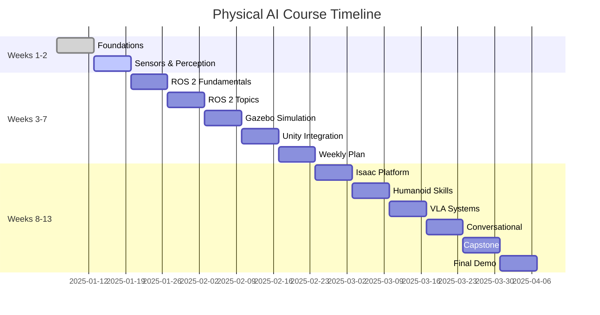
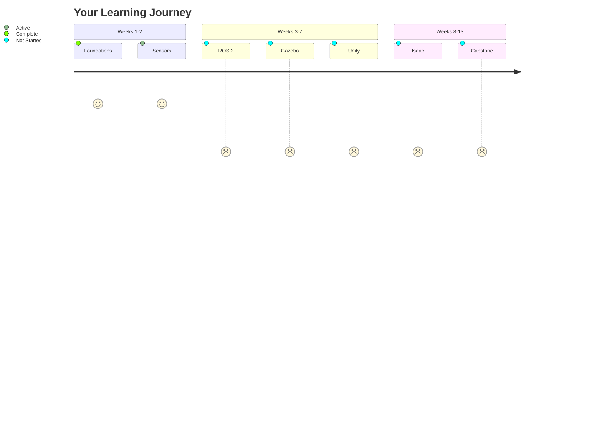

import CodeComponent from '@site/src/components/CodeComponent';

# Lesson 1.3: Weekly Learning Plan (Weeks 1-2)

## Learning Objectives

<div className="learning-objectives">

After completing this lesson, you will understand:
- The 13-week course structure and timeline
- Learning objectives for Weeks 1-2
- Required hardware and software setup
- Weekly milestones and deliverables
- How to track your progress

</div>

## Course Overview

This Physical AI & Humanoid Robotics course is designed as a **13-week intensive program** that takes you from basic concepts to building a complete autonomous humanoid robot system. Each week builds upon the previous one, creating a comprehensive learning journey.

<DiagramComponent title="13-Week Course Structure">



</DiagramComponent>

## Week 1: Physical AI Foundations

### Learning Objectives

1. Understand the concept of Physical AI and embodied intelligence
2. Differentiate between digital and physical AI systems
3. Recognize applications of Physical AI in the real world
4. Set up development environment for the course

### Weekly Schedule

| Day | Topics | Activities |
|-----|--------|------------|
| Monday | Course Introduction | Overview, expectations, assessment |
| Tuesday | What is Physical AI? | Core concepts, embodied intelligence theory |
| Wednesday | Digital vs Physical AI | Comparisons, advantages, use cases |
| Thursday | Applications & Case Studies | Real-world examples, demos |
| Friday | Environment Setup | Install tools, test basic examples |

### Daily Breakdown

#### Day 1: Course Introduction (2 hours)
- Course structure and goals
- Assessment criteria
- Required hardware and software
- Q&A session

#### Day 2: What is Physical AI? (3 hours)
- **Theory (1 hour)**
  - Definition and key concepts
  - Historical development
  - Theoretical frameworks

- **Interactive Examples (2 hours)**
  - Simple embodied agents
  - Perception-action loops
  - Basic robot simulation

#### Day 3: Digital vs Physical AI (3 hours)
- **Theory (1 hour)**
  - Key differences
  - Advantages of physical embodiment
  - Challenges and limitations

- **Lab (2 hours)**
  - Compare digital chatbot vs physical robot
  - Implement basic Physical AI agent
  - Demonstrate embodied learning

#### Day 4: Applications & Case Studies (3 hours)
- **Presentations (1.5 hours)**
  - Autonomous vehicles
  - Manufacturing robots
  - Healthcare robotics
  - Exploration robots

- **Discussions (1.5 hours)**
  - Group analysis of case studies
  - Ethical considerations
  - Future trends

#### Day 5: Environment Setup (3 hours)
- **Installation (1.5 hours)**
  - ROS 2 installation
  - Python environment
  - Development tools

- **Testing (1.5 hours)**
  - Verify installations
  - Run basic examples
  - Troubleshoot issues

### Week 1 Deliverables

1. **Physical AI Definition Paper** (2 pages)
   - Your understanding of Physical AI
   - Key differences from digital AI
   - One real-world application analysis

2. **Simple Physical Agent** (Python code)
   - Implements perception-action loop
   - Demonstrates embodied learning
   - 50-100 lines of code

3. **Environment Setup Verification**
   - All tools installed and tested
   - Screenshots of working installations
   - Brief troubleshooting log

### Assessment Criteria

| Component | Weight | Passing Criteria |
|-----------|--------|-----------------|
| Understanding Paper | 30% | Clear explanation, accurate concepts |
| Code Implementation | 40% | Working code, demonstrates concepts |
| Environment Setup | 30% | All tools installed, examples work |

## Week 2: Sensors & Perception Systems

### Learning Objectives

1. Master different types of sensors used in robotics
2. Implement basic perception algorithms
3. Apply sensor fusion techniques
4. Build a simple perception system

### Weekly Schedule

| Day | Topics | Activities |
|-----|--------|------------|
| Monday | Vision Sensors | Cameras, image processing |
| Tuesday | Depth Sensors | LiDAR, depth cameras |
| Wednesday | Proximity Sensors | Ultrasonic, infrared |
| Thursday | Inertial Sensors | IMU, Kalman filtering |
| Friday | Sensor Fusion | Multi-sensor integration |

### Daily Breakdown

#### Day 1: Vision Sensors (4 hours)
- **Theory (1.5 hours)**
  - Camera types and specifications
  - Image processing fundamentals
  - Computer vision algorithms

- **Lab (2.5 hours)**
  - OpenCV setup and basic operations
  - Object detection with color thresholding
  - Edge detection and contour finding

#### Day 2: Depth Sensors (4 hours)
- **Theory (1.5 hours)**
  - LiDAR principles and operation
  - Depth camera technologies
  - 3D reconstruction

- **Lab (2.5 hours)**
  - LiDAR data processing
  - Point cloud manipulation
  - 3D visualization

#### Day 3: Proximity Sensors (4 hours)
- **Theory (1.5 hours)**
  - Ultrasonic sensor physics
  - Infrared sensing
  - Time-of-flight measurements

- **Lab (2.5 hours)**
  - Ultrasonic sensor simulation
  - Obstacle detection algorithms
  - Multi-sensor array design

#### Day 4: Inertial Sensors (4 hours)
- **Theory (1.5 hours)**
  - Accelerometer and gyroscope principles
  - IMU data processing
  - Kalman filtering for pose estimation

- **Lab (2.5 hours)**
  - IMU data simulation
  - Orientation estimation
  - Motion tracking

#### Day 5: Sensor Fusion (4 hours)
- **Theory (1.5 hours)**
  - Kalman filter fundamentals
  - Particle filters
  - Multi-sensor fusion strategies

- **Lab (2.5 hours)**
  - Implement Kalman filter
  - Fuse vision and IMU data
  - Build tracking system

### Week 2 Deliverables

1. **Sensor Report** (3 pages)
   - Analysis of 5 different sensor types
   - Comparison of strengths/weaknesses
   - Application recommendations

2. **Perception System** (Python code)
   - Multi-sensor fusion implementation
   - Object tracking functionality
   - 200-300 lines of code

3. **Sensor Fusion Demo** (Video/Code)
   - Demonstration of working system
   - Performance analysis
   - Challenges faced and solutions

### Assessment Criteria

| Component | Weight | Passing Criteria |
|-----------|--------|-----------------|
| Sensor Report | 30% | Comprehensive analysis, technical accuracy |
| Perception System | 50% | Working fusion, robust tracking |
| Demo/Analysis | 20% | Clear demonstration, insightful analysis |

## Required Hardware & Software

### Minimum Requirements

#### Hardware
- **Computer**: 8GB RAM, quad-core processor
- **OS**: Ubuntu 20.04+ or macOS 10.15+ or Windows 10+
- **Camera**: USB webcam (720p minimum)
- **Storage**: 20GB free space

#### Software
- **ROS 2**: Humble Hawksbill
- **Python**: 3.8+
- **IDE**: VS Code, PyCharm, or similar
- **Version Control**: Git

### Recommended Hardware

#### Enhanced Experience
- **GPU**: NVIDIA GTX 1060 or better (for simulations)
- **RAM**: 16GB or more
- **Additional Sensors**: Arduino/ESP32 with ultrasonic sensors
- **Robot Kit**: Simple 2-DOF or 3-DOF robot arm

### Installation Commands

<CodeComponent title="ROS 2 Installation" language="bash">

```bash
# Add ROS 2 apt repository
sudo apt update
sudo apt install curl gnupg2 lsb-release

curl -sSL https://raw.githubusercontent.com/ros/rosdistro/master/ros.key -o /usr/share/keyrings/ros-archive-keyring.gpg

echo "deb [arch=$(dpkg --print-architecture)] http://packages.ros.org/ros2/ubuntu $(. /etc/os-release && echo $UBUNTU_CODENAME) main" | sudo tee /etc/apt/sources.list.d/ros2.list > /dev/null

# Install ROS 2
sudo apt update
sudo apt install ros-humble-desktop python3-argcomplete

# Set up environment
echo "source /opt/ros/humble/setup.bash" >> ~/.bashrc
source ~/.bashrc

# Install additional tools
sudo apt install python3-pip
pip3 install numpy scipy matplotlib
```

</CodeComponent>

## Learning Resources

### Essential Reading

1. **"Robotics, Vision & Control"** - Corke
2. **"Probabilistic Robotics"** - Thrun, Burgard, Fox
3. **"Computer Vision: Algorithms and Applications"** - Szeliski

### Online Resources

1. [ROS 2 Official Documentation](https://docs.ros.org/en/humble/)
2. [OpenCV Documentation](https://docs.opencv.org/)
3. [Physical AI Research Papers](https://arxiv.org/list/cs.RO/recent)

### Video Lectures

1. MIT 6.141 Robotics: Science and Systems
2. Berkeley CS182: Designing, Visualizing and Understanding Deep Neural Networks
3. Stanford CS231N: Convolutional Neural Networks for Visual Recognition

## Progress Tracking

### Weekly Milestones

<DiagramComponent title="Progress Tracker">



</DiagramComponent>

### Tracking Template

```markdown
# Week 1 Progress
- [ ] Complete theory reading
- [ ] Finish implementation tasks
- [ ] Submit deliverables
- [ ] Self-assessment score: ___/10

# Week 2 Progress
- [ ] Complete theory reading
- [ ] Finish implementation tasks
- [ ] Submit deliverables
- [ ] Self-assessment score: ___/10
```

## Support & Resources

### Getting Help

1. **Office Hours**: Tuesday/Thursday 3-5 PM
2. **Discussion Forum**: [Link to course forum]
3. **Email**: Instructor for urgent questions
4. **Study Groups**: Formed in Week 1

### Office Hours Schedule
| Day | Time | Topic |
|-----|------|-------|
| Tuesday | 3:00-5:00 PM | Week 1 content review |
| Thursday | 3:00-5:00 PM | Week 2 content review |
| Friday | 2:00-4:00 PM | Lab support |

## Success Tips

### Study Strategies

1. **Daily Practice**: Spend 1-2 hours daily on coding
2. **Review Regularly**: Weekly review of concepts
3. **Ask Questions**: Don't hesitate to seek help
4. **Collaborate**: Work with peers on complex topics

### Common Pitfalls to Avoid

1. **Falling Behind**: Keep up with weekly pace
2. **Skipping Labs**: Hands-on practice is essential
3. **Not Asking Questions**: Clarify doubts early
4. **Ignoring Theory**: Practice without understanding is ineffective

## Assessment Overview

### Grading Breakdown

| Component | Weight | Details |
|-----------|--------|---------|
| Weekly Labs | 40% | 10 labs, 4% each |
| Weekly Quizzes | 20% | 10 quizzes, 2% each |
| Midterm Project | 20% | Weeks 1-6 integration |
| Final Capstone | 20% | Complete humanoid robot |

### Grading Scale

| Score | Grade |
|-------|-------|
| 93-100 | A |
| 85-92 | B+ |
| 78-84 | B |
| 70-77 | C+ |
| 63-69 | C |
| 55-62 | D |
| Below 55 | F |

## Key Takeaways for Weeks 1-2

1. **Foundation First**: Understanding Physical AI concepts is crucial before implementation
2. **Sensors are Essential**: No perception without sensors
3. **Practice Matters**: Theory combined with practical application
4. **Stay Organized**: Keep track of progress and deliverables
5. **Seek Help**: Use all available resources when needed

## Next Steps

After completing Weeks 1-2, you will have:
- Solid understanding of Physical AI concepts
- Working knowledge of sensors and perception
- Development environment ready
- Foundation for advanced robotics concepts

Ready for Weeks 3-7: **Core Robotics Systems (ROS 2 + Simulation)**
- ROS 2 fundamentals
- Gazebo simulation
- Unity integration
- Real robot control

## Quiz

<Quiz
  quizId="weekly-plan-weeks-1-2"
  questions={[
    {
      id: "q1",
      type: "multiple-choice",
      question: "What is the main deliverable for Week 1?",
      options: [
        "A 10-page research paper",
        "A 2-page Physical AI definition paper and simple agent code",
        "A complete humanoid robot",
        "A sensor fusion system"
      ],
      correct: 1,
      explanation: "Week 1 requires a 2-page paper explaining Physical AI concepts and implementing a simple embodied agent."
    },
    {
      id: "q2",
      type: "multiple-choice",
      question: "How many different sensor types are covered in Week 2?",
      options: [
        "3 types: Camera, LiDAR, Ultrasonic",
        "4 types: Camera, Depth, Proximity, Inertial",
        "5 types: Vision, Depth, Proximity, Inertial, Specialized",
        "2 types: Vision and LiDAR"
      ],
      correct: 2,
      explanation: "Week 2 covers 4 main sensor categories: Vision sensors (cameras), Depth sensors (LiDAR), Proximity sensors (ultrasonic), and Inertial sensors (IMU)."
    },
    {
      id: "q3",
      type: "true-false",
      question: "The course requires a high-end GPU for all activities.",
      correct: false,
      explanation: "While a GPU is recommended for enhanced experience, minimum requirements can be met with basic hardware. Core learning can be achieved without a GPU."
    }
  ]}
/>