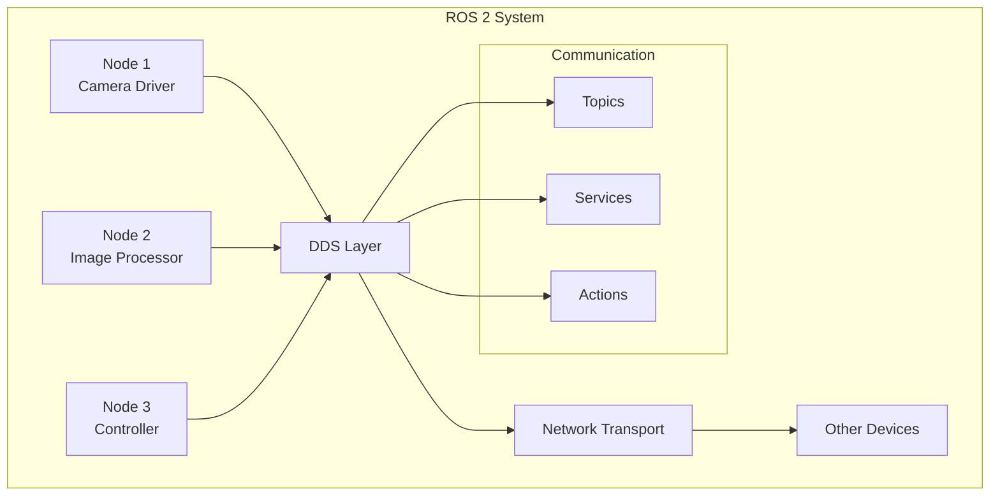

import CodeComponent from '@site/src/components/CodeComponent';

# Lesson 2.1: ROS 2 Fundamentals

## Learning Objectives

<div className="learning-objectives">

After completing this lesson, you will be able to:
- Explain the ROS 2 architecture and communication patterns
- Create and manage ROS 2 nodes, topics, services, and actions
- Launch and monitor ROS 2 systems
- Write simple ROS 2 programs in Python
- Use ROS 2 tools for debugging and visualization

</div>

## Introduction to ROS 2

ROS (Robot Operating System) is a flexible framework for writing robot software. ROS 2 is the second major release, providing significant improvements over ROS 1 in terms of reliability, performance, and ease of use.

<DiagramComponent title="ROS 2 Architecture Overview">



</DiagramComponent>

## Core ROS 2 Concepts

### 1. Nodes

Nodes are the smallest executable unit in ROS 2. Each node is responsible for a single process or functionality.

<CodeComponent title="Simple ROS 2 Node Example" language="python">

```python
#!/usr/bin/env python3
import rclpy
from rclpy.node import Node
from std_msgs.msg import String

class HelloWorldNode(Node):
    def __init__(self):
        super().__init__('hello_world_node')

        # Create a publisher
        self.publisher_ = self.create_publisher(String, 'greeting', 10)

        # Create a timer that fires every second
        timer_period = 1.0
        self.timer = self.create_timer(timer_period, self.timer_callback)
        self.get_logger().info('Hello World node started')

    def timer_callback(self):
        """Timer callback function"""
        msg = String()
        msg.data = f'Hello World! Count: {self.counter}' if hasattr(self, 'counter') else 'Hello World!'
        self.publisher_.publish(msg)
        self.get_logger().info(f'Publishing: {msg.data}')

        if hasattr(self, 'counter'):
            self.counter += 1
        else:
            self.counter = 1

def main(args=None):
    rclpy.init(args=args)
    node = HelloWorldNode()
    rclpy.spin(node)
    rclpy.shutdown()

if __name__ == '__main__':
    main()
```

</CodeComponent>

### 2. Topics

Topics are named buses over which nodes exchange messages. They follow a publish-subscribe pattern.

<CodeComponent title="Publisher and Subscriber Example" language="python">

```python
#!/usr/bin/env python3
import rclpy
from rclpy.node import Node
from geometry_msgs.msg import Twist
from sensor_msgs.msg import LaserScan

class ControllerNode(Node):
    def __init__(self):
        super().__init__('controller_node')

        # Publisher for robot velocity commands
        self.cmd_vel_pub = self.create_publisher(Twist, '/cmd_vel', 10)

        # Subscriber for laser scan data
        self.scan_sub = self.create_subscription(
            LaserScan,
            '/scan',
            self.scan_callback,
            10
        )

        self.get_logger().info('Controller node initialized')

    def scan_callback(self, msg):
        """Process laser scan data"""
        # Simple obstacle avoidance logic
        front_clear = True
        for i, distance in enumerate(msg.ranges):
            if i < len(msg.ranges) // 3:  # Front sector
                if distance < 1.0:  # Obstacle within 1 meter
                    front_clear = False
                    break

        # Create velocity command
        cmd_msg = Twist()

        if front_clear:
            cmd_msg.linear.x = 0.5  # Move forward
            cmd_msg.angular.z = 0.0
        else:
            cmd_msg.linear.x = 0.0  # Stop
            cmd_msg.angular.z = 0.5  # Turn left

        self.cmd_vel_pub.publish(cmd_msg)

def main(args=None):
    rclpy.init(args=args)
    node = ControllerNode()
    rclpy.spin(node)
    rclpy.shutdown()

if __name__ == '__main__':
    main()
```

</CodeComponent>

### 3. Services

Services provide request/response communication. They're useful for one-time operations.

<CodeComponent title="Service Server Example" language="python">

```python
#!/usr/bin/env python3
import rclpy
from rclpy.node import Node
from example_interfaces.srv import AddTwoInts

class MathService(Node):
    def __init__(self):
        super().__init__('math_service')

        # Create service
        self.srv = self.create_service(AddTwoInts, 'add_two_ints', self.add_two_ints_callback)
        self.get_logger().info('Math service started')

    def add_two_ints_callback(self, request, response):
        """Service callback function"""
        response.sum = request.a + request.b

        self.get_logger().info(
            f'Incoming request: a={request.a}, b={request.b}'
        )
        self.get_logger().info(f'Sending back response: [sum={response.sum}]')

        return response

def main(args=None):
    rclpy.init(args=args)
    math_service = MathService()
    rclpy.spin(math_service)
    rclpy.shutdown()

if __name__ == '__main__':
    main()
```

</CodeComponent>

### 4. Actions

Actions are long-running, preemptible services that provide feedback during execution.

<CodeComponent title="Action Server Example" language="python">

```python
#!/usr/bin/env python3
import rclpy
from rclpy.action import ActionServer
from action_msgs.msg import FibonacciFeedback, FibonacciResult
from fibonacci_action.action import Fibonacci

class FibonacciActionServer(Node):
    def __init__(self):
        super().__init__('fibonacci_action_server')

        # Create action server
        self._action_server = ActionServer(
            self,
            'fibonacci',
            Fibonacci,
            self.execute_callback
        )
        self.get_logger().info('Fibonacci action server started')

    def execute_callback(self, goal_handle):
        """Execute Fibonacci sequence"""
        self.get_logger().info('Executing goal...')

        # Get goal
        goal = goal_handle.request
        order = goal.order

        # Create feedback and result messages
        feedback_msg = FibonacciFeedback()
        result = FibonacciResult()

        # Initialize sequence
        feedback_msg.partial_sequence = [0, 1]

        for i in range(1, order):
            if goal_handle.is_cancel_requested:
                goal_handle.canceled()
                result.success = False
                self.get_logger().info('Goal canceled')
                return result

            # Calculate next Fibonacci number
            feedback_msg.partial_sequence.append(
                feedback_msg.partial_sequence[i-1] + feedback_msg.partial_sequence[i-2]
            )

            # Publish feedback
            goal_handle.publish_feedback(feedback_msg)
            self.get_logger().info(f'Feedback: {feedback_msg.partial_sequence}')

            # Simulate work
            rclpy.sleep(0.1)

        # Set result
        result.sequence = feedback_msg.partial_sequence
        result.success = True

        goal_handle.succeed(result)
        self.get_logger.info(f'Goal succeeded: sequence={result.sequence}')

def main(args=None):
    rclpy.init(args=args)
    fibonacci_action_server = FibonacciActionServer()
    rclpy.spin(fibonacci_action_server)
    rclpy.shutdown()

if __name__ == '__main__':
    main()
```

</CodeComponent>

## ROS 2 Communication Patterns

### Publisher-Subscriber Pattern

The most common communication pattern in ROS 2:

1. **Node A** publishes messages to a topic
2. **Node B** subscribes to that topic
3. **DDS** handles message delivery
4. **Multiple nodes** can subscribe or publish to the same topic

### Request-Response Pattern

For synchronous operations:

1. **Client Node** sends request to service
2. **Service Node** processes request
3. **Service Node** sends response back
4. **Client Node** receives response

## Lab Exercise: Building a ROS 2 System

<div className="lab-exercise">

### Objective
Create a complete ROS 2 system with multiple nodes demonstrating different communication patterns.

### Setup
1. Create a workspace
2. Implement nodes for different functionalities
3. Launch and test the system

### Implementation

<CodeComponent language="python" title="ROS 2 Robot Controller">

```python
# First, save this as publisher.py
#!/usr/bin/env python3
import rclpy
from rclpy.node import Node
from geometry_msgs.msg import Twist
from sensor_msgs.msg import LaserScan
import math

class RobotController(Node):
    def __init__(self):
        super().__init__('robot_controller')

        # Publishers
        self.cmd_vel_pub = self.create_publisher(Twist, '/cmd_vel', 10)
        self.sensor_pub = self.create_publisher(LaserScan, '/scan', 10)

        # Timer for publishing sensor data
        self.timer = self.create_timer(0.1, self.publish_sensor_data)
        self.get_logger().info('Robot controller started')

    def publish_sensor_data(self):
        """Publish simulated sensor data"""
        scan_msg = LaserScan()

        # Header
        scan_msg.header.stamp = self.get_clock().now().to_msg()
        scan_msg.header.frame_id = 'laser'

        # Scan parameters
        scan_msg.angle_min = -math.pi
        scan_msg.angle_max = math.pi
        scan_msg.angle_increment = math.pi / 180
        scan_msg.time_increment = 1.0 / 30 / 360
        scan_msg.scan_time = 1.0 / 30
        scan_msg.range_min = 0.1
        scan_msg.range_max = 10.0

        # Generate scan data (simulate a wall ahead)
        num_readings = 360
        ranges = []

        for i in range(num_readings):
            angle = -math.pi + i * scan_msg.angle_increment

            # Simulate a wall at 2 meters straight ahead
            if -0.2 < angle < 0.2:  # Wall in front
                distance = 2.0 + 0.1 * math.sin(10 * angle)
            else:
                distance = 5.0  # Open space

            ranges.append(distance)

        scan_msg.ranges = ranges
        self.sensor_pub.publish(scan_msg)

# Save this as subscriber.py
#!/usr/bin/env python3
import rclpy
from rclpy.node import Node
from sensor_msgs.msg import LaserScan
from geometry_msgs.msg import Twist

class RobotObserver(Node):
    def __init__(self):
        super().__init__('robot_observer')

        # Subscriber
        self.scan_sub = self.create_subscription(
            LaserScan,
            '/scan',
            self.scan_callback,
            10
        )

        self.get_logger().info('Robot observer started')

    def scan_callback(self, msg):
        """Process laser scan data"""
        # Analyze the scan
        front_distances = msg.ranges[160:200]  # Front 40 degrees

        if front_distances:
            min_distance = min(front_distances)
            self.get_logger().info(f'Min distance ahead: {min_distance:.2f}m')

# Save this as service_server.py
#!/usr/bin/env python3
import rclpy
from rclpy.node import Node
from std_srvs.srv import SetBool
from geometry_msgs.msg import Twist
import threading

class RobotService(Node):
    def __init__(self):
        super().__init__('robot_service')

        # Create service and publisher
        self.srv = self.create_service(SetBool, 'set_movement', self.set_movement_callback)
        self.cmd_vel_pub = self.create_publisher(Twist, '/cmd_vel', 10)

        # Movement state
        self.movement_enabled = False
        self.movement_thread = None

        self.get_logger().info('Robot service started')

    def set_movement_callback(self, request, response):
        """Service callback for enabling/disabling movement"""
        self.movement_enabled = request.data

        if self.movement_enabled:
            self.movement_thread = threading.Thread(target=self.movement_loop)
            self.movement_thread.start()
            response.success = True
            response.message = "Movement enabled"
        else:
            response.success = True
            response.message = "Movement disabled"

        self.get_logger().info(f'Movement {self.movement_enabled}: {response.message}')
        return response

    def movement_loop(self):
        """Continuous movement loop"""
        rate = self.create_rate(10)  # 10 Hz

        while self.movement_enabled and rclpy.ok():
            msg = Twist()
            msg.linear.x = 0.5  # Move forward
            msg.angular.z = 0.1  # Slight turn
            self.cmd_vel_pub.publish(msg)
            rate.sleep()
```

</CodeComponent>

### Launch File

<CodeComponent title="ROS 2 Launch File" language="python">

```python
# Save as robot_system.launch.py
import os
from launch import LaunchDescription
from launch_ros.actions import Node
from ament_index_python.packages import get_package_share_directory

def generate_launch_description():
    ld = LaunchDescription()

    # Robot controller node
    controller_node = Node(
        package='physical_ai_textbook',
        executable='robot_controller',
        name='controller',
        output='screen'
    )

    # Observer node
    observer_node = Node(
        package='physical_ai_textbook',
        executable='robot_observer',
        name='observer',
        output='screen'
    )

    # Service node
    service_node = Node(
        package='physical_ai_textbook',
        executable='robot_service',
        name='service',
        output='screen'
    )

    ld.add_action(controller_node)
    ld.add_action(observer_node)
    ld.add_action(service_node)

    return ld

def main(args=None):
    generate_launch_description()

if __name__ == '__main__':
    main()
```

</CodeComponent>

### Running the System

1. **Build the package**:
```bash
cd ~/ros2_ws
colcon build --packages-select physical_ai_textbook
```

2. **Source the workspace**:
```bash
source /opt/ros/humble/setup.bash
```

3. **Launch the system**:
```bash
ros2 launch physical_ai_textbook robot_system.launch.py
```

4. **Test the service**:
```bash
ros2 service call /set_movement "data: true"
```

### Expected Results

The system should demonstrate:
- Multiple nodes communicating
- Publisher-subscriber pattern for sensor data
- Service for enabling/disabling movement
- Visualization in RViz

</div>

## ROS 2 Tools

### 1. Command Line Tools

<CodeComponent title="Essential ROS 2 Commands" language="bash">

```bash
# Node management
ros2 node list
ros2 info /robot_controller
ros2 node info /robot_controller --verbose

# Topic management
ros2 topic list
ros2 topic echo /cmd_vel
ros2 topic hz /cmd_vel
ros2 topic type /scan

# Service management
ros2 service list
ros2 service call /add_two_ints "{a: 5, b: 3}"
ros2 service type /set_movement

# Action management
ros2 action list
ros2 action send /fibonacci "{order: 10}"
ros2 action info /fibonacci

# Parameter management
ros2 param list
ros2 param get /robot_controller
ros2 param set /robot_controller use_sim_time true
```

</CodeComponent>

### 2. RViz

RViz is the main visualization tool for ROS 2.

<CodeComponent title="RViz Configuration" language="yaml">

```yaml
# Save as robot_config.rviz
Panels:
  - Class: rviz_common/Displays
    Name: Displays
    Help Height: 70

Visualization Manager:
  Class: rviz_common/VisualizationManager
  Displays:
    - Class: rviz_default_plugins/RobotModel
      Name: RobotModel
      Robot Description: "$(find your_robot_description_package)/urdf/robot.urdf"
      Enabled: true

    - Class: rviz_default_plugins/LaserScan
      Name: LaserScan
      Topic: /scan
      Color: 255;255;255
      Size (Pixels): 120
      Style: Flat
      Use rainbow: false
      Autocompute Intensity: true
      Color Transformer: IntensityToRGBField

    - Class: rviz_default_plugins/TF
      Name: TF
      Enabled: true
      Marker Scale: 1
```

</CodeComponent>

### 3. Gazebo Integration

<CodeComponent title="Gazebo Launch with ROS 2" language="python">

```python
# Save as gazebo_robot.py
import os
from launch import LaunchDescription
from launch_ros.actions import ExecuteProcess, Node
from ament_index_python.packages import get_package_share_directory

def generate_launch_description():
    ld = LaunchDescription()

    # Gazebo
    gazebo_executable = os.path.join(
        get_package_share_directory('gazebo_ros'),
        'gazebo'
    )

    gazebo_process = ExecuteProcess(
        cmd=[gazebo_executable],
        arguments=[
            '--verbose',
            '-s', 'empty_world.sdf'
        ],
        output='screen'
    )

    # ROS 2 Gazebo bridge
    gazebo_ros = Node(
        package='gazebo_ros',
        executable='gazebo_ros',
        arguments=[
            '-dom', 'entity',
            'entity_name', 'robot',
            'publish_robot_state', 'true'
        ],
        output='screen'
    )

    ld.add_action(gazebo_process)
    ld.add_action(gazebo_ros)

    return ld

def main(args=None):
    generate_launch_description()

if __name__ == '__main__':
    main()
```

</CodeComponent>

## Best Practices

### 1. Node Design

- Single Responsibility Principle
- Keep nodes focused on one task
- Use meaningful node names
- Handle shutdown gracefully

### 2. Communication

- Use appropriate QoS settings
- Design clear message types
- Handle disconnections gracefully

### 3. Parameter Configuration

- Use parameter files
- Document all parameters
- Provide default values

### 4. Error Handling

- Try-catch critical sections
- Log errors appropriately
- Provide meaningful error messages

## Key Takeaways

1. **ROS 2 provides a complete robotics framework** with communication, visualization, and simulation tools
2. **Communication patterns** include publish-subscribe, request-response, and action servers
3. **Nodes are the building blocks** of ROS 2 systems
4. **Tools like RViz and Gazebo** are essential for visualization and simulation
5. **Proper ROS 2 design** leads to robust and maintainable robot software

## Summary

ROS 2 provides a powerful framework for building complex robotic systems. By understanding its core concepts and communication patterns, you can create sophisticated robot applications that can perceive, decide, and act in the physical world.

In the next lesson, we'll explore **simulation environments** using Gazebo and Unity, allowing us to test our algorithms before deploying on real hardware.

[Next: Simulation: Gazebo & Unity →](lesson-2)

## Quiz

<Quiz
  quizId="ros2-fundamentals"
  questions={[
    {
      id: "q1",
      type: "multiple-choice",
      question: "What is the primary communication pattern in ROS 2?",
      options: [
        "RPC (Remote Procedure Call)",
        "Publish-Subscribe",
        "Direct Function Calls",
        "Shared Memory"
      ],
      correct: 1,
      explanation: "The publish-subscribe pattern is the primary communication mechanism in ROS 2, allowing asynchronous data flow between nodes."
    },
    {
      id: "q2",
      type: "multiple-choice",
      question: "Which component handles message delivery in ROS 2?",
      options: [
        "ROS Master",
        "Node Manager",
        "DDS (Data Distribution Service)",
        "Message Broker"
      ],
      correct: 2,
      explanation: "ROS 2 uses DDS (Data Distribution Service) for message delivery, replacing the single point of failure ROS Master from ROS 1."
    },
    {
      id: "q3",
      type: "true-false",
      question: "Actions in ROS 2 are a type of service that provides immediate responses.",
      correct: false,
      explanation: "Actions are different from services - they support long-running, preemptible operations with continuous feedback, unlike services which provide immediate request-response communication."
    }
  ]}
/>