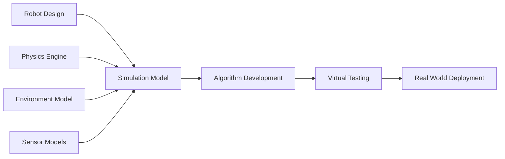

import CodeComponent from '@site/src/components/CodeComponent';

# Lesson 2.2: Simulation: Gazebo & Unity

## Learning Objectives

<div className="learning-objectives">

After completing this lesson, you will be able to:
- Create and configure robot models in URDF/SDF format
- Set up realistic physics simulations in Gazebo
- Build immersive environments in Unity Robotics
- Integrate sensors and actuators in simulation
- Bridge simulation with ROS 2 for testing

</div>

## Introduction to Robot Simulation

Simulation is a cornerstone of modern robotics development, allowing us to:
- Test algorithms without risking physical hardware
- Iterate quickly on designs
- Generate training data for AI systems
- Debug in controlled, repeatable conditions

<DiagramComponent title="Simulation in Robotics Development">



</DiagramComponent>

## URDF/SDF: Robot Description Formats

### URDF (Unified Robot Description Format)

URDF is an XML format that describes robot geometry, kinematics, and dynamics.

<CodeComponent title="Simple Robot URDF Example" language="xml">

```xml
<?xml version="1.0"?>
<robot name="simple_robot">
  <!-- Base Link -->
  <link name="base_link">
    <inertial>
      <mass value="10"/>
      <inertia ixx="1" ixy="0" ixz="0" iyy="1" iyz="0" izz="1"/>
    </inertial>

    <visual>
      <geometry>
        <box size="0.5 0.5 0.1"/>
      </geometry>
      <material name="blue">
        <color rgba="0 0 1 1"/>
      </material>
    </visual>

    <collision>
      <geometry>
        <box size="0.5 0.5 0.1"/>
      </geometry>
    </collision>
  </link>

  <!-- Wheel Joint -->
  <joint name="wheel_joint" type="continuous">
    <parent link="base_link"/>
    <child link="wheel"/>
    <origin xyz="0.3 0 -0.05" rpy="1.57 0 0"/>
    <axis xyz="0 0 1"/>
  </joint>

  <!-- Wheel Link -->
  <link name="wheel">
    <inertial>
      <mass value="1"/>
      <inertia ixx="0.1" ixy="0" ixz="0" iyy="0.1" iyz="0" izz="0.1"/>
    </inertial>

    <visual>
      <geometry>
        <cylinder radius="0.1" length="0.05"/>
      </geometry>
      <material name="black">
        <color rgba="0 0 0 1"/>
      </material>
    </visual>

    <collision>
      <geometry>
        <cylinder radius="0.1" length="0.05"/>
      </geometry>
    </collision>
  </link>
</robot>
```

</CodeComponent>

### SDF (Simulation Description Format)

SDF extends URDF with simulation-specific properties:

<CodeComponent title="Robot with Sensors in SDF" language="xml">

```xml
<?xml version="1.0"?>
<sdf version="1.6">
  <model name="robot_with_sensors">
    <!-- Robot Base -->
    <link name="base_link">
      <pose>0 0 0.5 0 0 0</pose>

      <inertial>
        <mass>10</mass>
        <inertia>
          <ixx>1</ixx>
          <ixy>0</ixy>
          <ixz>0</ixz>
          <iyy>1</iyy>
          <iyz>0</iyz>
          <izz>1</izz>
        </inertia>
      </inertial>

      <visual name="base_visual">
        <geometry>
          <box>
            <size>0.5 0.5 0.3</size>
          </box>
        </geometry>
        <material>
          <ambient>0 0 1 1</ambient>
          <diffuse>0 0 1 1</diffuse>
        </material>
      </visual>

      <collision name="base_collision">
        <geometry>
          <box>
            <size>0.5 0.5 0.3</size>
          </box>
        </geometry>
        <surface>
          <friction>
            <ode>
              <mu>0.5</mu>
            </ode>
          </friction>
        </surface>
      </collision>
    </link>

    <!-- Camera Sensor -->
    <link name="camera_link">
      <pose>0.25 0 0.6 0 0 0</pose>

      <sensor name="camera" type="camera">
        <camera>
          <horizontal_fov>1.047</horizontal_fov>
          <image>
            <width>640</width>
            <height>480</height>
          </image>
          <clip>
            <near>0.1</near>
            <far>100</far>
          </clip>
        </camera>

        <always_on>1</always_on>
        <update_rate>30</update_rate>
        <visualize>true</visualize>
      </sensor>
    </link>

    <!-- Joint for Camera -->
    <joint name="camera_joint" type="fixed">
      <parent>base_link</parent>
      <child>camera_link</child>
    </joint>

    <!-- LiDAR Sensor -->
    <link name="lidar_link">
      <pose>0 0 0.7 0 0 0</pose>

      <sensor name="lidar" type="ray">
        <ray>
          <scan>
            <horizontal>
              <samples>360</samples>
              <min_angle>-3.14159</min_angle>
              <max_angle>3.14159</max_angle>
            </horizontal>
          </scan>
          <range>
            <min>0.1</min>
            <max>10.0</max>
            <resolution>0.01</resolution>
          </range>
        </ray>

        <plugin name="lidar_plugin" filename="libgazebo_ros_ray_sensor.so">
          <ros>
            <namespace>/</namespace>
            <remapping>~/out:=scan</remapping>
          </ros>
          <output_type>sensor_msgs/LaserScan</output_type>
          <frame_name>lidar_link</frame_name>
        </plugin>
      </sensor>
    </link>

    <joint name="lidar_joint" type="fixed">
      <parent>base_link</parent>
      <child>lidar_link</child>
    </joint>
  </model>
</sdf>
```

</CodeComponent>

## Gazebo Simulation

### Setting Up a Gazebo World

<CodeComponent title="Custom Gazebo World" language="xml">

```xml
<?xml version="1.0"?>
<sdf version="1.6">
  <world name="robot_playground">

    <!-- Physics Engine Settings -->
    <physics name="1ms" type="ode">
      <max_step_size>0.001</max_step_size>
      <real_time_factor>1.0</real_time_factor>
    </physics>

    <!-- Ground Plane -->
    <include>
      <uri>model://ground_plane</uri>
    </include>

    <!-- Sun -->
    <include>
      <uri>model://sun</uri>
    </include>

    <!-- Building 1 -->
    <model name="building1">
      <static>true</static>
      <pose>5 5 0 0 0 0</pose>

      <link name="building_link">
        <collision name="building_collision">
          <geometry>
            <box>
              <size>4 4 6</size>
            </box>
          </geometry>
        </collision>

        <visual name="building_visual">
          <geometry>
            <box>
              <size>4 4 6</size>
            </box>
          </geometry>
          <material>
            <ambient>0.7 0.7 0.7 1</ambient>
            <diffuse>0.7 0.7 0.7 1</diffuse>
          </material>
        </visual>
      </link>
    </model>

    <!-- Obstacle Course -->
    <model name="obstacles">
      <static>true</static>

      <!-- Cylindrical Obstacles -->
      <link name="cylinder1">
        <pose>2 -1 0.5 0 0 0</pose>
        <collision name="collision">
          <geometry>
            <cylinder>
              <radius>0.3</radius>
              <length>1</length>
            </cylinder>
          </geometry>
        </collision>
        <visual name="visual">
          <geometry>
            <cylinder>
              <radius>0.3</radius>
              <length>1</length>
            </cylinder>
          </geometry>
          <material>
            <ambient>1 0 0 1</ambient>
          </material>
        </visual>
      </link>

      <link name="cylinder2">
        <pose>3 1 0.5 0 0 0</pose>
        <collision name="collision">
          <geometry>
            <cylinder>
              <radius>0.3</radius>
              <length>1</length>
            </cylinder>
          </geometry>
        </collision>
        <visual name="visual">
          <geometry>
            <cylinder>
              <radius>0.3</radius>
              <length>1</length>
            </cylinder>
          </geometry>
          <material>
            <ambient>0 1 0 1</ambient>
          </material>
        </visual>
      </link>

      <!-- Ramp -->
      <link name="ramp">
        <pose>0 3 0 0 0.3 0</pose>
        <collision name="collision">
          <geometry>
            <box>
              <size>4 2 0.2</size>
            </box>
          </geometry>
        </collision>
        <visual name="visual">
          <geometry>
            <box>
              <size>4 2 0.2</size>
            </box>
          </geometry>
          <material>
            <ambient>0.5 0.5 0.5 1</ambient>
          </material>
        </visual>
      </link>
    </model>

    <!-- Spawn Point Marker -->
    <model name="spawn_point">
      <static>true</static>
      <pose>0 0 0.1 0 0 0</pose>
      <link name="spawn_marker">
        <visual name="marker">
          <geometry>
            <cylinder>
              <radius>0.2</radius>
              <length>0.01</length>
            </cylinder>
          </geometry>
          <material>
            <ambient>0 0 1 0.5</ambient>
          </material>
        </visual>
      </link>
    </model>
  </world>
</sdf>
```

</CodeComponent>

### Gazebo Launch File with ROS 2 Integration

<CodeComponent title="Gazebo ROS 2 Launch File" language="python">

```python
# save as gazebo_simulation.launch.py
import os
from launch import LaunchDescription
from launch.actions import DeclareLaunchArgument, ExecuteProcess, IncludeLaunchDescription
from launch.conditions import IfCondition
from launch.launch_description_sources import PythonLaunchDescriptionSource
from launch.substitutions import Command, FindExecutable, LaunchConfiguration, PathJoinSubstitution
from launch_ros.actions import Node
from launch_ros.substitutions import FindPackageShare

def generate_launch_description():

    # Declare launch arguments
    declared_arguments = []
    declared_arguments.append(
        DeclareLaunchArgument(
            "use_sim_time",
            default_value="true",
            description="Use simulation (Gazebo) clock if true",
        )
    )
    declared_arguments.append(
        DeclareLaunchArgument(
            "gui",
            default_value="true",
            description="Start RViz2 automatically",
        )
    )

    # Get URDF via xacro
    robot_description_content = Command(
        [
            PathJoinSubstitution([FindExecutable(name="xacro")]),
            " ",
            PathJoinSubstitution(
                [FindPackageShare("physical_ai_textbook"), "urdf", "robot.urdf.xacro"]
            ),
        ]
    )

    robot_description = {"robot_description": robot_description_content}

    # Gazebo launch
    gazebo = IncludeLaunchDescription(
        PythonLaunchDescriptionSource(
            [FindPackageShare("gazebo_ros"), "/launch", "/gazebo.launch.py"]
        ),
        launch_arguments={"world": PathJoinSubstitution(
            [FindPackageShare("physical_ai_textbook"), "worlds", "robot_playground.world"]
        )}.items(),
    )

    # Robot state publisher
    robot_state_publisher_node = Node(
        package="robot_state_publisher",
        executable="robot_state_publisher",
        output="both",
        parameters=[robot_description, {"use_sim_time": LaunchConfiguration("use_sim_time")}],
    )

    # Spawn robot in Gazebo
    spawn_entity = Node(
        package="gazebo_ros",
        executable="spawn_entity.py",
        arguments=[
            "-topic", "robot_description",
            "-entity", "robot",
            "-x", "0.0",
            "-y", "0.0",
            "-z", "0.1"
        ],
        output="screen",
    )

    # Load controllers
    load_joint_state_controller = ExecuteProcess(
        cmd=["ros2", "control", "load_start_controller", "joint_state_broadcaster"],
        output="screen",
    )

    load_diff_drive_controller = ExecuteProcess(
        cmd=["ros2", "control", "load_start_controller", "diff_drive_base_controller"],
        output="screen",
    )

    # RViz2
    rviz_node = Node(
        package="rviz2",
        executable="rviz2",
        name="rviz2",
        output="screen",
        arguments=["-d", PathJoinSubstitution(
            [FindPackageShare("physical_ai_textbook"), "rviz", "robot_view.rviz"]
        )],
        condition=IfCondition(LaunchConfiguration("gui")),
        parameters=[{"use_sim_time": LaunchConfiguration("use_sim_time")}],
    )

    # Navigation stack (optional)
    nav2_bringup = IncludeLaunchDescription(
        PythonLaunchDescriptionSource(
            [FindPackageShare("nav2_bringup"), "/launch", "/navigation_launch.py"]
        ),
        launch_arguments={
            "use_sim_time": LaunchConfiguration("use_sim_time"),
            "map": PathJoinSubstitution(
                [FindPackageShare("physical_ai_textbook"), "maps", "sim_map.yaml"]
            ),
        }.items(),
    )

    nodes = [
        gazebo,
        robot_state_publisher_node,
        spawn_entity,
        load_joint_state_controller,
        load_diff_drive_controller,
        rviz_node,
        # nav2_bringup  # Uncomment if using navigation
    ]

    return LaunchDescription(declared_arguments + nodes)
```

</CodeComponent>

## Unity Robotics Simulation

### Unity Scene Setup for Robot Simulation

Unity provides high-fidelity graphics and physics for robot simulation.

<CodeComponent title="Unity Robot Controller Script" language="csharp">

```csharp
// RobotController.cs
using UnityEngine;
using ROS2;
using std_msgs.msg;
using geometry_msgs.msg;
using sensor_msgs.msg;

public class RobotController : MonoBehaviour
{
    [Header("Robot Configuration")]
    public float maxLinearSpeed = 2.0f;
    public float maxAngularSpeed = 1.5f;
    public Transform robotBase;

    [Header("Sensors")]
    public Camera robotCamera;
    public LidarSensor lidarSensor;

    // ROS 2 nodes and publishers
    private ROS2Node ros2Node;
    private IPublisher<Twist> cmdVelPublisher;
    private IPublisher<Image> imagePublisher;
    private IPublisher<LaserScan> laserPublisher;

    // Robot state
    private Vector3 currentVelocity = Vector3.zero;
    private float currentAngularVelocity = 0f;

    void Start()
    {
        // Initialize ROS 2
        ROS2.UnityROS2Instance.Init();
        ros2Node = ROS2.UnityROS2Instance.CreateNode("unity_robot_node");

        // Create publishers
        cmdVelPublisher = ros2Node.CreatePublisher<Twist>("/cmd_vel");
        imagePublisher = ros2Node.CreatePublisher<Image>("/camera/image_raw");
        laserPublisher = ros2Node.CreatePublisher<LaserScan>("/scan");

        // Create subscribers for control commands
        ros2Node.CreateSubscription<Twist>(
            "/cmd_vel_unity",
            msg => {
                currentVelocity = new Vector3(
                    (float)msg.Linear.X,
                    0f,
                    0f
                );
                currentAngularVelocity = (float)msg.Angular.Z;
            }
        );

        // Start sensor data publishing
        InvokeRepeating(nameof(PublishSensorData), 0f, 0.033f); // 30 Hz
    }

    void Update()
    {
        // Update robot position based on velocity commands
        UpdateRobotPose();
    }

    void UpdateRobotPose()
    {
        if (robotBase == null) return;

        // Apply linear velocity
        Vector3 movement = robotBase.forward * currentVelocity.x * Time.deltaTime;
        robotBase.position += movement;

        // Apply angular velocity
        Quaternion rotation = Quaternion.Euler(
            0f,
            currentAngularVelocity * Mathf.Rad2Deg * Time.deltaTime,
            0f
        );
        robotBase.rotation *= rotation;
    }

    void PublishSensorData()
    {
        // Publish camera image
        if (robotCamera != null)
        {
            PublishCameraImage();
        }

        // Publish LiDAR scan
        if (lidarSensor != null)
        {
            PublishLaserScan();
        }
    }

    void PublishCameraImage()
    {
        RenderTexture rt = new RenderTexture(640, 480, 24);
        robotCamera.targetTexture = rt;
        robotCamera.Render();

        Texture2D tex = new Texture2D(640, 480, TextureFormat.RGB24, false);
        RenderTexture.active = rt;
        tex.ReadPixels(new Rect(0, 0, 640, 480), 0, 0);
        tex.Apply();

        // Convert to ROS2 Image message
        Image imageMsg = new Image();
        imageMsg.Header.Frame_id = "camera_link";
        imageMsg.Height = (uint)tex.height;
        imageMsg.Width = (uint)tex.width;
        imageMsg.Encoding = "rgb8";
        imageMsg.Is_bigendian = 0;
        imageMsg.Step = (uint)(tex.width * 3);

        // Convert texture data to byte array
        byte[] data = tex.GetRawTextureData();
        imageMsg.Data = data;

        // Set timestamp
        imageMsg.Header.Stamp = ROS2.Time.Now();

        // Publish
        imagePublisher.Publish(imageMsg);

        // Cleanup
        robotCamera.targetTexture = null;
        RenderTexture.active = null;
        Destroy(rt);
    }

    void PublishLaserScan()
    {
        if (!lidarSensor.IsScanning) return;

        LaserScan scanMsg = new LaserScan();
        scanMsg.Header.Frame_id = "laser_link";
        scanMsg.Header.Stamp = ROS2.Time.Now();

        // Configure scan parameters
        scanMsg.Angle_min = -Mathf.PI;
        scanMsg.Angle_max = Mathf.PI;
        scanMsg.Angle_increment = 2 * Mathf.PI / lidarSensor.NumRays;
        scanMsg.Time_increment = 0f;
        scanMsg.Scan_time = 0.1f;
        scanMsg.Range_min = 0.1f;
        scanMsg.Range_max = 10f;

        // Get scan data
        float[] ranges = lidarSensor.GetRanges();

        // Convert to ROS2 format
        scanMsg.Ranges = new System.Collections.Generic.List<float>(ranges);

        // Publish
        laserPublisher.Publish(scanMsg);
    }

    void OnApplicationQuit()
    {
        // Clean up ROS 2
        ROS2.UnityROS2Instance.Shutdown();
    }
}
```

</CodeComponent>

### Unity-Wide Integration Script

<CodeComponent title="Unity-ROS2 Bridge" language="csharp">

```csharp
// UnityROS2Bridge.cs
using UnityEngine;
using ROS2;
using System.Collections;

public class UnityROS2Bridge : MonoBehaviour
{
    [Header("Bridge Settings")]
    public string rosNamespace = "";
    public bool enablePointCloud = true;
    public bool enableTF = true;

    private ROS2Node bridgeNode;
    private TFPublisher tfPublisher;

    void Start()
    {
        StartCoroutine(InitializeBridge());
    }

    IEnumerator InitializeBridge()
    {
        // Wait for ROS2 to initialize
        yield return new WaitForSeconds(1f);

        // Create bridge node
        bridgeNode = ROS2.UnityROS2Instance.CreateNode("unity_bridge");

        // Initialize TF publisher if enabled
        if (enableTF)
        {
            tfPublisher = gameObject.AddComponent<TFPublisher>();
            tfPublisher.Initialize(bridgeNode);
        }

        // Setup additional ROS2 services and actions
        SetupROSServices();

        Debug.Log("Unity-ROS2 Bridge initialized");
    }

    void SetupROSServices()
    {
        // Example: Spawn service to spawn objects in Unity
        bridgeNode.CreateService<SpawnObject.srv, SpawnObject.srv_Request, SpawnObject.srv_Response>(
            "spawn_object",
            HandleSpawnRequest
        );

        // Example: Get pose service
        bridgeNode.CreateService<GetPose.srv, GetPose.srv_Request, GetPose.srv_Response>(
            "get_pose",
            HandleGetPoseRequest
        );
    }

    private SpawnObject.srv_Response HandleSpawnRequest(SpawnObject.srv_Request request)
    {
        var response = new SpawnObject.srv_Response();

        try
        {
            // Spawn object at specified position
            GameObject prefab = Resources.Load<GameObject>(request.Model_name);
            if (prefab != null)
            {
                Vector3 position = new Vector3(
                    (float)request.Pose.Position.X,
                    (float)request.Pose.Position.Y,
                    (float)request.Pose.Position.Z
                );

                Quaternion orientation = new Quaternion(
                    (float)request.Pose.Orientation.X,
                    (float)request.Pose.Orientation.Y,
                    (float)request.Pose.Orientation.Z,
                    (float)request.Pose.Orientation.W
                );

                Instantiate(prefab, position, orientation);
                response.Success = true;
                response.Message = "Object spawned successfully";
            }
            else
            {
                response.Success = false;
                response.Message = $"Model '{request.Model_name}' not found";
            }
        }
        catch (System.Exception e)
        {
            response.Success = false;
            response.Message = e.Message;
        }

        return response;
    }

    private GetPose.srv_Response HandleGetPoseRequest(GetPose.srv_Request request)
    {
        var response = new GetPose.srv_Response();

        // Find object by name
        GameObject obj = GameObject.Find(request.Object_name);
        if (obj != null)
        {
            response.Pose.Position.X = obj.transform.position.x;
            response.Pose.Position.Y = obj.transform.position.y;
            response.Pose.Position.Z = obj.transform.position.z;

            response.Pose.Orientation.X = obj.transform.rotation.x;
            response.Pose.Orientation.Y = obj.transform.rotation.y;
            response.Pose.Orientation.Z = obj.transform.rotation.z;
            response.Pose.Orientation.W = obj.transform.rotation.w;

            response.Success = true;
        }
        else
        {
            response.Success = false;
        }

        return response;
    }

    void Update()
    {
        // Publish TF data if enabled
        if (tfPublisher != null)
        {
            tfPublisher.PublishTransforms();
        }
    }

    void OnApplicationQuit()
    {
        // Cleanup
        if (bridgeNode != null)
        {
            bridgeNode.Dispose();
        }
    }
}
```

</CodeComponent>

## Lab Exercise: Building a Complete Simulation

<div className="lab-exercise">

### Objective
Create a complete robot simulation environment with physics, sensors, and ROS 2 integration.

### Setup
1. Create a robot URDF model
2. Build a Gazebo world with obstacles
3. Set up Unity environment with realistic graphics
4. Implement sensor simulation
5. Connect everything through ROS 2

### Implementation

<CodeComponent language="python" editable={true}>

```python
# First, create the robot URDF file (robot.urdf.xacro)
robot_urdf = '''<?xml version="1.0"?>
<robot name="diff_drive_robot" xmlns:xacro="http://www.ros.org/wiki/xacro">

  <!-- Define robot properties -->
  <xacro:property name="wheel_radius" value="0.1"/>
  <xacro:property name="wheel_width" value="0.05"/>
  <xacro:property name="wheel_base" value="0.3"/>
  <xacro:property name="base_height" value="0.1"/>

  <!-- Base Link -->
  <link name="base_link">
    <pose>0 0 0 0 0 0</pose>

    <inertial>
      <mass value="5"/>
      <inertia ixx="0.1" ixy="0" ixz="0" iyy="0.1" iyz="0" izz="0.1"/>
    </inertial>

    <visual name="base_visual">
      <geometry>
        <cylinder radius="0.2" length="0.1"/>
      </geometry>
      <material name="blue">
        <color rgba="0 0.5 1 1"/>
      </material>
    </visual>

    <collision name="base_collision">
      <geometry>
        <cylinder radius="0.2" length="0.1"/>
      </geometry>
    </collision>
  </link>

  <!-- Left Wheel -->
  <link name="left_wheel">
    <pose>${wheel_base/2} 0 0 0 1.57 0</pose>

    <inertial>
      <mass value="0.5"/>
      <inertia ixx="0.01" ixy="0" ixz="0" iyy="0.01" iyz="0" izz="0.01"/>
    </inertial>

    <visual name="left_wheel_visual">
      <geometry>
        <cylinder radius="${wheel_radius}" length="${wheel_width}"/>
      </geometry>
      <material name="black">
        <color rgba="0.1 0.1 0.1 1"/>
      </material>
    </visual>

    <collision name="left_wheel_collision">
      <geometry>
        <cylinder radius="${wheel_radius}" length="${wheel_width}"/>
      </geometry>
    </collision>
  </link>

  <!-- Right Wheel -->
  <link name="right_wheel">
    <pose>-${wheel_base/2} 0 0 0 1.57 0</pose>

    <inertial>
      <mass value="0.5"/>
      <inertia ixx="0.01" ixy="0" ixz="0" iyy="0.01" iyz="0" izz="0.01"/>
    </inertial>

    <visual name="right_wheel_visual">
      <geometry>
        <cylinder radius="${wheel_radius}" length="${wheel_width}"/>
      </geometry>
      <material name="black">
        <color rgba="0.1 0.1 0.1 1"/>
      </material>
    </visual>

    <collision name="right_wheel_collision">
      <geometry>
        <cylinder radius="${wheel_radius}" length="${wheel_width}"/>
      </geometry>
    </collision>
  </link>

  <!-- Joints -->
  <joint name="left_wheel_joint" type="continuous">
    <parent link="base_link"/>
    <child link="left_wheel"/>
    <axis xyz="0 0 1"/>
  </joint>

  <joint name="right_wheel_joint" type="continuous">
    <parent link="base_link"/>
    <child link="right_wheel"/>
    <axis xyz="0 0 1"/>
  </joint>

  <!-- Camera Link -->
  <link name="camera_link">
    <pose>0 0 0.15 0 0 0</pose>

    <inertial>
      <mass value="0.1"/>
      <inertia ixx="0.001" ixy="0" ixz="0" iyy="0.001" iyz="0" izz="0.001"/>
    </inertial>
  </link>

  <joint name="camera_joint" type="fixed">
    <parent link="base_link"/>
    <child link="camera_link"/>
  </joint>
</robot>'''

# Save this to a file and use it in your simulation setup
import numpy as np

class SimulationEnvironment:
    def __init__(self):
        self.obstacles = []
        self.robot_pose = [0, 0, 0]
        self.sensor_data = {}

    def add_obstacle(self, position, size, shape='box'):
        """Add an obstacle to the environment"""
        self.obstacles.append({
            'position': position,
            'size': size,
            'shape': shape
        })

    def check_collision(self, position, robot_radius=0.2):
        """Check if position collides with any obstacle"""
        for obs in self.obstacles:
            if obs['shape'] == 'box':
                # Simple box collision
                dx = abs(position[0] - obs['position'][0])
                dy = abs(position[1] - obs['position'][1])
                if (dx < (obs['size'][0]/2 + robot_radius) and
                    dy < (obs['size'][1]/2 + robot_radius)):
                    return True
        return False

    def simulate_lidar(self, robot_pose, num_rays=360, max_range=5.0):
        """Simulate LiDAR sensor data"""
        angles = np.linspace(-np.pi, np.pi, num_rays)
        ranges = []

        for angle in angles:
            # Cast ray from robot position
            range_to_obstacle = max_range

            for obs in self.obstacles:
                # Simple ray-box intersection
                obs_dist = self.ray_box_intersection(
                    robot_pose, angle,
                    obs['position'], obs['size']
                )
                if obs_dist < range_to_obstacle:
                    range_to_obstacle = obs_dist

            ranges.append(range_to_obstacle)

        return {
            'angle_min': -np.pi,
            'angle_max': np.pi,
            'angle_increment': 2 * np.pi / num_rays,
            'ranges': ranges
        }

    def ray_box_intersection(self, origin, angle, box_pos, box_size):
        """Calculate ray-box intersection distance"""
        # Simplified implementation
        dx = box_pos[0] - origin[0]
        dy = box_pos[1] - origin[1]

        # Calculate closest point on box to ray
        closest_x = max(box_pos[0] - box_size[0]/2,
                       min(box_pos[0] + box_size[0]/2, origin[0]))
        closest_y = max(box_pos[1] - box_size[1]/2,
                       min(box_pos[1] + box_size[1]/2, origin[1]))

        # Distance to closest point
        dist = np.sqrt((closest_x - origin[0])**2 + (closest_y - origin[1])**2)

        return dist

# Create simulation environment
sim = SimulationEnvironment()

# Add some obstacles
sim.add_obstacle([2, 0, 0], [0.5, 0.5, 1], 'box')
sim.add_obstacle([0, 3, 0], [1, 0.5, 1], 'box')
sim.add_obstacle([-2, -2, 0], [0.8, 0.8, 1], 'box')

# Simulate LiDAR at robot position
lidar_data = sim.simulate_lidar([0, 0, 0])
print(f"Simulated LiDAR ranges: {len(lidar_data['ranges'])} rays")
print(f"Min range: {min(lidar_data['ranges']):.2f}m")

# Check for collisions
test_positions = [[1, 1, 0], [2.5, 0, 0], [0, 2.5, 0]]
for pos in test_positions:
    collision = sim.check_collision(pos)
    print(f"Position {pos}: {'Collision!' if collision else 'Clear'}")
```

</CodeComponent>

### Testing the Simulation

1. **Launch Gazebo**:
```bash
ros2 launch physical_ai_textbook gazebo_simulation.launch.py
```

2. **Control the robot**:
```bash
ros2 topic pub /cmd_vel geometry_msgs/msg/Twist "{linear: {x: 0.5}, angular: {z: 0.0}}"
```

3. **View sensor data**:
```bash
ros2 topic echo /scan
ros2 topic echo /camera/image_raw
```

### Expected Results

The simulation should demonstrate:
- Accurate physics simulation
- Realistic sensor data
- Smooth robot control
- Collision detection

</div>

## Best Practices for Robot Simulation

### 1. Model Accuracy
- Match physical properties (mass, inertia)
- Include all relevant sensors
- Validate against real robot

### 2. Performance Optimization
- Use appropriate physics timestep
- Optimize collision meshes
- Balance detail vs performance

### 3. Sensor Realism
- Add noise and bias
- Simulate real sensor constraints
- Include occlusion effects

### 4. Environment Design
- Start simple, add complexity
- Include challenging scenarios
- Test edge cases

## Key Takeaways

1. **Simulation accelerates development** - Test without risking hardware
2. **URDF/SDF define robot structure** - Essential for physics and visualization
3. **Gazebo provides realistic physics** - Industry standard for robotics
4. **Unity adds visual fidelity** - Excellent for AI training and demos
5. **ROS 2 bridges everything** - Unified interface for simulation and reality

## Summary

Simulation environments are indispensable for modern robotics development. They provide safe, efficient, and repeatable testing grounds for algorithms before deploying on physical hardware. By mastering Gazebo and Unity integration with ROS 2, you can create comprehensive test beds that accelerate your development cycle and improve system reliability.

In the next lesson, we'll explore the **weekly learning plan** for Weeks 3-7, integrating everything we've learned about ROS 2 and simulation.

[Next: Weekly Learning Plan (Weeks 3-7) →](lesson-3)

## Quiz

<Quiz
  quizId="simulation-gazebo-unity"
  questions={[
    {
      id: "q1",
      type: "multiple-choice",
      question: "What is the primary difference between URDF and SDF?",
      options: [
        "URDF is for 2D robots, SDF is for 3D robots",
        "SDF includes simulation-specific properties beyond URDF",
        "URDF uses JSON, SDF uses XML",
        "There is no difference; they're the same format"
      ],
      correct: 1,
      explanation: "SDF (Simulation Description Format) extends URDF with simulation-specific properties like physics parameters, sensor configurations, and environment settings that URDF doesn't support."
    },
    {
      id: "q2",
      type: "multiple-choice",
      question: "Which physics engine does Gazebo use by default?",
      options: [
        "Bullet Physics",
        "PhysX",
        "ODE (Open Dynamics Engine)",
        "Havok Physics"
      ],
      correct: 2,
      explanation: "Gazebo uses ODE (Open Dynamics Engine) as its default physics engine, though it can be configured to use others like Bullet."
    },
    {
      id: "q3",
      type: "true-false",
      question: "Unity Robotics requires a separate physics engine plugin for accurate robot simulation.",
      correct: false,
      explanation: "Unity has its own built-in physics engine (PhysX) that provides accurate physics simulation out of the box. The Unity Robotics package provides ROS 2 integration and additional robotics-specific features."
    }
  ]}
/>