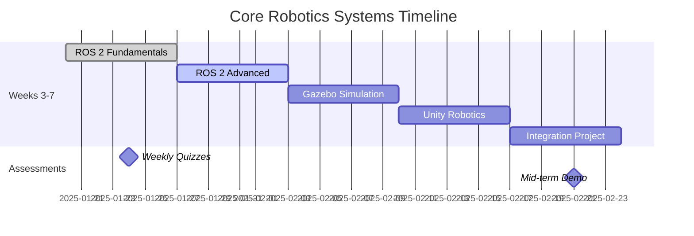
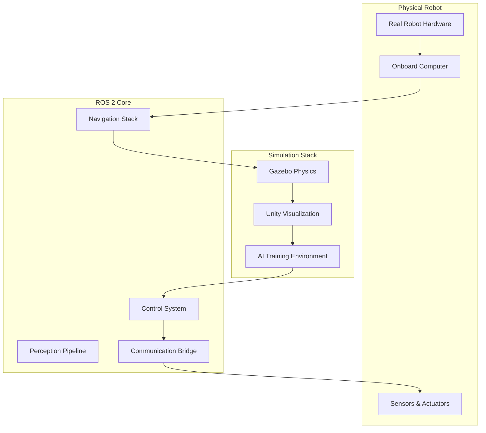

import CodeComponent from '@site/src/components/CodeComponent';

# Lesson 2.3: Weekly Learning Plan (Weeks 3-7)

## Learning Objectives

<div className="learning-objectives">

After completing this lesson, you will understand:
- The detailed structure for Weeks 3-7 of the course
- Progressive learning path for ROS 2 mastery
- Simulation project milestones and deliverables
- Assessment criteria and success metrics
- How to track progress through core robotics systems

</div>

## Course Overview: Weeks 3-7

This phase of the course focuses on **Core Robotics Systems**, building a solid foundation in ROS 2, simulation, and robot control. Each week introduces new concepts while progressively building on previous knowledge.

<DiagramComponent title="Weeks 3-7 Learning Progression">



</DiagramComponent>

## Week 3: ROS 2 Fundamentals

### Learning Objectives

1. Master ROS 2 architecture and communication patterns
2. Implement nodes, topics, and services
3. Use ROS 2 command-line tools effectively
4. Build a simple multi-node system

### Weekly Schedule

| Day | Topics | Activities | Assessment |
|-----|--------|------------|------------|
| Monday | ROS 2 Architecture | DDS, nodes, communication | Quiz 1 |
| Tuesday | Topics & Messages | Pub/sub patterns | Lab 1 |
| Wednesday | Services & Actions | Request/response, async | Lab 2 |
| Thursday | Launch & Parameters | System configuration | Quiz 2 |
| Friday | Multi-node Project | Complete system | Project Demo |

### Daily Breakdown

#### Day 1: ROS 2 Architecture (4 hours)

**Morning Theory (2 hours)**
- ROS 2 vs ROS 1 comparison
- DDS middleware explanation
- Communication patterns
- Quality of Service (QoS)

**Afternoon Practice (2 hours)**
- Install and configure ROS 2
- Create workspace
- First ROS 2 node
- Test node communication

```bash
# ROS 2 workspace setup
mkdir -p ~/ros2_ws/src
cd ~/ros2_ws
colcon build

# Environment setup
source /opt/ros/humble/setup.bash
source install/setup.bash

# Test node
ros2 run demo_nodes_cpp talker
ros2 run demo_nodes_py listener
```

#### Day 2: Topics and Messages (4 hours)

**Morning Theory (2 hours)**
- Message types and generation
- Publisher-subscriber pattern
- QoS profiles
- Topic naming conventions

**Afternoon Lab (2 hours)**
<CodeComponent title="Lab: Temperature Monitoring System" language="python">

```python
#!/usr/bin/env python3
import rclpy
from rclpy.node import Node
from std_msgs.msg import Float64
from sensor_msgs.msg import Temperature
import random
import time

class TemperatureSensor(Node):
    def __init__(self):
        super().__init__('temperature_sensor')

        # Publishers
        self.temp_pub = self.create_publisher(
            Temperature,
            '/sensors/temperature',
            10
        )

        self.avg_pub = self.create_publisher(
            Float64,
            '/sensors/avg_temperature',
            10
        )

        # Timer for regular readings
        self.timer = self.create_timer(1.0, self.read_temperature)

        # Data storage for averaging
        self.readings = []
        self.get_logger().info('Temperature sensor started')

    def read_temperature(self):
        """Simulate temperature readings"""
        # Simulate temperature between 20-30°C
        current_temp = 20 + random.random() * 10
        self.readings.append(current_temp)

        # Keep only last 10 readings
        if len(self.readings) > 10:
            self.readings.pop(0)

        # Create and publish temperature message
        temp_msg = Temperature()
        temp_msg.header.stamp = self.get_clock().now().to_msg()
        temp_msg.header.frame_id = 'sensor_frame'
        temp_msg.temperature = current_temp
        temp_msg.variance = 0.1

        self.temp_pub.publish(temp_msg)

        # Calculate and publish average
        avg_temp = sum(self.readings) / len(self.readings)
        avg_msg = Float64()
        avg_msg.data = avg_temp

        self.avg_pub.publish(avg_msg)

        self.get_logger().info(
            f'Current: {current_temp:.1f}°C, '
            f'Average: {avg_temp:.1f}°C'
        )

class TemperatureMonitor(Node):
    def __init__(self):
        super().__init__('temperature_monitor')

        # Subscriptions
        self.temp_sub = self.create_subscription(
            Temperature,
            '/sensors/temperature',
            self.temperature_callback,
            10
        )

        self.avg_sub = self.create_subscription(
            Float64,
            '/sensors/avg_temperature',
            self.average_callback,
            10
        )

        # Thresholds
        self.temp_threshold = 28.0
        self.critical_threshold = 29.5

        self.get_logger().info('Temperature monitor started')

    def temperature_callback(self, msg):
        """Handle individual temperature readings"""
        temp = msg.temperature

        if temp > self.critical_threshold:
            self.get_logger().error(
                f'CRITICAL: Temperature {temp:.1f}°C exceeds threshold!'
            )
        elif temp > self.temp_threshold:
            self.get_logger().warn(
                f'WARNING: Temperature {temp:.1f}°C above threshold'
            )
        else:
            self.get_logger().info(
                f'OK: Temperature {temp:.1f}°C within range'
            )

    def average_callback(self, msg):
        """Handle average temperature"""
        self.get_logger().info(
            f'Average temperature: {msg.data:.1f}°C'
        )

def main(args=None):
    rclpy.init(args=args)

    # Create nodes
    sensor = TemperatureSensor()
    monitor = TemperatureMonitor()

    # Spin both nodes
    executor = rclpy.executors.MultiThreadedExecutor()
    executor.add_node(sensor)
    executor.add_node(monitor)

    try:
        executor.spin()
    except KeyboardInterrupt:
        pass

    sensor.destroy_node()
    monitor.destroy_node()
    rclpy.shutdown()

if __name__ == '__main__':
    main()
```

</CodeComponent>

#### Day 3: Services and Actions (4 hours)

**Morning Theory (2 hours)**
- Service definition and implementation
- Action servers and clients
- When to use services vs actions vs topics
- Error handling and timeouts

**Afternoon Lab (2 hours)**
Implement a robot arm controller:
```python
# Service for moving arm to position
# Action for executing complex trajectories
# Error handling and feedback
```

#### Day 4: Launch Files and Parameters (4 hours)

**Morning Theory (2 hours)**
- Launch file formats (XML, Python)
- Parameter configuration
- Node remapping
- Composition vs distributed nodes

**Afternoon Lab (2 hours)**
Create comprehensive launch system for temperature monitoring.

#### Day 5: Multi-node Project (4 hours)

**Project Requirements**:
- At least 3 different nodes
- Mix of topics, services, and actions
- Proper launch configuration
- Error handling and logging
- Documentation

### Week 3 Deliverables

1. **Temperature Monitoring System** (Python code)
   - Sensor node with publisher
   - Monitor node with subscribers
   - Service for configuration
   - Launch file
   - 300-400 lines of code

2. **System Diagram** (Mermaid diagram)
   - Show all nodes and connections
   - Include message flows
   - Label data types

3. **Test Report** (2 pages)
   - Performance metrics
   - Error scenarios tested
   - Improvements made

### Assessment Criteria

| Component | Weight | Passing Criteria |
|-----------|--------|-----------------|
| Code Quality | 40% | Clean, documented, follows ROS 2 conventions |
| Functionality | 40% | All features working, proper error handling |
| Documentation | 20% | Clear README, diagram, test report |

## Week 4: Advanced ROS 2

### Learning Objectives

1. Implement custom messages and services
2. Master ROS 2 navigation stack
3. Use transforms (TF2) effectively
4. Build robot state publishers

### Weekly Schedule

| Day | Topics | Activities |
|-----|--------|------------|
| Monday | Custom Messages | IDL, compilation, usage |
| Tuesday | TF2 & Transforms | Coordinate frames, broadcasting |
| Wednesday | Navigation Stack | Map server, costmaps, planners |
| Thursday | Robot State Publisher | Joint states, URDF integration |
| Friday | Path Planning | A*, Dijkstra, custom planners |

### Key Project: Autonomous Navigation Robot

<CodeComponent title="Custom Message Definition" language="proto">

```yaml
# status_msgs/CustomStatus.msg
std_msgs/Header header
string robot_name
uint8 status_id
string status_message
float64 battery_level
float64[] joint_positions

# path_msgs/CustomPath.msg
std_msgs/Header header
geometry_msgs/PoseStamped[] poses
float32 tolerance
bool loop_path
```

</CodeComponent>

<CodeComponent title="Transform Broadcaster" language="python">

```python
#!/usr/bin/env python3
import rclpy
from rclpy.node import Node
from geometry_msgs.msg import TransformStamped
from tf2_ros import TransformBroadcaster
from nav_msgs.msg import Odometry
import math

class RobotTransformPublisher(Node):
    def __init__(self):
        super().__init__('robot_tf_publisher')

        # Transform broadcaster
        self.tf_broadcaster = TransformBroadcaster(self)

        # Odometry subscriber
        self.odom_sub = self.create_subscription(
            Odometry,
            '/odom',
            self.odom_callback,
            10
        )

        self.get_logger().info('Transform publisher started')

    def odom_callback(self, msg):
        """Publish transforms based on odometry"""
        # Base link to odom transform
        t = TransformStamped()
        t.header.stamp = self.get_clock().now().to_msg()
        t.header.frame_id = 'odom'
        t.child_frame_id = 'base_link'

        # Translation
        t.transform.translation.x = msg.pose.pose.position.x
        t.transform.translation.y = msg.pose.pose.position.y
        t.transform.translation.z = 0.0

        # Rotation
        t.transform.rotation = msg.pose.pose.orientation

        # Send the transform
        self.tf_broadcaster.sendTransform(t)

        # Additional transforms (e.g., sensor frames)
        self.publish_sensor_transforms()

    def publish_sensor_transforms(self):
        """Publish static sensor transforms"""
        # Camera transform
        t_camera = TransformStamped()
        t_camera.header.stamp = self.get_clock().now().to_msg()
        t_camera.header.frame_id = 'base_link'
        t_camera.child_frame_id = 'camera_link'
        t_camera.transform.translation.x = 0.2
        t_camera.transform.translation.z = 0.2

        # Rotate camera forward
        t_camera.transform.rotation.w = 0.707
        t_camera.transform.rotation.y = -0.707

        self.tf_broadcaster.sendTransform(t_camera)

def main(args=None):
    rclpy.init(args=args)
    tf_publisher = RobotTransformPublisher()
    rclpy.spin(tf_publisher)
    rclpy.shutdown()

if __name__ == '__main__':
    main()
```

</CodeComponent>

### Week 4 Deliverables

1. **Navigation Robot** (ROS 2 package)
   - Custom messages
   - Transform broadcaster
   - Navigation stack config
   - Launch files

2. **Navigation Demo** (Video)
   - Show autonomous navigation
   - Obstacle avoidance
   - Path planning visualization

## Week 5: Gazebo Simulation

### Learning Objectives

1. Create realistic robot models in URDF/SDF
2. Build custom Gazebo worlds
3. Simulate sensors accurately
4. Integrate physics simulation

### Weekly Schedule

| Day | Topics | Activities |
|-----|--------|------------|
| Monday | URDF Modeling | Links, joints, inertial properties |
| Tuesday | SDF & Physics | Collision models, surface properties |
| Wednesday | Sensor Simulation | Camera, LiDAR, IMU plugins |
| Thursday | World Building | Environments, obstacles, lighting |
| Friday | Physics Validation | Compare sim vs reality |

### Key Project: Mars Rover Simulation

Create a complete Mars rover simulation with:
- 6-wheel rocker-bogie suspension
- Scientific instruments
- Mars-like terrain
- Realistic physics

### Week 5 Deliverables

1. **Mars Rover Model** (URDF/SDF files)
2. **Mars Environment** (Gazebo world)
3. **Simulation Report** (Performance analysis)
4. **Demo Video** (Rover navigating terrain)

## Week 6: Unity Robotics

### Learning Objectives

1. Set up Unity for robotics simulation
2. Import and configure robot models
3. Implement high-fidelity rendering
4. Connect Unity with ROS 2

### Weekly Schedule

| Day | Topics | Activities |
|-----|--------|------------|
| Monday | Unity Setup | Project configuration, ROS-TCP-Connector |
| Tuesday | Robot Import | URDF importer, prefabs, scripts |
| Wednesday | Visual Quality | Materials, lighting, post-processing |
| Thursday | ROS 2 Bridge | Publishers, subscribers, services |
| Friday | AI Training | Data generation, reinforcement learning |

### Key Project: Photorealistic Warehouse

Create a warehouse simulation with:
- Multiple robots
- Dynamic obstacles
- Photorealistic rendering
- AI training capabilities

### Week 6 Deliverables

1. **Unity Scene** (Complete warehouse)
2. **ROS 2 Bridge** (Unity scripts)
3. **Training Pipeline** (Data collection)
4. **Visual Demo** (High-quality video)

## Week 7: Integration Project

### Learning Objectives

1. Integrate ROS 2, Gazebo, and Unity
2. Build complete robot system
3. Implement testing methodology
4. Create deployment strategies

### Weekly Schedule

| Day | Topics | Activities |
|-----|--------|------------|
| Monday | System Integration | Connect all components |
| Tuesday | Testing & Validation | Unit tests, integration tests |
| Wednesday | Performance Tuning | Optimize for real-time |
| Thursday | Documentation | Complete system documentation |
| Friday | Final Demo | Present complete system |

### Capstone Project: Autonomous Delivery Robot

<DiagramComponent title="Integrated System Architecture">



</DiagramComponent>

### Integration Requirements

1. **Dual Operation**
   - Switch between real and simulated robot
   - Same code runs on both
   - Seamless handoff

2. **Multi-sensor Fusion**
   - Camera + LiDAR perception
   - IMU integration
   - Sensor calibration

3. **Autonomous Navigation**
   - SLAM mapping
   - Path planning
   - Obstacle avoidance

4. **Task Execution**
   - Pick and place objects
   - Multi-robot coordination
   - Human-robot interaction

### Week 7 Deliverables

1. **Complete System** (All code and configs)
2. **Demo Video** (5 minutes)
3. **Technical Report** (10 pages)
4. **Presentation Slides** (15 slides)

## Assessment Overview: Weeks 3-7

### Grading Breakdown

| Component | Weight | Details |
|-----------|--------|---------|
| Weekly Labs | 25% | 5 labs, 5% each |
| Weekly Quizzes | 15% | 5 quizzes, 3% each |
| Mid-term Project | 25% | Integrated ROS 2 system |
| Final Integration | 35% | Complete autonomous system |

### Success Metrics

1. **Technical Proficiency**
   - ROS 2 best practices
   - Clean, maintainable code
   - Proper documentation

2. **Problem Solving**
   - Debugging skills
   - Creative solutions
   - Performance optimization

3. **Integration Skills**
   - Combining multiple systems
   - Testing methodology
   - Deployment readiness

## Resources and Tools

### Required Software

1. **ROS 2 Humble**
   - Complete installation
   - Development tools
   - Visualization packages

2. **Gazebo 11**
   - Physics simulation
   - Model plugins
   - Sensor simulation

3. **Unity 2022.3**
   - Unity Robotics Hub
   - ROS-TCP-Connector
   - ML-Agents (optional)

### Hardware Requirements

- **Minimum**: 8GB RAM, quad-core CPU
- **Recommended**: 16GB RAM, 6-core CPU, GTX 1060+
- **Optional**: Real robot hardware

### Learning Resources

1. **Official Documentation**
   - [ROS 2 Documentation](https://docs.ros.org/)
   - [Gazebo Tutorials](http://gazebosim.org/tutorials)
   - [Unity Robotics](https://github.com/Unity-Technologies/Unity-Robotics-Hub)

2. **Books**
   - "ROS 2 in Depth" - Martinez
   - "Robot Simulation" - Siciliano
   - "Game Engine Architecture" - Gregory

3. **Online Courses**
   - ROS 2 Basics (Coursera)
   - Robotics Software Engineering (Udacity)
   - Unity for Robotics (edX)

## Progress Tracking Template

```markdown
# Weeks 3-7 Progress Tracker

## Week 3: ROS 2 Fundamentals
- [ ] Node implementation completed
- [ ] Topic communication working
- [ ] Service/action implemented
- [ ] Multi-node system demo
- [ ] Quiz 1 score: ___/10

## Week 4: Advanced ROS 2
- [ ] Custom messages created
- [ ] Transform system working
- [ ] Navigation configured
- [ ] Path planning tested
- [ ] Quiz 2 score: ___/10

## Week 5: Gazebo Simulation
- [ ] Robot model complete
- [ ] Physics validated
- [ ] Sensors simulated
- [ ] World built
- [ ] Quiz 3 score: ___/10

## Week 6: Unity Robotics
- [ ] Scene created
- [ ] ROS 2 bridge working
- [ ] Visual quality optimized
- [ ] AI pipeline ready
- [ ] Quiz 4 score: ___/10

## Week 7: Integration
- [ ] All systems integrated
- [ ] Testing complete
- [ ] Documentation finished
- [ ] Demo prepared
- [ ] Quiz 5 score: ___/10
```

## Key Takeaways for Weeks 3-7

1. **Master ROS 2** - Foundation for all robotics development
2. **Simulation First** - Test before deploying to hardware
3. **Integration is Key** - Combine multiple systems effectively
4. **Documentation Matters** - Maintain clear, comprehensive docs
5. **Iterate Rapidly** - Use simulation to accelerate development

## Next Steps

After completing Weeks 3-7, you will have:
- Strong foundation in ROS 2
- Experience with simulation tools
- Complete autonomous system
- Portfolio-ready projects

Ready for Weeks 8-13: **AI-Robot Intelligence & Capstone**
- NVIDIA Isaac Platform
- Vision-Language-Action systems
- Conversational robots
- Humanoid robotics project

## Quiz

<Quiz
  quizId="weekly-plan-weeks-3-7"
  questions={[
    {
      id: "q1",
      type: "multiple-choice",
      question: "What is the main deliverable for Week 3?",
      options: [
        "A complete humanoid robot",
        "A temperature monitoring system with multiple ROS 2 nodes",
        "Unity game development",
        "A research paper on robotics"
      ],
      correct: 1,
      explanation: "Week 3 requires implementing a temperature monitoring system with sensor and monitor nodes, demonstrating mastery of ROS 2 fundamentals."
    },
    {
      id: "q2",
      type: "multiple-choice",
      question: "Which simulation tool is primarily used in Week 5?",
      options: [
        "Unreal Engine",
        "Blender",
        "Gazebo",
        "Simulink"
      ],
      correct: 2,
      explanation: "Week 5 focuses entirely on Gazebo simulation, including URDF/SDF modeling, physics simulation, and sensor simulation."
    },
    {
      id: "q3",
      type: "true-false",
      question: "The Week 7 integration project requires both simulation and real robot hardware.",
      correct: false,
      explanation: "While the project should support both simulation and real hardware, the actual hardware is optional. The focus is on integrating all software components seamlessly."
    }
  ]}
/>