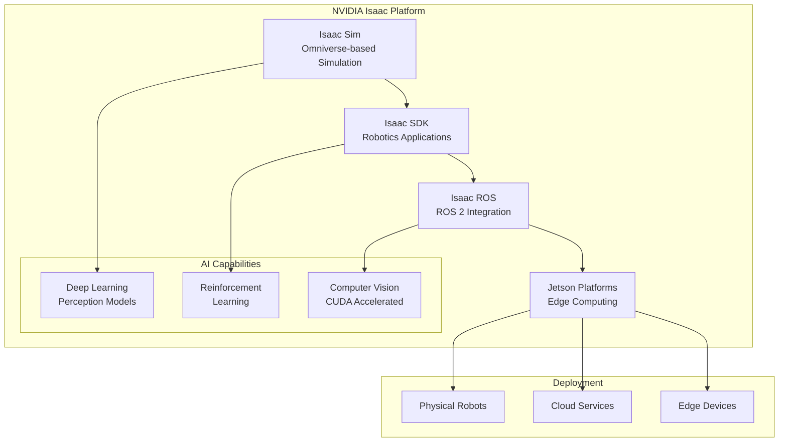

import CodeComponent from '@site/src/components/CodeComponent';

# Lesson 3.1: NVIDIA Isaac Platform

## Learning Objectives

<div className="learning-objectives">

After completing this lesson, you will be able to:
- Explain the NVIDIA Isaac ecosystem and its components
- Set up and configure Isaac Sim for robotics simulation
- Implement AI-powered robot perception with Isaac SDK
- Use NVIDIA Omniverse for collaborative robot development
- Integrate deep learning models with Isaac tools

</div>

## Introduction to NVIDIA Isaac

The NVIDIA Isaac Platform is a comprehensive robotics ecosystem that brings together simulation, AI, and edge computing. It provides developers with powerful tools to create, test, and deploy intelligent robots with advanced perception and navigation capabilities.

<DiagramComponent title="NVIDIA Isaac Ecosystem">



</DiagramComponent>

## Core Components

### 1. Isaac Sim

Isaac Sim is NVIDIA's robotics simulator built on NVIDIA Omniverse, providing photorealistic simulation capabilities powered by RTX technology.

**Key Features:**
- Physically accurate simulation with NVIDIA PhysX
- RTX-enabled rendering for sensor simulation
- Massive scalability for synthetic data generation
- USD (Universal Scene Description) compatibility
- Cloud-native architecture

### 2. Isaac SDK

The Isaac SDK provides a framework for building robotic applications with:

- Modular C++/Python API
- Pre-built perception and navigation modules
- Integration with popular AI frameworks
- Support for various robot hardware

### 3. Isaac ROS

Isaac ROS provides GPU-accelerated packages for ROS 2:

- NVIDIA-accelerated perception nodes
- Deep learning model integration
- CUDA-optimized processing
- Seamless ROS 2 compatibility

## Setting Up Isaac Sim

### System Requirements

<CodeComponent title="Isaac Sim Requirements" language="yaml">

```yaml
minimum_requirements:
  os: Ubuntu 20.04 LTS
  gpu: NVIDIA RTX 2070 or higher
  ram: 32GB
  storage: 100GB SSD
  driver: NVIDIA 470+
  cuda: 11.6+

recommended_requirements:
  gpu: NVIDIA RTX 3080 Ti or higher
  ram: 64GB
  storage: 500GB NVMe SSD
  network: 10 Gbps for cloud collaboration
```

</CodeComponent>

### Installation

<CodeComponent title="Isaac Sim Installation Script" language="bash">

```bash
#!/bin/bash
# Download Isaac Sim
wget https://developer.nvidia.com/isaac-sim/downloads \
  -O isaac-sim.tar.gz

# Extract to preferred location
sudo mkdir -p /opt/nvidia
sudo tar -xzf isaac-sim.tar.gz -C /opt/nvidia/

# Set up environment
echo 'export ISAAC_SIM_PATH=/opt/nvidia/isaac-sim' >> ~/.bashrc
echo 'source $ISAAC_SIM_PATH/setup.sh' >> ~/.bashrc

# Verify installation
source ~/.bashrc
python3 -c "import carb; print('Isaac Sim installed successfully')"
```

</CodeComponent>

## Creating Your First Isaac Sim Scene

### USD Scene Composition

<CodeComponent title="Warehouse Robot Scene in USD" language="python">

```python
#!/usr/bin/env python3
# warehouse_scene.py
import omni.kit.commands
from omni.isaac.core import World
from omni.isaac.core.objects import VisualCuboid
from omni.isaac.core.utils.nucleus import get_assets_root_path
from pxr import Usd, UsdGeom, Gf, Sdf

class WarehouseScene:
    def __init__(self):
        self.world = World()
        self.assets_root = get_assets_root_path()

    def create_environment(self):
        """Create a warehouse environment with shelves and obstacles"""

        # Create floor
        floor = VisualCuboid(
            prim_path="/World/Floor",
            name="floor",
            position=(0, 0, 0),
            size=(20, 20, 0.1),
            color=(0.5, 0.5, 0.5)
        )

        # Create shelving units
        self.create_shelves()

        # Create conveyor belt
        self.create_conveyor()

        # Create packing stations
        self.create_packing_stations()

        # Add lighting
        self.setup_lighting()

    def create_shelves(self):
        """Create warehouse shelving units"""
        shelf_positions = [
            (-8, -5, 1.5), (-4, -5, 1.5), (0, -5, 1.5), (4, -5, 1.5),
            (-8, 5, 1.5), (-4, 5, 1.5), (0, 5, 1.5), (4, 5, 1.5)
        ]

        for i, pos in enumerate(shelf_positions):
            shelf = VisualCuboid(
                prim_path=f"/World/Shelf_{i}",
                name=f"shelf_{i}",
                position=pos,
                size=(3, 0.5, 3),
                color=(0.8, 0.6, 0.4)
            )

            # Add shelf levels
            for j in range(3):
                shelf_level = VisualCuboid(
                    prim_path=f"/World/Shelf_{i}/Level_{j}",
                    name=f"shelf_level_{i}_{j}",
                    position=(pos[0], pos[1], pos[2] - j - 0.5),
                    size=(2.8, 0.05, 0.8),
                    color=(0.9, 0.9, 0.9)
                )

    def create_conveyor(self):
        """Create a moving conveyor belt"""
        conveyor = VisualCuboid(
            prim_path="/World/Conveyor",
            name="conveyor",
            position=(0, 0, 0.3),
            size=(15, 1, 0.1),
            color=(0.2, 0.2, 0.2)
        )

        # Add conveyor belt animation
        from omni.isaac.core.utils.stage import add_timeline_callback
        from omni.timeline import get_timeline_interface

        def update_conveyor(dt):
            # Animate conveyor belt movement
            conveyor_prim = omni.kit.commands.execute(
                "UsdGetPrim", path="/World/Conveyor"
            )
            # Animation logic would go here

        # Register animation callback
        self.world.add_physics_callback("conveyor_update", update_conveyor)

    def create_packing_stations(self):
        """Create packing stations with robot arms"""
        station_positions = [(-8, 0, 0), (8, 0, 0)]

        for i, pos in enumerate(station_positions):
            # Station table
            station = VisualCuboid(
                prim_path=f"/World/Station_{i}",
                name=f"packing_station_{i}",
                position=pos,
                size=(2, 2, 1),
                color=(0.6, 0.4, 0.3)
            )

            # Robot arm base
            robot_base = VisualCuboid(
                prim_path=f"/World/Station_{i}/RobotBase",
                name=f"robot_base_{i}",
                position=(pos[0], pos[1], pos[2] + 0.5),
                size=(0.5, 0.5, 0.5),
                color=(0.3, 0.3, 0.3)
            )

    def setup_lighting(self):
        """Configure warehouse lighting"""
        # Main overhead lights
        light_positions = [
            (-5, -3, 8), (5, -3, 8),
            (-5, 3, 8), (5, 3, 8)
        ]

        for i, pos in enumerate(light_positions):
            from omni.isaac.core import Light
            light = Light(
                prim_path=f"/World/Light_{i}",
                name=f"warehouse_light_{i}",
                position=pos,
                intensity=50000,
                color=(1.0, 1.0, 0.9)
            )

# Create and initialize the scene
def main():
    scene = WarehouseScene()
    scene.world.reset()
    scene.create_environment()

    # Add robot
    from omni.isaac.core.objects import DynamicCuboid
    robot = DynamicCuboid(
        prim_path="/World/Robot",
        name="warehouse_robot",
        position=(0, 0, 0.5),
        size=(0.5, 0.5, 0.5),
        color=(0.0, 0.0, 1.0)
    )

    print("Warehouse scene created successfully!")

if __name__ == "__main__":
    main()
```

</CodeComponent>

## Isaac SDK Applications

### Robot Perception Pipeline

<CodeComponent title="Isaac SDK Perception Application" language="python">

```python
#!/usr/bin/env python3
# perception_app.py
from isaac import Codelet, Application
from isaac.ml import InferenceCodelet
from isaac.sensors import Camera, Lidar
import numpy as np

class ObjectDetector(Codelet):
    """Object detection using Isaac ML"""

    def start(self):
        # Configure input channels
        self.rx_color = self.isaac_proto_rx("color_image", "ColorCameraProto")
        self.rx_depth = self.isaac_proto_rx("depth_image", "DepthCameraProto")

        # Configure output channels
        self.tx_detections = self.isaac_proto_tx("detections", "Detection2Proto")
        self.tx_markers = self.isaac_proto_tx("markers", "DetectionsMarkerProto")

        # Load detection model
        self.model = self.isaac.load_model("models/object_detection.onnx")

        # Detection parameters
        self.confidence_threshold = 0.5
        self.nms_threshold = 0.4

    def tick(self):
        # Get latest camera data
        if not self.rx_color.available or not self.rx_depth.available:
            return

        color_proto = self.rx_color.get_proto()
        depth_proto = self.rx_depth.get_proto()

        # Convert to numpy array
        color_image = self.get_image_buffer(color_proto)
        depth_image = self.get_image_buffer(depth_proto)

        # Run object detection
        detections = self.detect_objects(color_image, depth_image)

        # Publish results
        self.publish_detections(detections)

    def detect_objects(self, color_image, depth_image):
        """Detect objects using deep learning model"""
        # Preprocess image
        input_tensor = self.preprocess_image(color_image)

        # Run inference
        outputs = self.model.run(input_tensor)

        # Post-process results
        boxes, scores, classes = self.postprocess(outputs)

        # Combine with depth information
        detections = []
        for box, score, cls in zip(boxes, scores, classes):
            if score > self.confidence_threshold:
                # Get depth at object center
                depth = self.get_depth_at_position(depth_image, box)
                distance = self.depth_to_distance(depth)

                detection = {
                    'bbox': box,
                    'confidence': score,
                    'class': cls,
                    'distance': distance,
                    'position_3d': self.box_to_3d_position(box, distance)
                }
                detections.append(detection)

        return detections

    def publish_detections(self, detections):
        """Publish detection results"""
        detection_proto = self.tx_detections.get_proto()

        # Clear existing detections
        detection_proto.detections.clear()

        # Add new detections
        for detection in detections:
            det = detection_proto.detections.add()
            det.label = detection['class']
            det.confidence = detection['confidence']
            det.bbox.center.x = detection['bbox'][0]
            det.bbox.center.y = detection['bbox'][1]
            det.bbox.size.x = detection['bbox'][2] - detection['bbox'][0]
            det.bbox.size.y = detection['bbox'][3] - detection['bbox'][1]

            # Set 3D position
            det.position.x = detection['position_3d'][0]
            det.position.y = detection['position_3d'][1]
            det.position.z = detection['position_3d'][2]

        # Publish
        self.tx_detections.publish()

class NavigationPlanner(Codelet):
    """Navigation planning using Isaac SLAM"""

    def start(self):
        # Subscriptions
        self.rx_odometry = self.isaac_proto_rx("odom", "Odometry2Proto")
        self.rx_detections = self.isaac_proto_rx("detections", "Detection2Proto")
        self.rx_lidar = self.isaac_proto_rx("scan", "LidarScanProto")

        # Publications
        self.tx_cmd = self.isaac_proto_tx("cmd_vel", "VelocityCommandProto")
        self.tx_map = self.isaac_proto_tx("map", "OccupancyGridProto")

        # Initialize SLAM
        self.slam = self.isaac.create_slam_module()

        # Navigation state
        self.current_goal = None
        self.path = []

    def tick(self):
        """Main navigation loop"""
        if not self.rx_odometry.available or not self.rx_lidar.available:
            return

        # Get sensor data
        odom = self.rx_odometry.get_proto()
        scan = self.rx_lidar.get_proto()

        # Update SLAM
        self.slam.update(odom, scan)

        # Process detections for obstacle avoidance
        if self.rx_detections.available:
            detections = self.rx_detections.get_proto()
            self.update_costmap(detections)

        # Plan and execute
        if self.current_goal:
            self.execute_navigation()

    def update_costmap(self, detections):
        """Update navigation costmap with detected obstacles"""
        for detection in detections.detections:
            # Convert detection to costmap coordinates
            x = detection.position.x
            y = detection.position.y

            # Update costmap
            self.slam.update_costmap(x, y, cost=100)

class RobotController(Application):
    """Main robot controller application"""

    def __init__(self):
        super().__init__()

        # Add sensors
        self.camera = self.isaac.add_node("camera", Camera)
        self.lidar = self.isaac.add_node("lidar", Lidar)

        # Add perception
        self.detector = self.isaac.add_node("detector", ObjectDetector)

        # Add navigation
        self.planner = self.isaac.add_node("planner", NavigationPlanner)

        # Connect components
        self.connect_components()

    def connect_components(self):
        """Set up message passing between components"""
        # Camera to detector
        self.isaac.connect(
            "camera.color", "detector.color_image"
        )
        self.isaac.connect(
            "camera.depth", "detector.depth_image"
        )

        # Detector to planner
        self.isaac.connect(
            "detector.detections", "planner.detections"
        )

        # Odometry to planner
        self.isaac.connect(
            "robot.odometry", "planner.odom"
        )

        # Lidar to planner
        self.isaac.connect(
            "lidar.scan", "planner.scan"
        )

        # Planner to motors
        self.isaac.connect(
            "planner.cmd_vel", "robot.command"
        )

# Run the application
if __name__ == "__main__":
    app = RobotController()
    app.run()
```

</CodeComponent>

## Isaac ROS Integration

### GPU-Accelerated Perception

<CodeComponent title="Isaac ROS Object Detection Node" language="python">

```python
#!/usr/bin/env python3
# isaac_ros_object_detection.py
import rclpy
from rclpy.node import Node
import cv2
import numpy as np
from sensor_msgs.msg import Image
from vision_msgs.msg import Detection2DArray
from isaac_ros_essentials import IsaacRosNode
from trt_pose import PoseEngine

class IsaacRosObjectDetection(Node):
    """GPU-accelerated object detection using Isaac ROS"""

    def __init__(self):
        super().__init__('isaac_ros_object_detector')

        # Initialize Isaac ROS node
        self.isaac_node = IsaacRosNode()

        # Load TensorRT model
        self.model_path = "models/yolov5.engine"
        self.engine = PoseEngine(self.model_path, input_shape=(640, 640))

        # Publishers and subscribers
        self.image_sub = self.create_subscription(
            Image,
            '/camera/color/image_raw',
            self.image_callback,
            10
        )

        self.detection_pub = self.create_publisher(
            Detection2DArray,
            '/ detections',
            10
        )

        # Visualization publisher
        self.image_pub = self.create_publisher(
            Image,
            '/ detections/image',
            10
        )

        self.get_logger().info('Isaac ROS Object Detection Node initialized')

    def image_callback(self, msg):
        """Process incoming images for object detection"""
        try:
            # Convert ROS image to numpy array
            cv_image = self.bridge.imgmsg_to_cv2(msg, "bgr8")

            # Preprocess for inference
            input_tensor = self.preprocess_image(cv_image)

            # Run inference
            outputs = self.engine.infer(input_tensor)

            # Post-process results
            detections = self.postprocess(outputs, cv_image.shape[:2])

            # Publish detections
            self.publish_detections(detections, msg.header)

            # Visualize and publish
            self.visualize_detections(cv_image, detections)

        except Exception as e:
            self.get_logger().error(f'Error processing image: {str(e)}')

    def preprocess_image(self, image):
        """Preprocess image for model input"""
        # Resize
        resized = cv2.resize(image, (640, 640))

        # Normalize
        normalized = resized.astype(np.float32) / 255.0

        # Convert to tensor
        tensor = np.transpose(normalized, (2, 0, 1))
        tensor = np.expand_dims(tensor, axis=0)

        return tensor

    def postprocess(self, outputs, original_shape):
        """Convert model outputs to detection format"""
        # Extract boxes, scores, classes
        boxes = outputs['boxes']
        scores = outputs['scores']
        classes = outputs['classes']

        # Filter by confidence
        valid_detections = scores > 0.5
        boxes = boxes[valid_detections]
        scores = scores[valid_detections]
        classes = classes[valid_detections]

        # Scale boxes to original image size
        h, w = original_shape
        scale = np.array([w, h, w, h])
        boxes = boxes * scale

        # Convert to list of dictionaries
        detections = []
        for box, score, cls in zip(boxes, scores, classes):
            detections.append({
                'bbox': box.tolist(),
                'score': float(score),
                'class': int(cls),
                'label': self.get_class_label(int(cls))
            })

        return detections

    def publish_detections(self, detections, header):
        """Publish detection messages"""
        detection_msg = Detection2DArray()
        detection_msg.header = header

        for detection in detections:
            det = Detection2D()
            det.header = header

            # Set bounding box
            det.bbox.center.x = (detection['bbox'][0] + detection['bbox'][2]) / 2
            det.bbox.center.y = (detection['bbox'][1] + detection['bbox'][3]) / 2
            det.bbox.size_x = detection['bbox'][2] - detection['bbox'][0]
            det.bbox.size_y = detection['bbox'][3] - detection['bbox'][1]

            # Set class and confidence
            det.results.append(ObjectHypothesisWithPose())
            det.results[0].hypothesis.class_id = detection['class']
            det.results[0].hypothesis.score = detection['score']

            detection_msg.detections.append(det)

        self.detection_pub.publish(detection_msg)

    def visualize_detections(self, image, detections):
        """Draw detection boxes on image"""
        annotated = image.copy()

        for detection in detections:
            x1, y1, x2, y2 = map(int, detection['bbox'])

            # Draw box
            cv2.rectangle(annotated, (x1, y1), (x2, y2), (0, 255, 0), 2)

            # Draw label
            label = f"{detection['label']}: {detection['score']:.2f}"
            cv2.putText(annotated, label, (x1, y1 - 10),
                       cv2.FONT_HERSHEY_SIMPLEX, 0.5, (0, 255, 0), 2)

        # Publish annotated image
        self.image_pub.publish(self.bridge.cv2_to_imgmsg(annotated, "bgr8"))

def main(args=None):
    rclpy.init(args=args)

    detector = IsaacRosObjectDetection()

    try:
        rclpy.spin(detector)
    except KeyboardInterrupt:
        pass

    detector.destroy_node()
    rclpy.shutdown()

if __name__ == '__main__':
    main()
```

</CodeComponent>

## Lab Exercise: Building an AI-Powered Inspector Robot

<div className="lab-exercise">

### Objective
Create an autonomous warehouse inspection robot using NVIDIA Isaac tools that can identify inventory, check shelf conditions, and generate reports.

### Setup
1. Isaac Sim for warehouse environment
2. Isaac SDK for robot control
3. Isaac ROS for integration with ROS 2 ecosystem
4. Custom AI models for inventory recognition

### Implementation

<CodeComponent language="python" editable={true}>

```python
# isaac_inspector_robot.py
import numpy as np
from isaac import Application, Codelet
from isaac.sensors import Camera, Lidar
from isaac.navigation import NavigationStack
from isaac.ml import ObjectDetector
import json
from datetime import datetime

class InventoryInspector(Codelet):
    """AI-powered inventory inspection system"""

    def __init__(self):
        super().__init__()
        self.inventory_db = {}
        self.inspection_report = {
            'timestamp': datetime.now().isoformat(),
            'shelves_inspected': 0,
            'items_found': [],
            'anomalies': []
        }

    def start(self):
        # Configure vision system
        self.camera = self.isaac.get_sensor("camera")
        self.lidar = self.isaac.get_sensor("lidar")

        # Load inventory recognition model
        self.item_detector = self.isaac.load_model(
            "models/inventory_detection.onnx"
        )

        # Load shelf condition model
        self.shelf_inspector = self.isaac.load_model(
            "models/shelf_condition.onnx"
        )

        # Navigation system
        self.nav_stack = self.isaac.get_component("navigation")

        # Report generation
        self.report_timer = self.create_timer(30.0, self.generate_report)

        self.get_logger().info("Inventory Inspector initialized")

    def tick(self):
        """Main inspection loop"""
        if not self.is_inspecting():
            return

        # Check if at inspection point
        if self.nav_stack.is_at_goal():
            self.perform_inspection()
            self.move_to_next_inspection_point()

    def perform_inspection(self):
        """Perform detailed inspection at current location"""
        # Get sensor data
        color_image = self.camera.get_color_image()
        depth_image = self.camera.get_depth_image()
        point_cloud = self.lidar.get_point_cloud()

        # Detect inventory items
        items = self.detect_inventory_items(color_image, depth_image)

        # Inspect shelf condition
        condition = self.inspect_shelf_condition(color_image)

        # Analyze item placement
        placement_issues = self.analyze_placement(items, point_cloud)

        # Record findings
        self.record_inspection(items, condition, placement_issues)

        # Update inventory database
        self.update_inventory_database(items)

    def detect_inventory_items(self, color_image, depth_image):
        """Detect and identify inventory items"""
        # Run item detection model
        detections = self.item_detector.run({
            'color': color_image,
            'depth': depth_image
        })

        items = []
        for detection in detections:
            # Extract item information
            item_id = detection['class_id']
            confidence = detection['confidence']
            bbox = detection['bbox']
            position_3d = self.project_to_3d(bbox, depth_image)

            # Read barcode/QR if present
            barcode = self.read_barcode(color_image, bbox)

            item_info = {
                'id': item_id,
                'name': self.get_item_name(item_id),
                'barcode': barcode,
                'position': position_3d,
                'confidence': confidence,
                'quantity': self.count_items(detection)
            }

            items.append(item_info)

        return items

    def inspect_shelf_condition(self, image):
        """Analyze shelf physical condition"""
        # Run shelf inspection model
        condition_score = self.shelf_inspector.run(image)

        # Analyze specific issues
        issues = []

        if condition_score['damage_detected'] > 0.7:
            issues.append({
                'type': 'damage',
                'severity': 'high',
                'description': 'Physical damage detected'
            })

        if condition_score['dirt_level'] > 0.6:
            issues.append({
                'type': 'cleanliness',
                'severity': 'medium',
                'description': 'Shelf requires cleaning'
            })

        if condition_score['structural_integrity'] < 0.5:
            issues.append({
                'type': 'structural',
                'severity': 'critical',
                'description': 'Structural integrity compromised'
            })

        return {
            'overall_score': condition_score['overall'],
            'issues': issues
        }

    def record_inspection(self, items, condition, placement_issues):
        """Record inspection results"""
        shelf_id = self.get_current_shelf_id()

        shelf_report = {
            'shelf_id': shelf_id,
            'timestamp': datetime.now().isoformat(),
            'items': items,
            'condition': condition,
            'placement_issues': placement_issues,
            'total_items': len(items),
            'expected_items': self.get_expected_items(shelf_id)
        }

        # Add to inspection report
        self.inspection_report['items_found'].extend(items)
        self.inspection_report['anomalies'].extend(placement_issues)
        self.inspection_report['shelves_inspected'] += 1

        # Check for anomalies
        self.check_for_anomalies(shelf_report)

    def check_for_anomalies(self, shelf_report):
        """Check for inventory anomalies"""
        expected = shelf_report['expected_items']
        actual_count = shelf_report['total_items']

        # Check count mismatch
        if expected != actual_count:
            anomaly = {
                'type': 'count_mismatch',
                'shelf': shelf_report['shelf_id'],
                'expected': expected,
                'actual': actual_count,
                'severity': 'high' if abs(expected - actual_count) > 5 else 'medium'
            }
            self.inspection_report['anomalies'].append(anomaly)

        # Check for misplaced items
        for item in shelf_report['items']:
            if not self.is_item_correctly_placed(item):
                anomaly = {
                    'type': 'misplaced_item',
                    'item': item['name'],
                    'shelf': shelf_report['shelf_id'],
                    'severity': 'medium'
                }
                self.inspection_report['anomalies'].append(anomaly)

    def generate_report(self):
        """Generate and save inspection report"""
        # Add summary statistics
        self.inspection_report['summary'] = {
            'total_items': len(self.inspection_report['items_found']),
            'anomaly_count': len(self.inspection_report['anomalies']),
            'completion_rate': (
                self.inspection_report['shelves_inspected'] /
                self.get_total_shelves() * 100
            )
        }

        # Save report
        report_path = f"inspection_reports/report_{datetime.now().strftime('%Y%m%d_%H%M%S')}.json"
        with open(report_path, 'w') as f:
            json.dump(self.inspection_report, f, indent=2)

        self.get_logger().info(f"Inspection report saved: {report_path}")

        # Send notifications for critical issues
        self.send_notifications()

    def send_notifications(self):
        """Send notifications for critical anomalies"""
        critical_anomalies = [
            a for a in self.inspection_report['anomalies']
            if a.get('severity') == 'critical'
        ]

        if critical_anomalies:
            # Send to maintenance system
            self.send_to_maintenance(critical_anomalies)

            # Send email alert
            self.send_email_alert(critical_anomalies)

class InspectorRobot(Application):
    """Main inspector robot application"""

    def __init__(self):
        super().__init__(self.app_filename)

        # Add inspector codelet
        self.inspector = self.isaac.add_codelet("inspector", InventoryInspector)

        # Configure inspection route
        self.inspection_points = [
            (-8, -5, 0), (-4, -5, 0), (0, -5, 0), (4, -5, 0),
            (-8, 5, 0), (-4, 5, 0), (0, 5, 0), (4, 5, 0)
        ]

        self.current_point_index = 0

# Initialize and run
if __name__ == "__main__":
    app = InspectorRobot(
        name="inspector_robot",
        app_filename="inspector_robot.app.json"
    )

    # Configure warehouse environment
    app.load_scene("warehouse.usd")

    # Run inspection
    app.run()
```

</CodeComponent>

### Testing the Inspector

1. **Launch Isaac Sim**:
```bash
./isaac-sim/python.sh isaac_inspector_robot.py
```

2. **Monitor inspection progress**:
```python
# Check real-time status
print(f"Shelves inspected: {app.inspector.inspection_report['shelves_inspected']}")
print(f"Items found: {len(app.inspector.inspection_report['items_found'])}")
print(f"Anomalies detected: {len(app.inspector.inspection_report['anomalies'])}")
```

### Expected Results

The inspector robot should demonstrate:
- Autonomous navigation through warehouse
- Accurate item detection and identification
- Shelf condition assessment
- Comprehensive inspection reporting
- Real-time anomaly detection

</div>

## Best Practices

### 1. Performance Optimization
- Use TensorRT for model optimization
- Leverage GPU acceleration wherever possible
- Implement efficient data pipelines

### 2. Simulation Fidelity
- Match real-world lighting conditions
- Include sensor noise models
- Validate against real hardware

### 3. Model Training
- Use synthetic data generation
- Implement domain randomization
- Fine-tune with real-world data

## Key Takeaways

1. **NVIDIA Isaac provides end-to-end robotics development** - From simulation to deployment
2. **GPU acceleration is crucial** - For real-time AI perception
3. **USD enables collaborative development** - Share and modify scenes easily
4. **Isaac ROS bridges simulation and reality** - Seamless deployment path
5. **Synthetic data accelerates training** - Generate unlimited training data

## Summary

The NVIDIA Isaac Platform represents the cutting edge of robotics development tools. By combining high-fidelity simulation, GPU-accelerated AI, and seamless integration with ROS 2, it provides everything needed to develop and deploy intelligent robots. The platform's emphasis on synthetic data generation and cloud collaboration makes it particularly valuable for developing AI-powered robotic systems.

In the next lesson, we'll explore **Vision-Language-Action (VLA) systems** that combine computer vision, natural language, and robotic control.

[Next: Vision-Language-Action (VLA) Systems →](lesson-2)

## Quiz

<Quiz
  quizId="nvidia-isaac-platform"
  questions={[
    {
      id: "q1",
      type: "multiple-choice",
      question: "What is the primary advantage of using NVIDIA Isaac Sim?",
      options: [
        "It's completely free to use",
        "It provides photorealistic simulation with RTX rendering",
        "It only works with NVIDIA Jetson devices",
        "It doesn't require a GPU"
      ],
      correct: 1,
      explanation: "NVIDIA Isaac Sim's key advantage is its photorealistic simulation capabilities powered by NVIDIA RTX technology, providing physically accurate rendering for sensor simulation."
    },
    {
      id: "q2",
      type: "multiple-choice",
      question: "Which component provides GPU-accelerated ROS 2 packages?",
      options: [
        "Isaac Sim",
        "Isaac SDK",
        "Isaac ROS",
        "Isaac Gym"
      ],
      correct: 2,
      explanation: "Isaac ROS provides GPU-accelerated packages for ROS 2, including NVIDIA-optimized perception nodes, deep learning integration, and CUDA-accelerated processing."
    },
    {
      id: "q3",
      type: "true-false",
      question: "Isaac Sim uses USD (Universal Scene Description) as its native 3D format.",
      correct: true,
      explanation: "Isaac Sim is built on USD (Universal Scene Description), which enables non-destructive, collaborative 3D scene editing and is the standard format for NVIDIA Omniverse applications."
    }
  ]}
/>