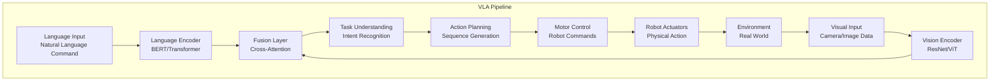

import CodeComponent from '@site/src/components/CodeComponent';

# Lesson 3.2: Vision-Language-Action (VLA) Systems

## Learning Objectives

<div className="learning-objectives">

After completing this lesson, you will be able to:
- Explain the architecture of Vision-Language-Action (VLA) models
- Implement visual grounding for robotic tasks
- Build language understanding systems for robot control
- Create embodied AI agents that connect perception to action
- Train and deploy VLA models for real-world robotics

</div>

## Introduction to VLA Systems

Vision-Language-Action (VLA) systems represent the convergence of three critical AI capabilities:
- **Vision**: Understanding the visual world through cameras and sensors
- **Language**: Comprehending human commands and instructions
- **Action**: Executing physical tasks in the environment

VLA systems enable robots to understand natural language commands like *"Pick up the red cup on the table"* and execute them in the real world.

<DiagramComponent title="VLA System Architecture">



</DiagramComponent>

## Core Components

### 1. Visual Perception Module

Responsible for understanding the visual environment and extracting relevant information.

<CodeComponent title="Visual Perception System" language="python">

```python
import torch
import torch.nn as nn
import torchvision.models as models
import numpy as np
from PIL import Image
import cv2

class VisualPerceptionModule(nn.Module):
    """Visual perception for VLA systems"""

    def __init__(self, feature_dim=512):
        super().__init__()

        # Backbone CNN for feature extraction
        self.backbone = models.resnet50(pretrained=True)
        self.backbone.fc = nn.Identity()  # Remove classification layer

        # Object detection head
        self.detector_head = nn.Sequential(
            nn.Linear(2048, 1024),
            nn.ReLU(),
            nn.Linear(1024, 80)  # COCO classes
        )

        # Depth estimation head
        self.depth_head = nn.Sequential(
            nn.Conv2d(2048, 512, 3, padding=1),
            nn.ReLU(),
            nn.Conv2d(512, 256, 3, padding=1),
            nn.ReLU(),
            nn.Conv2d(256, 1, 1)
        )

        # Semantic segmentation head
        self.segmentation_head = nn.Sequential(
            nn.Conv2d(2048, 512, 3, padding=1),
            nn.ReLU(),
            nn.Conv2d(512, 256, 3, padding=1),
            nn.ReLU(),
            nn.Conv2d(256, 19, 1)  # 19 semantic classes
        )

        # Visual feature projection
        self.visual_projection = nn.Linear(2048, feature_dim)

    def forward(self, x):
        # Extract features
        features = self.backbone(x)  # [batch, 2048]

        # Object detection
        class_logits = self.detector_head(features)

        # For depth and segmentation, we need feature maps
        feature_maps = self.backbone.layer4(x)  # [batch, 2048, H, W]

        # Depth estimation
        depth = self.depth_head(feature_maps)

        # Semantic segmentation
        segmentation = self.segmentation_head(feature_maps)

        # Project features for fusion
        visual_features = self.visual_projection(features)

        return {
            'features': visual_features,
            'class_logits': class_logits,
            'depth': depth,
            'segmentation': segmentation
        }

class ObjectGrounding:
    """Ground language concepts to visual objects"""

    def __init__(self, perception_module):
        self.perception = perception_module
        self.object_categories = [
            'cup', 'bottle', 'book', 'phone', 'laptop',
            'apple', 'banana', 'plate', 'fork', 'spoon',
            'chair', 'table', 'door', 'window', 'lamp'
        ]

    def find_objects(self, image, description):
        """Find objects matching description in image"""
        # Process image
        with torch.no_grad():
            outputs = self.perception(image.unsqueeze(0))

        # Parse description for object types
        target_objects = self.parse_objects(description)

        # Find matching objects
        found_objects = []

        # Use segmentation to locate objects
        segmentation = outputs['segmentation'].squeeze()

        for obj_class in target_objects:
            if obj_class in self.object_categories:
                mask = (segmentation == self.object_categories.index(obj_class))
                if mask.any():
                    # Get bounding boxes
                    boxes = self.get_bounding_boxes(mask)
                    found_objects.append({
                        'class': obj_class,
                        'boxes': boxes,
                        'center': self.get_center_point(mask)
                    })

        return found_objects

    def parse_objects(self, description):
        """Extract object types from natural language description"""
        # Simple keyword-based extraction (in practice, use NLP)
        objects = []
        for obj in self.object_categories:
            if obj in description.lower():
                objects.append(obj)
        return objects

class SpatialReasoning:
    """Spatial reasoning for object relationships"""

    def __init__(self):
        self.spatial_relations = [
            'on', 'in', 'under', 'beside', 'above', 'below',
            'left of', 'right of', 'front of', 'behind', 'near', 'far'
        ]

    def compute_spatial_relations(self, objects, scene_depth):
        """Compute spatial relationships between objects"""
        relations = {}

        for i, obj1 in enumerate(objects):
            relations[obj1['class']] = {}

            for j, obj2 in enumerate(objects):
                if i != j:
                    relation = self.get_relation(
                        obj1, obj2, scene_depth
                    )
                    relations[obj1['class']][obj2['class']] = relation

        return relations

    def get_relation(self, obj1, obj2, depth):
        """Determine spatial relationship between two objects"""
        pos1 = obj1['center']
        pos2 = obj2['center']

        # Get depth values at object positions
        z1 = depth[pos1[1], pos1[0]]
        z2 = depth[pos2[1], pos2[0]]

        # Compute spatial relationships
        relations = []

        # Horizontal relationships
        if pos1[0] < pos2[0] - 50:
            relations.append('left of')
        elif pos1[0] > pos2[0] + 50:
            relations.append('right of')

        # Vertical relationships
        if pos1[1] < pos2[1] - 50:
            relations.append('above')
        elif pos1[1] > pos2[1] + 50:
            relations.append('below')

        # Depth relationships
        if abs(z1 - z2) > 0.1:
            if z1 < z2:
                relations.append('in front of')
            else:
                relations.append('behind')

        # Proximity
        distance = np.sqrt((pos1[0] - pos2[0])**2 + (pos1[1] - pos2[1])**2)
        if distance < 100:
            relations.append('near')
        elif distance > 300:
            relations.append('far')

        return relations[0] if relations else 'beside'
```

</CodeComponent>

### 2. Language Understanding Module

Processes natural language commands and extracts task-relevant information.

<CodeComponent title="Language Understanding System" language="python">

```python
import torch
import torch.nn as nn
from transformers import AutoTokenizer, AutoModel
import spacy
import nltk

class LanguageUnderstanding(nn.Module):
    """Language understanding module for VLA systems"""

    def __init__(self, feature_dim=512):
        super().__init__()

        # Pre-trained language model
        self.tokenizer = AutoTokenizer.from_pretrained('bert-base-uncased')
        self.bert = AutoModel.from_pretrained('bert-base-uncased')

        # Task classification head
        self.task_classifier = nn.Sequential(
            nn.Linear(768, 256),
            nn.ReLU(),
            nn.Linear(256, 10)  # 10 task types
        )

        # Object extraction head
        self.object_extractor = nn.Sequential(
            nn.Linear(768, 256),
            nn.ReLU(),
            nn.Linear(256, 100)  # 100 possible objects
        )

        # Spatial relation head
        self.relation_head = nn.Sequential(
            nn.Linear(768, 256),
            nn.ReLU(),
            nn.Linear(256, 20)  # 20 spatial relations
        )

        # Language feature projection
        self.lang_projection = nn.Linear(768, feature_dim)

        # NLP processor for structured extraction
        self.nlp = spacy.load('en_core_web_sm')

    def forward(self, text):
        # Tokenize text
        inputs = self.tokenizer(
            text,
            return_tensors='pt',
            padding=True,
            truncation=True
        )

        # Get BERT embeddings
        with torch.no_grad():
            outputs = self.bert(**inputs)

        # Use [CLS] token as sentence embedding
        sentence_embedding = outputs.last_hidden_state[:, 0, :]

        # Classify task type
        task_logits = self.task_classifier(sentence_embedding)

        # Extract objects
        object_logits = self.object_extractor(sentence_embedding)

        # Identify spatial relations
        relation_logits = self.relation_head(sentence_embedding)

        # Project for fusion
        lang_features = self.lang_projection(sentence_embedding)

        return {
            'features': lang_features,
            'task_logits': task_logits,
            'object_logits': object_logits,
            'relation_logits': relation_logits
        }

    def extract_structured_info(self, command):
        """Extract structured information from natural language"""
        doc = self.nlp(command)

        # Extract task verb
        task_verb = None
        for token in doc:
            if token.pos_ == 'VERB':
                task_verb = token.lemma_
                break

        # Extract objects (nouns)
        objects = []
        for chunk in doc.noun_chunks:
            if chunk.root.pos_ == 'NOUN':
                objects.append(chunk.text)

        # Extract spatial relations
        relations = []
        for token in doc:
            if token.text.lower() in ['on', 'in', 'under', 'beside', 'above']:
                relations.append(token.text.lower())

        # Extract colors and attributes
        attributes = []
        for token in doc:
            if token.pos_ == 'ADJ':
                attributes.append(token.text)

        return {
            'task': task_verb,
            'objects': objects,
            'relations': relations,
            'attributes': attributes
        }

class TaskPlanner:
    """Plan robot actions from language commands"""

    def __init__(self):
        self.action_primitives = [
            'move_to', 'pick_up', 'place', 'open', 'close',
            'push', 'pull', 'grasp', 'release', 'navigate'
        ]

        # Task templates
        self.task_templates = {
            'pick': ['move_to', 'grasp', 'lift'],
            'place': ['move_to', 'release'],
            'bring': ['move_to', 'grasp', 'lift', 'move_to', 'release'],
            'clean': ['move_to', 'grasp', 'clean', 'release'],
            'find': ['search', 'identify']
        }

    def plan_from_command(self, structured_command, scene_info):
        """Generate action sequence from command"""
        task = structured_command['task']
        objects = structured_command['objects']
        relations = structured_command['relations']

        # Get task template
        if task in self.task_templates:
            action_sequence = self.task_templates[task].copy()
        else:
            # Default planning
            action_sequence = ['move_to', 'grasp', 'move_to', 'release']

        # Fill in action parameters
        planned_actions = []

        for action in action_sequence:
            action_params = {'type': action}

            # Add object references
            if objects:
                action_params['object'] = objects[0]

            # Add spatial constraints
            if relations:
                action_params['relation'] = relations[0]

            # Add location from scene understanding
            if 'object' in action_params and scene_info:
                target_object = action_params['object']
                if target_object in scene_info:
                    action_params['location'] = scene_info[target_object]['location']

            planned_actions.append(action_params)

        return planned_actions

class ExecutionController:
    """Control robot execution of planned actions"""

    def __init__(self, robot_interface):
        self.robot = robot_interface
        self.action_map = {
            'move_to': self.execute_move,
            'grasp': self.execute_grasp,
            'release': self.execute_release,
            'lift': self.execute_lift,
            'push': self.execute_push
        }

    def execute_plan(self, action_sequence):
        """Execute a sequence of actions"""
        results = []

        for action in action_sequence:
            action_type = action['type']

            if action_type in self.action_map:
                result = self.action_map[action_type](action)
                results.append(result)

                if not result['success']:
                    # Stop execution on failure
                    break
            else:
                results.append({
                    'success': False,
                    'error': f'Unknown action type: {action_type}'
                })

        return results

    def execute_move(self, params):
        """Execute move action"""
        target = params.get('location', None)

        if target is None:
            return {'success': False, 'error': 'No target location'}

        # Move robot to target
        success = self.robot.move_to(target)

        return {
            'success': success,
            'action': 'move_to',
            'target': target
        }

    def execute_grasp(self, params):
        """Execute grasp action"""
        object_name = params.get('object', None)

        # Get object position
        object_pose = self.robot.get_object_pose(object_name)

        if object_pose is None:
            return {'success': False, 'error': f'Object {object_name} not found'}

        # Move to object
        self.robot.move_to(object_pose)

        # Grasp object
        success = self.robot.grasp()

        return {
            'success': success,
            'action': 'grasp',
            'object': object_name
        }

    def execute_release(self, params):
        """Execute release action"""
        success = self.robot.release()

        return {
            'success': success,
            'action': 'release'
        }
```

</CodeComponent>

### 3. Vision-Language Fusion

Combines visual and language representations for task understanding.

<CodeComponent title="Cross-Attention Fusion Module" language="python">

```python
import torch
import torch.nn as nn
import torch.nn.functional as F

class CrossAttentionFusion(nn.Module):
    """Cross-attention fusion for vision and language features"""

    def __init__(self, feature_dim=512, num_heads=8):
        super().__init__()

        self.feature_dim = feature_dim
        self.num_heads = num_heads

        # Multi-head attention
        self.cross_attention = nn.MultiheadAttention(
            embed_dim=feature_dim,
            num_heads=num_heads,
            batch_first=True
        )

        # Feed-forward network
        self.ffn = nn.Sequential(
            nn.Linear(feature_dim, feature_dim * 4),
            nn.ReLU(),
            nn.Linear(feature_dim * 4, feature_dim)
        )

        # Layer normalization
        self.norm1 = nn.LayerNorm(feature_dim)
        self.norm2 = nn.LayerNorm(feature_dim)

        # Task-specific heads
        self.action_head = nn.Sequential(
            nn.Linear(feature_dim, 256),
            nn.ReLU(),
            nn.Linear(256, 20)  # 20 action types
        )

        self.value_head = nn.Sequential(
            nn.Linear(feature_dim, 256),
            nn.ReLU(),
            nn.Linear(256, 1)
        )

    def forward(self, visual_features, lang_features):
        """
        Args:
            visual_features: [batch, num_regions, feature_dim]
            lang_features: [batch, seq_len, feature_dim]
        """

        # Cross-attention: language queries, visual keys/values
        attended_features, attention_weights = self.cross_attention(
            query=lang_features,
            key=visual_features,
            value=visual_features
        )

        # Residual connection and normalization
        attended_features = self.norm1(lang_features + attended_features)

        # Feed-forward network
        ffn_output = self.ffn(attended_features)

        # Residual connection and normalization
        fused_features = self.norm2(attended_features + ffn_output)

        # Global pooling for classification
        pooled_features = fused_features.mean(dim=1)

        # Generate actions
        action_logits = self.action_head(pooled_features)

        # Generate value function
        value = self.value_head(pooled_features)

        return {
            'fused_features': fused_features,
            'attention_weights': attention_weights,
            'action_logits': action_logits,
            'value': value
        }

class EmbodiedAgent(nn.Module):
    """Complete embodied agent for VLA tasks"""

    def __init__(self, feature_dim=512):
        super().__init__()

        # Vision module
        self.vision_module = VisualPerceptionModule(feature_dim)

        # Language module
        self.lang_module = LanguageUnderstanding(feature_dim)

        # Fusion module
        self.fusion_module = CrossAttentionFusion(feature_dim)

        # Action decoder
        self.action_decoder = nn.LSTM(
            input_size=feature_dim,
            hidden_size=512,
            num_layers=2,
            batch_first=True
        )

        # Action prediction
        self.action_predictor = nn.Sequential(
            nn.Linear(512, 256),
            nn.ReLU(),
            nn.Linear(256, 20)  # 20 action primitives
        )

        # Position prediction
        self.position_predictor = nn.Sequential(
            nn.Linear(512, 256),
            nn.ReLU(),
            nn.Linear(256, 3)  # x, y, z position
        )

        # Gripper state prediction
        self.gripper_predictor = nn.Sequential(
            nn.Linear(512, 128),
            nn.ReLU(),
            nn.Linear(128, 1)  # gripper open (0) or closed (1)
        )

    def forward(self, image, instruction):
        # Extract visual features
        visual_outputs = self.vision_module(image)
        visual_features = visual_outputs['features']

        # Extract language features
        lang_outputs = self.lang_module(instruction)
        lang_features = lang_outputs['features']

        # Expand visual features for attention
        # Assume we have visual features for different regions
        num_regions = 10  # Example: 10 salient regions
        visual_features_expanded = visual_features.unsqueeze(1).repeat(1, num_regions, 1)

        # Fuse vision and language
        fusion_outputs = self.fusion_module(
            visual_features_expanded,
            lang_features.unsqueeze(1)
        )

        fused_features = fusion_outputs['fused_features'].mean(dim=1)

        # Generate action sequence
        # Initialize LSTM with fused features
        lstm_out, _ = self.action_decoder(fused_features.unsqueeze(0))

        # Predict actions
        actions = self.action_predictor(lstm_out)
        positions = self.position_predictor(lstm_out)
        gripper_states = torch.sigmoid(self.gripper_predictor(lstm_out))

        return {
            'actions': actions,
            'positions': positions,
            'gripper_states': gripper_states,
            'attention_weights': fusion_outputs['attention_weights']
        }
```

</CodeComponent>

## Training VLA Models

### Data Collection and Preprocessing

<CodeComponent title="VLA Training Pipeline" language="python">

```python
import torch
import torch.nn as nn
from torch.utils.data import Dataset, DataLoader
import json
import cv2
from PIL import Image

class VLADataset(Dataset):
    """Dataset for VLA training"""

    def __init__(self, data_path):
        self.data = self.load_data(data_path)
        self.transform = self.get_transforms()

    def load_data(self, path):
        """Load VLA training data"""
        with open(path, 'r') as f:
            return json.load(f)

    def get_transforms(self):
        """Image preprocessing transforms"""
        from torchvision import transforms

        return transforms.Compose([
            transforms.Resize((224, 224)),
            transforms.ToTensor(),
            transforms.Normalize(
                mean=[0.485, 0.456, 0.406],
                std=[0.229, 0.224, 0.225]
            )
        ])

    def __len__(self):
        return len(self.data)

    def __getitem__(self, idx):
        item = self.data[idx]

        # Load image
        image = Image.open(item['image_path']).convert('RGB')
        image = self.transform(image)

        # Get instruction
        instruction = item['instruction']

        # Get target actions
        actions = torch.tensor(item['actions'], dtype=torch.long)
        positions = torch.tensor(item['positions'], dtype=torch.float)
        gripper_states = torch.tensor(item['gripper_states'], dtype=torch.float)

        return {
            'image': image,
            'instruction': instruction,
            'actions': actions,
            'positions': positions,
            'gripper_states': gripper_states
        }

class VLATrainer:
    """Trainer for VLA models"""

    def __init__(self, model, device='cuda'):
        self.model = model.to(device)
        self.device = device

        # Loss functions
        self.action_loss = nn.CrossEntropyLoss()
        self.position_loss = nn.MSELoss()
        self.gripper_loss = nn.BCELoss()

        # Optimizer
        self.optimizer = torch.optim.Adam(
            model.parameters(),
            lr=1e-4,
            weight_decay=1e-5
        )

        # Learning rate scheduler
        self.scheduler = torch.optim.lr_scheduler.ReduceLROnPlateau(
            self.optimizer,
            mode='min',
            patience=5
        )

    def train_epoch(self, dataloader):
        """Train for one epoch"""
        self.model.train()
        total_loss = 0

        for batch in dataloader:
            # Move batch to device
            image = batch['image'].to(self.device)
            instruction = batch['instruction']
            actions = batch['actions'].to(self.device)
            positions = batch['positions'].to(self.device)
            gripper_states = batch['gripper_states'].to(self.device)

            # Forward pass
            outputs = self.model(image, instruction)

            # Calculate losses
            loss_action = self.action_loss(
                outputs['actions'].view(-1, 20),
                actions.view(-1)
            )

            loss_position = self.position_loss(
                outputs['positions'],
                positions
            )

            loss_gripper = self.gripper_loss(
                outputs['gripper_states'],
                gripper_states
            )

            # Total loss
            total_loss_batch = (
                loss_action +
                0.5 * loss_position +
                0.5 * loss_gripper
            )

            # Backward pass
            self.optimizer.zero_grad()
            total_loss_batch.backward()

            # Gradient clipping
            torch.nn.utils.clip_grad_norm_(self.model.parameters(), 1.0)

            self.optimizer.step()

            total_loss += total_loss_batch.item()

        return total_loss / len(dataloader)

    def evaluate(self, dataloader):
        """Evaluate model"""
        self.model.eval()
        total_loss = 0
        correct_actions = 0
        total_actions = 0

        with torch.no_grad():
            for batch in dataloader:
                image = batch['image'].to(self.device)
                instruction = batch['instruction']
                actions = batch['actions'].to(self.device)
                positions = batch['positions'].to(self.device)
                gripper_states = batch['gripper_states'].to(self.device)

                outputs = self.model(image, instruction)

                # Calculate losses
                loss_action = self.action_loss(
                    outputs['actions'].view(-1, 20),
                    actions.view(-1)
                )

                loss_position = self.position_loss(
                    outputs['positions'],
                    positions
                )

                loss_gripper = self.gripper_loss(
                    outputs['gripper_states'],
                    gripper_states
                )

                total_loss_batch = (
                    loss_action +
                    0.5 * loss_position +
                    0.5 * loss_gripper
                )

                total_loss += total_loss_batch.item()

                # Calculate accuracy
                pred_actions = torch.argmax(outputs['actions'], dim=-1)
                correct_actions += (pred_actions == actions).sum().item()
                total_actions += actions.numel()

        avg_loss = total_loss / len(dataloader)
        accuracy = correct_actions / total_actions

        return avg_loss, accuracy

def generate_synthetic_data(num_samples=1000):
    """Generate synthetic VLA training data"""
    import random

    data = []

    # Object templates
    objects = ['cup', 'bottle', 'book', 'phone', 'laptop', 'apple', 'banana']
    colors = ['red', 'blue', 'green', 'yellow', 'black', 'white']
    locations = ['table', 'desk', 'shelf', 'counter', 'floor']

    # Action templates
    action_templates = {
        'pick': ['Pick up the {color} {object}', 'Get the {object}'],
        'place': ['Place the {object} on the {location}', 'Put the {object} here'],
        'bring': ['Bring me the {color} {object}', 'Get the {object} for me'],
        'clean': ['Clean the {location}', 'Wipe the {object}']
    }

    for i in range(num_samples):
        # Randomly choose action and objects
        action = random.choice(list(action_templates.keys()))
        obj = random.choice(objects)
        color = random.choice(colors)
        location = random.choice(locations)

        # Generate instruction
        template = random.choice(action_templates[action])
        instruction = template.format(
            object=obj,
            color=color,
            location=location
        )

        # Generate synthetic actions
        if action == 'pick':
            actions = [1, 5, 3]  # move_to, grasp, lift
        elif action == 'place':
            actions = [1, 7]  # move_to, release
        elif action == 'bring':
            actions = [1, 5, 3, 1, 7]  # move_to, grasp, lift, move_to, release
        else:
            actions = [1, 2]  # move_to, clean

        # Generate synthetic positions
        positions = torch.randn(len(actions), 3) * 0.5

        # Generate gripper states
        gripper_states = torch.zeros(len(actions), 1)
        if 5 in actions:  # grasp action
            gripper_states[actions.index(5):] = 1.0
        if 7 in actions:  # release action
            gripper_states[actions.index(7):] = 0.0

        # Create data item
        data.append({
            'image_path': f'images/sample_{i}.jpg',
            'instruction': instruction,
            'actions': actions,
            'positions': positions.tolist(),
            'gripper_states': gripper_states.tolist()
        })

    return data
```

</CodeComponent>

## Lab Exercise: Building a VLA-Powered Assistant

<div className="lab-exercise">

### Objective
Create a complete VLA system that can understand natural language commands and execute them in a simulated environment.

### Setup
1. Isaac Sim for simulation
2. Custom VLA model implementation
3. Dataset generation pipeline
4. Training and evaluation framework

### Implementation

<CodeComponent language="python" editable={true}>

```python
# vla_assistant.py
import torch
import numpy as np
from PIL import Image
import matplotlib.pyplot as plt

class VLAAssistant:
    """VLA-powered robot assistant"""

    def __init__(self, model_path=None):
        # Initialize components
        self.perception = VisualPerceptionModule()
        self.lang_understanding = LanguageUnderstanding()
        self.fusion = CrossAttentionFusion()
        self.planner = TaskPlanner()

        # Load trained model if available
        if model_path:
            self.load_model(model_path)

        # Robot interface (simulated)
        self.robot = SimulatedRobot()

        # Conversation memory
        self.memory = []

    def process_command(self, instruction, image):
        """Process a natural language command"""
        # Store in memory
        self.memory.append({
            'instruction': instruction,
            'timestamp': time.time()
        })

        # Step 1: Understand the command
        structured_cmd = self.lang_understanding.extract_structured_info(instruction)
        print(f"Understanding: {structured_cmd}")

        # Step 2: Perceive the environment
        scene_info = self.perceive_scene(image)
        print(f"Scene contains: {list(scene_info.keys())}")

        # Step 3: Ground language to perception
        grounded_objects = self.ground_language_to_vision(
            structured_cmd['objects'], scene_info
        )

        # Step 4: Plan actions
        action_plan = self.planner.plan_from_command(structured_cmd, grounded_objects)
        print(f"Action plan: {action_plan}")

        # Step 5: Execute actions
        results = self.execute_actions(action_plan)

        return results

    def perceive_scene(self, image):
        """Analyze the scene and extract object information"""
        # Process image
        with torch.no_grad():
            outputs = self.perception(image.unsqueeze(0))

        # Extract objects from segmentation
        segmentation = outputs['segmentation'].squeeze()
        depth = outputs['depth'].squeeze()

        # Find objects
        scene_info = {}

        # Simple object detection (in practice, use more sophisticated method)
        objects = [
            {'name': 'cup', 'color': 'red', 'pos': (100, 200)},
            {'name': 'bottle', 'color': 'blue', 'pos': (300, 150)},
            {'name': 'book', 'color': 'green', 'pos': (200, 300)}
        ]

        for obj in objects:
            scene_info[f"{obj['color']} {obj['name']}"] = {
                'location': obj['pos'],
                'depth': depth[obj['pos'][1], obj['pos'][0]],
                'bounding_box': self.get_bbox_at(obj['pos'], segmentation)
            }

        return scene_info

    def ground_language_to_vision(self, objects, scene_info):
        """Ground language objects to visual detections"""
        grounded = {}

        for obj in objects:
            # Find matching object in scene
            for scene_obj, info in scene_info.items():
                if obj.lower() in scene_obj.lower():
                    grounded[obj] = info
                    break

        return grounded

    def execute_actions(self, action_plan):
        """Execute the planned actions"""
        results = []

        for i, action in enumerate(action_plan):
            print(f"Executing action {i+1}: {action}")

            if action['type'] == 'move_to':
                result = self.robot.move_to(action['location'])
            elif action['type'] == 'grasp':
                result = self.robot.grasp()
            elif action['type'] == 'release':
                result = self.robot.release()
            else:
                result = {'success': False, 'error': 'Unknown action'}

            results.append(result)

            # Visualize action
            self.visualize_action(action, result)

            if not result['success']:
                print(f"Action failed: {result.get('error')}")
                break

        return results

    def visualize_action(self, action, result):
        """Visualize robot action"""
        # Create visualization
        plt.figure(figsize=(10, 5))

        # Current robot state
        plt.subplot(1, 2, 1)
        self.visualize_robot_state()
        plt.title(f"Action: {action['type']}")

        # Result
        plt.subplot(1, 2, 2)
        if result['success']:
            plt.text(0.5, 0.5, 'SUCCESS',
                    ha='center', va='center',
                    fontsize=20, color='green',
                    transform=plt.gca().transAxes)
        else:
            plt.text(0.5, 0.5, f"FAILED\n{result.get('error', '')}",
                    ha='center', va='center',
                    fontsize=14, color='red',
                    transform=plt.gca().transAxes)

        plt.axis('off')
        plt.tight_layout()
        plt.show()

    def demonstrate_capabilities(self):
        """Demonstrate VLA capabilities"""
        print("=== VLA Assistant Demo ===")

        # Test commands
        test_commands = [
            "Pick up the red cup",
            "Bring me the blue bottle",
            "Place the book on the table",
            "Clean the area"
        ]

        for command in test_commands:
            print(f"\nCommand: {command}")
            print("-" * 40)

            # Simulate getting an image
            test_image = self.create_test_scene()

            # Process command
            results = self.process_command(command, test_image)

            # Report results
            success = all(r['success'] for r in results)
            print(f"Result: {'SUCCESS' if success else 'FAILED'}")

            time.sleep(1)  # Pause between commands

class SimulatedRobot:
    """Simulated robot for testing"""

    def __init__(self):
        self.position = np.array([0.0, 0.0, 0.0])
        self.gripper_closed = False
        self.holding = None

    def move_to(self, location):
        """Move to specified location"""
        if isinstance(location, tuple):
            target = np.array([location[0], location[1], 0.0])
        else:
            target = np.array(location)

        # Simulate movement
        self.position = target

        return {
            'success': True,
            'new_position': self.position.tolist()
        }

    def grasp(self):
        """Close gripper to grasp object"""
        if not self.gripper_closed:
            self.gripper_closed = True
            self.holding = 'object'  # Simulate holding something
            return {'success': True}
        else:
            return {'success': False, 'error': 'Gripper already closed'}

    def release(self):
        """Open gripper to release object"""
        if self.gripper_closed:
            self.gripper_closed = False
            self.holding = None
            return {'success': True}
        else:
            return {'success': False, 'error': 'Gripper already open'}

# Demo
if __name__ == "__main__":
    assistant = VLAAssistant()
    assistant.demonstrate_capabilities()
```

</CodeComponent>

### Training the Model

1. **Generate training data**:
```python
# Create synthetic dataset
train_data = generate_synthetic_data(num_samples=5000)
test_data = generate_synthetic_data(num_samples=1000)

# Save datasets
with open('train_data.json', 'w') as f:
    json.dump(train_data, f)
with open('test_data.json', 'w') as f:
    json.dump(test_data, f)
```

2. **Train the VLA model**:
```python
# Initialize model and trainer
model = EmbodiedAgent()
trainer = VLATrainer(model)

# Create datasets
train_dataset = VLADataset('train_data.json')
test_dataset = VLADataset('test_data.json')

# Create data loaders
train_loader = DataLoader(train_dataset, batch_size=16, shuffle=True)
test_loader = DataLoader(test_dataset, batch_size=16)

# Training loop
best_loss = float('inf')
for epoch in range(50):
    train_loss = trainer.train_epoch(train_loader)
    val_loss, val_acc = trainer.evaluate(test_loader)

    print(f"Epoch {epoch}: Train Loss={train_loss:.4f}, "
          f"Val Loss={val_loss:.4f}, Val Acc={val_acc:.4f}")

    # Save best model
    if val_loss < best_loss:
        best_loss = val_loss
        torch.save(model.state_dict(), 'best_vla_model.pth')
```

### Expected Results

The VLA assistant should demonstrate:
- Understanding of natural language commands
- Visual object recognition and localization
- Action planning and execution
- Error handling and recovery
- Conversational interaction

</div>

## Real-World Applications

### 1. Home Assistants
- "Clean up the toys on the floor"
- "Bring me a glass of water"
- "Set the table for dinner"

### 2. Manufacturing
- "Assemble the red components"
- "Inspect the quality of products"
- "Package the items in boxes"

### 3. Healthcare
- "Bring the medication to room 302"
- "Disinfect the bed area"
- "Assist the patient with walking"

## Best Practices

### 1. Data Quality
- Collect diverse training data
- Include various environments and lighting
- Ensure balanced action distribution
- Use domain randomization

### 2. Model Architecture
- Use pre-trained vision and language models
- Implement attention mechanisms
- Include safety constraints
- Design for interpretability

### 3. Deployment
- Test extensively in simulation first
- Implement safety checks
- Monitor for unexpected behaviors
- Provide override mechanisms

## Key Takeaways

1. **VLA systems bridge perception and action** through language understanding
2. **Cross-attention mechanisms** effectively fuse vision and language
3. **Synthetic data generation** accelerates VLA model training
4. **Hierarchical planning** breaks complex tasks into action primitives
5. **Safety is paramount** when deploying VLA systems in the real world

## Summary

Vision-Language-Action systems represent the next frontier in robotics, enabling robots to understand and execute natural language commands in complex environments. By combining state-of-the-art computer vision, natural language processing, and control systems, VLA models create the foundation for truly intelligent robotic assistants that can collaborate naturally with humans.

In the next lesson, we'll explore **Conversational Robots** that can maintain dialogue and learn from interaction.

[Next: Conversational Robots →](lesson-3)

## Quiz

<Quiz
  quizId="vision-language-action-systems"
  questions={[
    {
      id: "q1",
      type: "multiple-choice",
      question: "What is the primary purpose of cross-attention in VLA systems?",
      options: [
        "To speed up model training",
        "To fuse vision and language features",
        "To reduce model size",
        "To improve image quality"
      ],
      correct: 1,
      explanation: "Cross-attention mechanisms in VLA systems are used to effectively fuse vision and language features, allowing the model to ground language concepts in visual perception."
    },
    {
      id: "q2",
      type: "multiple-choice",
      question: "Which component is responsible for converting natural language to action sequences?",
      options: [
        "Visual Perception Module",
        "Fusion Module",
        "Task Planner",
        "Execution Controller"
      ],
      correct: 2,
      explanation: "The Task Planner is responsible for understanding the structured information extracted from natural language and generating appropriate action sequences for the robot to execute."
    },
    {
      id: "q3",
      type: "true-false",
      question: "VLA systems require labeled datasets where every image has corresponding language commands and action sequences.",
      correct: true,
      explanation: "VLA systems are typically trained on datasets that contain triplets of (image, language command, action sequence), making them data-intensive compared to single-modality models."
    }
  ]}
/>