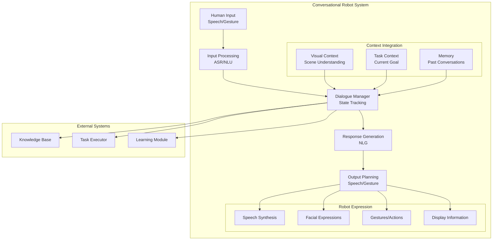

import CodeComponent from '@site/src/components/CodeComponent';

# Lesson 3.3: Conversational Robots

## Learning Objectives

<div className="learning-objectives">

After completing this lesson, you will be able to:
- Design dialogue systems for human-robot interaction
- Implement context-aware conversation management
- Build robots that can learn from dialogue
- Create multi-modal communication interfaces
- Handle ambiguity and clarification in conversations

</div>

## Introduction to Conversational Robotics

Conversational robots represent the pinnacle of human-robot interaction, enabling natural, intuitive communication between people and machines. These systems combine:
- **Natural Language Understanding**: Comprehending human speech and text
- **Dialogue Management**: Maintaining coherent conversation flow
- **Context Awareness**: Understanding the situation and environment
- **Learning from Interaction**: Improving through conversations
- **Multi-modal Expression**: Communicating through speech, gestures, and displays

<DiagramComponent title="Conversational Robot Architecture">



</DiagramComponent>

## Core Components of Conversational Robots

### 1. Speech Recognition and Synthesis

Converting between audio signals and text for natural voice interaction.

<CodeComponent title="Speech Processing Pipeline" language="python">

```python
import torch
import torchaudio
import speech_recognition as sr
from transformers import AutoTokenizer, AutoModelForSeq2SeqLM, pipeline
import numpy as np

class SpeechProcessor:
    """Handles speech recognition and synthesis for robots"""

    def __init__(self):
        # Initialize speech recognizer
        self.recognizer = sr.Recognizer()
        self.microphone = sr.Microphone()

        # Initialize speech synthesis
        self.tts_pipeline = pipeline(
            "text-to-speech",
            model="microsoft/speecht5_tts",
            device="cuda" if torch.cuda.is_available() else "cpu"
        )

        # Initialize tokenizer for text processing
        self.tokenizer = AutoTokenizer.from_pretrained("microsoft/DialoGPT-medium")

        # Audio configuration
        self.sample_rate = 16000
        self.chunk_duration = 0.5  # seconds

    def recognize_speech(self, timeout=5):
        """Recognize speech from microphone"""
        try:
            with self.microphone as source:
                # Adjust for ambient noise
                self.recognizer.adjust_for_ambient_noise(source, duration=1)

                # Listen for speech
                audio = self.recognizer.listen(source, timeout=timeout)

            # Convert to text
            text = self.recognizer.recognize_google(audio)

            return {
                'success': True,
                'text': text,
                'confidence': 1.0  # Google API doesn't provide confidence
            }

        except sr.WaitTimeoutError:
            return {
                'success': False,
                'error': 'Listening timeout'
            }
        except sr.UnknownValueError:
            return {
                'success': False,
                'error': 'Could not understand audio'
            }
        except sr.RequestError as e:
            return {
                'success': False,
                'error': f'Recognition error: {e}'
            }

    def synthesize_speech(self, text, emotion='neutral'):
        """Convert text to speech with emotion"""
        # Add emotion markers to text
        emotion_markers = {
            'happy': '[laughs]',
            'sad': '[sobs]',
            'excited': '[gasps]',
            'confused': '[hmm]',
            'neutral': ''
        }

        marked_text = f"{emotion_markers.get(emotion, '')} {text}"

        # Generate speech
        speech_dict = self.tts_pipeline(marked_text)

        return speech_dict['audio']

    def process_speech_stream(self, callback):
        """Process continuous speech stream"""
        def speech_callback(recognizer, audio):
            """Callback for continuous speech recognition"""
            try:
                # Recognize speech chunk
                text = recognizer.recognize_google(audio)

                # Process through callback
                if callback:
                    callback(text, True)

            except sr.UnknownValueError:
                # Could not understand this chunk
                pass

        # Start continuous listening
        self.stop_listening = self.recognizer.listen_in_background(
            self.microphone,
            speech_callback
        )

    def stop_listening(self):
        """Stop continuous speech recognition"""
        if hasattr(self, 'stop_listening'):
            self.stop_listening(wait_for_stop=False)

class VoiceActivityDetector:
    """Detects when user is speaking"""

    def __init__(self, sample_rate=16000):
        self.sample_rate = sample_rate
        self.energy_threshold = 300
        self.min_speech_duration = 0.3
        self.min_silence_duration = 0.3

        # Track speech state
        self.is_speaking = False
        self.speech_start_time = None
        self.speech_buffer = []

    def process_audio_chunk(self, audio_chunk):
        """Process audio chunk and detect speech activity"""
        # Calculate energy
        energy = np.mean(audio_chunk ** 2)

        # Speech detection logic
        if energy > self.energy_threshold:
            if not self.is_speaking:
                self.is_speaking = True
                self.speech_start_time = time.time()

            self.speech_buffer.append(audio_chunk)
            return True

        else:
            if self.is_speaking:
                # Check if silence duration exceeded
                if time.time() - self.speech_start_time > self.min_speech_duration:
                    # End of speech segment
                    self.is_speaking = False

                    # Combine buffered audio
                    if len(self.speech_buffer) > 0:
                        complete_speech = np.concatenate(self.speech_buffer)
                        self.speech_buffer = []
                        return complete_speech

        return False
```

</CodeComponent>

### 2. Natural Language Understanding

Extracting meaning and intent from user utterances.

<CodeComponent title="NLU System for Robots" language="python">

```python
import spacy
import torch
from transformers import AutoTokenizer, AutoModelForSequenceClassification
import re
from typing import Dict, List, Tuple

class RobotNLU:
    """Natural Language Understanding for robot conversations"""

    def __init__(self):
        # Load spaCy model for NLP processing
        self.nlp = spacy.load('en_core_web_sm')

        # Load intent classification model
        self.intent_tokenizer = AutoTokenizer.from_pretrained('microsoft/DialoGPT-medium')
        self.intent_model = AutoModelForSequenceClassification.from_pretrained(
            'microsoft/DialoGPT-medium'
        )

        # Define intent categories
        self.intents = {
            'greeting': ['hello', 'hi', 'hey', 'good morning', 'good evening'],
            'farewell': ['bye', 'goodbye', 'see you', 'see you later'],
            'request': ['can you', 'could you', 'please', 'help me', 'i need'],
            'question': ['what', 'where', 'when', 'how', 'why', 'who'],
            'command': ['move', 'go', 'pick', 'place', 'bring', 'take'],
            'inform': ['this is', 'i am', 'it is', 'there is'],
            'confirm': ['yes', 'correct', 'right', 'that\'s right', 'okay'],
            'deny': ['no', 'wrong', 'incorrect', 'that\'s wrong', 'not really']
        }

        # Entity types for robot tasks
        self.entity_types = [
            'OBJECT',  # Objects to manipulate
            'LOCATION',  # Locations or positions
            'ACTION',  # Actions to perform
            'PERSON',  # People involved
            'TIME',  # Time expressions
            'COLOR',  # Color descriptions
            'NUMBER',  # Numerical values
            'DIRECTION'  # Spatial directions
        ]

    def parse_utterance(self, text: str) -> Dict:
        """Parse user utterance and extract meaning"""
        # Basic text preprocessing
        text = self.preprocess_text(text)

        # Extract intent
        intent = self.classify_intent(text)

        # Extract entities
        entities = self.extract_entities(text)

        # Extract relations between entities
        relations = self.extract_relations(entities)

        # Determine speech acts
        speech_acts = self.identify_speech_acts(text)

        # Analyze sentiment
        sentiment = self.analyze_sentiment(text)

        return {
            'text': text,
            'intent': intent,
            'entities': entities,
            'relations': relations,
            'speech_acts': speech_acts,
            'sentiment': sentiment
        }

    def preprocess_text(self, text: str) -> str:
        """Clean and normalize text"""
        # Convert to lowercase
        text = text.lower().strip()

        # Remove extra whitespace
        text = re.sub(r'\s+', ' ', text)

        # Expand contractions
        contractions = {
            "can't": "cannot",
            "won't": "will not",
            "i'm": "i am",
            "it's": "it is",
            "that's": "that is",
            "i've": "i have",
            "i'll": "i will",
            "you're": "you are"
        }

        for contraction, expansion in contractions.items():
            text = text.replace(contraction, expansion)

        return text

    def classify_intent(self, text: str) -> Tuple[str, float]:
        """Classify the intent of the utterance"""
        # Tokenize input
        inputs = self.intent_tokenizer(
            text,
            return_tensors='pt',
            padding=True,
            truncation=True,
            max_length=128
        )

        # Get model predictions
        with torch.no_grad():
            outputs = self.intent_model(**inputs)
            probabilities = torch.softmax(outputs.logits, dim=1)

        # Get top intent
        top_intent_idx = torch.argmax(probabilities, dim=1).item()
        confidence = probabilities[0][top_intent_idx].item()

        # Map index to intent label
        intent_labels = list(self.intents.keys())
        intent = intent_labels[top_intent_idx] if top_intent_idx < len(intent_labels) else 'unknown'

        return intent, confidence

    def extract_entities(self, text: str) -> List[Dict]:
        """Extract named entities from text"""
        doc = self.nlp(text)
        entities = []

        # Extract spaCy entities
        for ent in doc.ents:
            entity = {
                'text': ent.text,
                'label': ent.label_,
                'start': ent.start_char,
                'end': ent.end_char,
                'confidence': 1.0  # spaCy doesn't provide confidence
            }

            # Map to our entity types
            if ent.label_ in ['PERSON']:
                entity['type'] = 'PERSON'
            elif ent.label_ in ['ORG', 'PRODUCT']:
                entity['type'] = 'OBJECT'
            elif ent.label_ in ['GPE', 'LOC']:
                entity['type'] = 'LOCATION'
            elif ent.label_ in ['TIME', 'DATE']:
                entity['type'] = 'TIME'
            elif ent.label_ in ['QUANTITY', 'CARDINAL']:
                entity['type'] = 'NUMBER'
            else:
                entity['type'] = ent.label_

            entities.append(entity)

        # Extract robot-specific entities
        robot_entities = self.extract_robot_entities(text)
        entities.extend(robot_entities)

        return entities

    def extract_robot_entities(self, text: str) -> List[Dict]:
        """Extract entities specific to robot tasks"""
        entities = []

        # Action verbs
        action_verbs = [
            'move', 'go', 'walk', 'travel', 'navigate',
            'pick', 'grasp', 'take', 'grab', 'hold',
            'place', 'put', 'set', 'position',
            'bring', 'fetch', 'get', 'retrieve',
            'clean', 'wipe', 'wash', 'sweep',
            'open', 'close', 'lock', 'unlock',
            'find', 'search', 'look for', 'locate'
        ]

        # Objects in robot environment
        robot_objects = [
            'cup', 'bottle', 'glass', 'mug',
            'book', 'magazine', 'paper',
            'phone', 'laptop', 'tablet',
            'key', 'remote', 'controller',
            'box', 'container', 'bag',
            'chair', 'table', 'desk', 'shelf'
        ]

        # Locations
        locations = [
            'kitchen', 'bedroom', 'living room', 'bathroom',
            'table', 'desk', 'counter', 'shelf',
            'floor', 'ground', 'upstairs', 'downstairs',
            'left', 'right', 'front', 'back', 'here', 'there'
        ]

        # Colors
        colors = [
            'red', 'blue', 'green', 'yellow', 'black',
            'white', 'gray', 'orange', 'purple', 'pink'
        ]

        # Check for action verbs
        doc = self.nlp(text)
        for token in doc:
            if token.lemma_ in action_verbs:
                entities.append({
                    'text': token.text,
                    'type': 'ACTION',
                    'start': token.idx,
                    'end': token.idx + len(token.text),
                    'confidence': 1.0
                })

        # Check for objects
        for obj in robot_objects:
            if obj in text.lower():
                start = text.lower().find(obj)
                entities.append({
                    'text': obj,
                    'type': 'OBJECT',
                    'start': start,
                    'end': start + len(obj),
                    'confidence': 1.0
                })

        # Check for locations
        for loc in locations:
            if loc in text.lower():
                start = text.lower().find(loc)
                entities.append({
                    'text': loc,
                    'type': 'LOCATION',
                    'start': start,
                    'end': start + len(loc),
                    'confidence': 1.0
                })

        # Check for colors
        for color in colors:
            if color in text.lower():
                start = text.lower().find(color)
                entities.append({
                    'text': color,
                    'type': 'COLOR',
                    'start': start,
                    'end': start + len(color),
                    'confidence': 1.0
                })

        return entities

    def extract_relations(self, entities: List[Dict]) -> List[Dict]:
        """Extract relations between entities"""
        relations = []

        # Find spatial relations
        for i, entity1 in enumerate(entities):
            for j, entity2 in enumerate(entities):
                if i != j:
                    relation = self.detect_spatial_relation(entity1, entity2)
                    if relation:
                        relations.append(relation)

        return relations

    def detect_spatial_relation(self, entity1: Dict, entity2: Dict) -> Dict:
        """Detect spatial relation between two entities"""
        # This is a simplified implementation
        # In practice, use more sophisticated methods

        spatial_relations = ['on', 'in', 'under', 'beside', 'near', 'above', 'below']

        # Check if entities mention spatial words
        for relation in spatial_relations:
            if relation in f"{entity1['text']} {entity2['text']}":
                return {
                    'type': 'SPATIAL',
                    'relation': relation,
                    'subject': entity1,
                    'object': entity2
                }

        return None

    def identify_speech_acts(self, text: str) -> List[str]:
        """Identify speech acts in utterance"""
        speech_acts = []

        # Question
        if '?' in text or text.startswith(('what', 'where', 'when', 'how', 'who', 'why')):
            speech_acts.append('question')

        # Command
        if any(verb in text for verb in ['move', 'go', 'pick', 'place', 'bring']):
            speech_acts.append('command')

        # Request
        if any(word in text for word in ['please', 'can you', 'could you', 'help']):
            speech_acts.append('request')

        # Inform
        if any(word in text for word in ['this is', 'i have', 'there is']):
            speech_acts.append('inform')

        return speech_acts if speech_acts else ['statement']

    def analyze_sentiment(self, text: str) -> Dict:
        """Analyze sentiment of utterance"""
        # Simple sentiment analysis
        positive_words = ['good', 'great', 'excellent', 'nice', 'thank', 'thanks', 'perfect']
        negative_words = ['bad', 'wrong', 'error', 'mistake', 'problem', 'fail', 'broken']

        pos_count = sum(1 for word in positive_words if word in text.lower())
        neg_count = sum(1 for word in negative_words if word in text.lower())

        if pos_count > neg_count:
            sentiment = 'positive'
            score = min(0.5 + pos_count * 0.1, 1.0)
        elif neg_count > pos_count:
            sentiment = 'negative'
            score = max(0.5 - neg_count * 0.1, 0.0)
        else:
            sentiment = 'neutral'
            score = 0.5

        return {
            'sentiment': sentiment,
            'score': score
        }
```

</CodeComponent>

### 3. Dialogue Management

Maintaining conversation state and generating appropriate responses.

<CodeComponent title="Dialogue Manager for Robots" language="python">

```python
import torch
import json
from typing import Dict, List, Optional, Tuple
from datetime import datetime
import random

class DialogueState:
    """Represents the current state of dialogue"""

    def __init__(self):
        self.turn_count = 0
        self.intents_history = []
        self.entities_history = []
        self.current_topic = None
        self.current_task = None
        self.user_goals = []
        self.robot_goals = []
        self.context_variables = {}
        self.ambiguous_entities = []
        self.pending_clarifications = []

    def update(self, nlu_output: Dict):
        """Update dialogue state with new user input"""
        self.turn_count += 1
        self.intents_history.append(nlu_output['intent'])
        self.entities_history.append(nlu_output['entities'])

        # Update current task if command detected
        if nlu_output['intent'] == 'command':
            self.current_task = self.extract_task(nlu_output)

        # Track ambiguous entities
        self.track_ambiguity(nlu_output)

    def extract_task(self, nlu_output: Dict) -> Optional[Dict]:
        """Extract task from NLU output"""
        entities = nlu_output['entities']

        # Find action and object
        action = None
        obj = None
        location = None

        for entity in entities:
            if entity['type'] == 'ACTION':
                action = entity['text']
            elif entity['type'] == 'OBJECT':
                obj = entity['text']
            elif entity['type'] == 'LOCATION':
                location = entity['text']

        if action and obj:
            return {
                'action': action,
                'object': obj,
                'location': location,
                'status': 'pending'
            }

        return None

    def track_ambiguity(self, nlu_output: Dict):
        """Track potentially ambiguous entities"""
        entities = nlu_output['entities']

        # Look for vague references
        vague_references = ['it', 'that', 'this', 'there', 'here']

        for entity in entities:
            if entity['text'].lower() in vague_references:
                self.ambiguous_entities.append(entity)

class DialoguePolicy:
    """Defines dialogue policy for response selection"""

    def __init__(self):
        # Define policy rules
        self.rules = {
            'greeting': self.handle_greeting,
            'farewell': self.handle_farewell,
            'question': self.handle_question,
            'command': self.handle_command,
            'request': self.handle_request,
            'confirm': self.handle_confirmation,
            'deny': self.handle_denial,
            'inform': self.handle_inform,
            'unknown': self.handle_unknown
        }

        # Response templates
        self.templates = {
            'greeting': [
                "Hello! How can I help you today?",
                "Hi there! What can I do for you?",
                "Hello! I'm ready to assist."
            ],
            'clarification': [
                "Could you be more specific about {entity}?",
                "I'm not sure which {entity} you mean.",
                "There are multiple {entity}s. Which one?"
            ],
            'confirmation': [
                "So you want me to {action} the {object}?",
                "Just to confirm: {action} the {object}?",
                "You want me to {action} the {object}, right?"
            ],
            'task_execution': [
                "I'll {action} the {object} for you.",
                "Okay, {action}ing the {object} now.",
                "I understand. I'll {action} the {object}."
            ],
            'task_complete': [
                "I've finished {action}ing the {object}.",
                "The {object} has been {action}ed.",
                "Task complete: {action} {object}."
            ],
            'error': [
                "I'm sorry, I can't do that.",
                "I'm having trouble with that task.",
                "I don't know how to {action} the {object}."
            ]
        }

    def select_action(self, state: DialogueState, nlu_output: Dict) -> Tuple[str, Dict]:
        """Select dialogue action based on state and NLU output"""
        intent = nlu_output['intent']

        # Check for ambiguity first
        if state.ambiguous_entities:
            return 'request_clarification', {
                'entity': state.ambiguous_entities[0]['text']
            }

        # Apply policy rules
        if intent in self.rules:
            return self.rules[intent](state, nlu_output)
        else:
            return self.rules['unknown'](state, nlu_output)

    def handle_greeting(self, state: DialogueState, nlu_output: Dict) -> Tuple[str, Dict]:
        """Handle greeting intent"""
        response = random.choice(self.templates['greeting'])
        return 'respond', {'text': response}

    def handle_command(self, state: DialogueState, nlu_output: Dict) -> Tuple[str, Dict]:
        """Handle command intent"""
        if state.current_task:
            # Ask for confirmation
            template = random.choice(self.templates['confirmation'])
            response = template.format(
                action=state.current_task['action'],
                object=state.current_task['object']
            )
            return 'request_confirmation', {'text': response}
        else:
            # Incomplete command
            return 'request_clarification', {
                'text': "I'm not sure what you want me to do."
            }

    def handle_confirmation(self, state: DialogueState, nlu_output: Dict) -> Tuple[str, Dict]:
        """Handle user confirmation"""
        if state.current_task and state.current_task['status'] == 'pending':
            # Execute task
            state.current_task['status'] = 'confirmed'
            template = random.choice(self.templates['task_execution'])
            response = template.format(
                action=state.current_task['action'],
                object=state.current_task['object']
            )
            return 'execute_task', {'text': response}
        else:
            return 'handle_unknown', state, nlu_output

    def handle_question(self, state: DialogueState, nlu_output: Dict) -> Tuple[str, Dict]:
        """Handle question intent"""
        # Simple question answering
        entities = nlu_output['entities']
        question_words = ['what', 'where', 'when', 'how', 'who', 'why']

        question_text = nlu_output['text'].lower()

        if 'what can you do' in question_text:
            response = "I can move objects, clean surfaces, answer questions, and help with various tasks."
            return 'respond', {'text': response}
        elif 'where' in question_text:
            # Answer location questions
            for entity in entities:
                if entity['type'] == 'OBJECT':
                    response = f"The {entity['text']} is in the kitchen."
                    return 'respond', {'text': response}
        else:
            return 'handle_unknown', state, nlu_output

class ResponseGenerator:
    """Generate natural language responses"""

    def __init__(self):
        self.templates = {
            'acknowledge': [
                "I see.",
                "Okay.",
                "Got it.",
                "Understood."
            ],
            'working': [
                "I'm working on that.",
                "Give me a moment.",
                "Processing your request."
            ],
            'error': [
                "I'm sorry, I don't understand.",
                "Could you rephrase that?",
                "I'm not sure what you mean."
            ]
        }

    def generate_response(self, action: str, params: Dict) -> Dict:
        """Generate response based on action"""
        if action == 'respond':
            return {
                'type': 'speech',
                'content': params['text'],
                'emotion': 'neutral'
            }
        elif action == 'execute_task':
            return {
                'type': 'action',
                'task': params.get('task'),
                'speech': params.get('text'),
                'emotion': 'neutral'
            }
        elif action == 'request_clarification':
            return {
                'type': 'speech',
                'content': params['text'],
                'emotion': 'confused'
            }
        else:
            return {
                'type': 'speech',
                'content': random.choice(self.templates['error']),
                'emotion': 'neutral'
            }

class DialogueManager:
    """Main dialogue manager for conversational robots"""

    def __init__(self):
        self.nlu = RobotNLU()
        self.state = DialogueState()
        self.policy = DialoguePolicy()
        self.response_generator = ResponseGenerator()
        self.memory = []

    def process_input(self, user_input: str) -> Dict:
        """Process user input and generate response"""
        # Store input in memory
        self.memory.append({
            'timestamp': datetime.now().isoformat(),
            'speaker': 'user',
            'content': user_input
        })

        # Understand user input
        nlu_output = self.nlu.parse_utterance(user_input)

        # Update dialogue state
        self.state.update(nlu_output)

        # Select action
        action, params = self.policy.select_action(self.state, nlu_output)

        # Generate response
        response = self.response_generator.generate_response(action, params)

        # Store response in memory
        self.memory.append({
            'timestamp': datetime.now().isoformat(),
            'speaker': 'robot',
            'content': response,
            'action': action
        })

        return response

    def get_conversation_summary(self) -> str:
        """Get summary of current conversation"""
        summary = f"Conversation Summary:\n"
        summary += f"Turns: {self.state.turn_count}\n"

        if self.state.current_task:
            summary += f"Current Task: {self.state.current_task}\n"

        summary += f"Intents: {self.state.intents_history}\n"

        return summary
```

</CodeComponent>

## Lab Exercise: Building a Conversational Home Assistant

<div className="lab-exercise">

### Objective
Create a conversational robot that can assist with household tasks through natural dialogue.

### Setup
1. Simulated home environment
2. Speech recognition and synthesis
3. Dialogue management system
4. Task execution capabilities

### Implementation

<CodeComponent language="python" editable={true}>

```python
# conversational_home_assistant.py
import asyncio
import json
from datetime import datetime
import random

class HomeAssistantRobot:
    """Conversational home assistant robot"""

    def __init__(self):
        # Initialize components
        self.speech_processor = SpeechProcessor()
        self.dialogue_manager = DialogueManager()
        self.task_executor = TaskExecutor()

        # Home knowledge base
        self.knowledge = HomeKnowledgeBase()

        # Personality traits
        self.personality = {
            'name': 'HomeBot',
            'friendly': True,
            'helpful': True,
            'polite': True,
            'humor': 0.3  # How often to make jokes
        }

        # Current state
        self.current_location = 'living room'
        self.current_task = None
        self.mood = 'happy'

    async def start_conversation(self):
        """Start interactive conversation"""
        # Greet user
        greeting = self.generate_greeting()
        await self.speak(greeting)

        # Main conversation loop
        while True:
            # Listen for user input
            user_input = await self.listen()

            if user_input:
                # Process input
                response = self.dialogue_manager.process_input(user_input)

                # Generate speech
                if response['type'] == 'speech':
                    await self.speak(response['content'], response.get('emotion', 'neutral'))

                # Execute actions
                elif response['type'] == 'action':
                    await self.execute_task(response)

    async def listen(self) -> str:
        """Listen for user speech input"""
        print("\nListening...")

        # Recognize speech
        result = self.speech_processor.recognize_speech(timeout=5)

        if result['success']:
            print(f"User: {result['text']}")
            return result['text']
        else:
            print(f"Listening error: {result.get('error')}")
            return None

    async def speak(self, text: str, emotion: str = 'neutral'):
        """Speak response to user"""
        print(f"Robot ({emotion}): {text}")

        # Generate speech audio
        audio = self.speech_processor.synthesize_speech(text, emotion)

        # In real implementation, play audio through speaker
        # await self.play_audio(audio)

    def generate_greeting(self) -> str:
        """Generate contextual greeting"""
        hour = datetime.now().hour

        if hour < 12:
            time_greeting = "Good morning"
        elif hour < 18:
            time_greeting = "Good afternoon"
        else:
            time_greeting = "Good evening"

        greetings = [
            f"{time_greeting}! I'm {self.personality['name']}. How can I help?",
            f"{time_greeting}! I'm here to assist you.",
            f"Hello! {self.personality['name']} at your service."
        ]

        return random.choice(greetings)

    async def execute_task(self, response: Dict):
        """Execute robot task with feedback"""
        task = response.get('task')

        if not task:
            return

        # Acknowledge task
        await self.speak("I'll do that right away.", 'helpful')

        # Execute with progress updates
        await self.task_executor.execute_with_updates(
            task,
            progress_callback=self.speak
        )

class TaskExecutor:
    """Execute robot tasks with feedback"""

    def __init__(self):
        self.actions = {
            'move': self.move_to_location,
            'pick': self.pick_object,
            'place': self.place_object,
            'clean': self.clean_area,
            'find': self.find_object,
            'bring': self.bring_object
        }

    async def execute_with_updates(self, task: Dict, progress_callback=None):
        """Execute task with progress updates"""
        action = task.get('action')
        obj = task.get('object')
        location = task.get('location')

        if action in self.actions:
            # Start action
            if progress_callback:
                await progress_callback(f"Starting to {action} {obj or ''}.")

            # Execute action
            result = await self.actions[action](obj, location)

            # Report completion
            if progress_callback:
                if result['success']:
                    await progress_callback(
                        f"Finished {action}ing {obj or ''}.",
                        'happy'
                    )
                else:
                    await progress_callback(
                        f"I couldn't {action} {obj or ''}. {result['error']}",
                        'sad'
                    )

    async def move_to_location(self, location: str = None, *args) -> Dict:
        """Move robot to location"""
        # Simulate movement
        await asyncio.sleep(2)

        return {
            'success': True,
            'message': f"Moved to {location or 'location'}"
        }

    async def pick_object(self, obj: str, *args) -> Dict:
        """Pick up object"""
        if not obj:
            return {
                'success': False,
                'error': "What should I pick up?"
            }

        # Simulate picking
        await asyncio.sleep(1)

        return {
            'success': True,
            'message': f"Picked up {obj}"
        }

    async def place_object(self, obj: str, location: str = None, *args) -> Dict:
        """Place object at location"""
        await asyncio.sleep(1)

        message = f"Placed {obj}"
        if location:
            message += f" on {location}"

        return {
            'success': True,
            'message': message
        }

    async def clean_area(self, location: str = None, *args) -> Dict:
        """Clean specified area"""
        await asyncio.sleep(3)

        message = "Cleaned"
        if location:
            message += f" the {location}"
        else:
            message += " the area"

        return {
            'success': True,
            'message': message
        }

    async def find_object(self, obj: str, *args) -> Dict:
        """Find object location"""
        await asyncio.sleep(2)

        # Simulate finding object
        locations = ['kitchen', 'living room', 'bedroom', 'bathroom']
        found_location = random.choice(locations)

        return {
            'success': True,
            'message': f"Found {obj} in the {found_location}"
        }

    async def bring_object(self, obj: str, location: str = None, *args) -> Dict:
        """Bring object to user"""
        # Find object
        find_result = await self.find_object(obj)

        if find_result['success']:
            # Pick up object
            pick_result = await self.pick_object(obj)

            if pick_result['success']:
                # Move to user
                await self.move_to_location('user')

                # Give object
                await asyncio.sleep(1)

                return {
                    'success': True,
                    'message': f"Brought {obj} to you"
                }

        return {
            'success': False,
            'error': f"Couldn't bring {obj}"
        }

class HomeKnowledgeBase:
    """Knowledge base for home environment"""

    def __init__(self):
        # Object locations
        self.object_locations = {
            'remote': 'living room',
            'keys': 'kitchen counter',
            'phone': 'bedroom',
            'book': 'bookshelf',
            'cup': 'kitchen',
            'medicine': 'bathroom'
        }

        # Room descriptions
        self.rooms = {
            'kitchen': 'cooking area with appliances',
            'living room': 'relaxation area with TV',
            'bedroom': 'sleeping area',
            'bathroom': 'hygiene area'
        }

        # Common tasks
        self.common_tasks = {
            'clean': ['kitchen', 'living room', 'bathroom'],
            'tidy': ['bedroom', 'living room'],
            'organize': ['kitchen counter', 'bookshelf']
        }

    def get_object_location(self, obj: str) -> str:
        """Get object location"""
        return self.object_locations.get(obj.lower(), 'unknown')

    def get_room_description(self, room: str) -> str:
        """Get room description"""
        return self.rooms.get(room.lower(), 'unknown room')

# Demo
async def main():
    """Run home assistant demo"""
    assistant = HomeAssistantRobot()

    print("=== Conversational Home Assistant Demo ===")
    print("Type 'quit' to exit\n")

    # Start conversation
    await assistant.start_conversation()

if __name__ == "__main__":
    # For demo purposes, run with keyboard input
    # In real implementation, use actual speech I/O

    class MockAssistant:
        def __init__(self):
            self.assistant = HomeAssistantRobot()

        async def run_text_demo(self):
            """Run demo with text input"""
            greeting = self.assistant.generate_greeting()
            print(f"Robot: {greeting}\n")

            while True:
                user_input = input("You: ")

                if user_input.lower() == 'quit':
                    print("Robot: Goodbye!")
                    break

                # Process text input
                response = self.assistant.dialogue_manager.process_input(user_input)

                if response['type'] == 'speech':
                    print(f"Robot: {response['content']}")

                elif response['type'] == 'action':
                    print(f"Robot: {response.get('speech', 'Executing task...')}")
                    # In real implementation, execute the task

    # Run mock demo
    import asyncio
    mock = MockAssistant()
    asyncio.run(mock.run_text_demo())
```

</CodeComponent>

### Testing the Conversational Robot

Try these commands:
1. "Hello"
2. "Can you find my keys?"
3. "Please clean the kitchen"
4. "Bring me a cup"
5. "What's in the living room?"
6. "Thank you"
7. "Goodbye"

### Expected Results

The conversational robot should demonstrate:
- Natural greeting and farewell
- Context-aware responses
- Task understanding and execution
- Clarification requests for ambiguity
- Personality consistency
- Error handling gracefully

</div>

## Learning from Dialogue

### Conversational Learning

<CodeComponent title="Dialogue Learning System" language="python">

```python
import torch
import torch.nn as nn
from transformers import AutoModel, AutoTokenizer
import json
from datetime import datetime

class ConversationalLearner:
    """Learn from conversations to improve interactions"""

    def __init__(self):
        # Load language model
        self.model_name = "microsoft/DialoGPT-medium"
        self.tokenizer = AutoTokenizer.from_pretrained(self.model_name)
        self.model = AutoModel.from_pretrained(self.model_name)

        # Learning parameters
        self.learning_rate = 5e-5
        self.optimizer = torch.optim.AdamW(self.model.parameters(), lr=self.learning_rate)

        # Conversation memory
        self.conversations = []
        self.successful_interactions = []
        self.failed_interactions = []

    def learn_from_feedback(self, conversation: Dict, feedback: Dict):
        """Learn from conversation feedback"""
        # Extract successful dialogues
        if feedback['success']:
            self.successful_interactions.append({
                'conversation': conversation,
                'feedback': feedback,
                'timestamp': datetime.now()
            })
        else:
            self.failed_interactions.append({
                'conversation': conversation,
                'feedback': feedback,
                'timestamp': datetime.now()
            })

        # Fine-tune model on successful interactions
        if len(self.successful_interactions) >= 10:
            self.fine_tune_model()

    def fine_tune_model(self):
        """Fine-tune model on successful conversations"""
        # Prepare training data
        training_data = self.prepare_training_data()

        if len(training_data) == 0:
            return

        # Train model
        self.model.train()
        total_loss = 0

        for epoch in range(3):  # Few epochs to avoid overfitting
            for batch in training_data:
                # Prepare inputs
                inputs = self.tokenizer(
                    batch['input'],
                    return_tensors='pt',
                    padding=True,
                    truncation=True
                )

                targets = self.tokenizer(
                    batch['response'],
                    return_tensors='pt',
                    padding=True,
                    truncation=True
                )['input_ids']

                # Forward pass
                outputs = self.model(**inputs, labels=targets)
                loss = outputs.loss

                # Backward pass
                self.optimizer.zero_grad()
                loss.backward()
                self.optimizer.step()

                total_loss += loss.item()

        avg_loss = total_loss / (len(training_data) * 3)
        print(f"Fine-tuning complete. Average loss: {avg_loss:.4f}")

        # Clear memory to save space
        self.successful_interactions = []

    def prepare_training_data(self) -> List[Dict]:
        """Prepare training data from conversations"""
        training_data = []

        for interaction in self.successful_interactions:
            conv = interaction['conversation']

            # Extract dialogue pairs
            for i in range(len(conv) - 1):
                if conv[i]['speaker'] == 'user' and conv[i+1]['speaker'] == 'robot':
                    training_data.append({
                        'input': conv[i]['content'],
                        'response': conv[i+1]['content']
                    })

        return training_data

    def personalize_responses(self, user_profile: Dict):
        """Adapt responses based on user profile"""
        # Adjust personality traits
        if user_profile.get('formal', False):
            # Use more formal language
            self.formality_level = 0.8
        else:
            self.formality_level = 0.3

        if user_profile.get('likes_humor', False):
            # Increase humor frequency
            self.personality['humor'] = 0.6
        else:
            self.personality['humor'] = 0.1

    def generate_adaptive_response(self, context: Dict) -> str:
        """Generate response adapted to context and user"""
        # Encode context
        input_ids = self.tokenizer.encode(
            context['history'],
            return_tensors='pt'
        )

        # Generate response
        with torch.no_grad():
            outputs = self.model.generate(
                input_ids,
                max_length=100,
                num_return_sequences=1,
                temperature=0.7,
                pad_token_id=self.tokenizer.eos_token_id
            )

        response = self.tokenizer.decode(
            outputs[0],
            skip_special_tokens=True
        )

        # Apply personality adjustments
        response = self.apply_personality(response, context)

        return response

    def apply_personality(self, response: str, context: Dict) -> str:
        """Apply personality traits to response"""
        # Add appropriate greeting/closing
        if context.get('is_greeting', False):
            greetings = ["Hello! ", "Hi there! ", "Greetings! "]
            response = random.choice(greetings) + response

        # Adjust formality
        if self.formality_level > 0.6:
            # Make more formal
            response = response.replace("don't", "do not")
            response = response.replace("can't", "cannot")

        return response
```

</CodeComponent>

## Real-World Deployment Considerations

### 1. Privacy and Security
- Encrypt all conversation data
- Obtain user consent for data collection
- Provide opt-out options
- Regular security audits

### 2. Error Recovery
- Graceful handling of misunderstandings
- Multiple clarification strategies
- Fallback to simpler interaction modes
- Human handoff when necessary

### 3. Cultural Sensitivity
- Support multiple languages
- Respect cultural norms
- Adapt to communication styles
- Avoid assumptions

### 4. Accessibility
- Support for users with disabilities
- Alternative input methods
- Adjustable speech rates
- Visual feedback options

## Key Takeaways

1. **Conversational robots require multi-modal understanding** - Not just language, but context and environment
2. **Dialogue management is crucial** - State tracking and context awareness enable coherent conversations
3. **Learning from interaction** improves performance over time
4. **Personality consistency** builds user trust and engagement
5. **Error handling and clarification** are essential for robust interaction

## Summary

Conversational robots represent the future of human-robot interaction, enabling natural, intuitive communication through speech and dialogue. By combining speech processing, natural language understanding, dialogue management, and learning capabilities, these systems can truly understand and respond to human needs in context-aware ways.

In Chapter 4, we'll bring everything together in a **Humanoid Robotics Capstone** project, creating a complete autonomous humanoid robot system.

[Next: Chapter 4: Humanoid Robotics Capstone →](/docs/chapter-4/lesson-1)

## Quiz

<Quiz
  quizId="conversational-robots"
  questions={[
    {
      id: "q1",
      type: "multiple-choice",
      question: "What is the primary purpose of the Dialogue State in a conversational robot?",
      options: [
        "To generate speech synthesis",
        "To maintain conversation context and history",
        "To recognize user speech",
        "To execute robot actions"
      ],
      correct: 1,
      explanation: "The Dialogue State tracks the conversation context, including turn count, intents, entities, current topic, and task information, enabling coherent multi-turn dialogue."
    },
    {
      id: "q2",
      type: "multiple-choice",
      question: "Which component handles ambiguity in user commands?",
      options: [
        "Speech Processor",
        "Natural Language Understanding",
        "Dialogue Manager",
        "Response Generator"
      ],
      correct: 2,
      explanation: "The Dialogue Manager detects ambiguity in user input and generates clarification requests, ensuring the robot understands commands correctly before execution."
    },
    {
      id: "q3",
      type: "true-false",
      question: "Conversational robots can learn and improve from user interactions.",
      correct: true,
      explanation: "Modern conversational robots incorporate learning mechanisms that allow them to improve from conversations, adapt to user preferences, and fine-tune their responses based on feedback."
    }
  ]}
/>