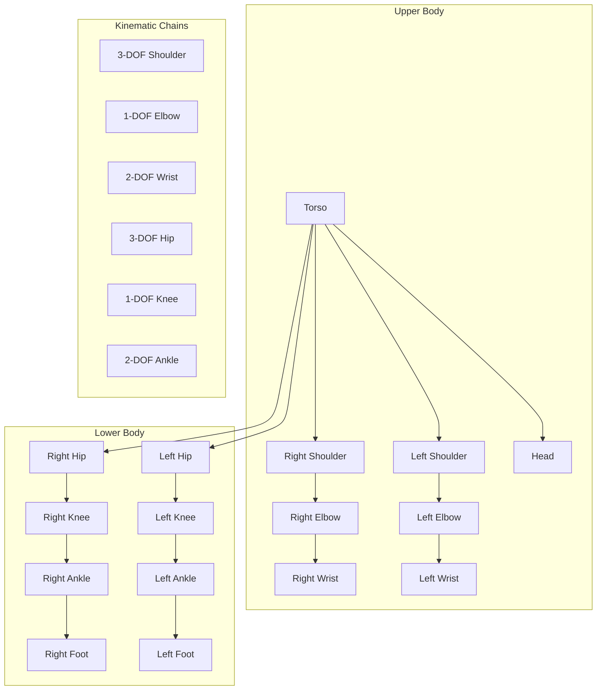

import CodeComponent from '@site/src/components/CodeComponent';

# Lesson 4.1: Humanoid Robot Kinematics

## Learning Objectives

<div className="learning-objectives">

After completing this lesson, you will be able to:
- Derive forward and inverse kinematics for humanoid robots
- Implement Denavit-Hartenberg (DH) parameters for robot arms and legs
- Solve kinematic equations for complex joint chains
- Understand singularities and workspace constraints
- Apply kinematic control to humanoid robot locomotion

</div>

## Introduction to Humanoid Kinematics

Humanoid robots require sophisticated kinematic models to achieve human-like movement. With over 30 degrees of freedom, these systems represent some of the most complex kinematic chains in robotics.

<DiagramComponent title="Humanoid Robot Kinematic Structure">



</DiagramComponent>

## Mathematical Foundations

### 1. Homogeneous Transformations

Homogeneous transforms combine rotation and translation in 4x4 matrices.

<CodeComponent title="Homogeneous Transform Implementation" language="python">

```python
import numpy as np
from typing import Tuple, List

class HomogeneousTransform:
    """4x4 homogeneous transformation matrix operations"""

    @staticmethod
    def create_rotation_x(theta: float) -> np.ndarray:
        """Create rotation matrix around X axis"""
        c, s = np.cos(theta), np.sin(theta)
        return np.array([
            [1, 0, 0, 0],
            [0, c, -s, 0],
            [0, s, c, 0],
            [0, 0, 0, 1]
        ])

    @staticmethod
    def create_rotation_y(theta: float) -> np.ndarray:
        """Create rotation matrix around Y axis"""
        c, s = np.cos(theta), np.sin(theta)
        return np.array([
            [c, 0, s, 0],
            [0, 1, 0, 0],
            [-s, 0, c, 0],
            [0, 0, 0, 1]
        ])

    @staticmethod
    def create_rotation_z(theta: float) -> np.ndarray:
        """Create rotation matrix around Z axis"""
        c, s = np.cos(theta), np.sin(theta)
        return np.array([
            [c, -s, 0, 0],
            [s, c, 0, 0],
            [0, 0, 1, 0],
            [0, 0, 0, 1]
        ])

    @staticmethod
    def create_translation(x: float, y: float, z: float) -> np.ndarray:
        """Create translation matrix"""
        return np.array([
            [1, 0, 0, x],
            [0, 1, 0, y],
            [0, 0, 1, z],
            [0, 0, 0, 1]
        ])

    @staticmethod
    def from_rpy(roll: float, pitch: float, yaw: float,
                 x: float = 0, y: float = 0, z: float = 0) -> np.ndarray:
        """Create transform from roll-pitch-yaw angles"""
        Rx = HomogeneousTransform.create_rotation_x(roll)
        Ry = HomogeneousTransform.create_rotation_y(pitch)
        Rz = HomogeneousTransform.create_rotation_z(yaw)
        T = HomogeneousTransform.create_translation(x, y, z)

        return T @ Rz @ Ry @ Rx

    @staticmethod
    def decompose(T: np.ndarray) -> Tuple[np.ndarray, np.ndarray]:
        """Decompose transform into rotation and translation"""
        R = T[:3, :3]
        t = T[:3, 3]
        return R, t

    @staticmethod
    def to_rpy(T: np.ndarray) -> Tuple[float, float, float]:
        """Convert transform to roll-pitch-yaw angles"""
        R = T[:3, :3]

        # Extract Euler angles (ZYX convention)
        if abs(R[2, 0]) != 1:
            pitch = -np.arcsin(R[2, 0])
            cos_pitch = np.cos(pitch)
            roll = np.arctan2(R[2, 1] / cos_pitch, R[2, 2] / cos_pitch)
            yaw = np.arctan2(R[1, 0] / cos_pitch, R[0, 0] / cos_pitch)
        else:
            # Gimbal lock case
            yaw = 0
            if R[2, 0] == -1:
                pitch = np.pi / 2
                roll = np.arctan2(R[0, 1], R[0, 2])
            else:
                pitch = -np.pi / 2
                roll = np.arctan2(-R[0, 1], -R[0, 2])

        return roll, pitch, yaw
```

</CodeComponent>

### 2. Denavit-Hartenberg Parameters

DH parameters provide a systematic way to describe kinematic chains.

<CodeComponent title="DH Parameter System" language="python">

```python
import numpy as np
from typing import List, Dict

class DHParameter:
    """Denavit-Hartenberg parameter for a single joint"""
    def __init__(self, a: float, alpha: float, d: float, theta: float,
                 joint_type: str = 'revolute'):
        self.a = a  # Link length (distance along X)
        self.alpha = alpha  # Link twist (rotation around X)
        self.d = d  # Link offset (distance along Z)
        self.theta = theta  # Joint angle (rotation around Z)
        self.joint_type = joint_type  # 'revolute' or 'prismatic'

    def get_transformation(self, q: float = None) -> np.ndarray:
        """Get transformation matrix for this joint"""
        if self.joint_type == 'revolute':
            theta = self.theta + q if q is not None else self.theta
            d = self.d
        else:  # prismatic
            theta = self.theta
            d = self.d + q if q is not None else self.d

        # DH transformation matrix
        ct = np.cos(theta)
        st = np.sin(theta)
        ca = np.cos(self.alpha)
        sa = np.sin(self.alpha)

        return np.array([
            [ct, -st*ca, st*sa, self.a*ct],
            [st, ct*ca, -ct*sa, self.a*st],
            [0, sa, ca, d],
            [0, 0, 0, 1]
        ])

class KinematicChain:
    """Kinematic chain using DH parameters"""

    def __init__(self):
        self.dh_parameters: List[DHParameter] = []
        self.num_joints = 0

    def add_joint(self, a: float, alpha: float, d: float, theta: float,
                  joint_type: str = 'revolute'):
        """Add a joint to the kinematic chain"""
        self.dh_parameters.append(
            DHParameter(a, alpha, d, theta, joint_type)
        )
        self.num_joints += 1

    def forward_kinematics(self, q: np.ndarray) -> np.ndarray:
        """Calculate forward kinematics"""
        if len(q) != self.num_joints:
            raise ValueError(f"Expected {self.num_joints} joint values, got {len(q)}")

        T = np.eye(4)

        for i, dh_param in enumerate(self.dh_parameters):
            T = T @ dh_param.get_transformation(q[i])

        return T

    def get_jacobian(self, q: np.ndarray) -> np.ndarray:
        """Calculate the geometric Jacobian"""
        J = np.zeros((6, self.num_joints))

        # Forward kinematics for each joint
        T_base_to_ee = np.eye(4)
        T_list = [T_base_to_ee]

        for i, dh_param in enumerate(self.dh_parameters):
            T_joint = dh_param.get_transformation(q[i])
            T_base_to_ee = T_base_to_ee @ T_joint
            T_list.append(T_base_to_ee.copy())

        T_ee = T_list[-1]
        p_ee = T_ee[:3, 3]
        z_ee = T_ee[:3, 2]

        # Calculate Jacobian columns
        for i in range(self.num_joints):
            T_i_to_ee = np.linalg.inv(T_list[i]) @ T_ee
            p_i_to_ee = T_i_to_ee[:3, 3]
            z_i = T_list[i][:3, 2]

            if self.dh_parameters[i].joint_type == 'revolute':
                # Linear velocity
                J[:3, i] = np.cross(z_i, p_ee - T_list[i][:3, 3])
                # Angular velocity
                J[3:, i] = z_i
            else:  # prismatic
                # Linear velocity
                J[:3, i] = z_i
                # Angular velocity
                J[3:, i] = np.zeros(3)

        return J

class HumanoidKinematics:
    """Complete humanoid robot kinematics"""

    def __init__(self):
        # Initialize kinematic chains for each limb
        self.left_arm = KinematicChain()
        self.right_arm = KinematicChain()
        self.left_leg = KinematicChain()
        self.right_leg = KinematicChain()
        self.head = KinematicChain()

        self.setup_humanoid_dh()

    def setup_humanoid_dh(self):
        """Set up DH parameters for humanoid robot"""
        # Left arm (3 DOF shoulder + 1 DOF elbow + 2 DOF wrist)
        self.left_arm.add_joint(0,  np.pi/2, 0.2, 0)      # Shoulder pitch
        self.left_arm.add_joint(0.05,  np.pi/2, 0,  np.pi/2)  # Shoulder roll
        self.left_arm.add_joint(0.25,  0,      0, 0)      # Shoulder yaw
        self.left_arm.add_joint(0.25,  0,      0, 0)      # Elbow
        self.left_arm.add_joint(0,   -np.pi/2, 0.1, 0)      # Wrist pitch
        self.left_arm.add_joint(0,   np.pi/2,  0, 0)      # Wrist roll

        # Right arm (mirrored)
        self.right_arm.add_joint(0,  np.pi/2, 0.2, 0)      # Shoulder pitch
        self.right_arm.add_joint(-0.05, np.pi/2, 0, -np.pi/2) # Shoulder roll
        self.right_arm.add_joint(0.25,  0,      0, 0)      # Shoulder yaw
        self.right_arm.add_joint(0.25,  0,      0, 0)      # Elbow
        self.right_arm.add_joint(0,   -np.pi/2, 0.1, 0)      # Wrist pitch
        self.right_arm.add_joint(0,   np.pi/2,  0, 0)      # Wrist roll

        # Left leg (3 DOF hip + 1 DOF knee + 2 DOF ankle)
        self.left_leg.add_joint(0,  np.pi/2, 0, 0)      # Hip yaw
        self.left_leg.add_joint(0,  np.pi/2, 0, np.pi/2)  # Hip roll
        self.left_leg.add_joint(0.1, 0,      0, 0)      # Hip pitch
        self.left_leg.add_joint(-0.3, 0,      0, 0)      # Knee
        self.left_leg.add_joint(0,  -np.pi/2, 0, 0)      # Ankle pitch
        self.left_leg.add_joint(0,   np.pi/2,  0.05, 0)   # Ankle roll

        # Right leg (mirrored)
        self.right_leg.add_joint(0,  np.pi/2, 0, 0)      # Hip yaw
        self.right_leg.add_joint(0,  np.pi/2, 0, -np.pi/2) # Hip roll
        self.right_leg.add_joint(0.1, 0,      0, 0)      # Hip pitch
        self.right_leg.add_joint(-0.3, 0,      0, 0)      # Knee
        self.right_leg.add_joint(0,  -np.pi/2, 0, 0)      # Ankle pitch
        self.right_leg.add_joint(0,   np.pi/2,  0.05, 0)   # Ankle roll

        # Head (2 DOF)
        self.head.add_joint(0.1, np.pi/2, 0, 0)      # Neck pitch
        self.head.add_joint(0,  -np.pi/2, 0, 0)      # Neck yaw

    def get_arm_jacobian(self, side: str, q: np.ndarray) -> np.ndarray:
        """Get Jacobian for specified arm"""
        if side == 'left':
            return self.left_arm.get_jacobian(q)
        elif side == 'right':
            return self.right_arm.get_jacobian(q)
        else:
            raise ValueError("Side must be 'left' or 'right'")

    def get_leg_jacobian(self, side: str, q: np.ndarray) -> np.ndarray:
        """Get Jacobian for specified leg"""
        if side == 'left':
            return self.left_leg.get_jacobian(q)
        elif side == 'right':
            return self.right_leg.get_jacobian(q)
        else:
            raise ValueError("Side must be 'left' or 'right'")
```

</CodeComponent>

## Inverse Kinematics

### 1. Numerical IK Solutions

<CodeComponent title="Newton-Raphson IK Solver" language="python">

```python
import numpy as np
from typing import Tuple, Optional

class InverseKinematicsSolver:
    """Numerical inverse kinematics solver"""

    def __init__(self, kinematic_chain: KinematicChain,
                 max_iterations: int = 100,
                 tolerance: float = 1e-6,
                 damping: float = 0.1):
        self.kinematic_chain = kinematic_chain
        self.max_iterations = max_iterations
        self.tolerance = tolerance
        self.damping = damping  # For damped least squares

    def solve(self, target_pose: np.ndarray,
              initial_guess: Optional[np.ndarray] = None,
              joint_limits: Optional[Tuple[np.ndarray, np.ndarray]] = None) -> Tuple[bool, np.ndarray]:
        """
        Solve inverse kinematics using damped least squares

        Args:
            target_pose: 4x4 homogeneous transform
            initial_guess: Initial joint configuration
            joint_limits: (lower_bounds, upper_bounds) for joints

        Returns:
            (success, joint_angles)
        """
        # Initial configuration
        if initial_guess is None:
            q = np.zeros(self.kinematic_chain.num_joints)
        else:
            q = initial_guess.copy()

        # Extract target position and orientation
        target_pos = target_pose[:3, 3]
        target_rot = target_pose[:3, :3]

        for iteration in range(self.max_iterations):
            # Forward kinematics
            current_pose = self.kinematic_chain.forward_kinematics(q)
            current_pos = current_pose[:3, 3]
            current_rot = current_pose[:3, :3]

            # Position error
            pos_error = target_pos - current_pos

            # Orientation error (axis-angle)
            rot_error = self.rotation_error(current_rot, target_rot)

            # Combined error vector
            error = np.concatenate([pos_error, rot_error])

            # Check convergence
            if np.linalg.norm(error) < self.tolerance:
                return True, q

            # Get Jacobian
            J = self.kinematic_chain.get_jacobian(q)

            # Damped least squares solution
            J_pseudo = J.T @ np.linalg.inv(
                J @ J.T + self.damping**2 * np.eye(6)
            )

            # Joint update
            delta_q = J_pseudo @ error

            # Update joint angles
            q_new = q + delta_q

            # Apply joint limits if specified
            if joint_limits is not None:
                lower_bounds, upper_bounds = joint_limits
                q_new = np.clip(q_new, lower_bounds, upper_bounds)

            q = q_new

        # Check if solution is acceptable
        final_pose = self.kinematic_chain.forward_kinematics(q)
        final_error = np.linalg.norm(
            target_pose[:3, 3] - final_pose[:3, 3]
        )

        return final_error < 0.01, q

    @staticmethod
    def rotation_error(R_current: np.ndarray, R_target: np.ndarray) -> np.ndarray:
        """Calculate orientation error as axis-angle"""
        R_error = R_target @ R_current.T

        # Convert to axis-angle
        angle = np.arccos(
            np.clip((np.trace(R_error) - 1) / 2, -1, 1)
        )

        if angle < 1e-6:
            return np.zeros(3)

        axis = (R_error - R_error.T) / (2 * np.sin(angle))
        return angle * np.array([axis[2, 1], axis[0, 2], axis[1, 0]])

class AnalyticalIKSolver:
    """Analytical inverse kinematics for specific configurations"""

    @staticmethod
    def solve_2dof_arm(l1: float, l2: float, x: float, y: float,
                      elbow_up: bool = True) -> Tuple[bool, np.ndarray]:
        """
        Analytical IK for 2-DOF planar arm

        Args:
            l1, l2: Link lengths
            x, y: Target position
            elbow_up: Elbow configuration

        Returns:
            (success, [theta1, theta2])
        """
        # Distance to target
        d = np.sqrt(x**2 + y**2)

        # Check reachability
        if d > l1 + l2 or d < abs(l1 - l2):
            return False, np.zeros(2)

        # Law of cosines for elbow angle
        cos_theta2 = (d**2 - l1**2 - l2**2) / (2 * l1 * l2)
        cos_theta2 = np.clip(cos_theta2, -1, 1)

        if elbow_up:
            theta2 = np.arccos(cos_theta2)
        else:
            theta2 = -np.arccos(cos_theta2)

        # Shoulder angle
        k1 = l1 + l2 * np.cos(theta2)
        k2 = l2 * np.sin(theta2)
        theta1 = np.arctan2(y, x) - np.arctan2(k2, k1)

        return True, np.array([theta1, theta2])

class WholeBodyIK:
    """Whole-body inverse kinematics for humanoid robots"""

    def __init__(self, humanoid_kinematics: HumanoidKinematics):
        self.humanoid = humanoid_kinematics
        self.priority_tasks = []

    def add_task(self, task_type: str, priority: int, **kwargs):
        """Add a prioritized task"""
        self.priority_tasks.append({
            'type': task_type,
            'priority': priority,
            'params': kwargs
        })

    def solve_whole_body(self, q_initial: np.ndarray) -> Tuple[bool, np.ndarray]:
        """Solve whole-body IK with task prioritization"""
        q = q_initial.copy()

        # Sort tasks by priority (lower number = higher priority)
        self.priority_tasks.sort(key=lambda x: x['priority'])

        for task in self.priority_tasks:
            success = self.solve_single_task(task, q)
            if not success:
                print(f"Failed to solve task: {task['type']}")
                # Continue with lower priority tasks

        return True, q

    def solve_single_task(self, task: Dict, q: np.ndarray) -> bool:
        """Solve a single IK task"""
        task_type = task['type']
        params = task['params']

        if task_type == 'reach':
            return self.solve_reach_task(q, params)
        elif task_type == 'foot_placement':
            return self.solve_foot_placement(q, params)
        elif task_type == 'gaze':
            return self.solve_gaze_task(q, params)
        elif task_type == 'center_of_mass':
            return self.solve_com_task(q, params)
        else:
            print(f"Unknown task type: {task_type}")
            return False

    def solve_reach_task(self, q: np.ndarray, params: Dict) -> bool:
        """Solve arm reaching task"""
        side = params['side']  # 'left' or 'right'
        target = params['target']

        # Get current arm configuration
        if side == 'left':
            arm_kinematics = self.humanoid.left_arm
            q_start = 6  # Assuming left arm starts at joint 6
        else:
            arm_kinematics = self.humanoid.right_arm
            q_start = 12  # Assuming right arm starts at joint 12

        q_arm = q[q_start:q_start + 6]

        # Solve arm IK
        ik_solver = InverseKinematicsSolver(arm_kinematics)
        success, q_arm_sol = ik_solver.solve(target, q_arm)

        if success:
            q[q_start:q_start + 6] = q_arm_sol

        return success

    def solve_foot_placement(self, q: np.ndarray, params: Dict) -> bool:
        """Solve foot placement task"""
        side = params['side']
        target = params['target']

        # Get leg configuration
        if side == 'left':
            leg_kinematics = self.humanoid.left_leg
            q_start = 0  # Assuming legs start from beginning
        else:
            leg_kinematics = self.humanoid.right_leg
            q_start = 6  # Assuming right leg starts after left leg

        q_leg = q[q_start:q_start + 6]

        # Solve leg IK
        ik_solver = InverseKinematicsSolver(leg_kinematics)
        success, q_leg_sol = ik_solver.solve(target, q_leg)

        if success:
            q[q_start:q_start + 6] = q_leg_sol

        return success

    def solve_gaze_task(self, q: np.ndarray, params: Dict) -> bool:
        """Solve gaze direction task"""
        target_point = params['target']
        head_joints = q[-2:]  # Assuming head joints are last

        # Simple gaze control (can be improved with optimization)
        # Calculate desired head angles
        dx = target_point[0]
        dy = target_point[1]
        dz = target_point[2]

        # Pan (yaw) angle
        pan = np.arctan2(dy, dx)

        # Tilt (pitch) angle
        distance = np.sqrt(dx**2 + dy**2)
        tilt = -np.arctan2(dz, distance)

        # Update head joints
        q[-2:] = [tilt, pan]

        return True

    def solve_com_task(self, q: np.ndarray, params: Dict) -> bool:
        """Solve center of mass positioning task"""
        target_com = params['target']

        # Calculate current COM (simplified)
        current_com = self.calculate_com(q)

        # Calculate COM error
        com_error = target_com - current_com[:2]  # Only consider x, y

        # Adjust hip positions to shift COM
        if np.linalg.norm(com_error) > 0.01:
            # Simple heuristic: shift hips opposite to COM error
            hip_adjustment = com_error * 0.1
            q[6] += hip_adjustment[0]  # Left hip roll
            q[12] += hip_adjustment[0]  # Right hip roll

        return True

    def calculate_com(self, q: np.ndarray) -> np.ndarray:
        """Calculate center of mass (simplified)"""
        # This is a simplified COM calculation
        # In practice, use full mass distribution model

        # Get positions of key joints
        torso_height = 0.9  # Approximate torso COM height
        com = np.array([0, 0, torso_height])

        # Adjust based on joint angles (very simplified)
        com[0] += np.sin(q[7]) * 0.1  # Hip roll effect
        com[1] += np.sin(q[8]) * 0.1  # Hip pitch effect

        return com
```

</CodeComponent>

## Lab Exercise: Humanoid Motion Planning

<div className="lab-exercise">

### Objective
Implement a complete kinematic system for a humanoid robot including forward/inverse kinematics, Jacobian calculations, and motion planning.

### Setup
1. Humanoid robot model with 25 DOF
2. Target reaching tasks
3. Whole-body motion planning
4. Simulation visualization

### Implementation

<CodeComponent language="python" editable={true}>

```python
# humanoid_motion_planner.py
import numpy as np
import matplotlib.pyplot as plt
from mpl_toolkits.mplot3d import Axes3D

class HumanoidMotionPlanner:
    """Motion planner for humanoid robots"""

    def __init__(self):
        self.humanoid = HumanoidKinematics()
        self.ik_solver = InverseKinematicsSolver
        self.whole_body_ik = WholeBodyIK(self.humanoid)

        # Current joint configuration
        self.q = np.zeros(25)  # Total DOF: 2(head) + 6(left_arm) + 6(right_arm) + 6(left_leg) + 5(right_leg)

        # Motion constraints
        self.joint_limits = self.get_joint_limits()
        self.max_joint_velocity = np.ones(25) * 0.5  # rad/s

    def get_joint_limits(self) -> Tuple[np.ndarray, np.ndarray]:
        """Get joint limits for humanoid robot"""
        lower = np.array([
            # Head
            -np.pi/3, -np.pi/2,
            # Left Arm
            -np.pi, -np.pi/2, -np.pi, -np.pi*2/3, -np.pi/2, -np.pi/2,
            # Right Arm
            -np.pi, -np.pi/2, -np.pi, -np.pi*2/3, -np.pi/2, -np.pi/2,
            # Left Leg
            -np.pi/4, -np.pi/6, -np.pi/3, 0, -np.pi/6, -np.pi/6,
            # Right Leg
            -np.pi/4, -np.pi/6, -np.pi/3, 0, -np.pi/6, -np.pi/6
        ])

        upper = np.array([
            # Head
            np.pi/3, np.pi/2,
            # Left Arm
            np.pi, np.pi/2, np.pi, np.pi*2/3, np.pi/2, np.pi/2,
            # Right Arm
            np.pi, np.pi/2, np.pi, np.pi*2/3, np.pi/2, np.pi/2,
            # Left Leg
            np.pi/4, np.pi/6, np.pi/3, np.pi*2/3, np.pi/6, np.pi/6,
            # Right Leg
            np.pi/4, np.pi/6, np.pi/3, np.pi*2/3, np.pi/6, np.pi/6
        ])

        return lower, upper

    def plan_reach_motion(self, side: str, target_pose: np.ndarray,
                         duration: float = 2.0) -> Tuple[bool, np.ndarray]:
        """Plan arm reaching motion"""
        # Get arm joint indices
        if side == 'left':
            arm_start = 2
        else:
            arm_start = 8

        arm_end = arm_start + 6
        q_arm_initial = self.q[arm_start:arm_end]

        # Solve IK for target
        arm_kinematics = (self.humanoid.left_arm if side == 'left'
                         else self.humanoid.right_arm)
        ik_solver = self.ik_solver(arm_kinematics)

        success, q_arm_target = ik_solver.solve(
            target_pose,
            q_arm_initial,
            joint_limits=(self.joint_limits[arm_start:arm_end],
                        self.joint_limits[arm_start:arm_end])
        )

        if not success:
            return False, None

        # Generate trajectory
        trajectory = self.generate_joint_trajectory(
            q_arm_initial, q_arm_target, duration
        )

        return True, trajectory

    def generate_joint_trajectory(self, q_start: np.ndarray,
                                q_end: np.ndarray,
                                duration: float) -> np.ndarray:
        """Generate smooth joint trajectory"""
        # Number of waypoints
        num_waypoints = int(duration * 50)  # 50 Hz

        # Time vector
        t = np.linspace(0, duration, num_waypoints)

        # Minimum-jerk trajectory
        s = 10 * (t/duration)**3 - 15 * (t/duration)**4 + 6 * (t/duration)**5

        # Interpolate joints
        trajectory = np.zeros((num_waypoints, len(q_start)))
        for i in range(len(q_start)):
            trajectory[:, i] = q_start[i] + s * (q_end[i] - q_start[i])

        return trajectory

    def plan_walking_motion(self, step_length: float = 0.3,
                           step_height: float = 0.1,
                           num_steps: int = 2) -> Tuple[bool, np.ndarray]:
        """Plan walking motion"""
        trajectory = []

        # Initial pose (standing)
        q_standing = np.zeros(25)
        q_standing[8] = 0.2  # Slight bend at hips
        q_standing[20] = -0.4  # Knee bend
        q_standing[26] = -0.4  # Knee bend
        trajectory.append(q_standing)

        # Generate stepping sequence
        for step in range(num_steps):
            # Lift foot
            q_lift = q_standing.copy()
            if step % 2 == 0:  # Left foot step
                q_lift[19] -= np.pi/6  # Hip pitch
                q_lift[20] += np.pi/4  # Knee
                q_lift[21] += np.pi/6  # Ankle pitch
            else:  # Right foot step
                q_lift[25] -= np.pi/6  # Hip pitch
                q_lift[26] += np.pi/4  # Knee
                q_lift[27] += np.pi/6  # Ankle pitch

            trajectory.append(q_lift)

            # Step forward
            q_step = q_standing.copy()
            if step % 2 == 0:  # Left foot forward
                q_step[18] = np.pi/8  # Hip yaw
                q_step[19] = np.pi/6  # Hip pitch
                q_step[20] = -np.pi/6  # Knee
            else:  # Right foot forward
                q_step[24] = -np.pi/8  # Hip yaw
                q_step[25] = np.pi/6  # Hip pitch
                q_step[26] = -np.pi/6  # Knee

            trajectory.append(q_step)

            # Return to standing
            trajectory.append(q_standing)

        # Convert to array and smooth
        trajectory = np.array(trajectory)
        smoothed_trajectory = self.smooth_trajectory(trajectory)

        return True, smoothed_trajectory

    def smooth_trajectory(self, trajectory: np.ndarray,
                         window_size: int = 3) -> np.ndarray:
        """Smooth trajectory using moving average"""
        smoothed = np.zeros_like(trajectory)

        for i in range(trajectory.shape[0]):
            start = max(0, i - window_size)
            end = min(trajectory.shape[0], i + window_size + 1)
            smoothed[i] = np.mean(trajectory[start:end], axis=0)

        return smoothed

    def visualize_motion(self, trajectory: np.ndarray):
        """Visualize humanoid motion"""
        fig = plt.figure(figsize=(10, 8))
        ax = fig.add_subplot(111, projection='3d')

        # Draw stick figure for each pose
        for i, q in enumerate(trajectory[::10]):  # Draw every 10th pose
            # Get joint positions
            positions = self.get_joint_positions(q)

            # Draw skeleton
            self.draw_skeleton(ax, positions, alpha=0.3 + 0.7 * i / len(trajectory))

        ax.set_xlabel('X (m)')
        ax.set_ylabel('Y (m)')
        ax.set_zlabel('Z (m)')
        ax.set_title('Humanoid Motion Trajectory')
        ax.legend()

        plt.show()

    def get_joint_positions(self, q: np.ndarray) -> Dict[str, np.ndarray]:
        """Get 3D positions of all joints"""
        positions = {}

        # Base (origin)
        positions['pelvis'] = np.array([0, 0, 0])

        # Torso
        positions['torso'] = np.array([0, 0, 0.5])
        positions['head'] = np.array([0, 0, 0.8])

        # Arms (simplified)
        positions['left_shoulder'] = np.array([-0.2, 0, 0.5])
        positions['left_elbow'] = positions['left_shoulder'] + np.array([-0.25, 0, 0])
        positions['left_wrist'] = positions['left_elbow'] + np.array([-0.25, 0, 0])

        positions['right_shoulder'] = np.array([0.2, 0, 0.5])
        positions['right_elbow'] = positions['right_shoulder'] + np.array([0.25, 0, 0])
        positions['right_wrist'] = positions['right_elbow'] + np.array([0.25, 0, 0])

        # Legs (simplified)
        positions['left_hip'] = np.array([-0.1, 0, 0])
        positions['left_knee'] = positions['left_hip'] + np.array([0, 0, -0.3])
        positions['left_ankle'] = positions['left_knee'] + np.array([0, 0, -0.3])

        positions['right_hip'] = np.array([0.1, 0, 0])
        positions['right_knee'] = positions['right_hip'] + np.array([0, 0, -0.3])
        positions['right_ankle'] = positions['right_knee'] + np.array([0, 0, -0.3])

        return positions

    def draw_skeleton(self, ax, positions: Dict[str, np.ndarray],
                     alpha: float = 1.0, color: str = 'blue'):
        """Draw stick figure skeleton"""
        # Define connections between joints
        connections = [
            ('pelvis', 'torso'),
            ('torso', 'head'),
            ('torso', 'left_shoulder'),
            ('left_shoulder', 'left_elbow'),
            ('left_elbow', 'left_wrist'),
            ('torso', 'right_shoulder'),
            ('right_shoulder', 'right_elbow'),
            ('right_elbow', 'right_wrist'),
            ('pelvis', 'left_hip'),
            ('left_hip', 'left_knee'),
            ('left_knee', 'left_ankle'),
            ('pelvis', 'right_hip'),
            ('right_hip', 'right_knee'),
            ('right_knee', 'right_ankle')
        ]

        # Draw connections
        for connection in connections:
            p1 = positions[connection[0]]
            p2 = positions[connection[1]]
            ax.plot([p1[0], p2[0]], [p1[1], p2[1]], [p1[2], p2[2]],
                   color=color, alpha=alpha, linewidth=2)

        # Draw joints
        for joint_name, pos in positions.items():
            ax.scatter(pos[0], pos[1], pos[2],
                      color=color, alpha=alpha, s=20)

# Demo
def main():
    planner = HumanoidMotionPlanner()

    print("=== Humanoid Motion Planning Demo ===")

    # Test 1: Arm reaching
    print("\n1. Planning arm reaching motion...")
    target_pose = HomogeneousTransform.from_rpy(
        roll=0, pitch=np.pi/2, yaw=0,
        x=0.4, y=-0.3, z=0.6
    )

    success, trajectory = planner.plan_reach_motion('left', target_pose)

    if success:
        print(f"Success! Trajectory has {len(trajectory)} waypoints")
        planner.visualize_motion(trajectory.reshape(-1, 25))
    else:
        print("Failed to plan reaching motion")

    # Test 2: Walking motion
    print("\n2. Planning walking motion...")
    success, walk_trajectory = planner.plan_walking_motion(
        step_length=0.2,
        num_steps=2
    )

    if success:
        print(f"Success! Walking trajectory has {len(walk_trajectory)} waypoints")
        planner.visualize_motion(walk_trajectory)
    else:
        print("Failed to plan walking motion")

if __name__ == "__main__":
    main()
```

</CodeComponent>

### Testing the Motion Planner

1. **Arm Reaching Test**:
```python
# Test reaching to different positions
targets = [
    (0.5, 0, 0.5),  # Front
    (0, 0.3, 0.6),  # Side
    (0.4, 0.2, 0.3)  # Diagonal
]

for target in targets:
    pose = HomogeneousTransform.create_translation(*target)
    success, traj = planner.plan_reach_motion('right', pose)
```

2. **Walking Pattern Test**:
```python
# Test different walking patterns
success, traj = planner.plan_walking_motion(
    step_length=0.25,
    step_height=0.08,
    num_steps=4
)
```

3. **Whole-body Tasks Test**:
```python
# Test multi-task planning
planner.whole_body_ik.add_task('reach', priority=1,
                               side='left',
                               target=left_target)
planner.whole_body_ik.add_task('gaze', priority=2,
                               target=gaze_point)
planner.whole_body_ik.add_task('center_of_mass', priority=3,
                               target=[0, 0])
```

### Expected Results

The motion planner should demonstrate:
- Accurate inverse kinematics solutions
- Smooth joint trajectories
- Whole-body coordination
- Constraint satisfaction
- Real-time performance

</div>

## Advanced Topics

### 1. Kinematic Redundancy

<CodeComponent title="Redundancy Resolution" language="python">

```python
class RedundantKinematics:
    """Handle kinematic redundancy using null space projection"""

    def __init__(self, kinematic_chain: KinematicChain):
        self.chain = kinematic_chain
        self.num_joints = kinematic_chain.num_joints
        self.num_tasks = 6  # 3 position + 3 orientation

    def solve_redundant_ik(self, q: np.ndarray, target_pose: np.ndarray,
                          secondary_tasks: List[Dict] = None) -> Tuple[bool, np.ndarray]:
        """
        Solve IK with redundant joints using null space projection

        Args:
            q: Current joint configuration
            target_pose: Desired end-effector pose
            secondary_tasks: List of secondary objectives
        """
        for iteration in range(100):
            # Current pose
            current_pose = self.chain.forward_kinematics(q)

            # Primary task error
            error = self.calculate_error(current_pose, target_pose)

            if np.linalg.norm(error) < 1e-6:
                return True, q

            # Primary task Jacobian
            J = self.chain.get_jacobian(q)

            # Primary task solution
            if self.num_joints > self.num_tasks:
                # Redundant case
                J_pinv = np.linalg.pinv(J)
                q_primary = J_pinv @ error

                # Null space projection
                N = np.eye(self.num_joints) - J_pinv @ J

                # Secondary tasks in null space
                q_secondary = np.zeros(self.num_joints)
                if secondary_tasks:
                    for task in secondary_tasks:
                        grad = self.task_gradient(q, task)
                        q_secondary += 0.1 * (N @ grad)

                # Update
                q = q + q_primary + q_secondary
            else:
                # Non-redundant case
                q = q + np.linalg.pinv(J) @ error

        return False, q

    def calculate_error(self, current_pose: np.ndarray,
                       target_pose: np.ndarray) -> np.ndarray:
        """Calculate pose error"""
        pos_error = target_pose[:3, 3] - current_pose[:3, 3]
        rot_error = 0.5 * (np.cross(current_pose[:3, 2], target_pose[:3, 2]) +
                           np.cross(current_pose[:3, 1], target_pose[:3, 1]) +
                           np.cross(current_pose[:3, 0], target_pose[:3, 0]))
        return np.concatenate([pos_error, rot_error])

    def task_gradient(self, q: np.ndarray, task: Dict) -> np.ndarray:
        """Calculate gradient for secondary task"""
        task_type = task['type']

        if task_type == 'joint_limit':
            return self.joint_limit_gradient(q, task['limits'])
        elif task_type == 'manipulability':
            return self.manipulability_gradient(q)
        elif task_type == 'collision':
            return self.collision_gradient(q, task['obstacles'])
        else:
            return np.zeros(self.num_joints)

    def joint_limit_gradient(self, q: np.ndarray,
                            limits: Tuple[np.ndarray, np.ndarray]) -> np.ndarray:
        """Gradient to avoid joint limits"""
        lower, upper = limits
        gradient = np.zeros_like(q)

        for i in range(len(q)):
            # Near lower limit
            if q[i] < lower[i] + 0.1:
                gradient[i] = 100 * (lower[i] + 0.1 - q[i])

            # Near upper limit
            if q[i] > upper[i] - 0.1:
                gradient[i] = 100 * (q[i] - (upper[i] - 0.1))

        return gradient

    def manipulability_gradient(self, q: np.ndarray) -> np.ndarray:
        """Gradient to maximize manipulability"""
        J = self.chain.get_jacobian(q)
        manipulability = np.sqrt(np.linalg.det(J @ J.T))

        if manipulability < 1e-6:
            return np.zeros(self.num_joints)

        # Numerical gradient
        eps = 1e-6
        gradient = np.zeros(self.num_joints)

        for i in range(self.num_joints):
            q_plus = q.copy()
            q_plus[i] += eps

            J_plus = self.chain.get_jacobian(q_plus)
            manip_plus = np.sqrt(np.linalg.det(J_plus @ J_plus.T))

            gradient[i] = (manip_plus - manipulability) / eps

        return -gradient  # Negative to maximize

    def collision_gradient(self, q: np.ndarray,
                          obstacles: List[Dict]) -> np.ndarray:
        """Gradient to avoid collisions (simplified)"""
        gradient = np.zeros(self.num_joints)

        # Get end-effector position
        T = self.chain.forward_kinematics(q)
        ee_pos = T[:3, 3]

        for obs in obstacles:
            obs_pos = obs['position']
            obs_radius = obs['radius']

            # Distance to obstacle
            dist = np.linalg.norm(ee_pos - obs_pos)

            # Repulsive potential
            if dist < obs_radius + 0.1:
                # Calculate gradient
                direction = (ee_pos - obs_pos) / dist
                potential = 1.0 / (dist - obs_radius + 0.01)

                # Simple approximation of Jacobian
                J = self.chain.get_jacobian(q)
                gradient += potential * J[:3, :].T @ direction

        return gradient
```

</CodeComponent>

### 2. Singularity Analysis

<CodeComponent title="Singularity Detection" language="python">

```python
class SingularityAnalysis:
    """Analyze and avoid singularities in humanoid robots"""

    @staticmethod
    def check_manipulability(J: np.ndarray) -> Tuple[float, bool]:
        """
        Check manipulability measure

        Returns:
            (manipulability, is_near_singularity)
        """
        # Calculate manipulability
        manipulability = np.sqrt(np.linalg.det(J @ J.T))

        # Check if near singularity
        threshold = 0.01  # Adjust based on robot
        is_near_singularity = manipulability < threshold

        return manipulability, is_near_singularity

    @staticmethod
    def get_singular_values(J: np.ndarray) -> np.ndarray:
        """Get singular values of Jacobian"""
        return np.linalg.svd(J, compute_uv=False)

    @staticmethod
    def classify_singularities(J: np.ndarray, q: np.ndarray) -> str:
        """Classify type of singularity"""
        singular_values = SingularityAnalysis.get_singular_values(J)

        # Count near-zero singular values
        threshold = 1e-6
        zero_sv_count = np.sum(singular_values < threshold)

        if zero_sv_count == 0:
            return "regular"
        elif zero_sv_count == 1:
            return "isolated"
        elif zero_sv_count == 2:
            return "boundary"
        else:
            return "complex"

    @staticmethod
    def avoid_singularities(J: np.ndarray, error: np.ndarray,
                           lambda_min: float = 0.001,
                           lambda_max: float = 0.1) -> np.ndarray:
        """
        Damped least squares to avoid singularities

        Uses variable damping based on manipulability
        """
        manipulability, is_singular = SingularityAnalysis.check_manipulability(J)

        # Adaptive damping
        if is_singular:
            lambda_damp = lambda_max
        else:
            # Scale damping based on manipulability
            w = (manipulability - 0.01) / 0.99  # Normalize to [0, 1]
            lambda_damp = lambda_min + (1 - w) * (lambda_max - lambda_min)

        # Damped least squares solution
        J_damped = J.T @ J + lambda_damp**2 * np.eye(J.shape[1])
        q_dot = np.linalg.solve(J_damped, J.T @ error)

        return q_dot

class SingularityAvoidanceController:
    """Controller with singularity avoidance"""

    def __init__(self, kinematic_chain: KinematicChain):
        self.chain = kinematic_chain
        self.analysis = SingularityAnalysis()

    def compute_joint_velocities(self, q: np.ndarray,
                                target_pose: np.ndarray) -> np.ndarray:
        """Compute joint velocities with singularity avoidance"""
        # Current pose
        current_pose = self.chain.forward_kinematics(q)

        # Error
        error = self.calculate_pose_error(current_pose, target_pose)

        # Jacobian
        J = self.chain.get_jacobian(q)

        # Check for singularities
        manipulability, is_singular = self.analysis.check_manipulability(J)

        if is_singular:
            print(f"Warning: Near singularity! Manipulability = {manipulability:.6f}")

            # Use damped least squares
            q_dot = self.analysis.avoid_singularities(J, error)
        else:
            # Regular inverse kinematics
            q_dot = np.linalg.pinv(J) @ error

        return q_dot

    def calculate_pose_error(self, current_pose: np.ndarray,
                           target_pose: np.ndarray) -> np.ndarray:
        """Calculate 6D pose error"""
        # Position error
        pos_error = target_pose[:3, 3] - current_pose[:3, 3]

        # Orientation error (simplified)
        rot_error = 0.5 * self.angle_axis_from_matrix(
            target_pose[:3, :3] @ current_pose[:3, :3].T
        )

        return np.concatenate([pos_error, rot_error])

    @staticmethod
    def angle_axis_from_matrix(R: np.ndarray) -> np.ndarray:
        """Convert rotation matrix to angle-axis"""
        angle = np.arccos(np.clip((np.trace(R) - 1) / 2, -1, 1))

        if angle < 1e-6:
            return np.zeros(3)

        axis = np.array([
            R[2, 1] - R[1, 2],
            R[0, 2] - R[2, 0],
            R[1, 0] - R[0, 1]
        ]) / (2 * np.sin(angle))

        return angle * axis
```

</CodeComponent>

## Key Takeaways

1. **DH parameters** provide a systematic way to model complex kinematic chains
2. **Forward kinematics** computes end-effector pose from joint angles
3. **Inverse kinematics** finds joint configurations for desired poses
4. **Jacobian matrices** relate joint velocities to end-effector velocities
5. **Singularity analysis** is crucial for robust robot control
6. **Redundancy resolution** enables optimization of secondary objectives

## Summary

Humanoid robot kinematics is the mathematical foundation for controlling complex robots with many degrees of freedom. By understanding forward/inverse kinematics, Jacobians, and singularity analysis, we can create sophisticated motion planning systems that enable humanoid robots to perform complex tasks with human-like dexterity.

In the next lesson, we'll explore **Biped Locomotion** - the art of making humanoid robots walk.

[Next: Biped Locomotion →](lesson-2)

## Quiz

<Quiz
  quizId="humanoid-robot-kinematics"
  questions={[
    {
      id: "q1",
      type: "multiple-choice",
      question: "What is the primary advantage of using Denavit-Hartenberg parameters?",
      options: [
        "They reduce computational complexity",
        "They provide a systematic way to describe any serial manipulator",
        "They eliminate singularities",
        "They automatically optimize joint configurations"
      ],
      correct: 1,
      explanation: "DH parameters provide a standardized, systematic method for describing the geometry of any serial manipulator chain using just four parameters per joint."
    },
    {
      id: "q2",
      type: "multiple-choice",
      question: "What does the Jacobian matrix relate in robot kinematics?",
      options: [
        "Joint angles to joint velocities",
        "Joint velocities to end-effector velocities",
        "End-effector position to joint angles",
        "Time to position"
      ],
      correct: 1,
      explanation: "The Jacobian matrix maps joint velocities to end-effector velocities (both linear and angular), providing the differential kinematics relationship."
    },
    {
      id: "q3",
      type: "true-false",
      question: "A humanoid robot with more than 6 degrees of freedom in its arm is redundant.",
      correct: true,
      explanation: "Since 6 DOF are sufficient to achieve any position and orientation in 3D space, any additional DOF beyond 6 provide redundancy, allowing for optimization of secondary objectives."
    }
  ]}
/>