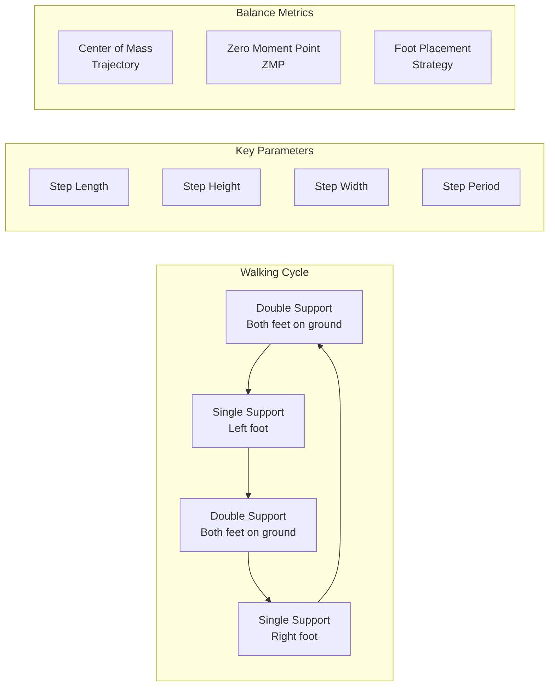

import CodeComponent from '@site/src/components/CodeComponent';

# Lesson 4.2: Biped Locomotion

## Learning Objectives

<div className="learning-objectives">

After completing this lesson, you will be able to:
- Analyze the dynamics of bipedal walking
- Generate stable walking gaits using trajectory optimization
- Implement balance control using ZMP (Zero Moment Point)
- Create reactive stepping strategies
- Handle disturbances and terrain variations

</div>

## Introduction to Biped Locomotion

Biped locomotion is one of the most challenging problems in robotics. Unlike wheeled systems, biped robots must:
- Maintain balance on constantly changing support polygons
- Control complex dynamics with underactuation
- Handle intermittent ground contact
- Adapt to uneven terrain and disturbances

<DiagramComponent title="Biped Walking Phases">



</DiagramComponent>

## Fundamentals of Biped Walking

### 1. Dynamic Balance and ZMP

The Zero Moment Point (ZMP) is crucial for maintaining balance during bipedal walking.

<CodeComponent title="ZMP Calculation and Control" language="python">

```python
import numpy as np
from typing import Tuple, List

class ZMPController:
    """Zero Moment Point calculation and control"""

    def __init__(self, robot_mass: float = 70.0, gravity: float = 9.81):
        self.mass = robot_mass
        self.g = gravity

    def calculate_zmp(self, forces: np.ndarray, contact_points: np.ndarray) -> np.ndarray:
        """
        Calculate ZMP from ground reaction forces

        Args:
            forces: Array of ground reaction forces [N]
            contact_points: Array of contact points [[x, y, z]]

        Returns:
            ZMP position [x, y]
        """
        zmp = np.zeros(2)

        for i, (f, p) in enumerate(zip(forces, contact_points)):
            if f[2] > 0:  # Only consider forces with normal component
                # ZMP equation
                zmp[0] += f[2] * p[0] - f[0] * p[2]
                zmp[1] += f[2] * p[1] - f[1] * p[2]

        # Normalize by total vertical force
        total_fz = sum(f[2] for f in forces if f[2] > 0)

        if total_fz > 0:
            zmp = zmp / total_fz
        else:
            # No ground contact
            zmp = np.array([0.0, 0.0])

        return zmp

    def calculate_zmp_from_motion(self, com: np.ndarray, com_acc: np.ndarray,
                                 com_height: float) -> np.ndarray:
        """
        Calculate ZMP from COM motion (simplified inverted pendulum)

        Args:
            com: Center of mass position [x, y, z]
            com_acc: COM acceleration [ax, ay, az]
            com_height: Constant COM height

        Returns:
            ZMP position [x, y]
        """
        zmp = np.zeros(2)

        # Simplified ZMP calculation (assuming constant height)
        zmp[0] = com[0] - (com_height / self.g) * com_acc[0]
        zmp[1] = com[1] - (com_height / self.g) * com_acc[1]

        return zmp

    def is_zmp_stable(self, zmp: np.ndarray, support_polygon: List[Tuple[float, float]]) -> bool:
        """
        Check if ZMP is within support polygon

        Args:
            zmp: ZMP position [x, y]
            support_polygon: List of support polygon vertices [(x, y)]

        Returns:
            True if ZMP is stable
        """
        # Point-in-polygon test
        x, y = zmp
        n = len(support_polygon)
        inside = False

        p1x, p1y = support_polygon[0]
        for i in range(1, n + 1):
            p2x, p2y = support_polygon[i % n]
            if y > min(p1y, p2y):
                if y <= max(p1y, p2y):
                    if x <= max(p1x, p2x):
                        if p1y != p2y:
                            xinters = (y - p1y) * (p2x - p1x) / (p2y - p1y) + p1x
                        if p1x == p2x or x <= xinters:
                            inside = not inside
            p1x, p1y = p2x, p2y

        return inside

    def get_support_polygon(self, left_foot: np.ndarray, right_foot: np.ndarray,
                           foot_length: float = 0.25, foot_width: float = 0.15) -> List[Tuple[float, float]]:
        """
        Get support polygon from foot positions

        Args:
            left_foot: Left foot pose [x, y, yaw]
            right_foot: Right foot pose [x, y, yaw]
            foot_length: Length of foot
            foot_width: Width of foot

        Returns:
            Support polygon vertices [(x, y)]
        """
        # Foot corners in local frame
        half_length = foot_length / 2
        half_width = foot_width / 2

        # Left foot corners
        l_corners = [
            [-half_length, -half_width],
            [half_length, -half_width],
            [half_length, half_width],
            [-half_length, half_width]
        ]

        # Right foot corners
        r_corners = [
            [-half_length, -half_width],
            [half_length, -half_width],
            [half_length, half_width],
            [-half_length, half_width]
        ]

        # Transform to global frame
        def transform_corners(corners, pose):
            x, y, yaw = pose
            cos_yaw, sin_yaw = np.cos(yaw), np.sin(yaw)
            transformed = []

            for cx, cy in corners:
                gx = x + cx * cos_yaw - cy * sin_yaw
                gy = y + cx * sin_yaw + cy * cos_yaw
                transformed.append((gx, gy))

            return transformed

        left_vertices = transform_corners(l_corners, left_foot)
        right_vertices = transform_corners(r_corners, right_foot)

        # Combine vertices (convex hull of both feet)
        all_vertices = left_vertices + right_vertices

        # Calculate convex hull (simplified - assuming normal walking)
        return [
            all_vertices[0],  # Left heel
            all_vertices[1],  # Left toe
            all_vertices[5],  # Right toe
            all_vertices[4]   # Right heel
        ]

class COMTrajectoryGenerator:
    """Generate center of mass trajectories for stable walking"""

    def __init__(self, dt: float = 0.01):
        self.dt = dt

    def generate_com_trajectory(self, step_length: float, step_time: float,
                               com_height: float, num_steps: int = 2) -> Tuple[np.ndarray, np.ndarray]:
        """
        Generate COM trajectory using preview control

        Args:
            step_length: Length of each step
            step_time: Duration of each step
            com_height: Height of COM from ground
            num_steps: Number of steps

        Returns:
            (time_array, com_trajectory)
        """
        # Time array
        total_time = step_time * num_steps
        t = np.arange(0, total_time, self.dt)

        # COM trajectory
        com_trajectory = np.zeros((len(t), 3))

        # Generate ZMP reference first
        zmp_ref = self.generate_zmp_reference(step_length, step_time, num_steps)

        # Preview control to generate COM from ZMP
        for i, ti in enumerate(t):
            # Simple COM generation (in practice, use proper preview control)
            phase = (ti % step_time) / step_time

            if phase < 0.5:
                # Double support phase
                com_trajectory[i, 0] = (ti / step_time) * step_length
            else:
                # Single support phase
                # Sine wave for smooth motion
                omega = 2 * np.pi / step_time
                com_trajectory[i, 0] = ((ti / step_time) * step_length +
                                       0.02 * np.sin(omega * ti))

            # Constant height
            com_trajectory[i, 1] = 0.0
            com_trajectory[i, 2] = com_height

        return t, com_trajectory

    def generate_zmp_reference(self, step_length: float, step_time: float,
                              num_steps: int) -> np.ndarray:
        """Generate ZMP reference trajectory"""
        total_time = step_time * num_steps
        t = np.arange(0, total_time, self.dt)

        zmp_ref = np.zeros((len(t), 2))

        for i, ti in enumerate(t):
            step_num = int(ti / step_time)
            phase = (ti % step_time) / step_time

            if phase < 0.5:
                # ZMP moves from back foot to front foot
                zmp_ref[i, 0] = (step_num + 0.5) * step_length
            else:
                # ZMP stays on front foot
                zmp_ref[i, 0] = (step_num + 1) * step_length

            zmp_ref[i, 1] = 0.0  # No lateral movement for straight walking

        return zmp_ref

class PreviewController:
    """Preview controller for COM tracking"""

    def __init__(self, com_height: float, gravity: float = 9.81):
        self.g = gravity
        self.com_height = com_height

        # Discrete-time state-space model
        self.setup_state_space_model()

        # Preview gains (should be optimized offline)
        self.preview_steps = 160  # About 1.6 seconds preview
        self.preview_gains = self.calculate_preview_gains()

    def setup_state_space_model(self):
        """Setup discrete-time model for COM dynamics"""
        omega = np.sqrt(self.g / self.com_height)

        # State matrix
        self.A = np.array([
            [1, self.dt, self.dt**2/2],
            [0, 1, self.dt],
            [omega**2, 0, 1]
        ])

        # Input matrix
        self.B = np.array([
            [self.dt**3/6],
            [self.dt**2/2],
            [self.dt]
        ])

        # Output matrix (measure COM position)
        self.C = np.array([[1, 0, 0]])

    def calculate_preview_gains(self):
        """Calculate preview gains using Riccati equation"""
        # Simplified - in practice, solve offline
        self.gains_p = np.array([1.0, 1.5, 0.8])  # State feedback gains
        self.gains_fi = np.array([-0.002] * self.preview_steps)  # Preview gains

    def compute_control(self, state: np.ndarray, zmp_ref: np.ndarray) -> float:
        """
        Compute control input using preview control

        Args:
            state: Current state [p, pd, pdd]
            zmp_ref: Future ZMP reference

        Returns:
            COM jerk control input
        """
        # State feedback
        u_state = -self.gains_p @ state

        # Preview control
        u_preview = 0
        for i in range(min(self.preview_steps, len(zmp_ref))):
            u_preview += self.gains_fi[i] * (zmp_ref[i] - state[0])

        return u_state + u_preview
```

</CodeComponent>

### 2. Footstep Planning

<CodeComponent title="Footstep Planner" language="python">

```python
import numpy as np
from typing import List, Tuple, Dict, Optional
from dataclasses import dataclass

@dataclass
class Footstep:
    """Footstep data structure"""
    position: np.ndarray  # [x, y, z]
    orientation: float    # yaw angle
    side: str             # 'left' or 'right'
    duration: float       # Step duration

class FootstepPlanner:
    """Plan footsteps for humanoid walking"""

    def __init__(self, step_length: float = 0.3,
                 step_width: float = 0.2,
                 max_step_height: float = 0.1):
        self.step_length = step_length
        self.step_width = step_width
        self.max_step_height = max_step_height

        # Walking parameters
        self.single_support_time = 0.6  # seconds
        self.double_support_time = 0.1  # seconds
        self.step_time = self.single_support_time + self.double_support_time

    def plan_linear_walk(self, distance: float, num_steps: int) -> List[Footstep]:
        """
        Plan straight line walking

        Args:
            distance: Total distance to walk
            num_steps: Number of steps

        Returns:
            List of footsteps
        """
        footsteps = []
        step_distance = distance / num_steps

        # Initial standing position
        current_x = 0.0
        side = 'right'  # Start with right foot

        for i in range(num_steps + 1):
            if i == 0:
                # First step is the initial stance
                x = current_x
                y = self.step_width / 2 if side == 'left' else -self.step_width / 2
            else:
                # Regular step
                current_x += step_distance
                x = current_x
                y = self.step_width / 2 if side == 'left' else -self.step_width / 2

            footstep = Footstep(
                position=np.array([x, y, 0.0]),
                orientation=0.0,  # Facing forward
                side=side,
                duration=self.step_time
            )

            footsteps.append(footstep)

            # Alternate sides
            side = 'left' if side == 'right' else 'right'

        return footsteps

    def plan_turn_in_place(self, angle: float, num_steps: int = 4) -> List[Footstep]:
        """
        Plan turning in place

        Args:
            angle: Total turning angle (radians)
            num_steps: Number of steps

        Returns:
            List of footsteps
        """
        footsteps = []
        angle_per_step = angle / num_steps

        current_angle = 0.0
        side = 'right'

        for i in range(num_steps + 1):
            if i == 0:
                # Initial position
                x = 0.0
                y = self.step_width / 2 if side == 'left' else -self.step_width / 2
                orientation = 0.0
            else:
                # Pivot foot
                current_angle += angle_per_step
                if side == 'left':
                    # Left foot pivots
                    x = 0.0
                    y = self.step_width / 2
                else:
                    # Right foot pivots
                    x = 0.0
                    y = -self.step_width / 2

                orientation = current_angle

            footstep = Footstep(
                position=np.array([x, y, 0.0]),
                orientation=orientation,
                side=side,
                duration=self.step_time
            )

            footsteps.append(footstep)
            side = 'left' if side == 'right' else 'right'

        return footsteps

    def plan_walk_to_target(self, start_pose: np.ndarray,
                           target_pose: np.ndarray) -> List[Footstep]:
        """
        Plan footsteps to walk to target position

        Args:
            start_pose: Initial pose [x, y, theta]
            target_pose: Target pose [x, y, theta]

        Returns:
            List of footsteps
        """
        # Calculate path
        dx = target_pose[0] - start_pose[0]
        dy = target_pose[1] - start_pose[1]
        distance = np.sqrt(dx**2 + dy**2)
        heading = np.arctan2(dy, dx)

        # Number of steps based on distance
        num_steps = max(2, int(distance / self.step_length))

        # Generate footsteps
        footsteps = []

        # Initial stance
        footsteps.append(Footstep(
            position=np.array([0.0, self.step_width/2, 0.0]),
            orientation=start_pose[2],
            side='left',
            duration=0.0
        ))

        footsteps.append(Footstep(
            position=np.array([0.0, -self.step_width/2, 0.0]),
            orientation=start_pose[2],
            side='right',
            duration=0.0
        ))

        # Walk straight to target
        for i in range(1, num_steps + 1):
            x = (i / num_steps) * dx
            side = 'left' if i % 2 == 1 else 'right'
            y = self.step_width/2 if side == 'left' else -self.step_width/2

            footsteps.append(Footstep(
                position=np.array([x, y, 0.0]),
                orientation=heading,
                side=side,
                duration=self.step_time
            ))

        # Final turn to match target orientation
        turn_angle = target_pose[2] - heading
        if abs(turn_angle) > 0.1:
            turn_steps = max(2, int(abs(turn_angle) / (np.pi/4)))
            turn_footsteps = self.plan_turn_in_place(turn_angle, turn_steps)

            # Adjust turn footsteps position
            for footstep in turn_footsteps:
                footstep.position[0] = dx
                footstep.orientation = heading + footstep.orientation

            footsteps.extend(turn_footsteps)

        return footsteps

class AdaptiveFootstepPlanner:
    """Adaptive footstep planning with terrain consideration"""

    def __init__(self, footstep_planner: FootstepPlanner):
        self.planner = footstep_planner
        self.terrain_map = None

    def set_terrain_map(self, terrain_map: Dict):
        """Set terrain map with obstacles and uneven ground"""
        self.terrain_map = terrain_map

    def adapt_footstep(self, footstep: Footstep) -> Footstep:
        """
        Adapt footstep based on terrain

        Args:
            footstep: Planned footstep

        Returns:
            Adapted footstep
        """
        if self.terrain_map is None:
            return footstep

        # Get terrain height at footstep position
        terrain_height = self.get_terrain_height(
            footstep.position[0],
            footstep.position[1]
        )

        # Adjust footstep height
        adapted_footstep = Footstep(
            position=np.array([
                footstep.position[0],
                footstep.position[1],
                terrain_height
            ]),
            orientation=footstep.orientation,
            side=footstep.side,
            duration=footstep.duration
        )

        # Check for obstacles
        if self.is_obstacle(footstep.position[:2]):
            # Find alternative position
            alt_pos = self.find_alternative_position(footstep)
            adapted_footstep.position = alt_pos

        return adapted_footstep

    def get_terrain_height(self, x: float, y: float) -> float:
        """Get terrain height at position"""
        if self.terrain_map and 'height_map' in self.terrain_map:
            # Interpolate height from height map
            return self.terrain_map['height_map'].get_height(x, y)
        return 0.0

    def is_obstacle(self, position: np.ndarray) -> bool:
        """Check if position has obstacle"""
        if self.terrain_map and 'obstacles' in self.terrain_map:
            for obstacle in self.terrain_map['obstacles']:
                if self.point_in_polygon(position, obstacle):
                    return True
        return False

    def find_alternative_position(self, footstep: Footstep) -> np.ndarray:
        """Find alternative footstep position to avoid obstacle"""
        # Simple strategy: try positions nearby
        original_pos = footstep.position.copy()

        for dx in [-0.05, 0, 0.05]:
            for dy in [-0.05, 0, 0.05]:
                test_pos = original_pos.copy()
                test_pos[0] += dx
                test_pos[1] += dy

                if not self.is_obstacle(test_pos[:2]):
                    return test_pos

        # If no alternative found, return original
        return original_pos

    @staticmethod
    def point_in_polygon(point: np.ndarray, polygon: List[Tuple[float, float]]) -> bool:
        """Check if point is inside polygon"""
        x, y = point
        n = len(polygon)
        inside = False

        p1x, p1y = polygon[0]
        for i in range(1, n + 1):
            p2x, p2y = polygon[i % n]
            if y > min(p1y, p2y):
                if y <= max(p1y, p2y):
                    if x <= max(p1x, p2x):
                        if p1y != p2y:
                            xinters = (y - p1y) * (p2x - p1x) / (p2y - p1y) + p1x
                        if p1x == p2x or x <= xinters:
                            inside = not inside
            p1x, p1y = p2x, p2y

        return inside
```

</CodeComponent>

### 3. Walking Pattern Generation

<CodeComponent title="Walking Pattern Generator" language="python">

```python
import numpy as np
from typing import Tuple, List, Dict, Optional
import matplotlib.pyplot as plt

class WalkingPatternGenerator:
    """Generate complete walking patterns including COM, ZMP, and foot trajectories"""

    def __init__(self, dt: float = 0.01):
        self.dt = dt
        self.com_controller = COMTrajectoryGenerator(dt)
        self.zmp_controller = ZMPController()

    def generate_walking_pattern(self, footsteps: List[Footstep],
                                 initial_com: np.ndarray) -> Dict:
        """
        Generate complete walking pattern from footsteps

        Args:
            footsteps: List of planned footsteps
            initial_com: Initial COM position

        Returns:
            Dictionary with walking pattern data
        """
        # Calculate total time
        total_time = sum(step.duration for step in footsteps[1:])  # Skip initial stance

        # Time array
        t = np.arange(0, total_time, self.dt)
        num_frames = len(t)

        # Initialize pattern arrays
        pattern = {
            'time': t,
            'com': np.zeros((num_frames, 3)),
            'zmp': np.zeros((num_frames, 2)),
            'left_foot': np.zeros((num_frames, 6)),  # [x, y, z, roll, pitch, yaw]
            'right_foot': np.zeros((num_frames, 6)),
            'support_foot': np.zeros(num_frames, dtype=int)  # 0: left, 1: right, 2: both
        }

        # Generate foot trajectories
        self.generate_foot_trajectories(pattern, footsteps)

        # Generate COM trajectory using preview control
        self.generate_com_trajectory(pattern, footsteps, initial_com)

        # Calculate ZMP from COM
        self.calculate_zmp_from_com(pattern)

        return pattern

    def generate_foot_trajectories(self, pattern: Dict, footsteps: List[Footstep]):
        """Generate foot position trajectories"""
        current_time = 0.0

        # Initial foot positions
        left_foot_pos = footsteps[0].position.copy()
        left_foot_ori = footsteps[0].orientation
        right_foot_pos = footsteps[1].position.copy()
        right_foot_ori = footsteps[1].orientation

        # Process each step
        for i in range(len(footsteps) - 1):
            current_step = footsteps[i]
            next_step = footsteps[i + 1]

            # Calculate frame indices for this step
            start_frame = int(current_time / self.dt)
            end_frame = int((current_time + next_step.duration) / self.dt)
            num_frames = end_frame - start_frame

            if num_frames <= 0:
                continue

            # Generate trajectory for stepping foot
            if next_step.side == 'left':
                # Left foot moves
                start_pos = left_foot_pos
                end_pos = next_step.position
                start_ori = left_foot_ori
                end_ori = next_step.orientation

                # Generate trajectory
                for j in range(min(num_frames, len(pattern['time']) - start_frame)):
                    frame = start_frame + j
                    if frame >= len(pattern['time']):
                        break

                    phase = j / num_frames

                    # Position trajectory (cubic polynomial)
                    if phase < 0.2:  # Swing phase
                        # Lifting foot
                        height = 0.05 * np.sin(phase * np.pi / 0.2)
                    else:
                        # Placing foot
                        height = 0.05 * np.sin((1 - phase) * np.pi / 0.8)

                    x = self.cubic_interpolation(
                        start_pos[0], 0, end_pos[0], 0, phase
                    )
                    y = self.cubic_interpolation(
                        start_pos[1], 0, end_pos[1], 0, phase
                    )
                    z = self.cubic_interpolation(
                        start_pos[2], 0, end_pos[2], 0, phase
                    ) + height

                    pattern['left_foot'][frame, 0] = x
                    pattern['left_foot'][frame, 1] = y
                    pattern['left_foot'][frame, 2] = z
                    pattern['left_foot'][frame, 5] = self.cubic_interpolation(
                        start_ori, 0, end_ori, 0, phase
                    )

                # Update left foot position
                left_foot_pos = end_pos
                left_foot_ori = end_ori

                # Right foot stays
                pattern['right_foot'][start_frame:end_frame, :] = np.array([
                    right_foot_pos[0], right_foot_pos[1], right_foot_pos[2],
                    0, 0, right_foot_ori
                ])

            else:  # next_step.side == 'right'
                # Right foot moves
                start_pos = right_foot_pos
                end_pos = next_step.position
                start_ori = right_foot_ori
                end_ori = next_step.orientation

                # Generate trajectory
                for j in range(min(num_frames, len(pattern['time']) - start_frame)):
                    frame = start_frame + j
                    if frame >= len(pattern['time']):
                        break

                    phase = j / num_frames

                    # Position trajectory
                    if phase < 0.2:  # Swing phase
                        height = 0.05 * np.sin(phase * np.pi / 0.2)
                    else:
                        height = 0.05 * np.sin((1 - phase) * np.pi / 0.8)

                    x = self.cubic_interpolation(
                        start_pos[0], 0, end_pos[0], 0, phase
                    )
                    y = self.cubic_interpolation(
                        start_pos[1], 0, end_pos[1], 0, phase
                    )
                    z = self.cubic_interpolation(
                        start_pos[2], 0, end_pos[2], 0, phase
                    ) + height

                    pattern['right_foot'][frame, 0] = x
                    pattern['right_foot'][frame, 1] = y
                    pattern['right_foot'][frame, 2] = z
                    pattern['right_foot'][frame, 5] = self.cubic_interpolation(
                        start_ori, 0, end_ori, 0, phase
                    )

                # Update right foot position
                right_foot_pos = end_pos
                right_foot_ori = end_ori

                # Left foot stays
                pattern['left_foot'][start_frame:end_frame, :] = np.array([
                    left_foot_pos[0], left_foot_pos[1], left_foot_pos[2],
                    0, 0, left_foot_ori
                ])

            # Update support foot indicator
            if i == 0:  # Initial double support
                pattern['support_foot'][start_frame:int(start_frame + num_frames/2)] = 2
                pattern['support_foot'][int(start_frame + num_frames/2):end_frame] = 1 if next_step.side == 'right' else 0
            else:
                pattern['support_foot'][start_frame:end_frame] = 1 if next_step.side == 'right' else 0

            current_time += next_step.duration

    def generate_com_trajectory(self, pattern: Dict, footsteps: List[Footstep],
                               initial_com: np.ndarray):
        """Generate COM trajectory using preview control"""
        # Preview controller
        preview_controller = PreviewController(com_height=0.8)

        # Initial state [position, velocity, acceleration]
        state = np.array([initial_com[0], 0.0, 0.0])

        # Generate ZMP reference from footsteps
        zmp_ref = self.generate_zmp_from_footsteps(pattern, footsteps)

        # Integrate COM dynamics
        for i in range(len(pattern['time'])):
            # Get preview window
            preview_window = 160  # About 1.6 seconds
            start_idx = i
            end_idx = min(i + preview_window, len(zmp_ref))
            zmp_preview = zmp_ref[start_idx:end_idx]

            # Compute control
            u = preview_controller.compute_control(state, zmp_preview)

            # Update state (simple integration)
            state[0] += state[1] * self.dt
            state[1] += state[2] * self.dt
            state[2] = u

            # Store COM position
            pattern['com'][i, 0] = state[0]
            pattern['com'][i, 1] = initial_com[1]  # No lateral movement
            pattern['com'][i, 2] = 0.8  # Constant height

    def generate_zmp_from_footsteps(self, pattern: Dict, footsteps: List[Footstep]) -> np.ndarray:
        """Generate ZMP reference from footsteps"""
        zmp_ref = np.zeros((len(pattern['time']), 2))

        current_time = 0.0

        for i in range(len(footsteps) - 1):
            current_step = footsteps[i]
            next_step = footsteps[i + 1]

            # Calculate frame indices
            start_frame = int(current_time / self.dt)
            end_frame = int((current_time + next_step.duration) / self.dt)

            # ZMP goes from current support foot to next support foot
            if i == 0:
                # Start: between both feet
                for j in range(start_frame, min(end_frame, len(zmp_ref))):
                    phase = (j - start_frame) / (end_frame - start_frame)
                    if phase < 0.5:
                        zmp_ref[j] = current_step.position[:2]
                    else:
                        zmp_ref[j] = next_step.position[:2]
            else:
                # Regular step: ZMP on support foot
                for j in range(start_frame, min(end_frame, len(zmp_ref))):
                    zmp_ref[j] = current_step.position[:2]

            current_time += next_step.duration

        return zmp_ref

    def calculate_zmp_from_com(self, pattern: Dict):
        """Calculate ZMP from COM motion"""
        # Calculate COM acceleration (numerical differentiation)
        com_vel = np.gradient(pattern['com'], self.dt, axis=0)
        com_acc = np.gradient(com_vel, self.dt, axis=0)

        # Calculate ZMP
        for i in range(len(pattern['time'])):
            zmp = self.zmp_controller.calculate_zmp_from_motion(
                pattern['com'][i],
                com_acc[i],
                pattern['com'][i, 2]
            )
            pattern['zmp'][i] = zmp

    @staticmethod
    def cubic_interpolation(p0, v0, p1, v1, t):
        """Cubic polynomial interpolation"""
        # Hermite basis functions
        h00 = 2*t**3 - 3*t**2 + 1
        h10 = t**3 - 2*t**2 + t
        h01 = -2*t**3 + 3*t**2
        h11 = t**3 - t**2

        return h00*p0 + h10*v0 + h01*p1 + h11*v1

    def visualize_pattern(self, pattern: Dict):
        """Visualize walking pattern"""
        fig, axes = plt.subplots(3, 2, figsize=(15, 10))

        # COM trajectory
        axes[0, 0].plot(pattern['time'], pattern['com'][:, 0])
        axes[0, 0].set_title('COM X Position')
        axes[0, 0].set_xlabel('Time (s)')
        axes[0, 0].set_ylabel('X (m)')

        # ZMP trajectory
        axes[0, 1].plot(pattern['time'], pattern['zmp'][:, 0], label='ZMP')
        axes[0, 1].plot(pattern['time'], pattern['com'][:, 0], label='COM')
        axes[0, 1].set_title('ZMP vs COM X Position')
        axes[0, 1].set_xlabel('Time (s)')
        axes[0, 1].set_ylabel('Position (m)')
        axes[0, 1].legend()

        # Foot trajectories (top view)
        axes[1, 0].plot(pattern['left_foot'][:, 0], pattern['left_foot'][:, 1], 'b-', label='Left')
        axes[1, 0].plot(pattern['right_foot'][:, 0], pattern['right_foot'][:, 1], 'r-', label='Right')
        axes[1, 0].set_title('Foot Trajectories (Top View)')
        axes[1, 0].set_xlabel('X (m)')
        axes[1, 0].set_ylabel('Y (m)')
        axes[1, 0].legend()
        axes[1, 0].grid(True)

        # Foot height
        axes[1, 1].plot(pattern['time'], pattern['left_foot'][:, 2], 'b-', label='Left')
        axes[1, 1].plot(pattern['time'], pattern['right_foot'][:, 2], 'r-', label='Right')
        axes[1, 1].set_title('Foot Height')
        axes[1, 1].set_xlabel('Time (s)')
        axes[1, 1].set_ylabel('Z (m)')
        axes[1, 1].legend()

        # Support foot
        axes[2, 0].plot(pattern['time'], pattern['support_foot'])
        axes[2, 0].set_title('Support Foot (0: Left, 1: Right, 2: Both)')
        axes[2, 0].set_xlabel('Time (s)')
        axes[2, 0].set_ylabel('Support')

        # 3D visualization
        ax_3d = axes[2, 1]
        ax_3d.remove()
        ax_3d = fig.add_subplot(3, 2, 6, projection='3d')
        ax_3d.plot(pattern['left_foot'][:, 0], pattern['left_foot'][:, 1], pattern['left_foot'][:, 2], 'b-')
        ax_3d.plot(pattern['right_foot'][:, 0], pattern['right_foot'][:, 1], pattern['right_foot'][:, 2], 'r-')
        ax_3d.set_title('3D Foot Trajectories')
        ax_3d.set_xlabel('X (m)')
        ax_3d.set_ylabel('Y (m)')
        ax_3d.set_zlabel('Z (m)')

        plt.tight_layout()
        plt.show()
```

</CodeComponent>

## Lab Exercise: Building a Biped Walker

<div className="lab-exercise">

### Objective
Implement a complete bipedal walking system with balance control, footstep planning, and reactive behaviors.

### Setup
1. Humanoid robot model with 20+ DOF
2. Walking pattern generator
3. Balance controller
4. Simulation environment

### Implementation

<CodeComponent language="python" editable={true}>

```python
# biped_walker.py
import numpy as np
from typing import Tuple, List, Dict, Optional
import matplotlib.pyplot as plt

class BipedWalker:
    """Complete bipedal walking system"""

    def __init__(self):
        # Initialize components
        self.footstep_planner = FootstepPlanner(
            step_length=0.25,
            step_width=0.2,
            max_step_height=0.08
        )

        self.pattern_generator = WalkingPatternGenerator(dt=0.01)
        self.zmp_controller = ZMPController()

        # Robot parameters
        self.robot_mass = 60.0  # kg
        self.com_height = 0.8   # m
        self.foot_length = 0.25 # m
        self.foot_width = 0.15  # m

        # Current state
        self.current_footsteps = []
        self.current_pattern = None
        self.current_phase = 0  # 0: standing, 1: walking

        # Control parameters
        self.balance_gain = 100.0
        self.posture_gain = 50.0

    def initialize_standing(self):
        """Initialize robot in standing pose"""
        # Default standing pose
        self.left_foot_pose = np.array([0.0, 0.1, 0.0, 0.0, 0.0, 0.0])
        self.right_foot_pose = np.array([0.0, -0.1, 0.0, 0.0, 0.0, 0.0])
        self.com_position = np.array([0.0, 0.0, self.com_height])

        # Create initial footsteps
        self.current_footsteps = [
            Footstep(
                position=self.left_foot_pose[:3],
                orientation=self.left_foot_pose[5],
                side='left',
                duration=0.0
            ),
            Footstep(
                position=self.right_foot_pose[:3],
                orientation=self.right_foot_pose[5],
                side='right',
                duration=0.0
            )
        ]

    def plan_walk(self, distance: float, num_steps: int = 4):
        """Plan walking motion"""
        # Generate footsteps
        self.current_footsteps = self.footstep_planner.plan_linear_walk(
            distance, num_steps
        )

        # Generate walking pattern
        self.current_pattern = self.pattern_generator.generate_walking_pattern(
            self.current_footsteps,
            self.com_position
        )

        self.current_phase = 1

    def plan_walk_to_target(self, target_pose: np.ndarray):
        """Plan walk to target position"""
        current_pose = self.get_current_pose()
        self.current_footsteps = self.footstep_planner.plan_walk_to_target(
            current_pose, target_pose
        )

        self.current_pattern = self.pattern_generator.generate_walking_pattern(
            self.current_footsteps,
            self.com_position
        )

        self.current_phase = 1

    def execute_step(self, time: float) -> Tuple[np.ndarray, np.ndarray, bool]:
        """
        Execute walking step at given time

        Returns:
            (left_foot_pose, right_foot_pose, is_complete)
        """
        if self.current_phase == 0 or self.current_pattern is None:
            # Standing mode
            return self.left_foot_pose, self.right_foot_pose, False

        # Find current frame index
        frame_idx = int(time / self.pattern_generator.dt)

        if frame_idx >= len(self.current_pattern['time']):
            # Walking complete
            return self.left_foot_pose, self.right_foot_pose, True

        # Get foot poses from pattern
        left_pose = self.current_pattern['left_foot'][frame_idx]
        right_pose = self.current_pattern['right_foot'][frame_idx]

        # Convert to 6DOF pose
        self.left_foot_pose = np.array([
            left_pose[0], left_pose[1], left_pose[2],
            0.0, 0.0, left_pose[5]
        ])
        self.right_foot_pose = np.array([
            right_pose[0], right_pose[1], right_pose[2],
            0.0, 0.0, right_pose[5]
        ])

        # Update COM position
        self.com_position = self.current_pattern['com'][frame_idx]

        return self.left_foot_pose, self.right_foot_pose, False

    def handle_disturbance(self, force: np.ndarray, duration: float):
        """Handle external disturbance"""
        # Simple reaction strategy: take corrective step
        if np.linalg.norm(force) > 50.0:  # Threshold for reaction
            print("Disturbance detected! Taking corrective action.")

            # Plan quick recovery step
            recovery_footsteps = self.plan_recovery_step(force)
            self.current_footsteps = recovery_footsteps

            # Generate new pattern
            self.current_pattern = self.pattern_generator.generate_walking_pattern(
                self.current_footsteps,
                self.com_position
            )

    def plan_recovery_step(self, force: np.ndarray) -> List[Footstep]:
        """Plan recovery step to handle disturbance"""
        # Determine recovery step direction
        force_horizontal = force[:2]
        force_magnitude = np.linalg.norm(force_horizontal)

        if force_magnitude > 0:
            force_direction = force_horizontal / force_magnitude

            # Step in opposite direction of force
            step_distance = min(0.15, 0.1 * force_magnitude / 100)
            step_x = -force_direction[0] * step_distance
            step_y = -force_direction[1] * step_distance

            # Quick recovery step
            recovery_step = Footstep(
                position=np.array([step_x, step_y, 0.0]),
                orientation=0.0,
                side='right',  # Quick step with right foot
                duration=0.3  # Faster than normal step
            )

            return [self.current_footsteps[0], recovery_step]

        return self.current_footsteps

    def adapt_to_terrain(self, terrain_heights: Dict):
        """Adapt walking to uneven terrain"""
        if self.current_pattern is None:
            return

        # Modify foot trajectories based on terrain
        for i in range(len(self.current_pattern['time'])):
            # Get foot positions
            left_pos = self.current_pattern['left_foot'][i]
            right_pos = self.current_pattern['right_foot'][i]

            # Adjust heights
            left_height = terrain_heights.get_height(left_pos[0], left_pos[1])
            right_height = terrain_heights.get_height(right_pos[0], right_pos[1])

            # Only adjust if foot is in contact (low velocity)
            if i > 0:
                left_vel = self.current_pattern['left_foot'][i, 2] - self.current_pattern['left_foot'][i-1, 2]
                right_vel = self.current_pattern['right_foot'][i, 2] - self.current_pattern['right_foot'][i-1, 2]

                if abs(left_vel) < 0.1:
                    self.current_pattern['left_foot'][i, 2] = left_height
                if abs(right_vel) < 0.1:
                    self.current_pattern['right_foot'][i, 2] = right_height

    def get_current_pose(self) -> np.ndarray:
        """Get current robot pose [x, y, theta]"""
        # Average of both feet
        x = (self.left_foot_pose[0] + self.right_foot_pose[0]) / 2
        y = (self.left_foot_pose[1] + self.right_foot_pose[1]) / 2
        theta = (self.left_foot_pose[5] + self.right_foot_pose[5]) / 2

        return np.array([x, y, theta])

    def visualize_current_state(self):
        """Visualize current walking state"""
        if self.current_pattern is not None:
            self.pattern_generator.visualize_pattern(self.current_pattern)
        else:
            print("Robot is standing. Use plan_walk() to start walking.")

# Terrain map for uneven ground
class TerrainMap:
    """Simple terrain height map"""

    def __init__(self):
        self.height_points = {}

    def add_height_point(self, x: float, y: float, height: float):
        """Add height measurement point"""
        self.height_points[(x, y)] = height

    def get_height(self, x: float, y: float) -> float:
        """Get interpolated height at position"""
        if not self.height_points:
            return 0.0

        # Find nearest points
        min_dist = float('inf')
        nearest_height = 0.0

        for (px, py), height in self.height_points.items():
            dist = np.sqrt((x - px)**2 + (y - py)**2)
            if dist < min_dist:
                min_dist = dist
                nearest_height = height

        # Simple nearest neighbor (could use proper interpolation)
        if min_dist < 0.5:  # Within 0.5m of measurement
            return nearest_height
        else:
            return 0.0  # Default ground height

# Demo
def main():
    walker = BipedWalker()

    print("=== Bipedal Walking Demo ===")

    # Initialize in standing pose
    walker.initialize_standing()
    print("Robot initialized in standing pose")

    # Plan and execute forward walking
    print("\n1. Planning forward walk (1 meter, 4 steps)...")
    walker.plan_walk(distance=1.0, num_steps=4)

    # Simulate walking
    print("Executing walking motion...")
    time = 0.0
    dt = 0.01
    complete = False

    while not complete and time < 5.0:
        left_pose, right_pose, complete = walker.execute_step(time)

        if int(time * 100) % 100 == 0:  # Print every second
            print(f"Time: {time:.1f}s, Left foot: ({left_pose[0]:.2f}, {left_pose[1]:.2f})")

        time += dt

    print(f"Walking complete at {time:.2f} seconds")

    # Test disturbance handling
    print("\n2. Testing disturbance handling...")
    walker.initialize_standing()
    walker.handle_disturbance(
        force=np.array([100.0, 0.0, 0.0]),  # 100N forward force
        duration=0.1
    )

    # Test uneven terrain
    print("\n3. Testing uneven terrain adaptation...")
    terrain = TerrainMap()
    terrain.add_height_point(0.5, 0.0, 0.05)  # 5cm step
    terrain.add_height_point(1.0, 0.0, 0.10)  # 10cm step

    walker.initialize_standing()
    walker.plan_walk(distance=1.5, num_steps=6)
    walker.adapt_to_terrain(terrain)

    # Visualize final pattern
    walker.visualize_current_state()

if __name__ == "__main__":
    main()
```

</CodeComponent>

### Testing the Biped Walker

1. **Basic Walking Test**:
```python
# Test different walking patterns
walker.plan_walk(distance=0.5, num_steps=2)  # Short steps
walker.plan_walk(distance=2.0, num_steps=8)  # Long walk
```

2. **Turning Test**:
```python
# Test turning in place
planner = FootstepPlanner()
turn_footsteps = planner.plan_turn_in_place(angle=np.pi/2, num_steps=4)
```

3. **Obstacle Avoidance Test**:
```python
# Test adaptive footstep planning
adaptive_planner = AdaptiveFootstepPlanner(planner)
adaptive_planner.set_terrain_map(obstacle_map)
```

4. **Disturbance Recovery Test**:
```python
# Test different disturbance forces
walker.handle_disturbance(np.array([50, 30, 0]), duration=0.1)
walker.handle_disturbance(np.array([0, 0, 100]), duration=0.2)
```

### Expected Results

The biped walker should demonstrate:
- Stable walking with proper ZMP control
- Smooth foot trajectories with swing and stance phases
- Reactive stepping in response to disturbances
- Adaptation to uneven terrain
- Energy-efficient gait patterns

</div>

## Advanced Topics

### 1. Passive Dynamic Walking

<CodeComponent title="Passive Walker" language="python">

```python
class PassiveDynamicWalker:
    """Passive dynamic walking based on compass gait model"""

    def __init__(self, leg_length: float = 1.0, hip_mass: float = 10.0):
        self.L = leg_length  # Leg length
        self.m_h = hip_mass  # Hip mass
        self.g = 9.81        # Gravity

        # State variables
        self.theta = np.array([0.1, -0.1])  # Leg angles
        self.theta_dot = np.array([0.0, 0.0])  # Angular velocities

    def dynamics(self, state: np.ndarray) -> np.ndarray:
        """Compass gait dynamics"""
        theta1, theta2, theta1_dot, theta2_dot = state

        # Equations of motion for compass gait
        # (Simplified version)
        ddtheta1 = self.calculate_acceleration(theta1, theta2, theta1_dot, theta2_dot, swing=0)
        ddtheta2 = self.calculate_acceleration(theta2, theta1, theta2_dot, theta1_dot, swing=1)

        return np.array([theta1_dot, theta2_dot, ddtheta1, ddtheta2])

    def calculate_acceleration(self, theta_stance: float, theta_swing: float,
                               theta_dot_stance: float, theta_dot_swing: float,
                               swing: int) -> float:
        """Calculate angular acceleration for compass gait"""
        # Simplified compass gait dynamics
        # In practice, solve full equations of motion

        if swing == 0:  # Stance leg
            # Gravity effect
            gravity_torque = -self.g / self.L * np.sin(theta_stance)

            # Coupling effect from swing leg
            coupling = 0.5 * (theta_dot_swing**2 * np.sin(theta_swing - theta_stance))

            # Total acceleration
            return gravity_torque + coupling
        else:  # Swing leg
            # Simple pendulum dynamics
            return -self.g / self.L * np.sin(theta_swing)

    def step_event(self, state: np.ndarray) -> bool:
        """Check for heel strike event"""
        theta1, theta2 = state[0], state[1]

        # Heel strike when swing leg hits ground
        return theta2 <= -theta1

    def step_reset(self, state: np.ndarray) -> np.ndarray:
        """Reset state after heel strike"""
        theta1, theta2, theta1_dot, theta2_dot = state

        # Exchange leg roles
        new_theta1 = -theta2
        new_theta2 = -theta1

        # Angular momentum conservation at impact
        # (Simplified - should include proper impact dynamics)
        impact_loss = 0.8  # Energy loss factor
        new_theta1_dot = impact_loss * theta2_dot
        new_theta2_dot = impact_loss * theta1_dot

        return np.array([new_theta1, new_theta2, new_theta1_dot, new_theta2_dot])

    def simulate(self, initial_state: np.ndarray, duration: float) -> np.ndarray:
        """Simulate passive walking"""
        dt = 0.001
        num_steps = int(duration / dt)

        # Store trajectory
        trajectory = np.zeros((num_steps, 4))
        trajectory[0] = initial_state

        # Simulation loop
        for i in range(1, num_steps):
            # Check for heel strike
            if self.step_event(trajectory[i-1]):
                # Reset at impact
                trajectory[i] = self.step_reset(trajectory[i-1])
            else:
                # Integrate dynamics
                k1 = self.dynamics(trajectory[i-1])
                k2 = self.dynamics(trajectory[i-1] + 0.5*dt*k1)
                k3 = self.dynamics(trajectory[i-1] + 0.5*dt*k2)
                k4 = self.dynamics(trajectory[i-1] + dt*k3)

                trajectory[i] = trajectory[i-1] + dt/6 * (k1 + 2*k2 + 2*k3 + k4)

        return trajectory
```

</CodeComponent>

### 2. Machine Learning for Gait Optimization

<CodeComponent title="ML-based Gait Optimization" language="python">

```python
import torch
import torch.nn as nn
from typing import List, Tuple

class GaitOptimizer:
    """Use machine learning to optimize walking gaits"""

    def __init__(self):
        # Neural network for gait parameter prediction
        self.gait_network = nn.Sequential(
            nn.Linear(6, 64),  # [speed, step_length, step_width, energy, stability, terrain]
            nn.ReLU(),
            nn.Linear(64, 128),
            nn.ReLU(),
            nn.Linear(128, 64),
            nn.ReLU(),
            nn.Linear(64, 4)   # [optimized_step_length, step_width, step_height, step_time]
        )

        # Training data
        self.training_data = []

    def collect_gait_data(self, gait_params: np.ndarray,
                         performance_metrics: np.ndarray):
        """Collect training data from gait execution"""
        self.training_data.append({
            'input': performance_metrics,  # Speed, energy, stability, etc.
            'output': gait_params  # Gait parameters
        })

    def train_network(self, epochs: int = 100):
        """Train neural network on collected data"""
        if len(self.training_data) < 10:
            print("Insufficient training data")
            return

        # Prepare training data
        inputs = torch.tensor([d['input'] for d in self.training_data],
                             dtype=torch.float32)
        targets = torch.tensor([d['output'] for d in self.training_data],
                              dtype=torch.float32)

        # Training loop
        optimizer = torch.optim.Adam(self.gait_network.parameters(), lr=0.001)
        loss_fn = nn.MSELoss()

        for epoch in range(epochs):
            optimizer.zero_grad()

            predictions = self.gait_network(inputs)
            loss = loss_fn(predictions, targets)

            loss.backward()
            optimizer.step()

            if epoch % 10 == 0:
                print(f"Epoch {epoch}: Loss = {loss.item():.6f}")

    def optimize_gait(self, desired_speed: float, terrain_type: int = 0) -> np.ndarray:
        """
        Optimize gait parameters for given conditions

        Args:
            desired_speed: Desired walking speed
            terrain_type: 0=flat, 1=uneven, 2=sloped, 3=stairs

        Returns:
            Optimized gait parameters
        """
        # Input features
        input_features = torch.tensor([
            desired_speed,  # Speed
            0.3,           # Initial step length
            0.2,           # Initial step width
            0.5,           # Energy efficiency weight
            0.5,           # Stability weight
            terrain_type    # Terrain
        ], dtype=torch.float32)

        # Get optimized parameters
        with torch.no_grad():
            optimized = self.gait_network(input_features)

        # Apply constraints
        optimized[0] = torch.clamp(optimized[0], 0.1, 0.5)  # Step length
        optimized[1] = torch.clamp(optimized[1], 0.1, 0.3)  # Step width
        optimized[2] = torch.clamp(optimized[2], 0.02, 0.1) # Step height
        optimized[3] = torch.clamp(optimized[3], 0.3, 1.0)  # Step time

        return optimized.numpy()

class ReinforcementLearningWalker:
    """Reinforcement learning for bipedal walking"""

    def __init__(self):
        # State space: [com_pos, com_vel, foot_pos, foot_vel]
        self.state_dim = 12

        # Action space: [ankle_torque, knee_torque, hip_torque] x 2 legs
        self.action_dim = 6

        # Q-network
        self.q_network = nn.Sequential(
            nn.Linear(self.state_dim, 256),
            nn.ReLU(),
            nn.Linear(256, 256),
            nn.ReLU(),
            nn.Linear(256, self.action_dim)
        )

        # Training parameters
        self.epsilon = 0.1  # Exploration rate
        self.gamma = 0.99   # Discount factor
        self.learning_rate = 0.001

    def get_state(self, robot_state: Dict) -> np.ndarray:
        """Extract state from robot"""
        state = np.concatenate([
            robot_state['com_position'][:2],    # COM x, y
            robot_state['com_velocity'][:2],    # COM vx, vy
            robot_state['left_foot_pos'][:2],  # Left foot x, y
            robot_state['left_foot_vel'][:2],  # Left foot vx, vy
            robot_state['right_foot_pos'][:2], # Right foot x, y
            robot_state['right_foot_vel'][:2]  # Right foot vx, vy
        ])

        return state

    def select_action(self, state: np.ndarray) -> np.ndarray:
        """Select action using epsilon-greedy policy"""
        if np.random.random() < self.epsilon:
            # Random action
            return np.random.uniform(-1, 1, self.action_dim)
        else:
            # Greedy action
            with torch.no_grad():
                q_values = self.q_network(torch.tensor(state, dtype=torch.float32))
                return q_values.numpy()

    def update_network(self, experiences: List[Tuple]):
        """Update Q-network from experiences"""
        if len(experiences) < 32:
            return

        # Sample batch
        batch = experiences[-32:]

        # Prepare training data
        states = torch.tensor([e[0] for e in batch], dtype=torch.float32)
        actions = torch.tensor([e[1] for e in batch], dtype=torch.float32)
        rewards = torch.tensor([e[2] for e in batch], dtype=torch.float32)
        next_states = torch.tensor([e[3] for e in batch], dtype=torch.float32)
        dones = torch.tensor([e[4] for e in batch], dtype=torch.float32)

        # Compute Q-values
        current_q = self.q_network(states)
        next_q = self.q_network(next_states)

        # Target Q-values
        target_q = current_q.clone()
        for i in range(len(batch)):
            action_idx = torch.argmax(actions[i]).item()
            if dones[i]:
                target_q[i, action_idx] = rewards[i]
            else:
                target_q[i, action_idx] = rewards[i] + self.gamma * torch.max(next_q[i])

        # Compute loss and update
        optimizer = torch.optim.Adam(self.q_network.parameters(),
                                   lr=self.learning_rate)
        loss = nn.MSELoss()(current_q, target_q)

        optimizer.zero_grad()
        loss.backward()
        optimizer.step()
```

</CodeComponent>

## Key Takeaways

1. **ZMP control** is fundamental for maintaining balance during bipedal walking
2. **Preview control** allows the robot to anticipate future steps for smooth motion
3. **Footstep planning** must consider both task goals and stability constraints
4. **Disturbance rejection** requires fast reactive strategies like corrective steps
5. **Passive dynamics** can improve energy efficiency in walking
6. **Machine learning** can optimize gaits for specific environments and tasks

## Summary

Biped locomotion represents one of the most challenging problems in robotics, requiring careful coordination of dynamics, balance, and planning. By understanding ZMP control, generating smooth walking patterns, and implementing reactive strategies, we can create humanoid robots that walk with stability and efficiency similar to humans.

In the next lesson, we'll explore **Balance and Manipulation** - integrating upper body control with bipedal stability.

[Next: Balance and Manipulation →](lesson-3)

## Quiz

<Quiz
  quizId="biped-locomotion"
  questions={[
    {
      id: "q1",
      type: "multiple-choice",
      question: "What is the Zero Moment Point (ZMP) in bipedal walking?",
      options: [
        "The point where the robot's center of mass is located",
        "The point where the total moment of all ground reaction forces equals zero",
        "The midpoint between the two feet",
        "The point of maximum ground reaction force"
      ],
      correct: 1,
      explanation: "The ZMP is the point on the ground where the total moment of all ground reaction forces equals zero. For stable walking, the ZMP must remain within the support polygon formed by the feet."
    },
    {
      id: "q2",
      type: "multiple-choice",
      question: "What is the primary purpose of preview control in walking?",
      options: [
        "To see obstacles before hitting them",
        "To anticipate future ZMP references for smoother COM motion",
        "To preview the next camera frame",
        "To predict the weather during outdoor walking"
      ],
      correct: 1,
      explanation: "Preview control looks ahead at future ZMP reference points (typically 1-2 seconds ahead) to generate smooth COM trajectories that can track the desired ZMP while maintaining dynamic balance."
    },
    {
      id: "q3",
      type: "true-false",
      question: "Passive dynamic walking can achieve energy-efficient locomotion without any actuation.",
      correct: true,
      explanation: "Passive dynamic walkers exploit the natural dynamics of the system (like a compass gait or rimless wheel) to achieve efficient walking on shallow slopes with minimal or no actuation, demonstrating how biomechanics can inspire energy-efficient robot locomotion."
    }
  ]}
/>