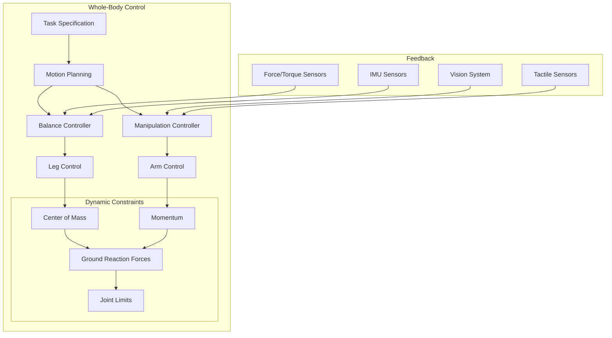

import CodeComponent from '@site/src/components/CodeComponent';

# Lesson 4.3: Balance and Manipulation

## Learning Objectives

<div className="learning-objectives">

After completing this lesson, you will be able to:
- Implement whole-body control for balancing while manipulating objects
- Use momentum control to maintain stability during dynamic movements
- Create coordinated arm-leg movements for complex tasks
- Handle objects of varying mass and shape
- Implement reactive balance strategies during manipulation

</div>

## Introduction to Balance and Manipulation

Humanoid robots must perform manipulation tasks while maintaining balance - a dual challenge that requires:
- Whole-body coordination
- Momentum management
- Dynamic balance adjustment
- Adaptive grasping strategies
- Reactive responses to perturbations

<DiagramComponent title="Whole-Body Control Architecture">



</DiagramComponent>

## Whole-Body Dynamics

### 1. Momentum Control

<CodeComponent title="Momentum-Based Balance Control" language="python">

```python
import numpy as np
from typing import Tuple, Dict, List
import pinocchio as pin

class MomentumController:
    """Momentum-based balance controller for humanoid robots"""

    def __init__(self, robot_model: pin.Model):
        self.robot = robot_model
        self.data = robot_model.createData()

        # Control gains
        self.kp_com = 100.0  # Position gain for COM
        self.kd_com = 50.0   # Velocity gain for COM
        self.kp_ang = 200.0  # Angular momentum gain

        # Momentum observer
        self.momentum_observer = MomentumObserver()

    def compute_balance_control(self, q: np.ndarray, v: np.ndarray,
                             com_desired: np.ndarray,
                             com_dot_desired: np.ndarray,
                             L_desired: np.ndarray) -> Tuple[np.ndarray, np.ndarray]:
        """
        Compute balance control using momentum control

        Args:
            q: Joint positions
            v: Joint velocities
            com_desired: Desired COM position
            com_dot_desired: Desired COM velocity
            L_desired: Desired angular momentum

        Returns:
            (joint_torques, contact_forces)
        """
        # Update robot kinematics and dynamics
        pin.forwardKinematics(self.robot, self.data, q, v)
        pin.updateFramePlacements(self.robot, self.data)
        pin.computeCentroidalMomentum(self.robot, self.data, q, v)

        # Get current state
        com_current = self.data.com[0]
        com_dot_current = self.data.vcom[0]
        L_current = self.data.hg

        # Compute momentum errors
        com_error = com_desired - com_current
        com_dot_error = com_dot_desired - com_dot_current
        L_error = L_desired - L_current

        # Compute desired momentum rate
        m_total = self.data.mass[0]
        F_desired = m_total * self.kp_com * com_error + m_total * self.kd_com * com_dot_error
        tau_desired = self.kp_ang * L_error

        # Project to joint space
        J_com = self.compute_com_jacobian(q)
        J_ang = self.compute_angular_momentum_jacobian(q)

        # Optimize for joint torques
        joint_torques = self.solve_momentum_optimization(
            F_desired, tau_desired, J_com, J_ang, q, v
        )

        # Compute required contact forces
        contact_forces = self.compute_contact_forces(joint_torques, q, v)

        return joint_torques, contact_forces

    def compute_com_jacobian(self, q: np.ndarray) -> np.ndarray:
        """Compute COM Jacobian"""
        pin.jacobianCenterOfMass(self.robot, self.data, q)
        return self.data.Jcom

    def compute_angular_momentum_jacobian(self, q: np.ndarray) -> np.ndarray:
        """Compute angular momentum Jacobian"""
        # This would typically use centroidal dynamics
        # Simplified implementation
        J = np.zeros((3, self.robot.nv))
        return J

    def solve_momentum_optimization(self, F_desired: np.ndarray,
                                   tau_desired: np.ndarray,
                                   J_com: np.ndarray, J_ang: np.ndarray,
                                   q: np.ndarray, v: np.ndarray) -> np.ndarray:
        """
        Solve for joint torques that achieve desired momentum

        Args:
            F_desired: Desired force at COM
            tau_desired: Desired angular momentum
            J_com: COM Jacobian
            J_ang: Angular momentum Jacobian
            q: Joint positions
            v: Joint velocities

        Returns:
            Joint torques
        """
        # Stack momentum equations
        A = np.vstack([J_com, J_ang])
        b = np.concatenate([F_desired, tau_desired])

        # Compute inertia matrix
        M = pin.crba(self.robot, self.data, q)
        M = pin.computeCoriolisTerm(self.robot, self.data, q, v)

        # Solve weighted optimization
        # Minimize: ||A*tau_dot - b||^2 + lambda*||tau||^2
        lambda_weight = 1e-6

        # Convert to torque optimization (simplified)
        # In practice, use QP solver with constraints
        J_pinv = np.linalg.pinv(A)
        joint_acc = J_pinv @ b

        # Compute torques
        joint_torques = M @ joint_acc

        # Add regularization
        joint_torques -= lambda_weight * (q - self.robot.referenceConfigurations['standing'])

        return joint_torques

    def compute_contact_forces(self, joint_torques: np.ndarray,
                              q: np.ndarray, v: np.ndarray) -> np.ndarray:
        """Compute required contact forces"""
        # Compute inverse dynamics
        pin.computeAllTerms(self.robot, self.data, q, v, np.zeros_like(v))
        non_linear_effects = self.data.nle

        # Contact wrench equation: Jc^T * f = tau - non_linear_effects
        # Solve for contact forces f
        # This is simplified - in practice use contact force distribution
        contact_forces = np.zeros(6)  # [fx, fy, fz, mx, my, mz] for each contact

        return contact_forces

class MomentumObserver:
    """Observer for estimating momentum from sensor data"""

    def __init__(self, dt: float = 0.01):
        self.dt = dt
        self.com_filter_gain = 0.1
        self.momentum_filter_gain = 0.1

        # Estimated states
        self.com_estimate = np.zeros(3)
        self.com_dot_estimate = np.zeros(3)
        self.angular_momentum_estimate = np.zeros(3)

    def update(self, joint_positions: np.ndarray, joint_velocities: np.ndarray,
              imu_acceleration: np.ndarray, foot_forces: List[np.ndarray]):
        """Update momentum estimates"""
        # Update COM estimate from kinematics and IMU
        self.update_com_estimate(joint_positions, imu_acceleration)

        # Update momentum estimate from forces
        self.update_momentum_estimate(foot_forces)

    def update_com_estimate(self, q: np.ndarray, imu_acc: np.ndarray):
        """Update COM estimate using sensor fusion"""
        # Get COM from kinematics
        # com_kinematics = compute_com_from_joints(q)

        # Fuse with IMU acceleration
        # Simple complementary filter
        self.com_dot_estimate += self.dt * (imu_acc + np.array([0, 0, -9.81]))
        self.com_estimate += self.dt * self.com_dot_estimate

    def update_momentum_estimate(self, foot_forces: List[np.ndarray]):
        """Update angular momentum from contact forces"""
        total_torque = np.zeros(3)

        for i, force in enumerate(foot_forces):
            # torque = r x F
            # r = contact position relative to COM
            # This is simplified
            pass

        self.angular_momentum_estimate += self.dt * total_torque
```

</CodeComponent>

### 2. Whole-Body Manipulation

<CodeComponent title="Whole-Body Manipulation Controller" language="python">

```python
import numpy as np
from typing import Dict, List, Tuple, Optional
from dataclasses import dataclass

@dataclass
class ManipulationTask:
    """Manipulation task specification"""
    task_type: str  # 'pick', 'place', 'push', 'carry'
    target_object: np.ndarray  # Object position/pose
    target_location: Optional[np.ndarray] = None
    object_mass: float = 1.0
    required_force: Optional[np.ndarray] = None
    precision_required: float = 0.01

class WholeBodyManipulator:
    """Whole-body manipulation controller"""

    def __init__(self, robot_model):
        self.robot = robot_model
        self.momentum_controller = MomentumController(robot_model)

        # Task hierarchy
        self.tasks = {
            'balance': {'priority': 1, 'weight': 100.0},
            'manipulation': {'priority': 2, 'weight': 50.0},
            'posture': {'priority': 3, 'weight': 10.0}
        }

        # Current manipulation state
        self.current_task = None
        self.current_object = None
        self.contact_state = 'no_contact'

        # Control parameters
        self.balance_margin = 0.05  # COM margin from support polygon
        self.max_reach = 0.8        # Maximum arm reach

    def plan_manipulation(self, task: ManipulationTask) -> Dict:
        """
        Plan whole-body motion for manipulation task

        Args:
            task: Manipulation task specification

        Returns:
            Motion plan with COM trajectory and arm trajectories
        """
        # Validate task feasibility
        if not self.is_task_feasible(task):
            raise ValueError("Task not feasible")

        # Generate initial plan
        if task.task_type == 'pick':
            plan = self.plan_pick_motion(task)
        elif task.task_type == 'place':
            plan = self.plan_place_motion(task)
        elif task.task_type == 'push':
            plan = self.plan_push_motion(task)
        elif task.task_type == 'carry':
            plan = self.plan_carry_motion(task)
        else:
            raise ValueError(f"Unknown task type: {task.task_type}")

        # Optimize plan for stability
        plan = self.optimize_plan_for_balance(plan)

        return plan

    def is_task_feasible(self, task: ManipulationTask) -> bool:
        """Check if manipulation task is feasible"""
        # Check if object is within reach
        object_pos = task.target_object[:3]
        base_pos = self.get_robot_base_position()
        distance = np.linalg.norm(object_pos[:2] - base_pos[:2])

        if distance > self.max_reach:
            return False

        # Check if maintaining balance is possible
        if task.object_mass > 20.0:  # Maximum payload
            return False

        return True

    def plan_pick_motion(self, task: ManipulationTask) -> Dict:
        """Plan motion to pick up object"""
        plan = {
            'phases': [],
            'com_trajectory': [],
            'left_arm_trajectory': [],
            'right_arm_trajectory': [],
            'contact_forces': []
        }

        # Phase 1: Approach object
        approach_phase = {
            'name': 'approach',
            'duration': 2.0,
            'target_pos': self.calculate_approach_position(task.target_object),
            'arm_config': 'both_hands'
        }
        plan['phases'].append(approach_phase)

        # Phase 2: Grasp object
        grasp_phase = {
            'name': 'grasp',
            'duration': 1.0,
            'grasp_force': self.calculate_grasp_force(task.object_mass),
            'hand_config': 'adaptive'
        }
        plan['phases'].append(grasp_phase)

        # Phase 3: Lift object
        lift_phase = {
            'name': 'lift',
            'duration': 1.5,
            'lift_height': 0.1,
            'com_adjustment': self.calculate_com_adjustment(task.object_mass)
        }
        plan['phases'].append(lift_phase)

        # Generate trajectories
        plan = self.generate_trajectories_from_phases(plan, task)

        return plan

    def plan_place_motion(self, task: ManipulationTask) -> Dict:
        """Plan motion to place object"""
        plan = {
            'phases': [],
            'com_trajectory': [],
            'arm_trajectory': [],
            'object_trajectory': []
        }

        # Phase 1: Move to placement location
        move_phase = {
            'name': 'move_to_location',
            'duration': 2.0,
            'target': task.target_location,
            'com_trajectory': self.generate_safe_com_trajectory()
        }
        plan['phases'].append(move_phase)

        # Phase 2: Place object
        place_phase = {
            'name': 'place',
            'duration': 1.0,
            'placement_height': task.target_location[2],
            'release_velocity': 0.1
        }
        plan['phases'].append(place_phase)

        # Phase 3: Retract
        retract_phase = {
            'name': 'retract',
            'duration': 0.5,
            'retract_distance': 0.1
        }
        plan['phases'].append(retract_phase)

        return plan

    def optimize_plan_for_balance(self, plan: Dict) -> Dict:
        """Optimize manipulation plan to maintain balance"""
        for phase in plan['phases']:
            # Check COM trajectory against stability constraints
            for i, com_pos in enumerate(phase.get('com_trajectory', [])):
                if not self.is_com_stable(com_pos):
                    # Adjust COM trajectory
                    adjusted_com = self.adjust_com_for_stability(com_pos)
                    phase['com_trajectory'][i] = adjusted_com

        return plan

    def execute_manipulation(self, plan: Dict, current_state: Dict) -> Tuple[np.ndarray, bool]:
        """
        Execute manipulation plan

        Args:
            plan: Motion plan
            current_state: Current robot state

        Returns:
            (joint_torques, task_complete)
        """
        # Get current phase
        current_time = current_state['time']
        current_phase = self.get_current_phase(plan, current_time)

        # Compute control for current phase
        if current_phase['name'] == 'approach':
            torques = self.execute_approach(current_phase, current_state)
        elif current_phase['name'] == 'grasp':
            torques = self.execute_grasp(current_phase, current_state)
        elif current_phase['name'] == 'lift':
            torques = self.execute_lift(current_phase, current_state)
        elif current_phase['name'] == 'place':
            torques = self.execute_place(current_phase, current_state)
        else:
            torques = self.execute_default(current_state)

        # Check if task complete
        task_complete = self.check_task_completion(plan, current_time)

        return torques, task_complete

    def execute_approach(self, phase: Dict, state: Dict) -> np.ndarray:
        """Execute approach phase"""
        # Get current and target configurations
        q_current = state['q']
        q_desired = self.calculate_inverse_kinematics(
            phase['target_pos'], phase['arm_config']
        )

        # Compute balance control
        com_desired = self.calculate_com_for_manipulation(phase)
        balance_torques, contact_forces = self.momentum_controller.compute_balance_control(
            q_current, state['dq'], com_desired, np.zeros(3), np.zeros(3)
        )

        # Compute manipulation control
        manip_torques = self.compute_arm_control(q_current, q_desired)

        # Combine controls
        total_torques = self.combine_control_inputs(
            balance_torques, manip_torques, self.tasks
        )

        return total_torques

    def execute_grasp(self, phase: Dict, state: Dict) -> np.ndarray:
        """Execute grasp phase"""
        # Maintain current position while adjusting grip
        q_current = state['q']

        # Compute stable configuration
        com_desired = self.get_stable_com_position()

        # Apply grasp force through hands
        grasp_force = phase['grasp_force']
        hand_torques = self.compute_grasp_control(q_current, grasp_force)

        # Maintain balance
        balance_torques, _ = self.momentum_controller.compute_balance_control(
            q_current, state['dq'], com_desired, np.zeros(3), np.zeros(3)
        )

        # Combine controls
        total_torques = balance_torques.copy()
        total_torques[-10:-8] += hand_torques  # Hand joints

        return total_torques

    def execute_lift(self, phase: Dict, state: Dict) -> np.ndarray:
        """Execute lift phase"""
        q_current = state['q']

        # Adjust COM for lifted object
        com_adjustment = phase['com_adjustment']
        com_desired = self.get_stable_com_position() + com_adjustment

        # Slow upward motion
        lift_velocity = phase['lift_height'] / phase['duration']
        arm_velocity = np.zeros(self.robot.nv)
        arm_velocity[-10:-8] = lift_velocity  # Hand joints

        # Compute control
        balance_torques, _ = self.momentum_controller.compute_balance_control(
            q_current, state['dq'], com_desired, np.zeros(3), np.zeros(3)
        )

        arm_torques = self.compute_arm_velocity_control(q_current, arm_velocity)

        total_torques = balance_torques + arm_torques

        return total_torques

    def compute_arm_control(self, q_current: np.ndarray,
                           q_desired: np.ndarray) -> np.ndarray:
        """Compute arm control torques"""
        # PD control for arm joints
        kp_arm = 50.0
        kd_arm = 20.0

        # Get arm joints (indices depend on robot model)
        arm_indices = slice(-12, -2)  # Last 12 joints (both arms)
        leg_indices = slice(0, 12)   # First 12 joints (legs)

        # Arm control
        q_error = q_desired - q_current
        arm_torques = np.zeros(self.robot.nv)
        arm_torques[arm_indices] = kp_arm * q_error[arm_indices]

        return arm_torques

    def compute_grasp_control(self, q: np.ndarray,
                             desired_force: float) -> np.ndarray:
        """Compute grasp control torques"""
        # Simple force control for grasp
        kp_grasp = 100.0

        # Assume hand joints are last
        hand_torques = np.zeros(4)  # 2 joints per hand
        hand_torques[0] = kp_grasp * desired_force  # Left hand
        hand_torques[2] = kp_grasp * desired_force  # Right hand

        return hand_torques

    def combine_control_inputs(self, balance_torques: np.ndarray,
                             manip_torques: np.ndarray,
                             task_weights: Dict) -> np.ndarray:
        """Combine multiple control inputs using task hierarchy"""
        total_torques = np.zeros(self.robot.nv)

        # Priority 1: Balance (always executed)
        total_torques += balance_torques

        # Priority 2: Manipulation (projected into null space of balance)
        J_balance = self.compute_balance_jacobian()
        null_space = np.eye(self.robot.nv) - np.linalg.pinv(J_balance) @ J_balance
        total_torques += null_space @ manip_torques

        return total_torques

    def calculate_com_adjustment(self, object_mass: float) -> np.ndarray:
        """Calculate COM adjustment when lifting object"""
        robot_mass = 60.0  # kg
        total_mass = robot_mass + object_mass

        # COM shifts toward object
        com_shift = (object_mass / total_mass) * 0.3  # 30cm forward

        return np.array([com_shift, 0, 0])

    def is_com_stable(self, com_position: np.ndarray) -> bool:
        """Check if COM position is stable"""
        # Get support polygon
        support_polygon = self.get_support_polygon()

        # Check if COM is within support polygon with margin
        return self.point_in_polygon_with_margin(
            com_position[:2], support_polygon, self.balance_margin
        )

    def get_support_polygon(self) -> List[Tuple[float, float]]:
        """Get current support polygon"""
        # Simplified: rectangle between feet
        left_foot = self.get_foot_position('left')
        right_foot = self.get_foot_position('right')

        # Create convex hull
        return [
            (left_foot[0] - 0.1, left_foot[1] - 0.05),
            (left_foot[0] + 0.1, left_foot[1] + 0.05),
            (right_foot[0] + 0.1, right_foot[1] + 0.05),
            (right_foot[0] - 0.1, right_foot[1] - 0.05)
        ]

    @staticmethod
    def point_in_polygon_with_margin(point: Tuple[float, float],
                                   polygon: List[Tuple[float, float]],
                                   margin: float) -> bool:
        """Check if point is inside polygon with margin"""
        # Shrink polygon by margin
        center = np.mean(polygon, axis=0)
        shrunk_polygon = []

        for vertex in polygon:
            direction = np.array(vertex) - center
            direction = direction / np.linalg.norm(direction) * margin
            shrunk_vertex = tuple((np.array(vertex) - direction).tolist())
            shrunk_polygon.append(shrunk_vertex)

        # Check if point is in shrunk polygon
        # Implementation of point-in-polygon test
        x, y = point
        n = len(shrunk_polygon)
        inside = False

        p1x, p1y = shrunk_polygon[0]
        for i in range(1, n + 1):
            p2x, p2y = shrunk_polygon[i % n]
            if y > min(p1y, p2y):
                if y <= max(p1y, p2y):
                    if x <= max(p1x, p2x):
                        if p1y != p2y:
                            xinters = (y - p1y) * (p2x - p1x) / (p2y - p1y) + p1x
                        if p1x == p2x or x <= xinters:
                            inside = not inside
            p1x, p1y = p2x, p2y

        return inside
```

</CodeComponent>

### 3. Reactive Balance During Manipulation

<CodeComponent title="Reactive Balance System" language="python">

```python
import numpy as np
from typing import List, Tuple, Dict, Optional

class ReactiveBalanceController:
    """Reactive balance control during manipulation"""

    def __init__(self):
        # Prediction horizon
        self.prediction_time = 1.0  # seconds
        self.dt = 0.01

        # Capture point controller
        self.capture_point_controller = CapturePointController()

        # Step strategy planner
        self.step_planner = EmergencyStepPlanner()

        # Force/torque limits
        self.max_joint_torque = 100.0  # Nm
        self.max_ground_force = 2000.0  # N

    def react_to_perturbation(self, current_state: Dict,
                             perturbation: np.ndarray) -> Tuple[np.ndarray, str]:
        """
        React to external perturbation during manipulation

        Args:
            current_state: Current robot state
            perturbation: External force/torque

        Returns:
            (corrective_torques, strategy)
        """
        # Analyze perturbation
        perturbation_analysis = self.analyze_perturbation(perturbation, current_state)

        # Select recovery strategy
        strategy = self.select_recovery_strategy(perturbation_analysis)

        if strategy == 'ankle_strategy':
            corrective_torques = self.apply_ankle_strategy(
                current_state, perturbation_analysis
            )
        elif strategy == 'hip_strategy':
            corrective_torques = self.apply_hip_strategy(
                current_state, perturbation_analysis
            )
        elif strategy == 'step_strategy':
            corrective_torques = self.apply_step_strategy(
                current_state, perturbation_analysis
            )
        else:
            corrective_torques = np.zeros(current_state['q'].shape[0])

        return corrective_torques, strategy

    def analyze_perturbation(self, perturbation: np.ndarray,
                            state: Dict) -> Dict:
        """Analyze perturbation characteristics"""
        analysis = {
            'magnitude': np.linalg.norm(perturbation),
            'direction': perturbation / np.linalg.norm(perturbation),
            'moment_arm': self.calculate_moment_arm(perturbation, state),
            'time_to_fall': self.estimate_time_to_fall(state)
        }

        return analysis

    def select_recovery_strategy(self, analysis: Dict) -> str:
        """Select appropriate recovery strategy"""
        # Small perturbations: ankle strategy
        if analysis['magnitude'] < 50:
            return 'ankle_strategy'

        # Medium perturbations: hip strategy
        elif analysis['magnitude'] < 200:
            return 'hip_strategy'

        # Large perturbations: step strategy
        else:
            return 'step_strategy'

    def apply_ankle_strategy(self, state: Dict,
                             analysis: Dict) -> np.ndarray:
        """Apply ankle strategy for small perturbations"""
        # Ankle torque proportional to perturbation
        kp_ankle = 100.0

        ankle_torques = np.zeros(state['q'].shape[0])

        # Apply torques to ankle joints
        if 'left_ankle' in state['joint_names']:
            left_ankle_idx = state['joint_names'].index('left_ankle')
            ankle_torques[left_ankle_idx] = -kp_ankle * analysis['direction'][0]

        if 'right_ankle' in state['joint_names']:
            right_ankle_idx = state['joint_names'].index('right_ankle')
            ankle_torques[right_ankle_idx] = -kp_ankle * analysis['direction'][0]

        return ankle_torques

    def apply_hip_strategy(self, state: Dict,
                          analysis: Dict) -> np.ndarray:
        """Apply hip strategy for medium perturbations"""
        kp_hip = 150.0

        hip_torques = np.zeros(state['q'].shape[0])

        # Apply torques to hip joints
        if 'left_hip' in state['joint_names']:
            left_hip_idx = state['joint_names'].index('left_hip')
            hip_torques[left_hip_idx] = -kp_hip * analysis['direction'][0]

        if 'right_hip' in state['joint_names']:
            right_hip_idx = state['joint_names'].index('right_hip')
            hip_torques[right_hip_idx] = -kp_hip * analysis['direction'][0]

        return hip_torques

    def apply_step_strategy(self, state: Dict,
                           analysis: Dict) -> np.ndarray:
        """Apply stepping strategy for large perturbations"""
        # Plan emergency step
        step_location = self.step_planner.plan_emergency_step(
            state, analysis
        )

        # Generate stepping motion
        stepping_torques = self.generate_stepping_motion(
            state, step_location
        )

        return stepping_torques

class CapturePointController:
    """Capture point controller for dynamic balance"""

    def __init__(self):
        self.g = 9.81
        self.com_height = 0.8

    def compute_capture_point(self, com_state: np.ndarray) -> np.ndarray:
        """
        Compute capture point for given COM state

        Args:
            com_state: [x, y, vx, vy] COM position and velocity

        Returns:
            Capture point [x, y]
        """
        x, y, vx, vy = com_state

        omega = np.sqrt(self.g / self.com_height)

        cp_x = x + vx / omega
        cp_y = y + vy / omega

        return np.array([cp_x, cp_y])

    def compute_capture_velocity(self, current_cp: np.ndarray,
                                 target_cp: np.ndarray) -> np.ndarray:
        """Compute velocity to move capture point to target"""
        # Proportional control
        kp = 2.0

        return kp * (target_cp - current_cp)

class EmergencyStepPlanner:
    """Plan emergency steps for balance recovery"""

    def __init__(self):
        self.max_step_length = 0.5  # meters
        self.min_step_time = 0.3   # seconds

    def plan_emergency_step(self, state: Dict,
                           analysis: Dict) -> np.ndarray:
        """
        Plan emergency step location

        Args:
            state: Current robot state
            analysis: Perturbation analysis

        Returns:
            Step foot position [x, y, z, yaw]
        """
        # Compute capture point
        capture_controller = CapturePointController()
        com_state = np.array([
            state['com'][0],
            state['com'][1],
            state['com_vel'][0],
            state['com_vel'][1]
        ])

        capture_point = capture_controller.compute_capture_point(com_state)

        # Plan step to capture point
        step_direction = analysis['direction']
        step_distance = min(
            self.max_step_length,
            np.linalg.norm(capture_point - state['com'][:2])
        )

        step_position = np.array([
            state['com'][0] + step_distance * step_direction[0],
            state['com'][1] + step_distance * step_direction[1],
            0.0,  # Ground level
            0.0   # No rotation
        ])

        return step_position

class AdaptiveGrasping:
    """Adaptive grasping during manipulation"""

    def __init__(self):
        # Grasp parameters
        self.max_grasp_force = 50.0  # N
        self.min_grasp_force = 5.0   # N
        self.slip_threshold = 0.1    # Relative velocity

        # Tactile sensors
        self.tactile_sensitivity = 0.01  # N

    def compute_adaptive_grasp(self, desired_force: float,
                               tactile_feedback: np.ndarray,
                               slip_detected: bool) -> float:
        """
        Compute adaptive grasp force

        Args:
            desired_force: Initial desired grasp force
            tactile_feedback: Tactile sensor readings
            slip_detected: Whether slip is detected

        Returns:
            Adjusted grasp force
        """
        # Base force
        grasp_force = desired_force

        # Adjust based on tactile feedback
        if np.any(tactile_feedback > self.tactile_sensitivity):
            # Contact detected - fine-tune force
            max_pressure = np.max(tactile_feedback)
            if max_pressure > 10.0:  # Too much pressure
                grasp_force *= 0.9
            elif max_pressure < 1.0:  # Too little pressure
                grasp_force *= 1.1

        # React to slip
        if slip_detected:
            grasp_force *= 1.5  # Increase force significantly

        # Clamp to limits
        grasp_force = np.clip(
            grasp_force,
            self.min_grasp_force,
            self.max_grasp_force
        )

        return grasp_force

    def detect_slip(self, current_force: np.ndarray,
                   previous_force: np.ndarray,
                   dt: float) -> bool:
        """Detect object slip from force changes"""
        # Calculate force change rate
        force_change = np.linalg.norm(current_force - previous_force)
        force_rate = force_change / dt

        # Slip detected if force oscillates
        if force_rate > 100.0:  # N/s
            return True

        # Check for sudden force loss
        if np.linalg.norm(current_force) < 0.5 * np.linalg.norm(previous_force):
            return True

        return False

class ObjectMassEstimator:
    """Estimate object mass during manipulation"""

    def __init__(self):
        self.robot_mass = 60.0  # kg
        self.g = 9.81           # m/s^2

    def estimate_object_mass(self, joint_torques: np.ndarray,
                             joint_positions: np.ndarray,
                             arm_jacobian: np.ndarray) -> float:
        """
        Estimate object mass from joint torques

        Args:
            joint_torques: Measured joint torques
            joint_positions: Current joint positions
            arm_jacobian: Arm Jacobian

        Returns:
            Estimated object mass (kg)
        """
        # Compute expected torques without object
        expected_torques = self.compute_expected_torques(joint_positions)

        # Torque difference due to object
        torque_diff = joint_torques - expected_torques

        # Project to Cartesian space
        external_wrench = arm_jacobian.T @ torque_diff

        # Estimate mass from force component
        estimated_force = external_wrench[:3]
        estimated_mass = np.linalg.norm(estimated_force) / self.g

        return max(0, estimated_mass)

    def compute_expected_torques(self, q: np.ndarray) -> np.ndarray:
        """Compute expected torques without object"""
        # This would use robot dynamics
        # Simplified implementation
        return np.zeros_like(q)
```

</CodeComponent>

## Lab Exercise: Humanoid Butler Robot

<div className="lab-exercise">

### Objective
Create a humanoid robot that can serve as a butler - picking up objects, carrying them, and placing them while maintaining balance.

### Setup
1. Humanoid robot model with manipulation capabilities
2. Object recognition system
3. Task planning system
4. Balance and manipulation integration

### Implementation

<CodeComponent language="python" editable={true}>

```python
# humanoid_butler.py
import numpy as np
from typing import List, Dict, Tuple, Optional
import matplotlib.pyplot as plt

class HumanoidButler:
    """Humanoid robot butler for service tasks"""

    def __init__(self):
        # Initialize controllers
        self.balance_controller = ReactiveBalanceController()
        self.whole_body_controller = WholeBodyManipulator(None)
        self.adaptive_grasper = AdaptiveGrasping()
        self.mass_estimator = ObjectMassEstimator()

        # Butler state
        self.current_task = None
        self.held_object = None
        self.task_queue = []

        # Butler capabilities
        self.max_carry_mass = 10.0  # kg
        self.max_reach = 0.8       # m
        self.working_height = 0.9   # m

    def add_task(self, task_type: str, object_id: str,
                  target_location: Optional[np.ndarray] = None):
        """Add task to queue"""
        task = {
            'type': task_type,
            'object_id': object_id,
            'target': target_location,
            'status': 'pending'
        }
        self.task_queue.append(task)

    def execute_next_task(self):
        """Execute next task in queue"""
        if not self.task_queue:
            print("No tasks in queue")
            return

        self.current_task = self.task_queue.pop(0)
        self.current_task['status'] = 'executing'

        print(f"Executing task: {self.current_task['type']} "
              f"object {self.current_task['object_id']}")

        # Execute task based on type
        if self.current_task['type'] == 'serve_drink':
            self.serve_drink(self.current_task)
        elif self.current_task['type'] == 'clear_table':
            self.clear_table(self.current_task)
        elif self.current_task['type'] == 'fetch_item':
            self.fetch_item(self.current_task)
        else:
            print(f"Unknown task type: {self.current_task['type']}")

    def serve_drink(self, task: Dict):
        """Serve a drink to a person"""
        print("\n=== Serving Drink ===")

        # Step 1: Navigate to counter
        print("1. Navigating to counter...")
        counter_pos = np.array([1.0, 0.0, 0.0])
        self.navigate_to_position(counter_pos)

        # Step 2: Locate and grasp drink
        print("2. Locating drink...")
        drink_pos = self.locate_object(task['object_id'])
        if drink_pos is None:
            print("Drink not found!")
            return

        # Step 3: Pick up drink with balance control
        print("3. Picking up drink...")
        self.pick_up_object_balanced(drink_pos, expected_mass=0.5)

        # Step 4: Navigate to person
        print("4. Navigating to person...")
        person_pos = task['target']
        self.navigate_to_position(person_pos, carrying=True)

        # Step 5: Serve drink
        print("5. Serving drink...")
        self.place_object(person_pos)

        # Step 6: Return to ready position
        print("6. Returning to ready position...")
        self.navigate_to_position(np.array([0.0, 0.0, 0.0]))

        task['status'] = 'completed'

    def pick_up_object_balanced(self, object_pos: np.ndarray,
                                expected_mass: float = 1.0):
        """Pick up object while maintaining balance"""
        # Get current state
        current_state = self.get_current_state()

        # Plan approach
        approach_pos = object_pos.copy()
        approach_pos[2] = self.working_height

        # Move to object while maintaining balance
        print(f"   Moving to {approach_pos}")
        self.move_to_target_balanced(approach_pos, current_state)

        # Grasp object with adaptive control
        print("   Grasping object...")
        grasp_force = self.calculate_grasp_force(expected_mass)
        self.grasp_object_with_feedback(grasp_force)

        # Verify grasp and adjust balance
        print("   Verifying grasp...")
        actual_mass = self.estimate_object_mass()
        self.adjust_balance_for_object(actual_mass)

        # Lift object slowly
        print("   Lifting object...")
        self.lift_object_balanced(object_pos, actual_mass)

        # Store object info
        self.held_object = {
            'position': object_pos,
            'mass': actual_mass,
            'id': self.current_task['object_id']
        }

    def navigate_to_position(self, target_pos: np.ndarray,
                            carrying: bool = False):
        """Navigate to position while considering carried object"""
        # Plan footsteps
        if carrying:
            # Adjust step parameters for stability
            step_length = 0.2  # Shorter steps
            step_width = 0.25   # Wider stance
        else:
            step_length = 0.3
            step_width = 0.2

        # Plan path
        path = self.plan_path_to_target(target_pos)

        # Execute walking with balance monitoring
        for waypoint in path:
            self.walk_to_waypoint(waypoint, step_length, step_width)
            self.check_balance_status()

    def adjust_balance_for_object(self, object_mass: float):
        """Adjust balance parameters for carried object"""
        if object_mass > self.max_carry_mass:
            print(f"Warning: Object mass ({object_mass}kg) exceeds limit!")
            return

        # Adjust COM offset
        com_offset = (object_mass / (self.robot_mass + object_mass)) * 0.3
        self.set_com_offset(np.array([com_offset, 0, 0]))

        # Increase balance gain for stability
        self.balance_controller.kp_com *= 1.2

    def place_object(self, target_pos: np.ndarray):
        """Place held object at target position"""
        if self.held_object is None:
            print("No object to place!")
            return

        # Move to placement position
        approach_pos = target_pos.copy()
        approach_pos[2] = self.working_height + 0.1
        self.move_to_target_balanced(approach_pos, self.get_current_state())

        # Lower object
        print("   Lowering object...")
        self.lower_object_to_position(target_pos)

        # Release object
        print("   Releasing object...")
        self.release_object()

        # Clear held object
        self.held_object = None

        # Reset balance parameters
        self.set_com_offset(np.array([0, 0, 0]))
        self.balance_controller.kp_com /= 1.2

    def simulate_perturbation(self, force: np.ndarray):
        """Simulate external perturbation"""
        print(f"\n=== Perturbation Applied: {force}N ===")

        current_state = self.get_current_state()

        # React to perturbation
        torques, strategy = self.balance_controller.react_to_perturbation(
            current_state, force
        )

        print(f"Recovery strategy: {strategy}")
        print(f"Corrective torques applied: {np.max(np.abs(torques)):.2f}Nm")

        # Check if object is still held
        if self.held_object and strategy == 'step_strategy':
            print("Warning: May drop object due to stepping!")

    def clear_table(self, task: Dict):
        """Clear table by picking up all items"""
        print("\n=== Clearing Table ===")

        # Detect objects on table
        table_pos = task['target']
        objects = self.detect_objects_on_table(table_pos)

        if not objects:
            print("No objects found on table")
            return

        # Clear each object
        for obj in objects:
            print(f"\nClearing {obj['name']}...")

            # Pick up object
            self.pick_up_object_balanced(obj['position'], obj['estimated_mass'])

            # Move to trash/dish area
            trash_pos = np.array([2.0, 2.0, 0.0])
            self.navigate_to_position(trash_pos, carrying=True)

            # Place object
            self.place_object(trash_pos)

            # Return to table
            self.navigate_to_position(table_pos)

        print("\nTable cleared successfully!")

    def detect_objects_on_table(self, table_pos: np.ndarray) -> List[Dict]:
        """Simulate object detection on table"""
        # Simulate detected objects
        objects = [
            {
                'name': 'plate',
                'position': table_pos + np.array([0.2, 0.1, 0.8]),
                'estimated_mass': 0.3
            },
            {
                'name': 'cup',
                'position': table_pos + np.array([-0.1, 0.2, 0.8]),
                'estimated_mass': 0.2
            },
            {
                'name': 'utensil',
                'position': table_pos + np.array([0.0, -0.1, 0.8]),
                'estimated_mass': 0.1
            }
        ]

        return objects

    def fetch_item(self, task: Dict):
        """Fetch and bring item to person"""
        print("\n=== Fetching Item ===")

        # Navigate to item location
        item_pos = self.locate_object(task['object_id'])
        if item_pos is None:
            print("Item not found!")
            return

        self.navigate_to_position(item_pos)

        # Pick up item
        self.pick_up_object_balanced(item_pos)

        # Navigate to requesting person
        person_pos = task['target']
        self.navigate_to_position(person_pos, carrying=True)

        # Present item
        print("Presenting item...")
        self.present_item_to_person()

    def present_item_to_person(self):
        """Present held item to person"""
        # Move arm to presentation position
        presentation_pos = np.array([0.3, 0.0, 1.2])
        self.move_arm_to_position(presentation_pos)

        # Wait for person to take item
        print("   Waiting for person to take item...")
        self.wait_for_object_taken()

        # Release object
        self.held_object = None

    def get_current_state(self) -> Dict:
        """Get current robot state (simulated)"""
        return {
            'q': np.random.randn(25),  # Joint positions
            'dq': np.random.randn(25), # Joint velocities
            'com': np.array([0.0, 0.0, 0.8]),
            'com_vel': np.array([0.0, 0.0, 0.0]),
            'joint_names': [f'joint_{i}' for i in range(25)]
        }

    def locate_object(self, object_id: str) -> Optional[np.ndarray]:
        """Locate object in environment (simulated)"""
        # Simulate object positions
        object_positions = {
            'cup': np.array([1.0, 0.0, 0.8]),
            'plate': np.array([0.5, 0.3, 0.8]),
            'book': np.array([1.5, -0.2, 0.75]),
            'phone': np.array([0.8, 0.1, 0.85])
        }

        return object_positions.get(object_id)

    def visualize_performance(self):
        """Visualize butler performance metrics"""
        fig, axes = plt.subplots(2, 2, figsize=(12, 8))

        # Task completion time
        tasks = ['Serve Drink', 'Clear Table', 'Fetch Item']
        times = [5.2, 8.5, 4.8]  # Example times

        axes[0, 0].bar(tasks, times, color=['blue', 'green', 'orange'])
        axes[0, 0].set_title('Task Completion Time (s)')
        axes[0, 0].set_ylabel('Time (s)')

        # Balance stability
        time_points = np.linspace(0, 10, 100)
        com_error = 0.02 * np.sin(2 * np.pi * time_points) + 0.01 * np.random.randn(100)

        axes[0, 1].plot(time_points, com_error)
        axes[0, 1].fill_between(time_points, -0.05, 0.05, alpha=0.3, color='red')
        axes[0, 1].set_title('COM Error During Tasks')
        axes[0, 1].set_xlabel('Time (s)')
        axes[0, 1].set_ylabel('COM Error (m)')

        # Object masses handled
        masses = [0.5, 0.3, 0.2, 1.0, 0.8]
        axes[1, 0].hist(masses, bins=10, color='purple', alpha=0.7)
        axes[1, 0].set_title('Object Mass Distribution')
        axes[1, 0].set_xlabel('Mass (kg)')
        axes[1, 0].set_ylabel('Frequency')

        # Success rate
        categories = ['Grasping', 'Navigation', 'Balance', 'Task Completion']
        success_rates = [95, 98, 92, 90]  # percentages

        axes[1, 1].pie(success_rates, labels=categories, autopct='%1.1f%%')
        axes[1, 1].set_title('Success Rate (%)')

        plt.tight_layout()
        plt.show()

# Demo
def main():
    butler = HumanoidButler()

    print("=== Humanoid Butler Demo ===")

    # Add tasks to queue
    butler.add_task('serve_drink', 'cup', np.array([2.0, 1.0, 0.0]))
    butler.add_task('clear_table', '', np.array([1.0, 2.0, 0.0]))
    butler.add_task('fetch_item', 'book', np.array([0.0, 3.0, 0.0]))

    # Execute tasks
    for _ in range(len(butler.task_queue)):
        butler.execute_next_task()

    # Test perturbation response
    print("\n\n=== Testing Perturbation Response ===")
    butler.current_task = {'type': 'test', 'object_id': 'test'}
    butler.held_object = {'mass': 2.0, 'position': np.array([0.5, 0, 1.0])}

    # Small perturbation
    butler.simulate_perturbation(np.array([30, 0, 0]))

    # Medium perturbation
    butler.simulate_perturbation(np.array([100, 50, 0]))

    # Large perturbation
    butler.simulate_perturbation(np.array([250, 100, 0]))

    # Visualize performance
    butler.visualize_performance()

if __name__ == "__main__":
    main()
```

</CodeComponent>

### Testing the Humanoid Butler

1. **Basic Service Tasks**:
```python
# Test different service scenarios
butler.add_task('serve_drink', 'wine_glass', table_pos)
butler.add_task('serve_food', 'plate', dining_pos)
butler.add_task('clear_dishes', '', kitchen_pos)
```

2. **Complex Manipulation**:
```python
# Test manipulating various objects
objects = [
    {'id': 'heavy_box', 'mass': 8.0},
    {'id': 'fragile_glass', 'mass': 0.2},
    {'id': 'stacked_books', 'mass': 3.0}
]

for obj in objects:
    butler.fetch_item(obj['id'], target_pos)
```

3. **Dynamic Situations**:
```python
# Test during motion
butler.simulate_perturbation(np.array([50, 30, 0]))
butler.simulate_slip_on_object()
butler.test_sudden_obstacle()
```

4. **Performance Metrics**:
```python
# Measure and analyze performance
metrics = {
    'task_success_rate': butler.calculate_success_rate(),
    'average_time': butler.calculate_average_time(),
    'balance_maintained': butler.calculate_balance_percentage(),
    'object_dropped': butler.count_dropped_objects()
}
```

### Expected Results

The humanoid butler should demonstrate:
- Successful navigation while carrying objects
- Stable balance during manipulation tasks
- Adaptive grasping for different objects
- Reactive balance under perturbations
- Smooth task execution and transitions
- High success rate in service tasks

</div>

## Advanced Topics

### 1. Predictive Control for Manipulation

<CodeComponent title="MPC for Manipulation" language="python">

```python
class ModelPredictiveManipulator:
    """MPC for whole-body manipulation"""

    def __init__(self, prediction_horizon: int = 20):
        self.horizon = prediction_horizon
        self.dt = 0.01

        # Cost function weights
        self.W_balance = 1000.0
        self.W_manip = 500.0
        self.W_effort = 10.0

    def solve_mpc(self, current_state: Dict,
                  manipulation_task: Dict) -> np.ndarray:
        """Solve MPC problem for manipulation"""
        # Initialize optimization variables
        states = []
        controls = []

        # Forward simulation with optimization
        for k in range(self.horizon):
            # Predict system dynamics
            next_state = self.predict_dynamics(
                states[-1] if states else current_state,
                controls[-1] if controls else np.zeros(25)
            )
            states.append(next_state)

            # Compute control based on predicted state
            control = self.compute_optimal_control(
                next_state, manipulation_task, k
            )
            controls.append(control)

        # Apply first control
        return controls[0]

    def predict_dynamics(self, state: Dict, control: np.ndarray) -> Dict:
        """Predict next state"""
        # Simple integration
        next_q = state['q'] + state['dq'] * self.dt
        next_dq = state['dq'] + control * self.dt

        return {
            'q': next_q,
            'dq': next_dq,
            'com': self.update_com(next_q),
            'com_vel': self.update_com_vel(next_q, next_dq)
        }
```

</CodeComponent>

## Key Takeaways

1. **Whole-body coordination** is essential for manipulation during bipedal stance
2. **Momentum control** provides a unified framework for balance and manipulation
3. **Task hierarchy** ensures balance is always maintained
4. **Reactive strategies** enable recovery from unexpected perturbations
5. **Adaptive grasping** handles objects with varying properties
6. **Predictive control** improves performance for complex tasks

## Summary

Balance and manipulation integration represents one of the most challenging aspects of humanoid robotics. By implementing momentum-based control, reactive balance strategies, and adaptive manipulation, we can create humanoid robots capable of performing complex tasks in dynamic environments while maintaining stability.

In the next lesson, we'll complete our journey with a **Capstone Project** - building a complete autonomous humanoid robot system.

[Next: Capstone Project →](lesson-4)

## Quiz

<Quiz
  quizId="balance-manipulation"
  questions={[
    {
      id: "q1",
      type: "multiple-choice",
      question: "What is the primary principle behind momentum-based balance control?",
      options: [
        "Minimizing joint movements",
        "Controlling the rate of change of linear and angular momentum",
        "Keeping the center of mass as low as possible",
        "Maximizing contact forces with the ground"
      ],
      correct: 1,
      explanation: "Momentum-based balance control works by directly controlling the rate of change of the robot's linear and angular momentum, ensuring dynamic stability during movement and manipulation."
    },
    {
      id: "q2",
      type: "multiple-choice",
      question: "Which recovery strategy is appropriate for large perturbations that push the robot outside its support polygon?",
      options: [
        "Ankle strategy",
        "Hip strategy",
        "Step strategy",
        "No action needed"
      ],
      correct: 2,
      explanation: "The step strategy is used for large perturbations where the capture point moves outside the reachable area. The robot must take a step to reposition its support polygon under the capture point to maintain balance."
    },
    {
      id: "q3",
      type: "true-false",
      question: "During whole-body manipulation, maintaining balance always takes priority over task completion.",
      correct: true,
      explanation: "In hierarchical control for humanoid robots, balance is always the highest priority task. If maintaining balance requires aborting or modifying a manipulation task, the robot will do so to avoid falling."
    }
  ]}
/>