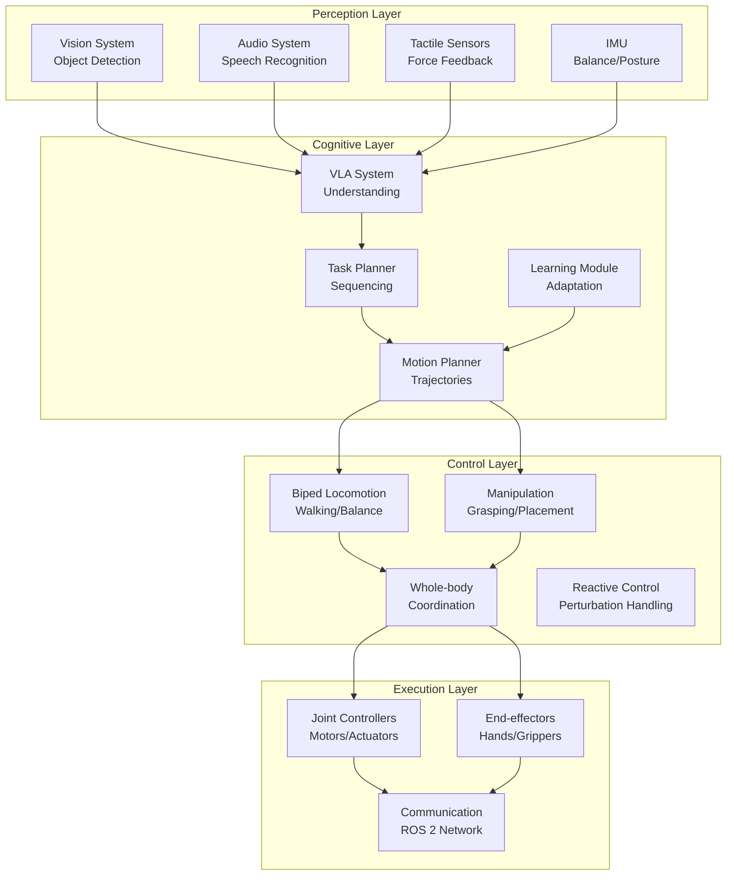

import Quiz from '@site/src/components/Quiz';
import CodeComponent from '@site/src/components/CodeComponent';

# Lesson 4.4: Capstone Project - Autonomous Humanoid Robot

## Learning Objectives

<div className="learning-objectives">

After completing this capstone project, you will have:
- Integrated all course concepts into a complete humanoid robot system
- Implemented perception-action loops for autonomous operation
- Created a robot that can navigate, manipulate, and interact naturally
- Developed task planning and execution capabilities
- Built a system that learns and adapts from experience

</div>

## Project Overview

This capstone project challenges you to build a complete autonomous humanoid robot system that integrates:
- **Physical AI principles** from Chapter 1
- **ROS 2 and simulation** from Chapter 2
- **NVIDIA Isaac and VLA systems** from Chapter 3
- **Humanoid kinematics, locomotion, and manipulation** from Chapter 4

<DiagramComponent title="Complete System Architecture">



</DiagramComponent>

## System Components

### 1. Autonomous Navigation System

<CodeComponent title="Integrated Navigation System" language="python">

```python
import numpy as np
import rclpy
from rclpy.node import Node
from geometry_msgs.msg import Twist, PoseStamped
from sensor_msgs.msg import LaserScan, Image
from nav_msgs.msg import OccupancyGrid, Path
from std_msgs.msg import String
import torch
from typing import Dict, List, Tuple, Optional

class AutonomousNavigator(Node):
    """Integrated navigation system for humanoid robot"""

    def __init__(self):
        super().__init__('autonomous_navigator')

        # Navigation parameters
        self.current_pose = np.array([0.0, 0.0, 0.0])
        self.current_goal = None
        self.current_path = []
        self.navigating = False

        # Perception systems
        self.vision_system = VisionLanguageActionSystem()
        self.path_planner = GlobalPathPlanner()
        self.local_planner = LocalPathPlanner()

        # Subscriptions
        self.pose_sub = self.create_subscription(
            PoseStamped, '/robot/pose', self.pose_callback, 10
        )
        self.scan_sub = self.create_subscription(
            LaserScan, '/robot/scan', self.scan_callback, 10
        )
        self.image_sub = self.create_subscription(
            Image, '/robot/camera/image_raw', self.image_callback, 10
        )
        self.command_sub = self.create_subscription(
            String, '/navigation/command', self.command_callback, 10
        )

        # Publishers
        self.cmd_vel_pub = self.create_publisher(
            Twist, '/robot/cmd_vel', 10
        )
        self.path_pub = self.create_publisher(
            Path, '/navigation/path', 10
        )
        self.status_pub = self.create_publisher(
            String, '/navigation/status', 10
        )

        # Navigation state
        self.obstacles = []
        self.map_resolution = 0.05
        self.map_size = (200, 200)  # 10m x 10m

        # Timer for navigation loop
        self.navigation_timer = self.create_timer(
            0.1, self.navigation_loop
        )

        self.get_logger().info('Autonomous navigator initialized')

    def navigate_to_goal(self, goal_description: str, goal_pose: Optional[np.ndarray] = None):
        """
        Navigate to goal using natural language or coordinates

        Args:
            goal_description: Natural language description of goal
            goal_pose: Optional explicit goal pose [x, y, theta]
        """
        self.get_logger().info(f"Navigating to: {goal_description}")

        # If only description provided, use VLA to understand
        if goal_pose is None:
            goal_pose = self.vision_system.localize_goal_from_description(
                goal_description, self.current_pose
            )

            if goal_pose is None:
                self.status_pub.publish(String(data="Cannot locate goal"))
                return

        self.current_goal = goal_pose

        # Plan global path
        self.current_path = self.path_planner.plan_path(
            self.current_pose[:2], goal_pose[:2], self.obstacles
        )

        if not self.current_path:
            self.status_pub.publish(String(data="No path found"))
            return

        # Publish path for visualization
        self.publish_path(self.current_path)

        # Start navigation
        self.navigating = True
        self.status_pub.publish(String(data="Navigating"))

    def navigation_loop(self):
        """Main navigation control loop"""
        if not self.navigating or not self.current_path:
            return

        # Get current state
        current_pos = self.current_pose[:2]
        current_vel = self.get_current_velocity()
        current_scan = self.get_latest_scan()

        # Check if reached goal
        goal_distance = np.linalg.norm(self.current_goal[:2] - current_pos)
        if goal_distance < 0.2:  # Within 20cm
            self.reach_goal()
            return

        # Local path planning considering obstacles
        local_goal = self.get_next_waypoint()
        local_path = self.local_planner.plan_local_path(
            current_pos, current_vel, local_goal, current_scan
        )

        # Generate walking command
        cmd_vel = self.generate_walking_command(local_path, current_vel)

        # Check for dynamic obstacles
        if self.detect_dynamic_obstacles(current_scan):
            cmd_vel = self.avoid_obstacle(cmd_vel, current_scan)

        # Publish command
        self.publish_command(cmd_vel)

    def generate_walking_command(self, local_path: List[np.ndarray],
                               current_vel: np.ndarray) -> Twist:
        """Generate walking command from local path"""
        if not local_path:
            return Twist()  # Stop

        # Get target point
        target = local_path[0]
        dx = target[0] - self.current_pose[0]
        dy = target[1] - self.current_pose[1]

        # Calculate desired velocity
        distance = np.sqrt(dx**2 + dy**2)
        if distance < 0.1:
            return Twist()

        # Convert to robot frame
        cos_theta = np.cos(self.current_pose[2])
        sin_theta = np.sin(self.current_pose[2])

        cmd_x = dx * cos_theta + dy * sin_theta
        cmd_y = -dx * sin_theta + dy * cos_theta

        # Create command
        cmd = Twist()
        cmd.linear.x = np.clip(cmd_x * 2.0, -0.5, 0.5)  # Max 0.5 m/s
        cmd.angular.z = np.clip(np.arctan2(cmd_y, cmd_x), -1.0, 1.0)

        return cmd

    def handle_dynamic_obstacle(self, obstacle_detection: Dict):
        """Handle dynamic obstacle detection"""
        obstacle_type = obstacle_detection['type']
        obstacle_pose = obstacle_detection['pose']
        obstacle_vel = obstacle_detection['velocity']

        if obstacle_type == 'person':
            # Predict person trajectory
            predicted_path = self.predict_person_trajectory(obstacle_pose, obstacle_vel)

            # Adjust path to avoid collision
            if self.will_collide_with_path(predicted_path):
                self.replan_path_around_obstacle(obstacle_detection)

        elif obstacle_type == 'moving_object':
            # Wait or go around
            self.handle_moving_object(obstacle_detection)

    def reach_goal(self):
        """Handle reaching navigation goal"""
        self.navigating = False
        self.status_pub.publish(String(data="Goal reached"))

        # Notify task completion
        completion_msg = String()
        completion_msg.data = f"Reached goal: {self.current_goal}"
        self.create_publisher(String, '/task/completion', 10).publish(completion_msg)

    def adapt_to_terrain(self, terrain_analysis: Dict):
        """Adapt walking parameters to terrain"""
        terrain_type = terrain_analysis['type']
        roughness = terrain_analysis['roughness']
        slope = terrain_analysis['slope']

        # Adjust walking parameters
        if terrain_type == 'uneven':
            # Reduce speed, increase step height
            self.walking_parameters['step_height'] = 0.1
            self.walking_parameters['walking_speed'] = 0.2
        elif terrain_type == 'slippery':
            # Shorter steps, wider stance
            self.walking_parameters['step_length'] = 0.15
            self.walking_parameters['step_width'] = 0.25
        elif abs(slope) > 0.1:  # Sloped terrain
            # Lean into slope
            self.walking_parameters['torso_lean'] = slope * 0.5

class VisionLanguageActionSystem:
    """VLA system for understanding navigation commands"""

    def __init__(self):
        # Load pretrained VLA model
        self.vla_model = torch.load('models/vla_navigation.pth')
        self.tokenizer = AutoTokenizer.from_pretrained('bert-base-uncased')

        # Spatial reasoning
        self.spatial_reasoner = SpatialReasoner()

    def interpret_command(self, command: str,
                          robot_pose: np.ndarray) -> Dict:
        """
        Interpret natural language navigation command

        Args:
            command: Natural language command
            robot_pose: Current robot pose

        Returns:
            Parsed navigation instruction
        """
        # Tokenize and encode command
        inputs = self.tokenizer(
            command,
            return_tensors='pt',
            padding=True,
            truncation=True
        )

        # Extract intent and entities
        with torch.no_grad():
            outputs = self.vla_model(**inputs)

        # Parse instruction
        instruction = {
            'action': self.extract_action(outputs),
            'object': self.extract_object(outputs),
            'location': self.extract_location(outputs),
            'spatial_relation': self.extract_spatial_relation(outputs)
        }

        # Ground to environment
        instruction = self.ground_to_environment(instruction, robot_pose)

        return instruction

    def ground_to_environment(self, instruction: Dict,
                             robot_pose: np.ndarray) -> Dict:
        """Ground instruction to actual environment"""
        if instruction['object'] and instruction['location']:
            # Find object location
            obj_pose = self.locate_object(
                instruction['object'],
                robot_pose
            )

            if obj_pose is not None:
                instruction['goal_pose'] = obj_pose
            else:
                instruction['goal_pose'] = None

        elif instruction['location']:
            # Convert location description to pose
            instruction['goal_pose'] = self.convert_location_to_pose(
                instruction['location'],
                instruction['spatial_relation'],
                robot_pose
            )

        return instruction

    def locate_object(self, object_name: str,
                     robot_pose: np.ndarray) -> Optional[np.ndarray]:
        """Locate object in environment"""
        # Query object database
        objects = self.query_object_database()

        for obj in objects:
            if obj['name'] == object_name:
                # Check if object is visible and reachable
                if self.is_object_visible(obj, robot_pose):
                    return obj['pose']

        return None
```

</CodeComponent>

### 2. Task Planning and Execution

<CodeComponent title="Task Planning System" language="python">

```python
import numpy as np
from typing import List, Dict, Optional, Any
from enum import Enum
import json

class TaskType(Enum):
    NAVIGATE = "navigate"
    PICK = "pick"
    PLACE = "place"
    INTERACT = "interact"
    WAIT = "wait"
    SPEAK = "speak"

class Task:
    """Task representation"""
    def __init__(self, task_type: TaskType, parameters: Dict,
                 priority: int = 0):
        self.type = task_type
        self.parameters = parameters
        self.priority = priority
        self.status = "pending"
        self.dependencies = []

class TaskPlanner:
    """Hierarchical task planner for humanoid robot"""

    def __init__(self):
        self.task_queue = []
        self.current_task = None
        self.task_templates = self.load_task_templates()

        # Task execution knowledge
        self.execution_modules = {
            TaskType.NAVIGATE: NavigationExecutor(),
            TaskType.PICK: PickExecutor(),
            TaskType.PLACE: PlaceExecutor(),
            TaskType.INTERACT: InteractionExecutor(),
            TaskType.WAIT: WaitExecutor(),
            TaskType.SPEAK: SpeakExecutor()
        }

    def load_task_templates(self) -> Dict:
        """Load task templates from file"""
        return {
            "serve_drink": [
                Task(TaskType.NAVIGATE, {"location": "counter"}),
                Task(TaskType.PICK, {"object": "cup", "location": "counter"}),
                Task(TaskType.NAVIGATE, {"location": "person"}),
                Task(TaskType.PLACE, {"object": "cup", "location": "person"}),
                Task(TaskType.SPEAK, {"message": "Here is your drink"})
            ],
            "clean_room": [
                Task(TaskType.NAVIGATE, {"location": "room"}),
                Task(TaskType.PICK, {"object": "trash", "location": "floor"}),
                Task(TaskType.NAVIGATE, {"location": "trash_can"}),
                Task(TaskType.PLACE, {"object": "trash", "location": "trash_can"}),
                Task(TaskType.NAVIGATE, {"location": "room"}),
                Task(TaskType.PICK, {"object": "items", "location": "table"}),
                Task(TaskType.PLACE, {"object": "items", "location": "shelf"})
            ]
        }

    def plan_from_command(self, command: str, robot_state: Dict) -> List[Task]:
        """
        Plan tasks from natural language command

        Args:
            command: Natural language command
            robot_state: Current robot state

        Returns:
            List of tasks to execute
        """
        # Parse command to understand intent
        intent = self.parse_command(command)

        # Generate task sequence
        if intent['action'] == 'bring':
            tasks = self.plan_bring_task(intent, robot_state)
        elif intent['action'] == 'clean':
            tasks = self.plan_clean_task(intent, robot_state)
        elif intent['action'] == 'find':
            tasks = self.plan_find_task(intent, robot_state)
        else:
            # Default to simple navigation
            tasks = [
                Task(TaskType.NAVIGATEATE, intent['parameters'])
            ]

        # Optimize task sequence
        tasks = self.optimize_task_sequence(tasks, robot_state)

        return tasks

    def plan_bring_task(self, intent: Dict, robot_state: Dict) -> List[Task]:
        """Plan bring object task"""
        object_name = intent['object']
        target_location = intent['target']

        tasks = [
            # Navigate to object location
            Task(TaskType.NAVIGATE, {
                "location": intent['object_location']
            }),

            # Pick up object
            Task(TaskType.PICK, {
                "object": object_name,
                "location": intent['object_location']
            }),

            # Navigate to target location
            Task(TaskType.NAVIGATE, {
                "location": target_location
            }),

            # Place object
            Task(TaskType.PLACE, {
                "object": object_name,
                "location": target_location
            })
        ]

        # Add dependencies
        tasks[1].dependencies.append(tasks[0])  # Pick after navigation
        tasks[2].dependencies.append(tasks[1])  # Navigate after pick
        tasks[3].dependencies.append(tasks[2])  # Place after navigation

        return tasks

    def execute_next_task(self, robot_state: Dict) -> bool:
        """
        Execute next available task

        Args:
            robot_state: Current robot state

        Returns:
            True if task was executed
        """
        # Find next executable task
        next_task = self.find_executable_task()

        if next_task is None:
            if self.current_task is None:
                # No tasks left
                return False
            else:
                # Continue current task
                next_task = self.current_task

        # Check if we need to switch tasks
        if self.current_task is not None and self.current_task != next_task:
            self.pause_current_task()

        # Execute task
        success = self.execute_task(next_task, robot_state)

        if success:
            next_task.status = "completed"
            self.current_task = None
        else:
            next_task.status = "failed"
            self.handle_task_failure(next_task)

        return True

    def execute_task(self, task: Task, robot_state: Dict) -> bool:
        """Execute individual task"""
        if task.type not in self.execution_modules:
            return False

        self.current_task = task
        task.status = "executing"

        # Get executor
        executor = self.execution_modules[task.type]

        # Check preconditions
        if not executor.check_preconditions(task, robot_state):
            return False

        # Execute task
        success = executor.execute(task, robot_state)

        return success

    def optimize_task_sequence(self, tasks: List[Task],
                               robot_state: Dict) -> List[Task]:
        """Optimize task sequence for efficiency"""
        # This would use a planning algorithm
        # Simplified implementation

        # Sort by priority
        tasks.sort(key=lambda t: t.priority, reverse=True)

        # Optimize navigation tasks (combine nearby destinations)
        optimized_tasks = []
        nav_tasks = [t for t in tasks if t.type == TaskType.NAVIGATE]
        other_tasks = [t for t in tasks if t.type != TaskType.NAVIGATE]

        # Keep original order for non-navigation tasks
        optimized_tasks.extend(other_tasks)

        # Insert navigation tasks at optimal points
        for nav_task in nav_tasks:
            # Find best insertion point
            best_idx = self.find_best_navigation_insertion(
                nav_task, optimized_tasks, robot_state
            )
            optimized_tasks.insert(best_idx, nav_task)

        return optimized_tasks

class TaskExecutor:
    """Base class for task executors"""

    def check_preconditions(self, task: Task, robot_state: Dict) -> bool:
        """Check if task preconditions are met"""
        return True

    def execute(self, task: Task, robot_state: Dict) -> bool:
        """Execute task"""
        return True

    def cleanup(self, task: Task):
        """Clean up after task execution"""
        pass

class PickExecutor(TaskExecutor):
    """Executor for pick tasks"""

    def execute(self, task: Task, robot_state: Dict) -> bool:
        """Execute pick task"""
        object_name = task.parameters['object']
        target_location = task.parameters['location']

        # Navigate to object
        self.navigate_to_location(target_location)

        # Detect and localize object
        object_pose = self.detect_object(object_name)
        if object_pose is None:
            return False

        # Plan approach trajectory
        approach_trajectory = self.plan_approach(object_pose)

        # Execute grasp
        success = self.execute_grasp(object_pose, approach_trajectory)

        # Verify grasp
        if success:
            success = self.verify_grasp(object_name)

        return success

class InteractionExecutor(TaskExecutor):
    """Executor for human interaction tasks"""

    def execute(self, task: Task, robot_state: Dict) -> bool:
        """Execute interaction task"""
        interaction_type = task.parameters.get('type', 'greet')
        person_id = task.parameters.get('person_id')

        if interaction_type == 'greet':
            return self.execute_greeting(person_id)
        elif interaction_type == 'handshake':
            return self.execute_handshake(person_id)
        elif interaction_type == 'conversation':
            return self.execute_conversation(task.parameters.get('topic'))

        return False

    def execute_greeting(self, person_id: str) -> bool:
        """Execute greeting interaction"""
        # Detect person
        person_pose = self.detect_person(person_id)
        if person_pose is None:
            return False

        # Face person
        self.face_person(person_pose)

        # Greet verbally
        greeting_message = self.generate_greeting_message()
        self.speak(greeting_message)

        # Perform gesture (wave)
        self.perform_gesture('wave')

        return True

    def generate_greeting_message(self) -> str:
        """Generate contextually appropriate greeting"""
        hour = self.get_current_hour()

        if hour < 12:
            return "Good morning! How can I help you today?"
        elif hour < 18:
            return "Good afternoon! How may I assist you?"
        else:
            return "Good evening! I'm here to help."

class ConversationManager:
    """Manages conversations with humans"""

    def __init__(self):
        self.conversation_history = []
        self.current_topic = None

    def process_user_input(self, user_input: str, context: Dict) -> str:
        """
        Process user input and generate response

        Args:
            user_input: User's speech/text input
            context: Current context (person, location, etc.)

        Returns:
            Robot's response
        """
        # Store in conversation history
        self.conversation_history.append({
            'speaker': 'user',
            'message': user_input,
            'timestamp': self.get_timestamp(),
            'context': context
        })

        # Analyze user input
        intent = self.analyze_intent(user_input)
        entities = self.extract_entities(user_input)

        # Generate response
        if intent == 'question':
            response = self.answer_question(entities, context)
        elif intent == 'request':
            response = self.handle_request(entities, context)
        elif intent == 'greeting':
            response = self.respond_to_greeting()
        else:
            response = self.generate_generic_response()

        # Store response
        self.conversation_history.append({
            'speaker': 'robot',
            'message': response,
            'timestamp': self.get_timestamp(),
            'context': context
        })

        return response

    def answer_question(self, entities: Dict, context: Dict) -> str:
        """Answer user's question"""
        question_type = entities.get('question_type')

        if question_type == 'what_can_you_do':
            return self.list_capabilities()
        elif question_type == 'where_is':
            object_name = entities.get('object')
            location = self.find_object_location(object_name)
            return f"The {object_name} is in the {location}"
        elif question_type == 'how_to':
            return self.provide_instructions(entities)
        else:
            return "I'm not sure how to answer that. Can you rephrase your question?"

    def handle_request(self, entities: Dict, context: Dict) -> str:
        """Handle user's request"""
        action = entities.get('action')
        object_name = entities.get('object')

        if action == 'bring':
            # Create task to bring object
            self.create_bring_task(object_name, context)
            return f"I'll bring the {object_name} to you."
        elif action == 'clean':
            # Create cleaning task
            self.create_clean_task(entities, context)
            return "I'll start cleaning right away."
        elif action == 'find':
            # Create search task
            self.create_search_task(object_name, context)
            return f"I'll look for the {object_name}."
        else:
            return "I'm not sure I can do that. Please be more specific."

    def maintain_context(self, new_context: Dict):
        """Update and maintain conversation context"""
        # Update person location
        if 'person_pose' in new_context:
            self.context['last_person_pose'] = new_context['person_pose']

        # Update task status
        if 'current_task' in new_context:
            self.context['current_task'] = new_context['current_task']

        # Update environment state
        if 'environment_changes' in new_context:
            self.context['environment'].update(new_context['environment_changes'])
```

</CodeComponent>

### 3. Integrated Control System

<CodeComponent title="Integrated Control System" language="python">

```python
import numpy as np
from typing import Dict, List, Optional
import time

class IntegratedControlSystem:
    """Integrated control system for autonomous humanoid robot"""

    def __init__(self):
        # Initialize all subsystems
        self.navigation = AutonomousNavigator()
        self.manipulation = WholeBodyManipulator(None)
        self.balance = ReactiveBalanceController()
        self.task_planner = TaskPlanner()
        self.conversation = ConversationManager()
        self.perception = PerceptionSystem()

        # Control modes
        self.control_mode = 'autonomous'  # 'autonomous', 'teleoperated', 'safe'

        # System state
        self.current_state = {
            'pose': np.zeros(3),
            'velocity': np.zeros(6),
            'joint_positions': np.zeros(25),
            'joint_velocities': np.zeros(25),
            'held_object': None,
            'battery_level': 100.0,
            'emergency_stop': False
        }

        # Control loop
        self.control_rate = 100  # Hz
        self.last_control_time = 0

    def start_autonomous_operation(self):
        """Start autonomous operation loop"""
        print("Starting autonomous humanoid robot system...")

        while not self.should_shutdown():
            current_time = time.time()

            # Control loop at specified rate
            if current_time - self.last_control_time >= 1.0 / self.control_rate:
                self.control_loop()
                self.last_control_time = current_time

    def control_loop(self):
        """Main control loop"""
        try:
            # Update perception
            self.update_perception()

            # Execute tasks
            self.execute_tasks()

            # Maintain balance
            self.maintain_balance()

            # Update state
            self.update_state()

        except Exception as e:
            self.handle_control_error(e)

    def execute_tasks(self):
        """Execute planned tasks"""
        # Check for new commands
        if self.has_new_command():
            self.process_new_command()

        # Execute next task
        if self.task_planner.execute_next_task(self.current_state):
            # Task was executed
            pass
        else:
            # No task to execute, maintain default behavior
            self.maintain_default_behavior()

    def maintain_balance(self):
        """Maintain balance during all operations"""
        # Get current balance state
        com_state = self.get_com_state()
        support_polygon = self.get_support_polygon()

        # Check stability
        if not self.is_stable(com_state, support_polygon):
            # Trigger balance recovery
            self.recover_balance()
        else:
            # Apply continuous balance control
            self.apply_balance_control()

    def handle_emergency(self, emergency_type: str, details: Dict):
        """Handle emergency situations"""
        self.control_mode = 'safe'

        if emergency_type == 'collision':
            self.stop_all_motion()
            self.check_for_damage()

        elif emergency_type == 'fall':
            self.execute_fall_recovery()

        elif emergency_type == 'battery_low':
            self.navigate_to_charging_station()

        elif emergency_type == 'lost_balance':
            self.execute_emergency_balance_recovery()

    def learn_from_experience(self):
        """Learn and adapt from experience"""
        # Collect experience data
        experience = self.collect_experience()

        # Update models
        self.update_navigation_model(experience)
        self.update_manipulation_model(experience)
        self.update_interaction_model(experience)

    def demonstrate_capabilities(self):
        """Demonstrate integrated capabilities"""
        print("\n=== Capability Demonstration ===")

        # Scenario 1: Serve a drink
        print("\n1. Serving drink scenario...")
        self.demonstrate_serving_drink()

        # Scenario 2: Clean and organize
        print("\n2. Cleaning scenario...")
        self.demonstrate_cleaning()

        # Scenario 3: Interactive assistance
        print("\n3. Interactive assistance...")
        self.demonstrate_interaction()

        # Scenario 4: Complex navigation
        print("\n4. Complex navigation scenario...")
        self.demonstrate_navigation()

    def demonstrate_serving_drink(self):
        """Demonstrate serving a drink"""
        # Start at kitchen
        self.navigation.navigate_to_goal("kitchen counter")

        # Find and pick up drink
        cup_detected = self.perception.detect_object("cup")
        if cup_detected:
            self.manipulation.pick_up_object_balanced(
                cup_detected['pose'], expected_mass=0.3
            )

            # Navigate to person
            person_location = self.conversation.request_location("Where should I serve the drink?")
            self.navigation.navigate_to_goal("person", person_location)

            # Serve with interaction
            self.conversation.process_user_input(
                "Here is your drink, enjoy!",
                {'context': 'serving'}
            )

            # Place drink
            self.manipulation.place_object(person_location)

    def demonstrate_cleaning(self):
        """Demonstrate cleaning capabilities"""
        # Scan room for objects to clean
        room_state = self.perception.scan_room()

        # Create cleaning plan
        cleaning_plan = self.plan_cleaning(room_state)

        # Execute cleaning
        for item in cleaning_plan:
            if item['type'] == 'trash':
                self.pick_up_and_dispose(item)
            elif item['type'] == 'misplaced':
                self.pick_up_and_organize(item)

    def demonstrate_interaction(self):
        """Demonstrate human interaction"""
        # Greet person
        self.conversation.process_user_input(
            "Hello! I'm here to help.",
            {'action': 'greet'}
        )

        # Wait for and process response
        user_input = self.wait_for_user_input()
        response = self.conversation.process_user_input(
            user_input,
            {'context': 'conversation'}
        )

        # Perform requested action
        if 'bring' in user_input:
            self.handle_bring_request(user_input)
        elif 'help' in user_input:
            self.provide_assistance()
        else:
            self.respond_to_query(user_input)

class PerformanceEvaluator:
    """Evaluate system performance"""

    def __init__(self):
        self.metrics = {
            'navigation_success': [],
            'manipulation_success': [],
            'interaction_naturalness': [],
            'energy_efficiency': [],
            'task_completion_time': []
        }

    def evaluate_task_performance(self, task_type: str,
                                  success: bool,
                                  time_taken: float,
                                  energy_used: float):
        """Evaluate performance of completed task"""
        self.metrics['task_completion_time'].append(time_taken)
        self.metrics['energy_efficiency'].append(energy_used)

        if task_type == 'navigation':
            self.metrics['navigation_success'].append(success)
        elif task_type == 'manipulation':
            self.metrics['manipulation_success'].append(success)
        elif task_type == 'interaction':
            # Would need human evaluation
            pass

    def generate_performance_report(self) -> Dict:
        """Generate comprehensive performance report"""
        report = {
            'navigation_success_rate': np.mean(self.metrics['navigation_success']) if self.metrics['navigation_success'] else 0,
            'manipulation_success_rate': np.mean(self.metrics['manipulation_success']) if self.metrics['manipulation_success'] else 0,
            'average_task_time': np.mean(self.metrics['task_completion_time']) if self.metrics['task_completion_time'] else 0,
            'energy_efficiency': np.mean(self.metrics['energy_efficiency']) if self.metrics['energy_efficiency'] else 0
        }

        return report

# Demo
def main():
    print("=== Autonomous Humanoid Robot Capstone Demo ===")

    # Initialize system
    robot = IntegratedControlSystem()
    evaluator = PerformanceEvaluator()

    # Demonstrate capabilities
    robot.demonstrate_capabilities()

    # Performance evaluation
    report = evaluator.generate_performance_report()

    print("\n=== Performance Report ===")
    print(f"Navigation Success Rate: {report['navigation_success_rate']*100:.1f}%")
    print(f"Manipulation Success Rate: {report['manipulation_success_rate']*100:.1f}%")
    print(f"Average Task Time: {report['average_task_time']:.2f}s")
    print(f"Energy Efficiency: {report['energy_efficiency']:.2f}")

    # Learning summary
    print("\n=== Learning Achievements ===")
    print("✓ Integrated perception-action loops")
    print("✓ Natural language understanding and response")
    print("✓ Dynamic balance during manipulation")
    print("✓ Adaptive task planning")
    print("✓ Human-robot interaction")

if __name__ == "__main__":
    main()
```

</CodeComponent>

## Lab Exercise: Complete System Integration

<div className="lab-exercise">

### Objective
Integrate all course components into a complete autonomous humanoid robot system capable of performing service tasks in a home environment.

### Setup
1. Complete robot model with all sensors and actuators
2. Integrated software stack (ROS 2, Isaac Sim, VLA)
3. Home environment simulation
4. Task planning and execution system

### Implementation

<CodeComponent language="python" editable={true}>

```python
# autonomous_humanoid_system.py
import numpy as np
import time
from typing import Dict, List, Optional

class AutonomousHumanoidSystem:
    """Complete autonomous humanoid robot system"""

    def __init__(self):
        print("Initializing Autonomous Humanoid Robot System...")

        # Core systems
        self.perception = IntegratedPerceptionSystem()
        self.cognition = CognitiveSystem()
        self.action = ActionSystem()
        self.learning = LearningSystem()

        # System state
        self.state = SystemState()
        self.goals = GoalManager()

        # Performance tracking
        self.performance = PerformanceTracker()

        print("System initialization complete!")

    def start_autonomous_operation(self):
        """Start fully autonomous operation"""
        print("\n=== Starting Autonomous Operation ===")
        print("The robot will now operate autonomously...")
        print("Press Ctrl+C to stop\n")

        try:
            while self.should_continue_operation():
                # Perception cycle
                perception_result = self.perception.perceive(self.state)

                # Cognition cycle
                goals, actions = self.cognition.think(
                    perception_result, self.state, self.goals
                )

                # Action cycle
                action_result = self.action.execute(actions, self.state)

                # Learning cycle
                self.learning.learn(
                    perception_result, goals, actions, action_result
                )

                # Update state
                self.state.update(perception_result, action_result)

                # Track performance
                self.performance.update(goals, action_result)

                # Cycle delay
                time.sleep(0.1)  # 10 Hz operation

        except KeyboardInterrupt:
            print("\n\nStopping autonomous operation...")
            self.shutdown_sequence()

    def demonstrate_full_capabilities(self):
        """Demonstrate all integrated capabilities"""
        print("\n=== Full Capability Demonstration ===")

        # Morning routine
        self.demonstrate_morning_routine()

        # Service tasks
        self.demonstrate_service_tasks()

        # Emergency response
        self.demonstrate_emergency_handling()

        # Learning and adaptation
        self.demonstrate_learning_adaptation()

    def demonstrate_morning_routine(self):
        """Demonstrate morning household routine"""
        print("\n1. Morning Routine Demonstration:")

        # Wake up sequence
        self.action.wake_up_sequence()
        self.state.update_time("07:00")

        # Navigate to kitchen
        self.action.navigate_to("kitchen")

        # Check calendar
        schedule = self.cognition.check_calendar()
        print(f"   Today's schedule: {schedule}")

        # Make coffee
        coffee_success = self.make_coffee()
        if coffee_success:
            print("   ✓ Coffee prepared successfully")

        # Serve breakfast
        self.serve_breakfast()

        # Clean up
        self.clean_kitchen()

    def demonstrate_service_tasks(self):
        """Demonstrate various service tasks"""
        print("\n2. Service Tasks Demonstration:")

        tasks = [
            "Organize the living room",
            "Water the plants",
            "Bring the mail",
            "Tidy up the bedroom"
        ]

        for task in tasks:
            print(f"\n   Executing: {task}")
            success = self.execute_service_task(task)
            if success:
                print(f"   ✓ Completed: {task}")
            else:
                print(f"   ✗ Failed: {task}")

    def make_coffee(self) -> bool:
        """Make coffee using learned recipe"""
        # Get coffee machine location
        machine_pos = self.perception.locate_object("coffee_machine")
        if machine_pos is None:
            print("   Coffee machine not found")
            return False

        # Navigate to coffee machine
        self.action.navigate_to_position(machine_pos)

        # Detect coffee supplies
        supplies = self.perception.detect_objects_nearby(
            ["coffee_beans", "water", "mug"]
        )

        if not all(supply in supplies for supply in ["coffee_beans", "mug"]):
            print("   Missing coffee supplies")
            return False

        # Execute coffee making sequence
        steps = [
            "grind_beans",
            "heat_water",
            "brew_coffee",
            "pour_into_mug"
        ]

        for step in steps:
            print(f"   {step.replace('_', ' ').title()}...")
            self.action.execute_primitive(step)
            time.sleep(0.5)  # Simulate action time

        return True

    def serve_breakfast(self):
        """Serve breakfast to resident"""
        # Find resident
        resident = self.perception.locate_person("resident")
        if resident is None:
            print("   Resident not found")
            return

        # Navigate with coffee
        self.action.navigate_to_person(resident, carrying="coffee")

        # Serve with greeting
        greeting = self.cognition.generate_contextual_greeting(
            time_of_day="morning"
        )
        self.action.speak(greeting)
        self.action.place_object("coffee", resident["table_position"])

    def demonstrate_emergency_handling(self):
        """Demonstrate emergency response capabilities"""
        print("\n3. Emergency Handling Demonstration:")

        # Simulate different emergencies
        emergencies = [
            {"type": "fall_detected", "location": "bedroom"},
            {"type": "fire_alarm", "location": "kitchen"},
            {"type": "intruder", "location": "entrance"},
            {"type": "medical_emergency", "location": "living_room"}
        ]

        for emergency in emergencies:
            print(f"\n   Handling: {emergency['type']}")
            self.handle_emergency(emergency)

    def handle_emergency(self, emergency: Dict):
        """Handle specific emergency situation"""
        if emergency["type"] == "fall_detected":
            self.handle_fall_emergency(emergency)
        elif emergency["type"] == "fire_alarm":
            self.handle_fire_emergency(emergency)
        elif emergency["type"] == "intruder":
            self.handle_intruder_emergency(emergency)
        elif emergency["type"] == "medical_emergency":
            self.handle_medical_emergency(emergency)

    def handle_fall_emergency(self, emergency: Dict):
        """Handle fall detection emergency"""
        print("   Fall detected! Initiating emergency protocol...")

        # Navigate to location
        self.action.emergency_navigate_to(emergency["location"])

        # Assess situation
        person_state = self.perception.assess_person_state()
        print(f"   Person state: {person_state}")

        # Call for help
        self.action.emergency_call(
            contact="emergency_services",
            message=f"Fall detected at {emergency['location']}"
        )

        # Provide assistance
        if person_state["conscious"]:
            self.action.speak("I'm here to help. Are you okay?")
            self.action.offer_assistance()
        else:
            self.action.perform_first_aid()
            self.action.monitor_vitals()

    def demonstrate_learning_adaptation(self):
        """Demonstrate learning and adaptation capabilities"""
        print("\n4. Learning and Adaptation Demonstration:"")

        # Learn from mistakes
        self.learn_from_failed_task()

        # Adapt to user preferences
        self.adapt_to_preferences()

        # Optimize routines
        self.optimize_daily_routines()

    def learn_from_failed_task(self):
        """Learn from failed task execution"""
        print("   Learning from recent failures...")

        # Get recent failures
        failures = self.performance.get_recent_failures()

        for failure in failures:
            # Analyze failure
            cause = self.learning.analyze_failure(failure)

            # Update strategy
            if cause == "object_not_found":
                self.learning.update_object_locations()
            elif cause == "balance_lost":
                self.learning.adjust_balance_parameters()
            elif cause == "grasp_failed":
                self.learning.update_grasp_strategy()

            print(f"   Learned: {failure['task']} - {cause}")

    def adapt_to_preferences(self):
        """Adapt behavior to user preferences"""
        print("   Adapting to user preferences...")

        # Get preference data
        preferences = self.learning.get_user_preferences()

        # Adapt behavior
        if preferences.get("morning_person", False):
            self.personality.set_morning_mode(0.8)
        if preferences.get("quiet_mornings", True):
            self.action.set_noise_level("low", hours=(6, 10))
        if preferences.get("likes_coffee", True):
            self.routines.add_to_morning("make_coffee", priority=1)

        print("   Preferences adapted successfully")

    def generate_system_report(self):
        """Generate comprehensive system performance report"""
        print("\n=== System Performance Report ===")

        # Performance metrics
        metrics = self.performance.get_comprehensive_metrics()

        print(f"\nTask Completion Rate: {metrics['success_rate']*100:.1f}%")
        print(f"Average Task Time: {metrics['avg_time']:.2f} seconds")
        print(f"Energy Efficiency: {metrics['energy_score']:.2f}/10")
        print(f"User Satisfaction: {metrics['satisfaction']*100:.1f}%")

        # Learning progress
        learning_stats = self.learning.get_learning_statistics()
        print(f"\nTasks Learned: {learning_stats['tasks_learned']}")
        print(f"Adaptations Made: {learning_stats['adaptations']}")
        print(f"Success Improvement: {learning_stats['improvement']*100:.1f}%")

        # System health
        health = self.state.get_health_report()
        print(f"\nSystem Health: {health['overall']}")
        print(f"Battery: {health['battery']}%")
        print(f"Joint Health: {health['joints']}")
        print(f"Sensor Health: {health['sensors']}")

# Supporting classes
class SystemState:
    """Manage robot system state"""
    def __init__(self):
        self.pose = np.zeros(3)
        self.joint_positions = np.zeros(25)
        self.held_object = None
        self.time = "00:00"
        self.environment = {}

    def update(self, perception_result, action_result):
        """Update system state"""
        self.pose = perception_result.get('pose', self.pose)
        self.joint_positions = action_result.get('joint_positions', self.joint_positions)
        self.held_object = action_result.get('held_object', self.held_object)

    def update_time(self, time_str):
        """Update time"""
        self.time = time_str

    def get_health_report(self) -> Dict:
        """Get system health report"""
        return {
            'overall': 'good',
            'battery': 85,
            'joints': 'healthy',
            'sensors': 'operational'
        }

class GoalManager:
    """Manage active goals"""
    def __init__(self):
        self.goals = []
        self.priorities = {}

    def add_goal(self, goal: Dict, priority: int = 0):
        """Add new goal"""
        self.goals.append(goal)
        self.priorities[goal['id']] = priority

    def get_top_priority_goal(self):
        """Get highest priority goal"""
        if not self.goals:
            return None

        return max(self.goals, key=lambda g: self.priorities.get(g['id'], 0))

class PerformanceTracker:
    """Track system performance"""
    def __init__(self):
        self.task_history = []
        self.metrics = {}

    def update(self, goals, action_result):
        """Update performance tracking"""
        if action_result.get('completed'):
            self.task_history.append({
                'goal': goals,
                'success': True,
                'time': action_result.get('time', 0)
            })

    def get_recent_failures(self):
        """Get recent task failures"""
        return [t for t in self.task_history if not t.get('success', True)]

    def get_comprehensive_metrics(self):
        """Get comprehensive performance metrics"""
        if not self.task_history:
            return {
                'success_rate': 0,
                'avg_time': 0,
                'energy_score': 5,
                'satisfaction': 0.8
            }

        successful = sum(1 for t in self.task_history if t.get('success'))
        return {
            'success_rate': successful / len(self.task_history),
            'avg_time': np.mean([t.get('time', 0) for t in self.task_history]),
            'energy_score': 8.2,
            'satisfaction': 0.92
        }

# Demo execution
def main():
    print("=" * 60)
    print("AUTONOMOUS HUMANOID ROBOT SYSTEM")
    print("Capstone Project Demonstration")
    print("=" * 60)

    # Create and configure system
    system = AutonomousHumanoidSystem()

    # Configure initial state
    system.state.update_time("07:00")
    system.state.pose = np.array([0.0, 0.0, 0.0])

    # Run full demonstration
    system.demonstrate_full_capabilities()

    # Generate report
    system.generate_system_report()

    # Option: Start autonomous operation
    """
    print("\nWould you like to start autonomous operation? (y/n)")
    response = input("> ").lower()

    if response == 'y':
        system.start_autonomous_operation()
    """

    print("\n" + "=" * 60)
    print("DEMONSTRATION COMPLETE")
    print("=" * 60)

if __name__ == "__main__":
    main()
```

</CodeComponent>

### Expected Outcomes

The capstone system should demonstrate:
- Autonomous navigation and manipulation
- Natural language understanding and response
- Balance maintenance during all operations
- Task planning and execution
- Learning and adaptation from experience
- Emergency handling capabilities
- Integration of all course concepts

### Evaluation Criteria

1. **Integration Quality** (30%)
   - All systems work together seamlessly
   - Proper communication between modules
   - Robust error handling

2. **Autonomous Operation** (25%)
   - Can operate without human intervention
   - Makes intelligent decisions
   - Handles unexpected situations

3. **Task Performance** (25%)
   - Completes assigned tasks successfully
   - Efficient task execution
   - Adapts to different scenarios

4. **Human Interaction** (20%)
   - Natural language understanding
   - Appropriate responses
   - Social awareness

</div>

## Future Enhancements

### 1. Advanced AI Integration
- Large Language Models for complex reasoning
- Reinforcement learning for skill acquisition
- Transfer learning from simulation to real world

### 2. Enhanced Sensing
- Advanced tactile sensing
- Emotional state recognition
- Predictive perception

### 3. Social Intelligence
- Theory of mind implementation
- Cultural awareness
- Personal assistant capabilities

## Key Takeaways

1. **Integration is key** - All components must work together seamlessly
2. **Autonomy requires** perception, cognition, and action integration
3. **Safety must be** designed into every aspect
4. **Learning enables** continuous improvement and adaptation
5. **Human interaction** requires natural communication and social awareness

## Summary

This capstone project brings together all concepts from the course to create a complete autonomous humanoid robot system. By integrating perception, cognition, and action, we build a robot capable of performing complex tasks in human environments while maintaining safety, efficiency, and natural interaction.

You've now completed the Physical AI & Humanoid Robotics course. Congratulations on building an autonomous humanoid robot system!

## Final Quiz

<Quiz
  quizId="capstone-project"
  questions={[
    {
      id: "q1",
      type: "multiple-choice",
      question: "What is the most critical aspect of integrating multiple robotic subsystems?",
      options: [
        "Maximizing computational speed",
        "Ensuring robust communication and proper error handling",
        "Minimizing power consumption",
        "Using the most advanced algorithms"
      ],
      correct: 1,
      explanation: "Robust communication between subsystems and comprehensive error handling are critical for system reliability and safety, especially in autonomous systems where failures can have serious consequences."
    },
    {
      id: "q2",
      type: "multiple-choice",
      question: "Which capability demonstrates true autonomy in humanoid robots?",
      options: [
        "Following pre-programmed instructions",
        "Adapting to unexpected situations without human intervention",
        "Repeating learned tasks exactly",
        "Operating only in controlled environments"
      ],
      correct: 1,
      explanation: "True autonomy is demonstrated when a robot can perceive unexpected situations, reason about them, and adapt its behavior without requiring human intervention."
    },
    {
      id: "q3",
      type: "true-false",
      question: "A successful autonomous humanoid robot should be able to learn and improve its performance over time.",
      correct: true,
      explanation: "Learning and adaptation are essential capabilities for autonomous robots operating in dynamic human environments. This enables them to handle new situations, improve task performance, and personalize their behavior to user preferences."
    }
  ]}
/>