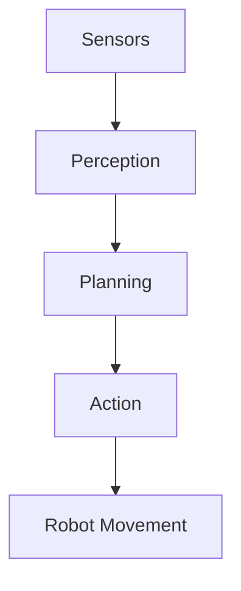

import Quiz from '@site/src/components/Quiz';

# Welcome to Physical AI & Humanoid Robotics


## What is This Textbook?

This is an **interactive, AI-powered textbook** that teaches you the fundamentals of Physical AI and Humanoid Robotics. Unlike traditional textbooks, this platform combines:

- 📚 **Comprehensive Theory** - Deep explanations of core concepts
- 💻 **Interactive Code Examples** - Run code directly in your browser
- 🤖 **Hands-on Labs** - Practice with real robotics simulations
- 🧠 **AI Assistant** - Ask questions and get instant help
- 🌐 **Multilingual Support** - Learn in English or Urdu

## Who Is This For?

This textbook is designed for:

- **Students** learning robotics and AI
- **Educators** teaching Physical AI concepts
- **Engineers** transitioning to robotics
- **Researchers** exploring embodied AI
- **Hobbyists** building humanoid robots

## What You'll Learn

### Chapter 1: Physical AI Foundations
- Understanding embodied intelligence
- Digital vs Physical AI
- Robot sensors and perception systems

### Chapter 2: Core Robotics Systems
- ROS 2 fundamentals
- Simulation with Gazebo & Unity
- Robot control and communication

### Chapter 3: AI-Robot Intelligence
- NVIDIA Isaac Platform
- Vision-Language-Action systems
- Conversational robots

### Chapter 4: Humanoid Robotics Capstone
- Biped locomotion
- Balance and manipulation
- Complete autonomous humanoid project

## How to Use This Book

1. **Read Theory Sections** - Learn the concepts
2. **Run Code Examples** - Experiment with interactive code
3. **Complete Labs** - Hands-on practice exercises
4. **Take Quizzes** - Test your understanding
5. **Ask Questions** - Use the AI assistant for help

## Prerequisites

- Basic programming knowledge (Python preferred)
- Understanding of fundamental AI/ML concepts
- Computer with internet access
- Optional: ROS 2 installation for advanced exercises

## Getting Help

Throughout this book, you have access to:

- **📘 Ask Book Button** - Click on any text to ask questions
- **💬 AI Chat Assistant** - Get instant clarification
- **🔍 Search** - Find specific topics quickly
- **📝 Notes** - Take personal notes on lessons

## Learning Path

This textbook is structured as a **13-week course**:

- **Weeks 1-2**: Physical AI Foundations
- **Weeks 3-7**: Core Robotics Systems
- **Weeks 8-13**: AI-Robot Intelligence & Capstone

You can go at your own pace, but we recommend following the lessons in order as each builds on previous knowledge.

## Interactive Features

### Code Runner
Every code example can be run and modified directly in your browser:

```python
print("Hello, Physical AI!")
```

### Mermaid Diagrams
Visualize complex concepts with interactive diagrams:



### Interactive Quizzes
Test your knowledge with immediate feedback:

<Quiz quizId="intro-quiz" />

## Community

Join our community to:

- Ask questions and share knowledge
- Show off your projects
- Get help with assignments
- Connect with other learners

- [Discord Server](https://discord.gg/physical-ai)
- [GitHub Discussions](https://github.com/zakiabashir/physical_AI_book_hacka)
- [Twitter/X](https://twitter.com/panaversity)

## Let's Begin!

Ready to start your journey into Physical AI and Humanoid Robotics?

[Start with Chapter 1 →](/docs/chapter-1/lesson-1)

---

Remember: **Learning is an interactive process**. Don't hesitate to ask questions, experiment with code, and make mistakes. That's how we learn best!

Happy learning! 🚀