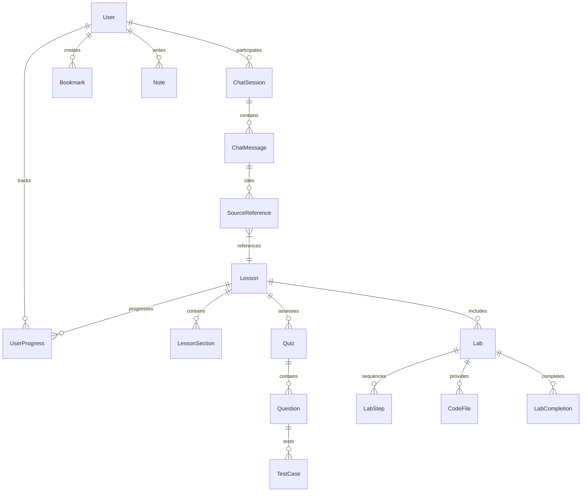

# Data Model: Physical AI & Humanoid Robotics Textbook

**Date**: 2025-12-05
**Phase**: 1 - Design & Contracts

## Core Entities

### 1. User

```typescript
interface User {
  id: string                    // UUID v4
  email: string                 // User email (optional)
  education: 'high-school' | 'bachelor' | 'master' | 'phd' | 'other'  // Highest education level
  createdAt: Date              // Account creation date
  lastActive: Date             // Last interaction timestamp

  // Preferences
  preferences: {
    language: 'en' | 'ur'      // Display language
    learningStyle: 'visual' | 'kinesthetic' | 'textual' | 'mixed'
    backgroundLevel: 'beginner' | 'intermediate' | 'advanced'
    notifications: {
      email: boolean
      browser: boolean
    }
  }

  // Background (from onboarding survey)
  background: {
    experience: string[]        // e.g., ['python', 'robotics', 'ml']
    education: 'high-school' | 'bachelor' | 'master' | 'phd' | 'other'
    goals: string[]            // e.g., ['research', 'industry', 'hobby']
  }

  // Hardware capabilities
  hardware: {
    hasRobot: boolean          // Owns physical robot
    robotType?: string         // e.g., 'turtlebot', 'custom'
    hasGPU: boolean            // For local simulations
    platform: string          // e.g., 'windows', 'linux', 'macos'
  }
}
```

### 2. Lesson

```typescript
interface Lesson {
  id: string                   // e.g., "1.1", "2.3"
  chapter: number             // 1-4
  lessonNumber: number        // 1-3 per chapter
  title: string
  slug: string                // URL-friendly identifier

  // Learning structure
  objectives: LearningObjective[]
  prerequisites: string[]     // Lesson IDs
  estimatedDuration: number   // minutes

  // Content sections
  sections: LessonSection[]
  labs: Lab[]
  quiz: Quiz

  // Metadata
  difficulty: 1 | 2 | 3 | 4 | 5
  tags: string[]              // e.g., ['ros2', 'sensors', 'control']
  lastUpdated: Date
}

interface LearningObjective {
  id: string
  text: string                // e.g., "Understand ROS 2 node communication"
  bloomLevel: 'remember' | 'understand' | 'apply' | 'analyze' | 'evaluate' | 'create'
  measurable: boolean         // Can be assessed
}

interface LessonSection {
  id: string
  type: 'theory' | 'code' | 'diagram' | 'video' | 'interactive'
  title: string
  content: string             // MDX content
  metadata: {
    duration: number         // minutes
    difficulty: number       // 1-5
    interactive: boolean     // Has user interaction
  }
}
```

### 3. Lab Exercise

```typescript
interface Lab {
  id: string
  lessonId: string
  title: string
  description: string
  type: 'simulation' | 'coding' | 'hardware' | 'analysis'

  // Lab structure
  objectives: string[]
  steps: LabStep[]
  expectedOutcome: string

  // Resources
  resources: {
    codeFiles: CodeFile[]
    datasets?: Dataset[]
    simulationConfig?: SimulationConfig
    hardwareSetup?: HardwareSetup
  }

  // Assessment
  verificationCriteria: VerificationCriteria[]
  hints: string[]
  estimatedTime: number      // minutes
}

interface LabStep {
  id: string
  order: number
  title: string
  instruction: string
  type: 'action' | 'observation' | 'analysis'
  expected?: string
}

interface CodeFile {
  path: string                // e.g., "src/node_publisher.py"
  language: string            // e.g., "python", "cpp"
  content: string
  editable: boolean
}
```

### 4. Quiz

```typescript
interface Quiz {
  id: string
  lessonId: string
  title: string
  passingScore: number        // percentage

  questions: Question[]
  timeLimit?: number          // minutes
  attempts: number            // allowed attempts

  // Feedback
  showCorrectAnswers: boolean
  provideFeedback: boolean
}

interface Question {
  id: string
  type: 'multiple-choice' | 'true-false' | 'fill-blank' | 'code'
  question: string
  options?: string[]         // for multiple choice
  correctAnswer: string | string[]
  explanation?: string
  points: number
  difficulty: number         // 1-5

  // Code-specific
  codeTemplate?: string      // for code questions
  language?: string          // for code questions
  testCases?: TestCase[]     // for code questions
}
```

### 5. User Progress

```typescript
interface UserProgress {
  userId: string

  // Lesson progress
  lessons: Record<string, LessonProgress>

  // Quiz scores
  quizScores: Record<string, QuizScore>

  // Lab completions
  labCompletions: Record<string, LabCompletion>

  // Overall metrics
  totalTime: number          // minutes spent
  streakDays: number         // consecutive days
  lastActivity: Date

  // Achievements
  achievements: Achievement[]

  // Bookmarks and notes
  bookmarks: Bookmark[]
  notes: Note[]
}

interface LessonProgress {
  lessonId: string
  startedAt?: Date
  completedAt?: Date
  lastPosition: string       // section ID
  timeSpent: number          // minutes
  sectionsCompleted: string[]

  // Reading metrics
  scrollDepth: number        // percentage
  interactions: number       // count of clicks, hovers, etc.
}

interface QuizScore {
  quizId: string
  attempt: number
  score: number              // percentage
  maxScore: number
  completedAt: Date
  answers: Record<string, any>
  timeSpent: number          // minutes
}
```

### 6. Chat Session

```typescript
interface ChatSession {
  id: string
  userId: string?
  sessionId: string          // for anonymous users
  createdAt: Date
  lastMessage: Date

  // Context
  currentLesson?: string
  selectedText?: string
  conversationHistory: ChatMessage[]

  // Metrics
  messageCount: number
  satisfactionRating?: number  // 1-5
  wasHelpful: boolean?
}

interface ChatMessage {
  id: string
  role: 'user' | 'assistant'
  content: string
  timestamp: Date

  // Context
  lessonContext?: string
  sources?: SourceReference[]
  relatedLessons?: string[]

  // Feedback
  rating?: number             // 1-5
  feedback?: string
}

interface SourceReference {
  lessonId: string
  sectionId: string
  snippet: string
  relevanceScore: number
}
```

### 7. Content Assets

```typescript
interface ContentAsset {
  id: string
  type: 'image' | 'diagram' | 'video' | 'simulation' | 'dataset'
  filename: string
  path: string                // relative URL
  mimeType: string

  // Metadata
  size: number                // bytes
  dimensions?: {              // for images/videos
    width: number
    height: number
  }
  altText: string             // accessibility

  // Localization
  translations: Record<string, {
    path: string
    altText: string
  }>

  // Dependencies
  requiredFor: string[]       // lesson/section IDs
  optionalFor: string[]       // lesson/section IDs
}
```

## Data Relationships



## Data Validation Rules

### User Validation
- Email format validation if provided
- Language codes limited to 'en' | 'ur'
- Learning styles limited to predefined options
- Background level limited to predefined options

### Lesson Validation
- IDs must follow pattern: `chapter.lesson` (e.g., "1.1")
- Each chapter must have exactly 3 lessons
- All lessons must have at least one objective
- Difficulty must be 1-5

### Progress Validation
- Progress percentages must be 0-100
- Time values must be non-negative
- Completion dates must be after start dates
- Quiz scores must be 0-100

### Chat Validation
- Messages must have content length 1-4000 characters
- Session IDs must be unique
- Source references must point to existing lessons

## Indexing Strategy

### Database Indexes
1. **User Progress**
   - Composite: (userId, lessonId) for quick progress lookup
   - Index: (lastActivity) for engagement analytics

2. **Chat Sessions**
   - Index: (sessionId) for anonymous user lookup
   - Index: (createdAt) for session cleanup

3. **Content Search**
   - Full-text search on lesson content
   - Vector embeddings for semantic search
   - Tag-based filtering

### Caching Strategy
1. **Lesson Content**
   - Cache for 1 hour (content doesn't change frequently)
   - Cache key includes lastUpdated timestamp

2. **User Progress**
   - Cache for 5 minutes (real-time updates)
   - Invalidate on progress update

3. **Chat Context**
   - Cache for 30 minutes (session duration)
   - Include conversation history

## Data Migration

### Version 1 → Version 2
 Planned migrations for future updates:
1. Add new lesson metadata fields
2. Expand user preferences
3. Add collaborative features
4. Implement offline synchronization

### Rollback Strategy
- All migrations are reversible
- Data backups before major updates
- Feature flags for gradual rollout

## Privacy and Security

### Data Classification
- **Public**: Lesson content, general progress statistics
- **Private**: User progress, chat sessions, personal notes
- **Sensitive**: Email addresses, personal identifiers

### Data Retention
- Anonymous chat sessions: 30 days
- User progress: Indefinite (with consent)
- Analytics data: 2 years (aggregated)

### GDPR Compliance
- Right to export data
- Right to delete data
- Explicit consent for tracking
- Data portability